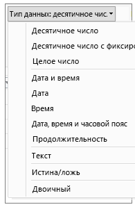
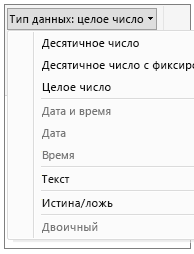

# Типы данных в Power BI Desktop
В этой статье описаны типы данных, поддерживаемые в Power BI, а также выражения анализа данных (DAX). 

Когда вы загружаете данные в Power BI Desktop, предпринимается попытка преобразовать тип данных исходного столбца в такой тип, который лучше поддерживает более эффективное хранение, вычисление и визуализацию данных. Например, если импортируемый из Excel столбец значений не содержит дробных значений, Power BI Desktop преобразует весь столбец данных в тип данных "Целое число", который лучше всего подходит для хранения целых чисел.

Эта концепция важна, так как некоторые функции DAX предъявляют особые требования к типам данных. Хотя DAX часто выполняет неявное преобразование типа данных, существуют случаи, когда этого не происходит.  Например, если функция DAX требует тип данных "Дата", а столбец имеет тип данных "Текст", функция DAX будет работать неправильно.  Таким образом, задание правильного типа данных для столбца обеспечивает как правильную, так и удобную работу. Неявные преобразования описаны далее в этой статье.

## Определение и указание типа данных столбца
В Power BI Desktop можно определить и указать тип данных столбца в редакторе запросов либо в представлении данных или отчетов:

**Типы данных в редакторе запросов**

**Типы данных в представлении данных или отчетов**

Раскрывающийся список "Тип данных" в редакторе запросов содержит два типа данных, которые пока отсутствуют в представлении данных или отчетов: **Дата/время/часовой пояс** и **Длительность**. Когда столбец с такими типами данных загружается в модель и просматривается в представлении данных или отчетов, столбец с типом данных "Дата/время/часовой пояс" преобразуется в тип "Дата/время", а столбец с типом данных "Длительность" преобразуется в тип "Десятичное число".

### Числовые типы
Power BI Desktop поддерживает три числовых типа:

**Десятичное число** — представляет 64-разрядное (8-байтовое) число с плавающей запятой. Это наиболее распространенный числовой тип, который соответствует нашему обычному представлению о числах.  Хотя он предназначен для обработки чисел с дробными частями, он также обрабатывает и целые числа.  Тип "Десятичное число" позволяет обрабатывать отрицательные значения от −1,79E +308 до −2,23E −308, 0 и положительные значения от 2,23E −308 до 1,79E + 308. Например, значения 34, 34,01 и 34,000367063 являются допустимыми десятичными числами. Наибольшее значение, которое может быть представлено типом десятичных чисел, имеет длину 15 цифр.  Десятичный разделитель может находиться в любом месте внутри числа. Тип "Десятичное число" соответствует способу хранения чисел в Excel.

**Фиксированное десятичное число** — имеет фиксированное расположение десятичного разделителя. Справа от десятичного разделителя всегда находятся четыре цифры, а общая значимость типа равна 19 цифрам.  Наибольшее значение, которое может представлять данный тип, равно 922 337 203 685 477,5807 (положительное или отрицательное).  Тип фиксированного десятичного числа удобен в случаях, когда округление может привести к ошибкам.  При работе с множеством чисел с небольшой дробной частью значения могут накапливаться, немного изменяя число.  Поскольку числа, отстоящие от десятичного разделителя более чем на четыре позиции вправо, усекаются, тип фиксированного десятичного типа позволяет избежать таких ошибок.   Если вы знакомы с SQL Server, этот тип данных соответствует типу данных десятичного числа Decimal в SQL Server (19,4) либо типу данных денежной единицы Currency в Power Pivot. 

**Целое число** — представляет 64-разрядное (8-байтовое) целое число. Поскольку это целое число, оно не имеет знаков справа от десятичного знака. Этот тип позволяет использовать 19-значные положительные или отрицательные целые числа в диапазоне от −9 223 372 036 854 775 808 (−2^63) и 9 223 372 036 854 775 807 (2^63−1).  Он может представлять максимально возможное количество различных числовых типов данных.  Как тип фиксированного десятичного числа, тип целого числа может быть полезен в случаях, когда требуется контролировать округление. 

> [!NOTE]
>  Модель данных Power BI Desktop поддерживает 64-разрядные целочисленные значения, однако из-за ограничений JavaScript наибольшим числом, которое могут безопасно выражать визуальные элементы, является 9 007 199 254 740 991 (2^53-1). Если в своей модели данных вы работаете с числами больше указанного, то, прежде чем добавлять эти числа в визуальный элемент, можете уменьшить их размер посредством вычислений. 
> 
>

### Типы даты и времени
Power BI Desktop поддерживает пять типов данных даты и времени в представлении запросов и три в представлении отчетов и модели.   При загрузке в модель типы "Дата/время/часовой пояс" и "Длительность" преобразуются.

**Дата и время** — представляет значение даты и времени.  В системе значение даты и времени сохраняется как тип десятичных чисел.  Поэтому можно легко выполнять преобразования между этими типами.   Составляющая время сохраняется в виде дробного значения, кратного 1/300 секунды (3,33 мс).  Поддерживаются даты от 1900 до 9999 лет.

**Дата** — представляет только дату (без составляющей времени).  При преобразовании в модели дата аналогична значению даты и времени с нулевой дробной частью.

**Время** — представляет только время (без составляющей даты).  При преобразовании в модели значение времени аналогично значению даты и времени с отсутствующими числами слева от десятичного знака.

**Дата/время/часовой пояс** — представляет дату и время в формате UTC.  В настоящее время при загрузке в модель этот тип преобразуется в дату и время.

**Длительность** — представляет интервал времени. При загрузке в модель этот тип преобразуется в тип десятичного числа.  Являясь типом тип десятичного числа, он обеспечивает правильное выполнение операций сложения или вычитается с полем даты и времени.  Этот тип десятичного числа удобно использовать в визуализациях, которые показывают величины.

### Тип текста
**Текст** — строка символьных данных в Юникоде. Это могут быть строки, числа или даты, представленные в текстовом формате. Максимальная длина строки составляет 268 435 456 символов Юникода (256 мегасимволов) или 536 870 912 байт.

### Тип True/False
**True/False** — логическое значение True или False.

### Тип пустых значений, или значений NULL
**Пустое значение** — тип данных в DAX, представляющий и заменяющий значения NULL в SQL. Можно создать пустое значение с помощью функции [BLANK](http://msdn.microsoft.com/library/ee634820.aspx) и выполнить проверку пустых значений с помощью логической функции [ISBLANK](https://msdn.microsoft.com/library/ee634204.aspx).

### Тип табличных данных
DAX используется тип табличных данных во множестве функций, таких как агрегаты и логика операций со временем. Некоторые функции требуют наличия ссылки на таблицу, иные возвращают таблицу, которую можно использовать в качестве входных данных для других функций. В некоторых функциях, требующих входные данные в виде таблицы, можно указать выражение, результатом вычисления которого является таблица; для некоторых функций необходима ссылка на базовую таблицу. Сведения о требованиях конкретных функций см. в разделе [Справочник по функциям DAX](https://msdn.microsoft.com/library/ee634396.aspx).

## Неявные и явные преобразования типов данных в формулах DAX
Каждая функция DAX предъявляет особые требования в отношении типов данных, которые используются в качестве входных и выходных данных. Например, некоторые функции требуют использовать целые числа для некоторых аргументов и даты для других; иные функции требуют использовать текст или таблицы.

Если данные в столбце, указанном в качестве аргумента, несовместимы с необходимым функции типом данных, во многих случаях DAX возвращает ошибку. Однако везде, где это возможно, DAX выполняет попытку неявного преобразования данных в требуемый тип данных. Например:

* Можно ввести дату в виде строки, и DAX проанализирует строку и попытается привести ее к одному из форматов даты и времени Windows.
* Вы можете добавить TRUE + 1 и получить результат 2, так как TRUE неявно преобразуется в число 1 и выполняется операция 1 + 1.
* Если вы складываете значения в двух столбцах и одно значение представлено в виде текста ("12"), а другое в виде числа (12), DAX неявно преобразует строку в число и затем выполняет сложение для получения числового результата. Следующее выражение возвращает 44: = "22" + 22.
* Если попытаться сцепить два числа, Excel представит их в виде строк, а затем выполнит объединение. Следующее выражение возвращает "1234": = 12 & 34.

### Таблица неявных преобразований данных
Тип выполняемого преобразования определяется оператором, который приводит необходимые значения перед выполнением запрошенной операции. В этих таблицах перечислены операторы и указано преобразование, выполняемое для каждого типа данных в столбце, когда он объединяется с типом данных из пересекающейся строки.

> [!NOTE]
>  Текстовые типы данных не включены в эти таблицы. Если число представлено в текстовом формате, в некоторых случаях Power BI пытается определить числовой тип и представить значение в виде числа.
> 
> 

**Сложение (+)**

| Оператор (+) | ЦЕЛОЕ ЧИСЛО | ДЕНЕЖНАЯ ЕДИНИЦА | ВЕЩЕСТВЕННОЕ ЧИСЛО | Дата и время |
| --- | --- | --- | --- | --- |
| ЦЕЛОЕ ЧИСЛО |ЦЕЛОЕ ЧИСЛО |ДЕНЕЖНАЯ ЕДИНИЦА |ВЕЩЕСТВЕННОЕ ЧИСЛО |Дата и время |
| ДЕНЕЖНАЯ ЕДИНИЦА |ДЕНЕЖНАЯ ЕДИНИЦА |ДЕНЕЖНАЯ ЕДИНИЦА |ВЕЩЕСТВЕННОЕ ЧИСЛО |Дата и время |
| ВЕЩЕСТВЕННОЕ ЧИСЛО |ВЕЩЕСТВЕННОЕ ЧИСЛО |ВЕЩЕСТВЕННОЕ ЧИСЛО |ВЕЩЕСТВЕННОЕ ЧИСЛО |Дата и время |
| Дата и время |Дата и время |Дата и время |Дата и время |Дата и время |

Например, если вещественное число используется в операции сложения в сочетании со значением денежной единицы, оба этих значения преобразуются в вещественный тип, а результат также возвращается в вещественного числа.

**Вычитание (-)**

В следующей таблице заголовок строки является уменьшаемым (слева), а заголовок столбца — вычитаемым (справа).

| Оператор (-) | ЦЕЛОЕ ЧИСЛО | ДЕНЕЖНАЯ ЕДИНИЦА | ВЕЩЕСТВЕННОЕ ЧИСЛО | Дата и время |
| --- | --- | --- | --- | --- |
| ЦЕЛОЕ ЧИСЛО |ЦЕЛОЕ ЧИСЛО |ДЕНЕЖНАЯ ЕДИНИЦА |ВЕЩЕСТВЕННОЕ ЧИСЛО |ВЕЩЕСТВЕННОЕ ЧИСЛО |
| ДЕНЕЖНАЯ ЕДИНИЦА |ДЕНЕЖНАЯ ЕДИНИЦА |ДЕНЕЖНАЯ ЕДИНИЦА |ВЕЩЕСТВЕННОЕ ЧИСЛО |ВЕЩЕСТВЕННОЕ ЧИСЛО |
| ВЕЩЕСТВЕННОЕ ЧИСЛО |ВЕЩЕСТВЕННОЕ ЧИСЛО |ВЕЩЕСТВЕННОЕ ЧИСЛО |ВЕЩЕСТВЕННОЕ ЧИСЛО |ВЕЩЕСТВЕННОЕ ЧИСЛО |
| Дата и время |Дата и время |Дата и время |Дата и время |Дата и время |

Например, если дата используется в операции вычитания с любым другим типом данных, оба значения преобразуются в даты, а возвращаемое значение также является датой.

> [!NOTE]
>    Модели данных также поддерживают унарный оператор "-" (отрицательное значение), однако этот оператор не изменяет тип данных операнда.
> 
> 

**Умножение (*)**

| Оператор (*) | ЦЕЛОЕ ЧИСЛО | ДЕНЕЖНАЯ ЕДИНИЦА | ВЕЩЕСТВЕННОЕ ЧИСЛО | Дата и время |
| --- | --- | --- | --- | --- |
| ЦЕЛОЕ ЧИСЛО |ЦЕЛОЕ ЧИСЛО |ДЕНЕЖНАЯ ЕДИНИЦА |ВЕЩЕСТВЕННОЕ ЧИСЛО |ЦЕЛОЕ ЧИСЛО |
| ДЕНЕЖНАЯ ЕДИНИЦА |ДЕНЕЖНАЯ ЕДИНИЦА |ВЕЩЕСТВЕННОЕ ЧИСЛО |ДЕНЕЖНАЯ ЕДИНИЦА |ДЕНЕЖНАЯ ЕДИНИЦА |
| ВЕЩЕСТВЕННОЕ ЧИСЛО |ВЕЩЕСТВЕННОЕ ЧИСЛО |ДЕНЕЖНАЯ ЕДИНИЦА |ВЕЩЕСТВЕННОЕ ЧИСЛО |ВЕЩЕСТВЕННОЕ ЧИСЛО |

Например, если целое число используется вместе с вещественным числом в операции умножения, оба числа преобразуются в вещественный тип, а возвращаемое значение также является вещественным числом.

**Деление (/)**

В следующей таблице заголовок строки является числителем, а заголовок столбца — знаменателем.

| Оператор (/) (строка/столбец) | ЦЕЛОЕ ЧИСЛО | ДЕНЕЖНАЯ ЕДИНИЦА | ВЕЩЕСТВЕННОЕ ЧИСЛО | Дата и время |
| --- | --- | --- | --- | --- |
| ЦЕЛОЕ ЧИСЛО |ВЕЩЕСТВЕННОЕ ЧИСЛО |ДЕНЕЖНАЯ ЕДИНИЦА |ВЕЩЕСТВЕННОЕ ЧИСЛО |ВЕЩЕСТВЕННОЕ ЧИСЛО |
| ДЕНЕЖНАЯ ЕДИНИЦА |ДЕНЕЖНАЯ ЕДИНИЦА |ВЕЩЕСТВЕННОЕ ЧИСЛО |ДЕНЕЖНАЯ ЕДИНИЦА |ВЕЩЕСТВЕННОЕ ЧИСЛО |
| ВЕЩЕСТВЕННОЕ ЧИСЛО |ВЕЩЕСТВЕННОЕ ЧИСЛО |ВЕЩЕСТВЕННОЕ ЧИСЛО |ВЕЩЕСТВЕННОЕ ЧИСЛО |ВЕЩЕСТВЕННОЕ ЧИСЛО |
| Дата и время |ВЕЩЕСТВЕННОЕ ЧИСЛО |ВЕЩЕСТВЕННОЕ ЧИСЛО |ВЕЩЕСТВЕННОЕ ЧИСЛО |ВЕЩЕСТВЕННОЕ ЧИСЛО |

Например, если целое число используется вместе со значением денежной единицы в операции деления, оба значения преобразуются в вещественный тип, а результат также является вещественным числом.

### Операторы сравнения
В выражениях сравнения логические значения считаются приоритетнее строковых значений, а строковые значения приоритетнее числовых значений или значений даты и времени; числа и значения даты и времени считаются равнозначными. Неявные преобразования для логических или строковых значений не выполняются. BLANK или пустое значение преобразуется в 0/""/false в зависимости от типа данных другого сравниваемого значения.

Следующие выражения DAX иллюстрируют это поведение:

=IF(FALSE()\>"true","Выражение имеет значение true", "Выражение имеет значение false") возвращает "Выражение имеет значение true"

=IF("12"\>12,"Выражение имеет значение true", "Выражение имеет значение false") возвращает "Выражение имеет значение true".

=IF("12"=12,"Выражение имеет значение true", "Выражение имеет значение false") возвращает "Выражение имеет значение false".

Неявные преобразования выполняются для числовых типов или типов даты и времени, как описано в следующей таблице:

| Оператор сравнения | ЦЕЛОЕ ЧИСЛО | ДЕНЕЖНАЯ ЕДИНИЦА | ВЕЩЕСТВЕННОЕ ЧИСЛО | Дата и время |
| --- | --- | --- | --- | --- |
| ЦЕЛОЕ ЧИСЛО |ЦЕЛОЕ ЧИСЛО |ДЕНЕЖНАЯ ЕДИНИЦА |ВЕЩЕСТВЕННОЕ ЧИСЛО |ВЕЩЕСТВЕННОЕ ЧИСЛО |
| ДЕНЕЖНАЯ ЕДИНИЦА |ДЕНЕЖНАЯ ЕДИНИЦА |ДЕНЕЖНАЯ ЕДИНИЦА |ВЕЩЕСТВЕННОЕ ЧИСЛО |ВЕЩЕСТВЕННОЕ ЧИСЛО |
| ВЕЩЕСТВЕННОЕ ЧИСЛО |ВЕЩЕСТВЕННОЕ ЧИСЛО |ВЕЩЕСТВЕННОЕ ЧИСЛО |ВЕЩЕСТВЕННОЕ ЧИСЛО |ВЕЩЕСТВЕННОЕ ЧИСЛО |
| Дата и время |ВЕЩЕСТВЕННОЕ ЧИСЛО |ВЕЩЕСТВЕННОЕ ЧИСЛО |ВЕЩЕСТВЕННОЕ ЧИСЛО |Дата и время |

### Обработка пустых значений, пустых строк и нулевых значений
В DAX значение NULL, пустое значение, пустая ячейка или отсутствующее значение представляются с помощью одного нового типа значений — BLANK. Вы можете создавать пустые значения с помощью функции BLANK или выполнять проверку пустых значений с помощью функции ISBLANK.

Процедура обработки пустых значений в таких операциях, как сложение и объединение, зависит от конкретной функции. В следующей таблице перечислены различия между формулами DAX и Microsoft Excel с точки зрения обработки пустых значений.

| Выражение | DAX | Excel |
| --- | --- | --- |
| BLANK + BLANK |BLANK |0(ноль) |
| BLANK + 5 |5 |5 |
| BLANK * 5 |BLANK |0(ноль) |
| 5/BLANK |Бесконечность |Ошибка |
| 0/BLANK |Не число |Ошибка |
| BLANK/BLANK |BLANK |Ошибка |
| FALSE ИЛИ BLANK |FALSE |FALSE |
| FALSE И BLANK |FALSE |FALSE |
| TRUE ИЛИ BLANK |TRUE |TRUE |
| TRUE И BLANK |FALSE |TRUE |
| BLANK ИЛИ BLANK |BLANK |Ошибка |
| BLANK И BLANK |BLANK |Ошибка |

