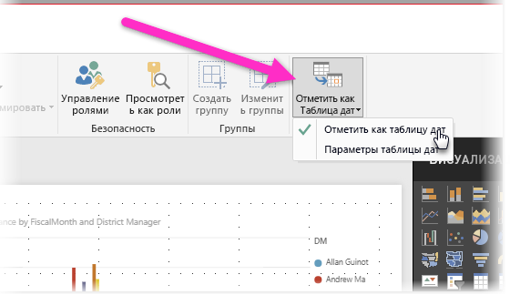
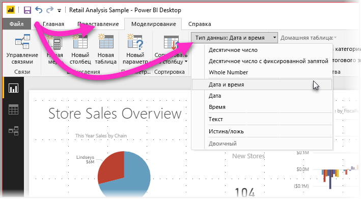

# Настройка и использование таблиц дат в Power BI Desktop

В **Power BI Desktop** таблицы автоматически определяются как **таблицы дат**. Затем создаются иерархии дат и другие метаданные для включения модели от вашего имени. Это происходит в фоновом режиме. Эти встроенные иерархии можно использовать в дальнейшем при создании таких компонентов отчета, как визуальные элементы, таблицы, быстрые меры, срезы и т. д. Для этого в Power BI Desktop от вашего имени создаются скрытые таблицы, которые впоследствии вы можете использовать для отчетов и выражений DAX.

Многие специалисты по анализу данных предпочитают создавать собственные таблицы. Можно делать и так. **Power BI Desktop** позволяет указать **таблицу дат** для вашей модели и создавать связанные с датами визуализации, таблицы, быстрые меры и другие элементы, используя данные из этой таблицы. Если вы указываете собственную таблицу дат, вы сами управляете иерархиями дат, созданными в модели, и применяете их для **быстрых мер** и других операций, в которых используется таблица дат вашей модели. 

## Настройка собственной таблицы дат

Чтобы настроить **таблицу дат**, выберите нужную таблицу на панели **Поля**. Затем щелкните таблицу правой кнопкой мыши и последовательно выберите в открывшемся меню **Отметить как таблицу дат > Отметить как таблицу дат**, как показано на следующем изображении:

Также вы можете указать таблицу, а затем выбрать  **Отметить как таблицу дат** на ленте **Моделирование**, как показано ниже.

Если вы указываете собственную **таблицу дат**, в Power BI Desktop выполняются описанные ниже проверки этого столбца и содержащихся в нем данных. Это позволяет убедиться в следующем:

* данные содержат уникальные значения;
* данные содержат значения, отличные от NULL;
* данные содержат значения смежных дат (от начала до конца);
* если это тип данных **Дата/время**, для каждого значения используется одна и та же метка времени.

Есть два вероятных сценария, в которых целесообразно создать собственную таблицу данных:

* Первый вариант — использование канонических или базовых таблицы данных и иерархий. Это таблица, которая соответствует описанным выше критериям проверки для таблицы дат. 

* Второй вариант — использование таблицы из служб Analysis Services, например, таблицы с полем *измерения даты*, в качестве таблицы дат. 

Указав таблицу дат, вы сможете выбрать для дат любой столбец в этой таблице. Вы можете указать, какой столбец использовать. Для этого выберите таблицу на панели **Поля**, щелкните ее правой кнопкой мыши и последовательно выберите **Отметить как таблицу дат > Параметры таблицы дат**. Появится следующее окно, в котором можно выбрать в раскрывающемся списке столбец для использования в качестве таблицы дат.

Обратите внимание, что при создании собственной таблицы дат в **Power BI Desktop** иерархии не создаются автоматически, как при выборе другого варианта, когда они встраиваются в модель от вашего имени. Если позднее вы отмените выбор таблицы дат (и у вас больше не будет таблицы дат, настроенной вручную), в Power BI Desktop повторно автоматически создаются встроенные таблицы дат для столбцов дат в таблице.

Также следует отметить, что когда вы отмечаете таблицу как таблицу дат, встроенная (автоматически созданная) таблица дат в Power BI Desktop удаляется. В таком случае все визуальные элементы или выражения DAX, созданные ранее на основе этих встроенных таблиц, не будут правильно работать. 

## Присвоение таблице дат надлежащего типа данных

Если вы создаете собственную **таблицу дат**, необходимо правильно задать тип данных. Для **типа данных** должно быть установлено значение **Дата/время** или **Дата**. Для этого выполните следующие действия:

1. Выберите свою **таблицу дат** на панели **Поля** и при необходимости разверните ее. Выберите столбец, который нужно использовать в качестве даты.
   
     

2. На вкладке **Моделирование** выберите **Тип данных** и щелкните стрелку раскрывающегося списка, чтобы отобразились доступные типы данных.

    

3. Укажите тип данных для столбца. 

## Дальнейшие действия

Также рекомендуем ознакомиться со следующими статьями.

* [Типы данных в Power BI Desktop](desktop-data-types.md)

 