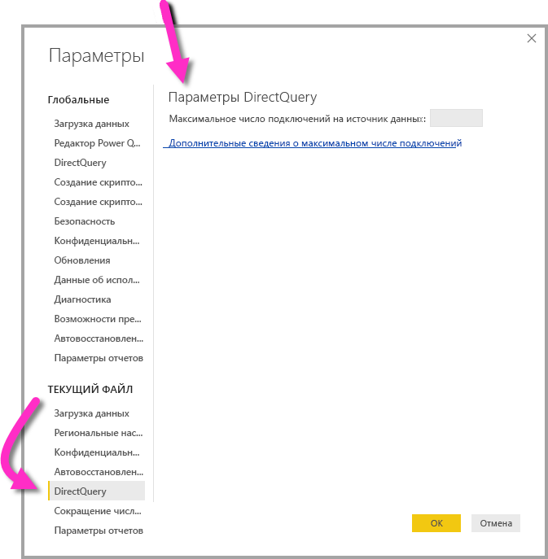

# Использование DirectQuery в Power BI
При использовании **Power BI Desktop** или **службы Power BI** вы можете подключиться к различным типам источников данных разными способами. Вы можете *импортировать* данные в Power BI, что является наиболее распространенным способом получения данных, или подключиться непосредственно к данным в исходном репозитории источника, который известен как **DirectQuery**. В этой статье описывается **DirectQuery** и его возможности:

* различные параметры подключения для DirectQuery;
* руководство по использованию DirectQuery (когда необходимо использовать именно DirectQuery, а не импорт);
* недостатки использования DirectQuery;
* рекомендации по использованию DirectQuery.

Вкратце, импорт нужно использовать в следующих случаях:

* **Импортируйте** данные в Power BI всякий раз, когда это возможно. Таким образом используются преимущества высокоэффективного обработчика запросов в Power BI, а также широкие возможности взаимодействия и расширенная функциональность при работе с данными.
* Если же импорт не может удовлетворить ваши цели в полной мере, используйте **DirectQuery**. Например, если данные часто меняются, а отчеты должны отображать последние данные, лучше выбрать DirectQuery. Тем не менее использование DirectQuery целесообразно, только если базовый источник данных может обеспечить интерактивные запросы (менее чем через 5 секунд) для обычного статистического запроса, а также может обработать сформированную загрузку запросов. Кроме того, необходимо тщательно рассмотреть список ограничений по использованию DirectQuery.

Набор возможностей, предлагаемых Power BI для двух режимов подключения (импорта и DirectQuery), со временем будет меняться. При использовании импортируемых данных обеспечивается большая гибкость, поэтому в большинстве случаев можно выбирать импорт. Кроме того, этот режим позволяет избежать некоторых недостатков, характерных для DirectQuery. Несмотря на преимущества, при использовании DirectQuery следует всегда учитывать производительность базового источника данных. Если такой базовый источник данных работает медленно, тогда использование DirectQuery для него нецелесообразно.

Здесь рассматривается DirectQuery в контексте Power BI, а не служб SQL Server Analysis Services. DirectQuery также является функцией служб **SQL Server Analysis Services**, и многие дополнительные сведения, описанные ниже, относятся к использованию этой функции. Однако тут есть некоторые важные отличия. Сведения об использовании DirectQuery со службами SQL Server Analysis Services см. в [этом техническом документе](http://download.microsoft.com/download/F/6/F/F6FBC1FC-F956-49A1-80CD-2941C3B6E417/DirectQuery%20in%20Analysis%20Services%20-%20Whitepaper.pdf).  

В этой статье рассматривается рекомендуемый рабочий процесс для DirectQuery, когда создается отчет в **Power BI Desktop**, однако здесь также приведены сведения о подключении непосредственно в **службе Power BI**.

## Режимы подключения Power BI
Power BI подключается к большому количеству различных источников данных, включая следующие:

* веб-службы (Salesforce, Dynamics 365 и другие);
* базы данных (SQL Server, Access, Amazon Redshift и другие);
* простые файлы (Excel, JSON и другие);
* другие источники данных (Spark, веб-сайты, Microsoft Exchange и другие).

Для этих источников данные можно импортировать в Power BI. К некоторым можно подключиться с помощью DirectQuery. Точный набор источников, который поддерживает DirectQuery, приведен в статье [Источники данных, поддерживаемые DirectQuery](desktop-directquery-data-sources.md). В будущем планируется поддержка в DirectQuery и других источников, преимущественно тех, которые обеспечивают оптимальную обработку интерактивных запросов.

Службы **SQL Server Analysis Services** нужно рассмотреть отдельно. При подключении к службам SQL Server Analysis Services вы можете либо импортировать данные, либо использовать *динамическое подключение*.  Режим динамического подключения напоминает DirectQuery. То есть в таком режиме данные не импортируются, а базовый источник данных всегда запрашивается, чтобы обновить визуальный элемент. Однако другие аспекты *динамического подключения* отличаются от DirectQuery. Именно поэтому используется *другой термин* (для их *сравнения*).

Эти три варианта подключения к данным — **импорт**, **DirectQuery** и **динамическое подключение** — подробно рассматриваются в разделах ниже.

### Подключения с помощью импорта
Если вы используете окно **Получение данных** в **Power BI Desktop**, чтобы подключиться к такому источнику данных, как SQL Server, а также выберите в качестве режима подключения **импорт**, произойдет следующее:

* Во время **получения данных** на начальном этапе каждый набор выбранных таблиц определяет запрос, который будет возвращать набор данных (эти запросы можно редактировать до загрузки данных, например можно применить фильтры или объединить данные, а также соединить разные таблицы).
* При загрузке все данные, определенные этими запросами, будут импортированы в кэш Power BI.
* При создании визуализации в рамках **Power BI Desktop** будут запрашиваться импортированные данные. Хранилище Power BI гарантирует быстрое выполнение запроса, а значит, все изменения визуализации будут сразу же отображаться.
* Любые изменения базовых данных не будут отражаться в визуальных элементах. После *обновления* данные будут повторно импортированы.
* При публикации отчета (PBIX-файла) в **службе Power BI** создается набор данных, который затем отправляется в эту службу.  С этим набором данных также отправляются импортируемые данные. Затем можно настроить запланированное обновление данных, например, чтобы ежедневно повторно импортировать данные. В зависимости от расположения исходного источника данных может потребоваться настроить локальный шлюз данных.
* При открытии существующего отчета в **службе Power BI** или создании нового отчета импортируемые данные запрашиваются снова, что обеспечивает интерактивность.
* Визуальные элементы или все страницы отчета могут быть прикреплены в качестве плиток к панели мониторинга. Плитки будут автоматически обновляться при каждом обновлении базового набора данных.  

### Подключения с помощью DirectQuery
Если вы используете окно **Получение данных** в **Power BI Desktop**, чтобы подключиться к источнику данных, а также выберите в качестве режима подключения **DirectQuery**, произойдет следующее:

* Во время **получения данных** на начальном этапе выбирается источник. Для реляционных источников это означает, что набор выбранных таблиц по-прежнему определяет запрос, который логически возвращает набор данных. Для многомерных источников, таких как SAP BW, выбирается только источник.
* Однако при загрузке данные не импортируются в хранилище Power BI. Вместо этого при создании визуализации в рамках **Power BI Desktop** запросы будут отправляться в базовый источник данных для получения необходимых данных. Время для обновления визуального элемента будет зависеть от производительности базового источника данных.
* Любые изменения базовых данных будут отражены в существующих визуальных элементах не сразу. Нужно по-прежнему выполнить обновление, после чего необходимые запросы будут повторно отправлены для каждого визуального элемента, который при необходимости обновится.
* При публикации отчета в **службе Power BI** также будет создан набор данных, как и при использовании режима импорта. Однако *данные* с этим набором данных не отправляются.
* При открытии существующего отчета в **службе Power BI** или создании нового для получения необходимых данных снова запрашивается базовый источник данных. В зависимости от расположения исходного источника данных может потребоваться настроить локальный шлюз данных, как и для режима импорта в случае обновления данных.
* Визуальные элементы или все страницы отчета могут быть прикреплены в качестве плиток к панели мониторинга. Чтобы обеспечить быстрое открытие панели мониторинга, плитки обновляются согласно расписанию (например, каждый час). Этой частотой обновления можно управлять, чтобы видеть все последние обновления данных. Таким образом, при открытии панели мониторинга плитки будут отражать данные по состоянию на момент последнего обновления, а не последние изменения базового источника. Вы всегда можете обновить открытую панель мониторинга, чтобы использовать ее последнюю версию.    

### Динамические подключения
При подключении к службам **SQL Server Analysis Services** (SSAS) вы можете либо импортировать данные из выбранной модели данных, либо динамически подключиться к этой модели. Если вы выберете **импорт**, вам нужно определить запрос применительно к этому внешнему источнику SSAS, что обеспечит импорт данных в обычном режиме. Если вы выберете **динамическое подключение**, запрос не определяется и внешняя модель отображается в списке полей. Если вы выберете **DirectQuery**, то при создании визуальных элементов запросы отправляются во внешний источник SSAS. Однако в отличие от DirectQuery неважно, в каком режиме создается *модель*. Другими словами, невозможно определить новые вычисляемые столбцы, иерархии, связи и т. д. Вместо этого нужно просто подключиться непосредственно к внешней модели SSAS.

Ситуация, описанная в предыдущем абзаце, также относится к подключению к следующим источникам (за исключением того, что из них невозможно импортировать данные):

* наборам данных Power BI (например, при подключении к набору данных Power BI, который был ранее создан и опубликован в службе, для создания нового отчета);
* Common Data Services.

Режим работы отчетов через службы SSAS при публикации в **службе Power BI** аналогичен режимам работы отчетов DirectQuery в следующем:

* При открытии существующего отчета в **службе Power BI** или создании нового отчета запрашивается базовый источник SSAS (возможно, требуется локальный шлюз данных).
* Плитки панели мониторинга автоматически обновляются по расписанию (например, каждый час или в зависимости от определенной частоты обновления).

Однако существуют важные различия, в том числе для динамических подключений. Удостоверение пользователя, который открывает отчет, всегда будет передаваться в базовый источник SSAS.

Не будем углубляться в сравнения, а сосредоточимся только на **DirectQuery**.

## Когда лучше использовать DirectQuery?
В таблице ниже описаны сценарии, для которых рекомендуется подключение с помощью DirectQuery, включая случаи, когда предпочтительнее оставить данные в исходном источнике. Описание включает обсуждение относительно доступности определенного сценария в Power BI.

| Ограничения | Описание |
| --- | --- |
| Данные часто меняются, и требуется создание отчета в режиме реального времени |Модели с импортируемыми данными могут обновляться максимум один раз в час. Таким образом, если данные постоянно меняются, а отчеты должны содержать последние данные, тогда импорта с обновлением по расписанию может быть недостаточно. Обратите внимание, что можно также выполнить потоковую передачу данных непосредственно в Power BI, хотя предусмотрены ограничения объемов данных.     И напротив, с помощью DirectQuery при открытии или обновлении отчета и панели мониторинга в источнике всегда будут отображаться последние данные. Кроме того, плитки панели мониторинга могут обновляться чаще (например, каждые 15 минут). |
| Слишком большой объем данных |Если объем данных слишком большой, тогда импорт совсем нецелесообразен. И напротив, DirectQuery не требует передачи большого объема данных, так как запрашивается на месте.     Однако большие объемы данных могут также подразумевать, что производительность запросов применительно к этому базовому источнику слишком низкая (что рассматривается в разделе о *влиянии DirectQuery* ниже). И не всегда необходимо импортировать полный набор данных. Вместо этого во время импорта данные можно предварительно объединить (что очень просто сделать с помощью **редактора запросов**). В крайнем случае можно импортировать именно объединенные данные, необходимые для каждого визуального элемента. Итак, учитывая, что для больших объемов данных лучше всего использовать DirectQuery, необходимо помнить о том, что импорт объединенных данных — отличное решение для базового источника с низкой производительностью. |
| Правила безопасности определены в базовом источнике |После импорта данных Power BI будет подключаться к источнику данных с помощью текущих учетных данных пользователей (из Power BI Desktop) или учетных данных, определенных как часть настройки запланированного обновления (в службе Power BI). Таким образом при публикации и совместном использовании такого отчета необходимо обеспечить совместное использование отчета с пользователями, которые могут видеть те же данные, или определить безопасность на уровне строк в наборе данных.     В идеале, так как DirectQuery всегда запрашивает базовый источник, к нему можно применить любой уровень безопасности. Однако на сегодняшний день Power BI всегда подключается к базовому источнику, используя те же учетные данные, что используются для импорта.     Таким образом, пока Power BI позволяет передавать идентификатор пользователя отчета в базовый источник, использование DirectQuery не дает никаких преимуществ в отношении обеспечения безопасности источника данных. |
| Применение ограничений к независимости данных |В некоторых организациях предусмотрены политики для независимости данных, что означает, что данные нельзя передать из локальной среды организации. Импорт не рассматривается как подходящее решение. С DirectQuery же эти данные остаются в базовом источнике.     Однако стоит заметить, что даже при использовании DirectQuery некоторые кэши данных на уровне визуализации сохраняются в службе Power BI (из-за запланированного обновления плиток). |
| Базовый источник данных представляет собой источник OLAP, содержащий меры |Если базовый источник данных содержит *меры* (например, SAP HANA или SAP Business Warehouse), тогда импорт данных приведет к другим проблемам. Это значит, что импортированные данные находятся на определенном уровне статистической обработки в соответствии с запросом. Например, меры TotalSales по классу, году и расположению. Затем, если созданный визуальный элемент запрашивает данные на более высоком уровне статистической обработки (например, TotalSales по году), выполняется дальнейшая статистическая обработка агрегированного значения. Это подходит для аддитивных мер (например, Sum, Min) и не подходит для неаддитивных мер (например, Average, DistinctCount).     Чтобы упростить получение правильных агрегатных данных (необходимых для конкретного визуального элемента) непосредственно из источника, было бы необходимо отправлять запросы для каждого визуального элемента, как в DirectQuery.     При подключении к SAP Business Warehouse (BW) с помощью DirectQuery можно обрабатывать меры таким образом. Поддержка SAP BW рассматривается далее в статье об [использовании DirectQuery с SAP Business Warehouse (BW)](desktop-directquery-sap-bw.md).     Тем не менее на сегодняшний день при подключении к SAP HANA режим DirectQuery определяет данную меру как реляционный источник, а поэтому обеспечивает поведение, схожее с режимом импорта. Это рассматривается далее в статье [DirectQuery и SAP HANA](desktop-directquery-sap-hana.md). |

Поэтому в целом, учитывая текущие возможности DirectQuery в Power BI, этот режим предоставляет преимущества в следующих сценариях:

* данные часто меняются, и требуется создание отчета в режиме реального времени;
* обработка больших объемов данных без необходимости предварительной статистической обработки;
* применение ограничений к независимости данных;
* источником является многомерный источник, содержащий меры (например, SAP BW).

Сведения из списка выше связаны с использованием одной службы Power BI. Вы всегда можете использовать внешнюю модель служб SQL Server Analysis Services (или Azure Analysis Services) для импорта данных, а затем использовать Power BI для подключения к этой модели. Хотя такой подход и требует дополнительных навыков, он обеспечивает большую гибкость. Например, можно импортировать гораздо большие объемы данных, а также отсутствуют ограничения для частоты обновления данных.

## Ограничения использования DirectQuery
Использование **DirectQuery** может вызвать некоторые последствия, подробнее описанные далее. Некоторые из этих ограничений несколько отличаются в зависимости от конкретного используемого источника. Так, будет рассмотрено общее влияние, а в отдельных статьях будут приведены сведения о влиянии для различных источников.  

### Производительность и нагрузка в базовом источнике
При использовании **DirectQuery** ограничения использования в целом значительно зависят от производительности базового источника данных. Если обновление каждого визуального элемента (например, после изменения значения среза) занимает несколько секунд (< 5 секунд), тогда использование этого режима целесообразно, но все же, в сравнении с незамедлительным ответом при импорте данных в Power BI, остается не в приоритете. Если же медленная работа источника подразумевает, что обновление отдельных визуальных элементов длится от 10 секунд, тогда использование DirectQuery нецелесообразно, возможно даже из-за истечения времени ожидания выполнения запроса.

Таким же важным вопросом, как и производительность базового источника, является и нагрузка на этот источник (которая часто влияет на производительность). При открытии общего отчета каждым пользователем, а также при периодическом обновлении каждой плитки панели мониторинга в базовый источник отправляется как минимум один запрос на один визуальный элемент. Это значит, что источник должен справиться с обработкой такой нагрузки запроса, обеспечивая при этом оптимальную производительность.

### Использование одного источника
Во время импорта данных можно объединить данные из нескольких источников в одну модель, например, чтобы легко добавить некоторые данные из корпоративной базы данных SQL Server к некоторым локальным данным, сохраненным в файле Excel. При использовании DirectQuery это невозможно. Если вы выбираете DirectQuery для источника, можно использовать данные только из одного источника (например, отдельной базы данных SQL Server).

### Ограничения для преобразования данных
Есть также ограничения для преобразования данных, которые можно применить с помощью **редактора запросов**. Для режима импорта перед созданием визуальных элементов можно также легко применить расширенный набор преобразований для очистки данных или их повторного формирования (например, анализ документов JSON или сведение данных из столбца в форму с поддержкой строк). С DirectQuery используются большие ограничения для таких преобразований. Во-первых, при подключении к источнику OLAP, например SAP Business Warehouse, определить преобразования вообще невозможно и отдельная внешняя модель берется из источника. Для реляционных источников, например SQL Server, все еще можно определить набор преобразований для каждого запроса, но эти преобразования ограничены из соображений производительности. Каждое такое преобразование необходимо было бы применить к каждому запросу базового источника, а не к общему обновлению данных. Таким образом, ограничением является возможность преобразования только для отдельного машинного запроса. Если вы используете слишком сложное преобразование, вы получите ошибку. В таком случае вам нужно либо удалить преобразование, либо переключить модель в режим импорта.

Кроме того, запрос, полученный из диалогового окна **получения данных** или **редактора запроса**, будет использоваться в подзапросе в рамках запросов, созданных и отправленных для получения необходимых данных для визуального элемента. Таким образом, запрос, определенный в редакторе запросов, должен быть допустимым в данном контексте. В частности, это означает, что невозможно использовать запрос с обобщенными табличными выражениями или запрос, содержащий вызовы хранимых процедур.

### Ограничения моделирования
Термин *моделирование* в данном контексте означает процесс уточнения и расширения необработанных данных в рамках создания отчета. Примеры моделирования включают:

* определение связей между таблицами;
* добавление новых вычислений (вычисляемых столбцов и мер);
* переименование и скрытие столбцов и мер;
* определение иерархий;
* определение порядка форматирования, формирования сводных данных по умолчанию и сортировки для столбца;
* группирование или кластеризацию значений.

При использовании **DirectQuery** многие из этих модельных расширений можно применить, а также по-прежнему актуален принцип, что необработанные данные расширяются для их последующего эффективного использования. Однако при использовании DirectQuery некоторые возможности моделирования недоступны или же ограничены. Ограничения обычно применяются, чтобы избежать проблем с производительностью. Ограничения, общие для всех источников DirectQuery, перечислены в следующем маркированном списке. Дополнительные ограничения могут применяться к отдельным источникам, что рассматривается в этой статье далее — в *дополнительных сведениях об источнике данных*.

* **Отсутствие встроенной иерархии по дате:** при импорте данных для каждого столбца даты и времени по умолчанию будет доступна встроенная иерархия по дате. Например, если импортировать таблицу заказов на продажу, включая столбец OrderDate, тогда при использовании OrderDate в визуальном элементе можно будет выбрать соответствующий уровень (год, месяц, день). В режиме DirectQuery эта иерархия недоступна. Тем не менее обратите внимание, что если в базовом источнике есть таблица дат (что характерно для многих хранилищ данных), тогда функции логики операций со временем в DAX можно использовать в обычном режиме.
* **Ограничения в вычисляемых столбцах:** вычисляемые столбцы ограничены возможностью выполнения операций в пределах строки, то есть они могут только ссылаться на значения из других столбцов одной таблицы без возможности использования агрегатных функций. Кроме того, разрешенные скалярные функции в DAX (например, LEFT()) ограничатся функциями, которые передаются в базовый источник, поэтому будут зависеть от конкретных возможностей источника. Неподдерживаемые функции не будут перечисляться в автозаполнении при создании DAX для вычисляемого столбца, и использование этих функций завершится ошибкой.
* **Отсутствие поддержки функций DAX типа "родители — потомки":** в модели DirectQuery невозможно использовать семейство функций DAX PATH(), которое обычно обрабатывает структуры типа "родители — потомки" (например, диаграмму учетных записей или иерархии сотрудников).
* **Ограничения для мер:** функции и выражения DAX, которые могут использоваться в мерах, ограничиваются. Снова-таки автозаполнение ограничит перечисленные функции и использование недопустимой функции или выражение завершится ошибкой. При этом используются простые меры, которые вряд ли приведут к проблемам с производительностью.
* **Отсутствие поддержки вычисляемых таблиц:** возможность определения вычисляемой таблицы с помощью выражения DAX в режиме DirectQuery не поддерживается.
* **Фильтрация связей ограничена одним направлением:** при использовании DirectQuery невозможно задать оба направления перекрестной фильтрации связи. Например, с тремя таблицами, приведенными ниже, невозможно создать визуальный элемент, отображающий каждого клиента[пол] и количество продуктов[категория], приобретенных каждым клиентом. Использование такой двусторонней фильтрации описывается [в этом техническом документе](http://download.microsoft.com/download/2/7/8/2782DF95-3E0D-40CD-BFC8-749A2882E109/Bidirectional%20cross-filtering%20in%20Analysis%20Services%202016%20and%20Power%20BI.docx). В нем приведены примеры в контексте служб SQL Server Analysis Services, но основополагающие аспекты в равной степени относятся и к Power BI.
  
  
  
  Ограничения снова-таки накладываются из-за соображений производительности. Особенно важно применение фильтрации при определении безопасности на уровне строк в качестве части отчета, так как общая схема должна включать очень много связей между пользователями и сущностями, к которым у них есть доступ, и использование двусторонней фильтрации необходимо для усиления этой безопасности. Тем не менее следует тщательно рассмотреть вариант использования двусторонней фильтрации для моделей DirectQuery с учетом любого негативного влияния на производительность.  
* **Отсутствие кластеризации:** при использовании DirectQuery возможность кластеризации для автоматического обнаружения групп отсутствует.

### Ограничения отчетности
Для моделей DirectQuery поддерживаются почти все функции отчетности. Таким образом, пока базовый источник предлагает подходящий уровень производительности, можно использовать один набор визуализаций. Однако существует несколько важных ограничений для некоторых других возможностей, предлагаемых **службой Power BI** после публикации отчета. Эти ограничения включают:

* **Отсутствие поддержки Краткой аналитики:** Краткая аналитика в Power BI быстро ищет различные подмножества наборов данных, применяя ряд сложных алгоритмов для обнаружения интересующих комбинаций. Учитывая необходимость выполнения высокопроизводительных запросов, при использовании DirectQuery эта возможность недоступна.
* **Отсутствие поддержки функции "Вопросы и ответы":** функция "Вопросы и ответы" Power BI позволяет исследовать данные с помощью интуитивно понятных возможностей, основанных на естественном языке, и получать ответы в виде диаграмм и графиков. На сегодняшний день при использовании DirectQuery эта функция не поддерживается для наборов данных.
* **Использование функции обзора в Excel снижает производительность:** вы можете исследовать данные с помощью функции обзора в Excel для набора данных. Это позволит создать в Excel сводные таблицы и диаграммы. Хотя DirectQuery и поддерживает эту возможность для наборов данных, производительность становится значительно ниже, чем при создании визуальных элементов в Power BI. Поэтому, если использование Excel важно для сценариев, это следует учесть при решении использовать DirectQuery.

### Безопасность
Как уже было описано выше, отчет **DirectQuery** всегда будет использовать те же самые основные учетные данные для подключения к базовому источнику данных после публикации в **службе Power BI**. Мы рекомендуем снова обратить внимание на то, что это относится именно к DirectQuery, а не к динамическим подключениям к службам SQL Server Analysis Services. Для них этот аспект отличается. Поэтому сразу после публикации отчета DirectQuery следует настроить необходимые учетные данные пользователя. Если этого не сделать, открытие отчета в службе Power BI завершится ошибкой.

После указания учетных данных пользователя эти учетные данные и будут использоваться в дальнейшем, *независимо от пользователя, который открывает отчет*. В этом отношении это напоминает режим импорта данных, то есть каждый пользователь будет видеть те же данные, если только не определить безопасность на уровне строк как часть отчета. Если в базовом источнике определены какие-либо правила обеспечения безопасности, должное внимание необходимо также уделить совместному использованию отчета.

### Как работает отчет в службе Power BI
В этом разделе описывается работа отчета **DirectQuery** в **службе Power BI**. Этот вопрос рассматривается, чтобы понять степень нагрузки, которую получает внутренний источник данных, с учетом количества пользователей, которым будет предоставлен доступ к отчету и панели мониторинга, сложности отчета и вопроса безопасности на уровне строк.

#### Отчеты: их открытие, взаимодействие с ними и редактирование
При открытии отчета на видимой в данный момент странице будут обновлены все визуальные элементы. Как правило, каждый визуальный элемент потребует хотя бы один запрос к базовому источнику данных. Некоторые визуальные элементы могут потребовать более одного запроса (к примеру, при наличии статистических выражений из двух разных таблиц фактов или содержании сложной меры или общих значений неаддиктивных мер, например Count Distinct). Перемещение на новую страницу приведет к обновлению этих визуальных элементов, что в свою очередь завершится новым набором запросов к базовому источнику.

Любое действие пользователя в отчете может привести к обновлению визуализаций. Например, выбор другого значения среза потребует отправки нового набора запросов для обновления всех затронутых визуальных элементов. Это будет также актуально, если щелкнуть визуальный элемент для перекрестного выделения других элементов или при изменении фильтра.  

Похожим образом изменение нового отчета требует отправки запросов для каждого действия, необходимого для получения конечного соответствующего визуального элемента.

Результаты кэшируются, что обеспечивает мгновенное обновление визуального элемента, если некоторые результаты соответствуют результатам в кэше. Если безопасность на уровне строк определена как часть отчета, такие кэши не являются общими для пользователей.

#### Обновление панели мониторинга
Отдельные визуальные элементы или целые страницы можно закрепить на панели мониторинга как плитки. Плитки, основанные на наборах данных **DirectQuery**, затем автоматически обновляются в соответствии с расписанием, что приводит к отправке запросов к серверному источнику данных. По умолчанию это происходит каждый час, но этот процесс можно также настроить в параметрах набора данных. Так, можно установить еженедельное обновление или же обновление каждые 15 минут.

Если в модели не определена безопасность на уровне строк, это означает, что каждая плитка будет обновлена один раз, а результаты будут доступны всем пользователям. Если же безопасность на уровне строк определена, тогда можно ожидать большого коэффициента пересчета — каждая плитка потребует, чтобы отдельные запросы на каждого пользователя были отправлены в базовый источник.  

Таким образом, панель мониторинга с десятью плитками, доступная 100 пользователям, созданная в наборе данных с помощью **DirectQuery** с определенной безопасностью на уровне строк, а также настроенная на обновление каждые 15 минут, приведет как минимум к 1000 запросам, которые каждые 15 минут будут отправляться во внутренний источник.

Из этого следует, что должное внимание нужно уделить использованию безопасности на уровне строк, а также настройке расписания обновления.

#### Истечение времени ожидания
В **службе Power BI** для отдельных запросов установлено время ожидания в четыре минуты. Это значит, что запросы, время ожидания которых превышает четыре минуты, завершатся сбоем. Как уже подчеркивалось ранее, мы рекомендуем использовать DirectQuery для источников, которые обеспечивают интерактивную обработку запросов. Поэтому это ограничение установлено для предотвращения проблем, связанных с чрезмерно долгим выполнением.

### Другие ограничения
Ниже перечислены некоторые другие ограничения использования **DirectQuery**:

* **Если данные изменяются, необходимо выполнить обновление, чтобы отображалась актуальная информация:** возможность использования кэша не гарантирует отображения последних данных визуальным элементом. Например, визуальный элемент может отображать транзакции за последний день. Из-за изменения среза его нужно обновить, чтобы показать транзакции за последние два дня, включая недавние. Возвращение среза к исходному значению приведет к тому, что он снова покажет недавно полученное кэшированное значение и не будет содержать новую транзакцию, которая прежде была доступна.
  
  Операция обновления очистит кэш и обновит все визуальные элементы на странице, чтобы отобразить последние данные.
* **Если данные изменяются, согласованность между визуальными элементами не гарантирована:** разные визуальные элементы (на одной странице или на разных) можно обновлять в разное время. Таким образом, если данные в базовом источнике изменяются, нет никакой гарантии, что каждый визуальный элемент будет отображать данные в одно время. На самом деле при условии, что визуальный элемент требует выполнения более одного запроса (например, чтобы получить подробные сведения и общие), — не гарантируется согласованность даже внутри отдельного визуального элемента. Такая гарантия требует затрат на обновление всех визуальных элементов при каждом обновлении одного из них, а также использования дорогостоящих функций, например изоляции моментального снимка, в базовом источнике данных.
  
  Эту проблему можно обойти, снова используя операцию обновления, чтобы обновить все визуальные элементы на странице. Следует также отметить, что даже в режиме импорта имеется похожая проблема обеспечения согласованности при импорте данных из нескольких таблиц.
* **Обновление в Power BI Desktop требуется для отражения любых изменений метаданных:** после публикации отчета операция обновления обновит визуальные элементы в отчете. Если изменилась схема базового источника, тогда эти изменения не будут автоматически применены для изменения доступных полей в списке полей. Таким образом, если таблицы или столбцы были удалены из базового источника, это может привести к сбою запроса при обновлении. Если открыть отчет в Power BI Desktop и выполнить операцию обновления, поля в модели обновятся и отобразятся изменения.
* **Ограничение в один миллион строк, возвращаемых для любого запроса:** для максимального числа строк, возвращаемых в любом запросе к базовому источнику, установлено фиксированное значение — один миллион. Это обычно не приводит ни к каким результатам, и визуальные элементы сами по себе не отображают многие значения. Тем не менее столкнуться с этим ограничением можно в случаях, когда Power BI не полностью оптимизирует переданные запросы и запрашивается некоторый промежуточный результат, превышающий установленное ограничение. Это ограничение актуально также при создании визуального элемента — при выполнении действий для получения соответствующего конечного состояния. Например, добавление столбцов Customer и TotalSalesQuantity превысило бы это ограничение, если бы число клиентов было больше 1 миллиона (если, конечно, не применить соответствующий фильтр).
  
  В этом случае вы бы получили следующую ошибку: "Набор результатов запроса к внешнему источнику данных превышает максимально допустимое количество строк: (1000000 строк)".
* **Невозможно изменить режим импорта на режим DirectQuery:**  Хотя модель можно переключить из режима DirectQuery в режим импорта, при этом нужно импортировать все необходимые данные. Однако невозможно выполнить обратное переключение (из режима импорта на режим DirectQuery), так как в режиме DirectQuery не поддерживается некоторый набор функций. Модели DirectQuery для многомерных источников, таких как SAP BW, также невозможно переключить из DirectQuery на режим импорта из-за различных подходов к обработке внешних мер.

## DirectQuery в службе Power BI
Все источники поддерживаются из **Power BI Desktop**. Некоторые источники также доступны в рамках **службы Power BI**. Например, корпоративный пользователь может использовать Power BI для подключения к данным в Salesforce, а также получить мгновенный доступ к панели мониторинга без использования **Power BI Desktop**.

Непосредственно в службе доступны только два источника для DirectQuery:

* Spark;
* Хранилище данных SQL Azure

Однако мы рекомендуем при любом использовании **DirectQuery** для этих двух источников запускать режим с помощью **Power BI Desktop**. Причина заключается в следующем. Если подключение изначально устанавливается в **службе Power BI**, можно столкнуться со многими существенными ограничениями. Так как установка подключения в службе Power BI была выполнена мгновенно (без включения расширенных процессов), есть вероятность столкнуться с ограничениями при дальнейшем расширении конечного отчета (например, в таком случае невозможно выполнить какие-либо вычисления, использовать аналитические функции или даже обновить метаданные для отображения изменений базовой схемы).   

## Руководство по успешному использованию DirectQuery
Если вы собираетесь использовать **DirectQuery**, мы рекомендуем ознакомиться с этим разделом, чтобы обеспечить успешную работу с этим режимом. Рекомендации в этом разделе разработаны с учетом ограничений использования DirectQuery, описанных выше.

### Производительность серверного источника данных
Следует убедиться, что простые визуальные элементы могут обновляться в разумные сроки (то есть в течение 5 секунд), чтобы обеспечивать достаточно удобное взаимодействие. Если обновление визуальных элементов занимает более 30 секунд, вполне вероятно возникновение дальнейших проблем после публикации отчета, из-за чего решение станет непригодным.

Если запросы выполняются медленно, тогда в первую очередь необходимо изучить те из них, которые были отправлены в базовый источник, а также понять причину, повлиявшую на производительность запроса. Эта статья не охватывает весь ряд рекомендаций по оптимизации базы данных для всех наборов возможных базовых источников, однако в ней рассматриваются рекомендации для стандартной базы данных, которые применяются в большинстве случаев:

* связи, основанные на столбцах с целыми числами, обычно имеют лучшую производительность, чем соединения в столбцах других типов данных;
* необходимо создать соответствующие индексы, что обычно означает использование индексов хранилищ столбцов в источниках, которые поддерживают эти индексы (например, SQL Server);
* должны быть обновлены все необходимые в источнике статистические данные.

### Руководство по проектированию модели
При определении модели учитывайте следующее:

* **Избегайте сложных запросов в редакторе запросов.** Запрос, определенный в редакторе запросов, будет преобразован в один запрос SQL, который затем будет включен в подзапрос каждого запроса, отправленного в таблицу. Если этот запрос будет сложным, это может привести к проблемам производительности каждого отправленного запроса. Фактический SQL-запрос для набора действий можно получить, если выбрать последнее действие в редакторе запросов, а также выбрать в контекстном меню *Просмотреть машинный запрос*.
* **Используйте простые меры.** По крайней мере поначалу мы рекомендуем ограничить меры, чтобы упростить статистические выражения. Затем, если эти меры выполняются оптимально, можно определить более сложные меры, но при этом следить за производительностью каждой.
* **Избегайте связей в вычисляемых столбцах.** Это важно для баз данных, в которых необходимо объединять несколько столбцов. На сегодняшний день в Power BI не предусмотрена связь на основе нескольких столбцов, как FK/PK. Наиболее распространенным решением является объединение столбцов с помощью вычисляемого столбца и установка соединения для этого столбца. Хотя этот способ является оптимальным для режима импорта, при использовании **DirectQuery** это приводит к соединению в выражении, из-за чего становится невозможным использование любых индексов, а также снижается производительность. Единственное решение — фактически материализовать несколько столбцов в один столбец в базовой базе данных.
* **Избегайте связей в столбцах с данными типа uniqueidentifier.** Power BI не поддерживает тип данных uniqueidentifier (уникальные идентификаторы). Поэтому определение связи между столбцами типа uniqueidentifier приведет к запросу с соединением, включающим Cast. Это снова-таки вызовет снижение производительности. Пока для этого случая не найдется оптимальное решение, единственным выходом остается материализовать столбцы альтернативного типа в базовой базе данных.
* **Скройте в связях столбец *для применения*.** Столбец *для применения* в связях (преимущественно первичный ключ в таблице *для применения*) необходимо скрыть, чтобы он не отображался в списке поля и, таким образом, не мог быть использован в визуальных элементах. Часто столбцы, на которых основаны связи, являются по сути *системными столбцами* (например, суррогатными ключами в хранилище данных), и скрывать такие столбцы все же рекомендуется. Если столбец не имеет смысла, тогда представьте видимый вычисляемый столбец, который содержит простое выражение, равное значению первичного ключа. Например:
  
      ProductKey_PK   (Destination of a relationship, hidden)
      ProductKey (= [ProductKey_PK],   visible)
      ProductName
      ...
  
  Это нужно сделать, чтобы избежать проблем производительности, с которыми можно столкнуться, если визуальный элемент содержит столбец первичного ключа.
* **Изучите все случаи использования вычисляемых столбцов и изменений типов данных.** Использование этих возможностей не обязательно приведет к негативным последствиям. Скорее, к отправке запросов в базовый источник, содержащий выражения, а не обычные ссылки на столбцы, что в свою очередь может привести к отсутствию возможности использовать индексы.  
* **Избегайте использования двусторонней перекрестной фильтрации в связях.** Использование двусторонней перекрестной фильтрации может привести к неправильному выполнению инструкций запросов.
* **Попробуйте установить флажок *Предполагать целостность данных*.** Если для связей установить флажок *Предполагать целостность данных*, запросы смогут использовать инструкции INNER JOIN вместо OUTER JOIN. Это улучшит производительность запроса, хотя она и зависит в большей степени от конкретных параметров источника данных.
* **Не используйте относительную фильтрацию данных в редакторе запросов.** Вы можете определить относительную фильтрацию данных в редакторе запросов. Например, чтобы выполнить фильтрацию строк, содержащих данные за последние 14 дней.
  
  
  
  Однако при этом будет использоваться фильтрация на основе установленной даты на момент создания запроса. Это можно увидеть, если просмотреть исходный запрос.
  
  
  
  Конечно, результаты не будут соответствовать ожиданиям. Чтобы обеспечить применение фильтра на основе даты на момент выполнения отчета, примените параметр "Фильтр отчета". На сегодняшний день это можно сделать, создав вычисляемый столбец, вычисляющий количество прошедших дней (с помощью функции DAX DATE()), а затем используя этот вычисляемый столбец в фильтре.

### Руководство по проектированию отчета
Создавая отчет с помощью подключения DirectQuery, соблюдайте следующие рекомендации:

* **Используйте параметры для сокращения числа запросов:** Power BI позволяет настроить в отчете меньше запросов для отправки и отключить определенные взаимодействия, которые могут привести к снижению производительности, если выполнение полученного запроса занимает много времени. Чтобы получить доступ к этим параметрам в **Power BI Desktop**, последовательно выберите **Файл > Параметры и настройки > Параметры** и щелкните **Сокращение числа запросов**. 

   

    С помощью флажков в области **Сокращение числа запросов** вы можете отключить перекрестное выделение для всего отчета. Кроме того, можно выбрать отображение кнопки *Применить* для выбранных срезов и (или) фильтров Это позволяет выбрать несколько срезов и фильтров перед применением. Запросы не будут отправляться, пока вы не нажмете кнопку **Применить** в срезе. После этого выбранные элементы можно использовать для фильтрации данных.

    Эти параметры применяются к отчету, когда вы работаете с ним в **Power BI Desktop**, а также когда пользователи работают с ним в **службе Power BI**.

* **Сначала примените фильтры:** при создании визуального элемента всегда применяйте все возможные фильтры. Например, вместо того чтобы выполнять ряд действий со столбцами TotalSalesAmount и ProductName, а затем выполнять фильтрацию по году, примените фильтр по году сразу же при создании визуального элемента. Это можно объяснить следующим образом. Так как на каждом шаге создания визуального элемента отправляется запрос, а также учитывая при этом возможность выполнения других действий (до непосредственного завершения выполнения первого запроса), на базовый источник создается ненужная нагрузка. Изначальное применение фильтров делает менее затратными промежуточные запросы. Игнорирование изначального применения фильтров может привести к превышению ограничения в 1 млн строк, описанному выше.
* **Ограничьте число визуальных элементов на странице:** при открытии страницы (или изменении фильтра или среза на уровне страницы) происходит обновление всех визуальных элементов на странице. Также имеется ограничение для количества одновременно отправленных запросов. При увеличении количества визуальных элементов некоторые из них будут обновляться в последовательном режиме, что увеличивает время, необходимое для обновления всей страницы. По этой причине рекомендуется ограничить количество визуальных элементов на одной странице и вместо этого использовать несколько более простых страниц.
* **Отключите взаимодействие между визуальными элементами:** По умолчанию визуализации на странице отчета можно использовать для кроссфильтрации и перекрестного выделения других визуализаций на странице. Например, если вы выберете на круговой диаграмме "1999", гистограмма станет перекрестно выделенной для отображения продаж по категории для запроса "1999".                                                                  
  
  
  
  В DirectQuery для кроссфильтрации и перекрестного выделения нужно отправить запрос в базовый источник. Поэтому взаимодействие следует отключить, чтобы сократить время ответа для пользовательских запросов. Это можно сделать для всего отчета (как указано выше в описании *параметров для сокращения числа запросов*) или для отдельных случаев, как описано [в этой статье](consumer/end-user-interactions.md).

Кроме того, мы рекомендуем также обратить внимание на то, что каждая из приведенных ниже функций может вызвать проблемы производительности:

* **Фильтры мер:** визуальные элементы, содержащие меры (или статистические выражения столбцов), могут содержать фильтры в этих мерах. Например, визуальный элемент ниже отображает столбец SalesAmount в параметре "Категория", но при этом включает категории с количеством продаж, превышающих 20 млн.
  
  
  
  Это приведет к отправке двух запросов в базовый источник данных.
  
  * Первый запрос извлечет категории, соответствующие условию продаж свыше 20 млн.
  * Второй запрос найдет необходимые данные для визуального элемента, включая категории, соответствующие условию предложения WHERE.  
  
  Это оптимальное решение для сотен и тысяч категорий, как показано в этом примере. В случае чрезмерно большого числа категорий производительность снизится. (Хотя по сути запрос завершится ошибкой, если число категорий, соответствующих условию, превысит миллион, т. е. установленное ограничение, рассмотренное в этой статье выше.)
* **Фильтры "Ведущие N":** позволяют задать расширенные фильтры для фильтрации только верхних (или нижних) значений N, сортированных по определенным мерам, например для включения только первых 10 категорий в визуальном элементе выше. Это снова приведет к отправке двух запросов в базовый источник данных. Однако первый запрос вернет все категории из базового источника, и фильтры TopN будут применены на основе возвращенных результатов. В зависимости от количества включенных столбцов это может привести к проблемам с производительностью (или сбоям запросов из-за ограничения строк в 1 млн).
* **Медиана:** в целом любое статистическое выражение (Sum, Count Distinct и т. д.) передается в базовый источник. Но к медиане это не относится, так как это статистическое выражение обычно не поддерживается базовым источником. В таких случаях подробные данные извлекаются из базового источника, и медиана вычисляется на основе возвращенных результатов. Это целесообразно, если медиана будет рассчитываться для относительно небольшого количества результатов, в противном случае производительность будет снижена (или же запросы завершатся сбоем из-за ограничения в 1 млн строк).  Оптимально использовать медиану населения страны, а не цены продажи.
* **Расширенные текстовые фильтры (для значений типа "содержит" и аналогичных):** при фильтрации текстового столбца расширенная фильтрация позволяет выполнять фильтрацию для значений типа "содержит", "начинается с" и других. Использование этих фильтров может привести к снижению производительности для некоторых источников данных. В частности, фильтр со значением по умолчанию типа "содержит" не рекомендуется использовать, если требуется точное соответствие ("имеется" или "не имеется"). Несмотря на то что результаты могут быть одинаковыми, в зависимости от фактических данных производительность может значительно отличаться из-за использования индексов.
* **Выбор нескольких наборов элементов в срезе:** по умолчанию можно выбрать только один набор элементов в срезе. Выбор нескольких фильтров может вызвать проблемы производительности. Если пользователь выбирает один набор элементов в срезе (например, 10 заинтересовавших его продуктов), каждый следующий выбор нового набора приведет к отправке запроса в серверный источник. Хотя пользователь и может выбрать следующий элемент до завершения первого запроса, это вызовет дополнительную нагрузку на базовый источник.

* **Отключите отображение итогов в визуальных элементах:** по умолчанию в таблицах и матрицах отображаются итоги и промежуточные итоги. Часто для получения таких итогов нужно отправлять отдельные запросы к базовому источнику. Например, при каждом применении агрегата *DistinctCount* или во всех случаях использования DirectQuery в SAP BW или SAP HANA. Если такие итоги не требуются, отключите их на панели **Формат**. 

### Параметр "Максимальное число подключений" для DirectQuery

Вы можете задать максимальное число подключений, открываемых DirectQuery для каждого базового источника данных, и тем самым контролировать количество запросов, одновременно отправляемых в каждый источник данных. 

По умолчанию максимальное число одновременных подключений, открываемых DirectQuery, — 10. Вы можете изменить это значение для текущего файла в **Power BI Desktop**. Для этого перейдите в меню **Файл > Параметры и настройки > Параметры**, а затем в разделе **Текущий файл** в области слева выберите **DirectQuery**. 

Этот параметр включен только при наличии хотя бы одного источника DirectQuery в текущем отчете. Значение применяется ко всем источникам DirectQuery, включая любые новые источники DirectQuery, добавляемые в тот же отчет.

При увеличении значения **максимального числа подключений** увеличивается число запросов (до максимального указанного количества), отправляемых в базовый источник данных, что удобно при наличии нескольких визуальных элементов на одной странице или при одновременном подключении к отчету большого числа пользователей. Как только будет достигнуто максимальное число подключений, дополнительные запросы помещаются в очередь до освобождения подключения. Увеличение этого предела приводит к увеличению нагрузки на базовый источник, соответственно, параметр не гарантирует общего повышения производительности.

После публикации отчета максимальное число одновременных запросов, отправляемых в базовый источник данных, также зависит от установленных пределов, которые, в свою очередь, зависят от целевой среды, в которой публикуется отчет. Разные среды (например, Power BI, Power BI Premium или сервер отчетов Power BI) могут налагать разные ограничения.

### Диагностика проблем производительности
В этом разделе описывается диагностика проблем с производительностью, а также получение более подробных сведений для оптимизации отчетов.

Мы настоятельно рекомендуем выполнять любую диагностику проблем производительности в **Power BI Desktop**, а не в **службе Power BI**. Очень часто проблемы с производительностью возникают на основе уровня производительности базового источника, и их проще всего обнаружить и проанализировать в более изолированной среде, как например в **Power BI Desktop**, что также предотвращает возможность столкновения с определенными компонентами (например, Power BI Gateway). Только в том случае, если проблемы производительности невозможно диагностировать в Power BI Desktop, необходимо рассмотреть отдельные аспекты отчета в службе Power BI.

Аналогичным образом рекомендуется в первую очередь обеспечить надежную защиту для отдельного визуального элемента, а не нескольких на странице.

Итак, давайте предположим, что эти действия (рассмотренные в предыдущих абзацах этого раздела) выполнены. Теперь у нас есть один визуальный элемент на странице в **Power BI Desktop**, производительность которого достаточно низкая. Чтобы определить запросы, отправленные в базовый источник Power BI Desktop, можно просмотреть сведения о трассировке (диагностике), предоставляемые этим источником. Такие трассировки могут также содержать полезную информацию и дополнительные сведения о выполнении запроса и возможностях его оптимизации.

Кроме того, даже если мы не получим сведений о трассировке из источника, у нас все равно есть возможность просмотреть запросы, отправленные Power BI, а также время их выполнения, что будет рассматриваться далее.

#### Определение запросов, отправленных Power BI Desktop
По умолчанию **Power BI Desktop** записывает события во время определенного сеанса в файл трассировки, который называется FlightRecorderCurrent.trc.

Для некоторых источников **DirectQuery** этот журнал включает все запросы, отправленные в базовый источник данных (другие источники DirectQuery будут включены позже). Ниже перечислены источники, которые отправляют запросы в журнал.

* SQL Server
* База данных SQL Azure
* Хранилище данных SQL Azure
* Oracle
* Teradata
* SAP HANA

Файл трассировки можно найти в папке **AppData** для текущего пользователя:

    \<User>\AppData\Local\Microsoft\Power BI Desktop\AnalysisServicesWorkspaces

Ниже описан простой способ получить эту папку: в **Power BI Desktop** выберите **Файл > Параметры и настройки > Параметры**, а затем выберите **Диагностика**. Появится следующее диалоговое окно:

Когда вы щелкните ссылку *Открыть папку трассировки* в **параметрах диагностики**, откроется следующая папка:

    \<User>\AppData\Local\Microsoft\Power BI Desktop\Traces

Когда вы перейдете к родительской папке, отобразится папка, содержащая *AnalysisServicesWorkspaces*, которая будет содержать одну вложенную папку рабочей области для каждого открытого экземпляра **Power BI Desktop**. Эти вложенные папки содержат в имени суффикс целого числа, например *AnalysisServicesWorkspace2058279583*.

В этой папке находится вложенная папка *\\Data*, содержащая файл трассировки FlightRecorderCurrent.trc для текущего сеанса Power BI. Соответствующая папка рабочей области удаляется по завершении связанного сеанса Power BI Desktop.

Файлы трассировки можно считать с помощью средства **SQL Server Profiler**, которое доступно для скачивания бесплатно, как часть **SQL Server Management Studio**. Получить SQL Server Management Studio вы можете из [этого расположения](https://msdn.microsoft.com/library/mt238290.aspx).

После скачивания и установки **SQL Server Management Studio** запустите **SQL Server Profiler**.

Чтобы открыть файл трассировки, сделайте следующее:

1. В **SQL Server Profiler** выберите **Файл > Открыть > Файл трассировки**.
2. Введите путь к файлу трассировки для текущего открытого сеанса Power BI, например:
   
         C:\Users\<user>\AppData\Local\Microsoft\Power BI Desktop\AnalysisServicesWorkspaces\AnalysisServicesWorkspace2058279583\Data
3. откройте FlightRecorderCurrent.trc

Отобразятся все события текущего сеанса. Ниже приведен пример, в котором выделены группы событий. Каждая группа включает следующее:

* события *Начало запроса* и *Окончание запроса*, которые представляют отправку и завершение запроса DAX, созданного интерфейсом пользователя (например, визуальным элементом, заполнением списка значений в пользовательском интерфейсе фильтра);
* одну или несколько пар событий *Начало DirectQuery* и *Окончание DirectQuery*, которые представляют запрос, отправленный в базовый источник данных, как часть оценки запроса DAX.

Обратите внимание, что несколько запросов DAX могут выполняться параллельно, поэтому события из разных групп могут чередоваться. Значение ActivityID может использоваться для определения событий, принадлежащих одной группе.

Другие столбцы, которые следует рассмотреть:

* **TextData:** текстовые сведения о событии. Для событий "Начало запроса" и "Окончание запроса" будет использоваться запрос DAX. Для событий "Начало DirectQuery" и "Окончание DirectQuery" будет использоваться SQL-запрос, отправленный в базовый источник. Столбец TextData для текущего выбранного события также отображается в нижней области.
* **EndTime:** время завершения события.
* **Duration:** время, затраченное на выполнение запроса SQL или DAX, в мс.
* **Error:** событие, сообщающее об ошибке (в этом случае событие также отображается красным цветом).

На приведенном выше рисунке область со столбцами, которые мы не рассматриваем, сужена, что дает возможность сосредоточиться только на основных столбцах.

Чтобы диагностировать потенциальные проблемы производительности с помощью трассировки, мы рекомендуем сделать следующее:

* Откройте отдельный сеанс **Power BI Desktop** (чтобы избежать путаницы с несколькими папками рабочей области).
* Выполните необходимые действия в **Power BI Desktop**. Выполните несколько дополнительных действий, чтобы убедиться, что нужные события записываются в файл трассировки.
* Откройте **SQL Server Profiler** и найдите файл трассировки, как описано выше. Помните, что файл трассировки после закрытия **Power BI Desktop** будет удален. Кроме того, дополнительные действия в Power BI Desktop будут отображены не сразу: файл трассировки следует закрыть, а затем повторно открыть, чтобы просмотреть новые события.
* Используйте небольшие отдельные сеансы (десятки секунд на действие, не сотни) для быстрого анализа файла трассировки. (Из-за ограничения размера файла трассировки есть вероятность, что события длинных сеансов завершатся сбоем.)

#### Основные сведения о форме запроса, отправленного Power BI Desktop
Общий формат запросов, созданных и отправленных **Power BI Desktop**, использует подзапросы для каждой связанной таблицы, в которой подзапрос такой же, как и запрос, определенный в **редакторе запросов**. Предположим, в SQL Server есть следующие таблицы TPC-DS:

Рассмотрим следующий запрос:

Этот запрос вызовет следующий визуальный элемент:

Обновление этого визуального элемента приведет к SQL-запросу, показанному ниже. Как вы видите, у нас три подзапроса, для Web Sales, Item и Date_dim, каждый из которых возвращает все столбцы соответствующей таблицы, несмотря на то, что визуальный элемент ссылается на четыре столбца. Эти запросы в подзапросах (которые затенены) — это точный результат запросов, определенных в **редакторе запросов**. Использование подзапросов таким образом не повлияло на производительность для источников данных, поддерживаемых для DirectQuery на сегодняшний день. Такие источники данных, как SQL Server, оптимизируют ссылки на другие столбцы.

Одна из причин, по которым Power BI использует этот подход, заключается в том, что SQL-запрос может непосредственно предоставить аналитик, поэтому он используется "как есть" без попыток изменить его.

## Дальнейшие действия
В этой статье описываются аспекты **DirectQuery**, общие для всех источников данных. Существуют аспекты, касающиеся только отдельных источников. Дополнительные сведения об отдельных источниках см. в следующих статьях.

* [DirectQuery и SAP HANA](desktop-directquery-sap-hana.md)
* [Использование DirectQuery и SAP Business Warehouse (BW)](desktop-directquery-sap-bw.md)

Дополнительные сведения о **DirectQuery** см. в следующей статье:

* [Источники данных, поддерживаемые DirectQuery](desktop-directquery-data-sources.md)

