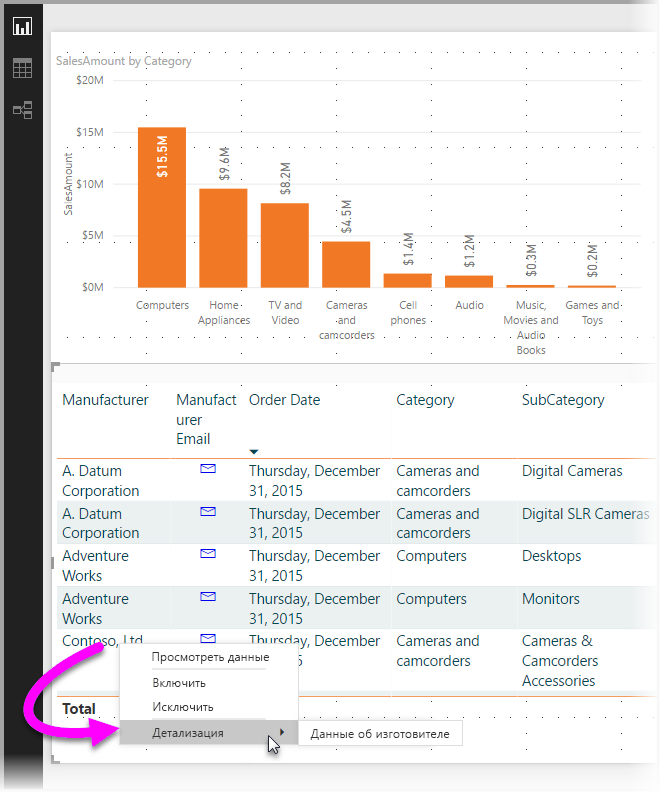
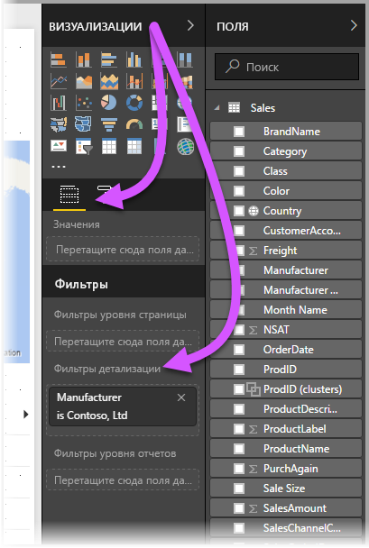
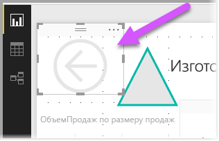
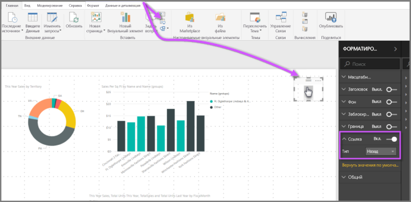
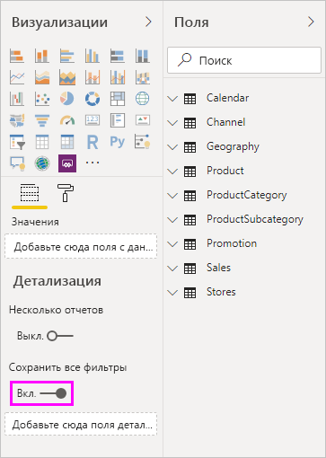
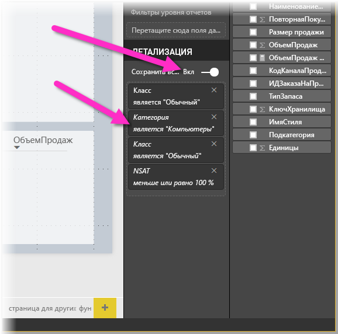
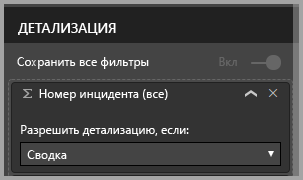

# Использование детализации в Power BI Desktop
С помощью функции **детализации** в **Power BI Desktop** вы можете создать страницу отчета, посвященную определенной сущности, такой как поставщик, клиент или производитель. Щелкнув правой кнопкой мыши точку данных на странице отчета, пользователь может перейти на страницу с дополнительными сведениями об этой точке данных, отфильтрованными по контексту.

## Использование детализации
1. Чтобы использовать **детализацию**, создайте страницу отчета с необходимыми визуальными элементами для типа сущности, для которой будет выполняться детализация. 

    Предположим, вы хотите детализировать данные по производителям. Для этого можно создать страницу детализации с визуальными элементами, которые показывают общий объем продаж, общее количество отгруженных единиц товара, продажи по категориям, продажи по регионам и т. д. Таким образом, когда вы перейдете на эту страницу, отобразятся визуальные элементы, относящиеся к выбранному производителю.

2. Затем на странице детализации в разделе **Поля** панели **Визуализации** перетащите поле, для которого требуется выполнить детализацию, в область **Фильтры детализации**.

    

    Когда вы добавите поле в область **Фильтры детализации**, программа **Power BI Desktop** автоматически создаст визуальный элемент для *возврата*. В опубликованных отчетах этот визуальный элемент представляет собой кнопку. С ее помощью пользователи, которые работают с вашим отчетом в **службе Power BI**, смогут вернуться на страницу отчета, с которой они перешли.

    

## Использование собственного изображения для кнопки возврата    
 Так как кнопка "Назад" — это изображение, вы можете заменить его на любое другое изображение. Это не повлияет на работу кнопки, с помощью которой пользователи отчетов возвращаются к исходной странице. Чтобы использовать собственное изображение для кнопки "Назад", выполните следующие действия:

1. На вкладке **Главная** выберите **Изображение**. Затем найдите требуемое изображение и поместите его на странице детализации.

2. Выберите новое изображение на странице детализации. В разделе **Формат изображения** установите ползунок для параметра **Ссылка** в положение **Включить** и задайте для параметра **Тип** значение **Назад**. Теперь изображение выполняет функцию кнопки возврата.

    

    
     Теперь пользователи могут щелкнуть правой кнопкой мыши точку данных в отчете и открыть контекстное меню, чтобы перейти на страницу детализации. 

    

    Когда пользователь отчета переходит на страницу детализации, данные на странице фильтруются, чтобы отобразить сведения о точке данных, которую он щелкнул правой кнопкой мыши. Например, пользователь щелкнул правой кнопкой мыши точку данных о компании Contoso (производитель) и перешел на страницу детализации. На открывшейся странице детализации данные будут отфильтрованы по компании Contoso.

## Передача всех фильтров в детализации

Начиная с версии **Power BI Desktop**, выпущенной в мае 2018 года, все примененные фильтры можно передавать в окно детализации. Например, можно выбрать определенную товарную категорию и отфильтровать визуальные элементы по этой категории, а затем выбрать детализацию. Вам может быть интересно узнать, как будет выглядеть детализация со всеми примененными фильтрами.

Чтобы сохранить все примененные фильтры, в разделе **Детализация** области **Визуализация** установите переключатель **Передать все фильтры** в положение **Включить**. 

Чтобы сохранить все примененные фильтры в версиях **Power BI Desktop**, выпущенных до мая 2018 г., этот переключатель следует установить в положение **Выключить**.

Выполнив теперь детализацию визуального элемента, можно увидеть, какие фильтры действуют после применения временных фильтров к исходному визуальному элементу. В окне детализации такие временные фильтры выделены курсивом. 

Так же можно было бы поступить и со страницами подсказок, но они будут работать неправильно. Поэтому выполнять эти действия с подсказками не рекомендуется.

## Добавление меры в детализацию

Помимо передачи всех фильтров в окно детализации, вы можете добавить в область детализации меру или итоговый числовой столбец. Перетащите поле детализации в карточку "Детализация", чтобы применить его. 

После добавления меры или итогового числового столбца вы сможете перейти к странице детализации, когда это поле используется в области *Значение* визуального элемента.

Это все, что нужно знать о **детализации** в отчетах. Детализация — отличный способ получить развернутое представление данных о сущности, выбранных с помощью фильтра детализации.

## Дальнейшие действия

Рекомендуем также ознакомиться со следующими материалами:

* [Использование детализации между отчетами в Power BI Desktop](desktop-cross-report-drill-through.md)
* [Использование срезов в Power BI Desktop](visuals/power-bi-visualization-slicers.md)

