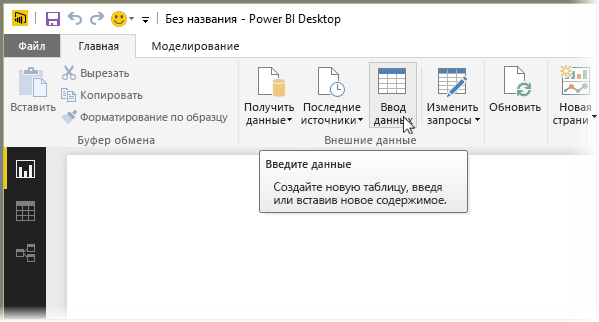
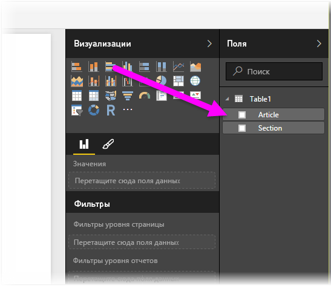

# Ввод данных непосредственно в Power BI Desktop
Вы можете вводить данные непосредственно в Power BI Desktop и использовать их в своих отчетах и визуализациях. Например, можно скопировать часть книги или веб-страницы, а затем вставить ее в Power BI Desktop.

Чтобы приступить к непосредственному вводу, выберите **Введите данные** на ленте **Главная**.

Power BI Desktop может попытаться применить к значениям несущественные преобразования, если это понадобится, как и при загрузке данных из любого источника. Например, в приведенном ниже примере первая строка преобразуется в заголовки.

Чтобы отформатировать введенные (или вставленные) данные, нажмите кнопку **Изменить**, которая вызывает редактор запросов, позволяющий сделать необходимые правки и преобразования, прежде чем загружать информацию в Power BI Desktop. Если нажать кнопку **Загрузить**, данные будут импортированы в исходном виде.

При нажатии кнопки **Загрузить** Power BI Desktop создает на основе данных новую таблицу, которая появляется в области **Поля**. На изображении ниже Power BI Desktop демонстрирует новую таблицу (по умолчанию ей присвоено название *Таблица1*), а также два поля в ней.

Таким образом, вводить данные в Power BI Desktop очень просто.

Теперь вы можете работать с информацией в приложении Power BI Desktop: создавать визуальные элементы и отчеты, а также подключать и импортировать прочие сведения, например книги Excel, базы и любые другие источники данных.

### Дальнейшие действия
В Power BI Desktop можно подключаться к данным самых разных видов. Дополнительные сведения об источниках данных см. в перечисленных ниже статьях.

* [Начало работы с Power BI Desktop](desktop-getting-started.md)
* [Источники данных в Power BI Desktop](desktop-data-sources.md)
* [Формирование и объединение данных в Power BI Desktop](desktop-shape-and-combine-data.md)
* [Подключение к данным Excel в Power BI Desktop](desktop-connect-excel.md)   
* [Подключение к CSV-файлам в Power BI Desktop](desktop-connect-csv.md)   

