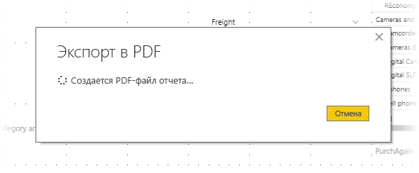

# Экспорт отчетов в PDF из Power BI Desktop
С помощью **Power BI Desktop** или службы Power BI можно экспортировать отчеты в PDF-файлы, а затем поделиться ими или распечатать их.

Процесс экспорта отчета из **Power BI Desktop** в формат PDF для его печати или совместного использования довольно прост. В Power BI Deskop выберите **Файл > Экспорт в PDF**.

Функция **Экспорт в PDF** экспортирует все *видимые* страницы отчета так, что каждая страница отчета будет экспортирована в страницу PDF-файла. Не отображаемые в текущий момент страницы отчета, такие как подсказки или скрытые страницы, не будут экспортироваться в PDF-файл. 

При выборе **Файл > Экспорт в PDF** начинается экспорт, и открывается диалоговое окно, показывающее, что экспорт выполняется. Это диалоговое окно остается на экране до окончания экспорта. Во время экспорта все взаимодействия с экспортируемым отчетом прекращаются. Чтобы начать взаимодействовать с отчетом, дождитесь завершения процесса экспорта или отмените его. 

По завершении экспорта PDF-файл загружается в средство просмотра PDF, установленное по умолчанию на этом компьютере. 

## Рекомендации и ограничения
Существуют определенные рекомендации, которые следует учитывать при использовании функции **Экспорт в PDF**.

* Функция выполняет экспорт визуальных элементов Power BI, но при этом *не* экспортирует фоновый рисунок отчета.

По этой причине следует обратить особое внимание на отчеты с темным фоновым рисунком. Если текст в отчете светлый или белый (для выделения на темном фоне), его будет сложно или даже невозможно прочитать после экспорта в PDF, так как фоновый рисунок не будет экспортирован с остальным отчетом. 

## Дальнейшие действия
В **Power BI Desktop** есть много визуальных элементов и функций. Дополнительные сведения см. в перечисленных ниже источниках.

* [Усовершенствование отчетов Power BI с помощью визуальных элементов](desktop-visual-elements-for-reports.md)
* [Что такое Power BI Desktop?](desktop-what-is-desktop.md)

