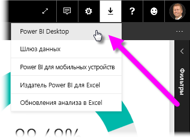
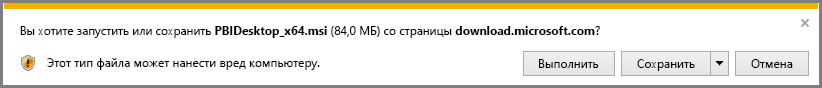
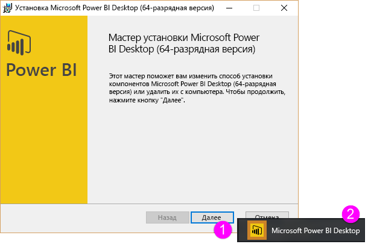
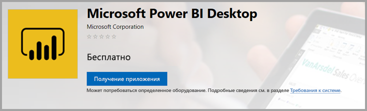

# Получение Power BI Desktop
**Power BI Desktop** дает возможность создавать расширенные запросы, модели и отчеты, визуализирующие данные. С помощью **Power BI Desktop** можно создавать модели данных, отчеты и совместно использовать данные, публикуя их в службе Power BI.  **Power BI Desktop** можно скачать бесплатно.

Получить **Power BI Desktop** можно двумя способами, каждый из которых описан в следующих разделах:

* **скачать** напрямую в виде пакета MSI, скачиваемого и устанавливаемого на компьютер;
* установить как приложение из **Магазина Windows**.

Какой бы способ вы ни выбрали, вы получаете на своем компьютере последнюю версию **Power BI Desktop**. Тем не менее, существуют некоторые различия, которые описаны в следующих разделах.

## Скачивание Power BI Desktop
Чтобы скачать последнюю версию **Power BI Desktop**, щелкните значок загрузки в правом верхнем углу службы Power BI и выберите пункт **Power BI Desktop**.

Вы также можете скачать последнюю версию Power BI Desktop на этой странице:

* [**Скачать Power BI Desktop** (32- и 64-разрядная версия)](https://powerbi.microsoft.com/desktop).
  
  

В любом случае после скачивания **Power BI Desktop** появится запрос на запуск файла установки:

**Power BI Desktop** установится как приложение и запустится на компьютере.

> [!NOTE]
> Установка скачанной версии **Power BI Desktop** (пакет MSI) и версии из **Магазина Windows** на одном и том же компьютере (так называемая *параллельная* установка) не поддерживается.
> 
> 

## Установка в виде приложения из Магазина Windows
Приложение **Power BI Desktop** можно получить также из Магазина Windows. Оно доступно по следующей ссылке:

* [Установить **Power BI Desktop** из **Магазина Windows**](http://aka.ms/pbidesktopstore)

У приложения **Power BI Desktop** из Магазина Windows есть ряд преимуществ:

* **Автоматические обновления.** Windows автоматически скачивает последнюю версию в фоновом режиме, как только она становится доступной. Поэтому ваша версия всегда будет актуальной.
* **Меньше загружаемых файлов.** Из **Магазина Windows** на компьютер при каждом обновлении скачиваются только те компоненты, которые были изменены. Таким образом, загружается меньше файлов.
* **Права администратора не требуются.** Для установки скачанного напрямую файла MSI у вас должны быть права администратора. Если вы получили **Power BI Desktop** из Магазина Windows, права администратора *не* требуются.
* **Возможность развертывания сотрудниками ИТ-отдела**. Версию из **Магазина Windows** проще *развернуть* для всех пользователей в организации. Кроме того, приложение **Power BI Desktop** можно разместить в **Магазине Майкрософт для бизнеса**.
* **Определение языка**. Версия из **Магазина Windows** включает все поддерживаемые языки и при каждом запуске проверяет, какой язык используется на компьютере. Это также влияет на локализацию моделей, созданных в **Power BI Desktop**. Например, встроенные иерархии дат будут соответствовать языку, который использовался в приложении **Power BI Desktop** при создании PBIX-файла.

При установке **Power BI Desktop** из Магазина Windows необходимо учитывать несколько важных моментов.

* Если вы используете соединитель SAP, вам, возможно, потребуется переместить файлы драйвера SAP в папку *Windows\System32*.

> [!NOTE]
> Установка скачанной версии **Power BI Desktop** (пакет MSI) и версии из **Магазина Windows** на одном и том же компьютере (так называемая *параллельная* установка) не поддерживается.
> 
> [!NOTE]
> Версия сервера отчетов Power BI для **Power BI Desktop** отличается от версий, описанных в этой статье, и устанавливается отдельно от них. Сведения о версии сервера отчетов для **Power BI Desktop** см. в статье [Краткое руководство по созданию отчета Power BI для сервера отчетов Power BI](report-server/quickstart-create-powerbi-report.md).
> 
> 

## Использование Power BI Desktop
При запуске **Power BI Desktop** отобразится экран *приветствия*.

Если вы используете **Power BI Desktop** впервые (выполняете установку, а не обновление), вам будет предложено заполнить форму и ответить на несколько вопросов либо войти в **службу Power BI** для продолжения работы.

В этом приложении можно создавать модели данных и отчеты, а затем делиться ими с другими пользователями в службе Power BI. Перейдите по ссылкам в разделе **Дополнительные сведения** в конце этой статьи. Вы найдете руководства, которые помогут вам приступить к использованию **Power BI Desktop**.

## Минимальные требования
Минимальные требования для запуска **Power BI Desktop**:

* Windows 7, Windows Server 2008 R2 или более поздние версии
* .NET 4.5
* Internet Explorer 9 или более поздней версии
* **Память (ОЗУ)** : не менее 1 ГБ (рекомендуется 1,5 ГБ или больше).
* **Дисплей** : рекомендуемое разрешение — не меньше 1440 x 900 или 1600 x 900 (16:9). Использовать дисплеи с более низким разрешением, например 1024 x 768 или 1280 x 800, не рекомендуется, так как некоторые элементы управления (такие как кнопка для закрытия экрана запуска) могут выходить за границы видимой области.
* **Параметры отображения Windows**. Если в параметрах отображения для размера текста, приложений и других элементов задано изменение более чем на 100 %, возможно, не отобразятся некоторые диалоговые окна. При этом, чтобы продолжить работу в **Power BI Desktop**, необходимо закрыть такие окна или ответить на запрос в них. Если возникла эта проблема, откройте **Параметры отображения**, последовательно выбрав в Windows **Параметры > Система > Отображение**, и с помощью ползунка установите для параметров отображения значение 100 %.
* **ЦП** : рекомендуется 32- или 64-разрядный процессор тактовой частотой 1 гигагерц (ГГц) или выше.

## Дальнейшие действия
После установки **Power BI Desktop** ознакомьтесь со статьями, которые помогут вам быстро приступить к использованию этого приложения:

* [Начало работы с Power BI Desktop](desktop-getting-started.md)
* [Общие сведения о запросах в Power BI Desktop](desktop-query-overview.md)
* [Источники данных в Power BI Desktop](desktop-data-sources.md)
* [Подключение к данным в Power BI Desktop](desktop-connect-to-data.md)
* [Формирование и объединение данных в Power BI Desktop](desktop-shape-and-combine-data.md)
* [Общие задачи с запросами в Power BI Desktop](desktop-common-query-tasks.md)   

