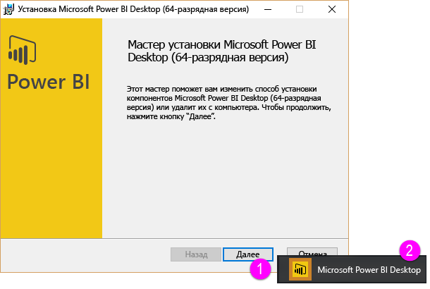
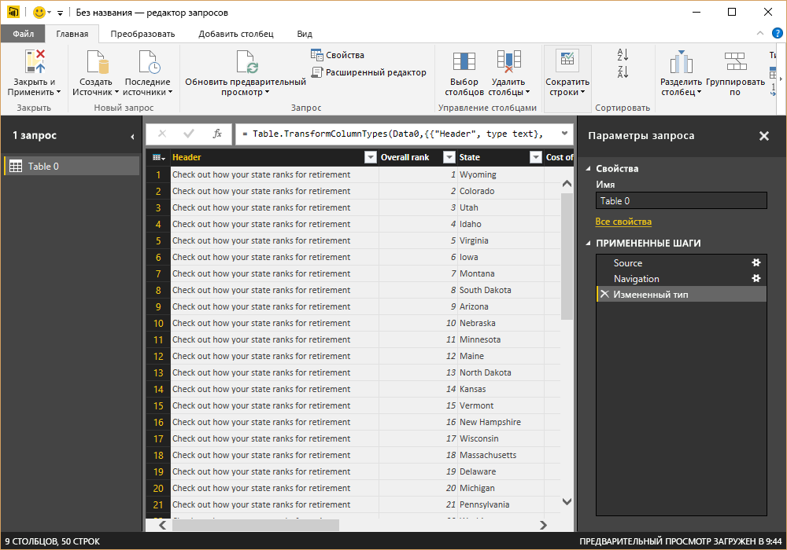
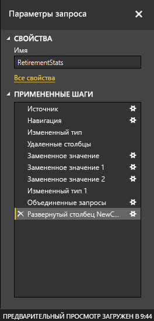
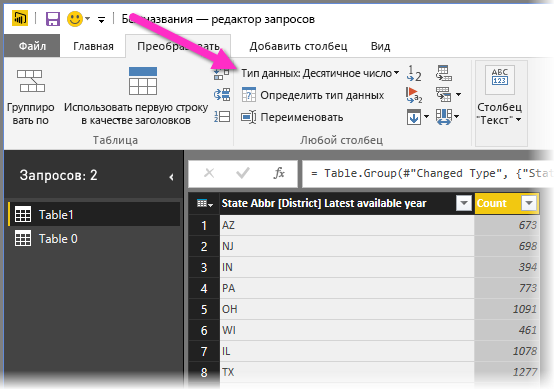

# Начало работы с Power BI Desktop
Добро пожаловать в **руководство по началу работы с Power BI Desktop**. Этот краткий обзор Power BI Desktop знакомит вас с принципами работы инструмента и его функциями и позволяет развить навыки создания надежных моделей данных (и потрясающих отчетов) и повысить эффективность своей работы в области бизнес-аналитики. 

Предпочитаете смотреть, а не читать? Прежде всего [ознакомьтесь с нашим вводным видео](desktop-videos.md). Если вы хотите изучить видео с соответствующими демонстрационными данными, можно [загрузить этот пример книги Excel](http://go.microsoft.com/fwlink/?LinkID=521962).

Power BI Desktop позволяет создать коллекцию запросов, подключений к данным и отчетов, к которым легко предоставить общий доступ другим пользователям. В Power BI Desktop интегрированы проверенные технологии Майкрософт: эффективная подсистема обработки запросов, система моделирования данных и визуализации. Инструмент полностью совместим с [**интернет-службой Power BI**](https://app.powerbi.com/).

Благодаря сочетанию интерфейса **Power BI Desktop** (где аналитики и другие пользователи могут создавать многофункциональные подключения данных, модели и отчеты) и [**службы Power BI**](https://preview.powerbi.com/) (предоставляющей общий доступ к отчетам Power BI Desktop, чтобы пользователи могли просматривать их и взаимодействовать с ними) становится гораздо проще моделировать, строить, совместно использовать и расширять новые идеи из мира данных.

Аналитики данных найдут в Power BI Desktop мощный, гибкий и отличающийся высокой доступностью инструмент для подключения к большим объемам данных, формирования больших объемов данных, построения надежных моделей и создания хорошо структурированных отчетов.

## Как использовать это руководство
Это руководство можно быстро просмотреть, чтобы получить краткий обзор, или внимательно прочесть каждый раздел, чтобы хорошо понять, как работает Power BI Desktop.

Если вы спешите, можно всего за несколько минут просмотреть это руководство, вынеся из него представление о том, как функционирует Power BI Desktop и как его использовать. Большая часть данного руководства состоит из экранов с визуализациями работы Power BI Desktop.

Для более глубокого понимания прочтите каждый раздел, выполните приведенные в нем действия и получите свой собственный файл Power BI Desktop, готовый к отправке в **службу Power BI** и совместному использованию с другими пользователями.

>[!NOTE]
>Существует также отдельная и специализированная версия **Power BI**, которая называется [**Сервер отчетов Microsoft Power BI**](report-server/get-started.md). Она предназначена для клиентов, которые хотят, чтобы их данные и отчеты оставались в локальной среде. Для использования с этой версией существует также отдельная и специализированная версия **Power BI Desktop**, которая называется **Power BI Desktop для Сервера отчетов Microsoft Power BI**. Она работает только с версией "Сервер отчетов Microsoft Power BI". В этой статьей описывается стандартная версия **Power BI Desktop**.

## Принципы работы Power BI Desktop
В Power BI Desktop вы *подключаетесь к данным* (обычно к нескольким источникам данных), *формируете эти данные* (с помощью запросов, создающих информативные, наглядные модели данных) и используете эту модель для *создания отчетов* (которые пользователи могут использовать в своей работе, в том числе совместной).

После выполнения этих действий (подключения к данным, формирования данных и подготовки отчетов) требуемым образом можно сохранить свою работу в формате файла Power BI Desktop, который имеет расширение PBIX. Файлы Power BI Desktop могут совместно использоваться, как любые другие файлы, но наиболее эффективный способ предоставления общего доступа к этим файлам заключается в их отправке в [**службу Power BI**](https://preview.powerbi.com/). 

Power BI Desktop централизует, упрощает и ускоряет то, что в противном случае могло бы представлять собой разрозненный, неупорядоченный и достаточно сложный процесс проектирования и создания репозиториев и отчетов бизнес-аналитики.

Готовы попробовать? Давайте начнем.

## Установка и запуск Power BI Desktop
Power BI Desktop можно загрузить в службе **Power BI** , щелкнув значок **шестеренки** и выбрав **Power BI Desktop**.

Power BI Desktop устанавливается как приложение и выполняется на рабочем столе.

При запуске Power BI Desktop отображается экран *приветствия* .

Здесь можно **Получить данные**, просмотреть **Последние источники**или **Открыть другие** **отчеты** непосредственно с экрана *приветствия* (по ссылкам в области слева). Если закрыть этот экран (нажать **x** в правом верхнем углу), появляется представление **Отчет** Power BI Desktop.

В Power BI Desktop три представления: **Отчет**, **Данные** и **Связи**. Power BI Desktop также включает **Редактор запросов**, который открывается в отдельном окне. В представлении **Редактор запросов**можно создавать запросы и преобразовывать данные, а затем загружать уточненные модели данных в Power BI Desktop и создавать отчеты.

На следующем снимке экрана показаны значки трех представлений в левой части Power BI Desktop: **Отчет**, **Данные** и **Связи** (сверху вниз). Отображаемое в настоящее время представление обозначено желтой полосой слева. В данном случае сейчас отображается представление **Отчет** . Для смены представления нужно выбрать любой из трех значков.

После установки Power BI Desktop можно подключаться к данным, формировать данные и создавать отчеты (обычно в таком порядке). В следующих разделах мы поочередно ознакомим вас с этими действиями.

## Подключение к данным
После установки Power BI Desktop вы готовы подключаться к непрерывно расширяющейся среде данных. В окне запросов доступны *все виды* источников данных. На следующем рисунке показано, как подключиться к данным, щелкнув на ленте вкладку **Главная** и выбрав **Получить данные \> Еще**.

 

В этом кратком обзоре мы будем подключаться к нескольким разным источникам данных в **Интернете** .

Представьте, что вы уходите на пенсию и хотите жить там, где много солнечного света, мягкие налоги и хорошее здравоохранение; — или, возможно, вы аналитик данных и хотите получить эти сведения, чтобы помочь клиентам. Например, возможно, вы хотите помочь своему продавцу солнцезащитных очков организовать адресную реализацию там, где солнце больше светит.

В любом случае интересующие вас данные в этих и многих других областях имеются на следующем веб-ресурсе:

[*http://www.bankrate.com/finance/retirement/best-places-retire-how-state-ranks.aspx*](http://www.bankrate.com/finance/retirement/best-places-retire-how-state-ranks.aspx)

Выберите **Получить данные \> Интернет** и вставьте адрес.

 

Когда вы нажмете кнопку **ОК**, начнет работу функциональность **Запрос** Power BI Desktop. Запрос обращается к веб-ресурсу, и в окне **Навигатор** отображается найденное на веб-странице. В данном случае найдена таблица (*Таблица 0*) и общий интернет-документ. Нас интересует эта таблица, поэтому мы выбираем ее из списка. В окне **Навигатор** доступен предварительный просмотр содержимого.

 

На этом этапе можно изменить запрос перед загрузкой таблицы, нажав кнопку **Изменить** внизу окна, или загрузить эту таблицу.

Если нажать кнопку **Изменить**, загружается редактор запросов и отображается представление таблицы. Появляется область **Параметры запроса** (если эта область не отображается, щелкните на ленте вкладку **Вид**, а затем последовательно выберите **Показать \> Параметры запроса**, чтобы вывести на экран область **Параметры запроса**). Вот как это выглядит.

 

Дополнительные сведения о подключении к данным см. в статье [Подключение к данным в Power BI Desktop](desktop-connect-to-data.md).

В следующем разделе мы настроим данные так, чтобы они соответствовали нашим потребностям. Процесс настройки подключенных данных называется *формированием* данных.

## Формирование и объединение данных.
Теперь, когда мы подключились к источнику данных, необходимо настроить данные для наших потребностей. Иногда настройка означает *преобразование* данных, например переименование столбцов или таблиц, изменение текста на числа, удаление строк, установку первой строки в качестве заголовков и т. д.

В редакторе запросов в Power BI Desktop можно в полной мере использовать контекстные меню в дополнение к задачам, доступным на ленте. Почти все действия, которые можно выбрать на ленте **Преобразование** , также доступны, если щелкнуть правой кнопкой мыши элемент (например, столбец) и выбрать соответствующий пункт в появившемся меню.

## Формирование данных
При формировании данных в **редакторе запросов**вы создаете пошаговые инструкции (которые автоматически выполняются в этом **редакторе запросов** ) для настройки данных по мере их загрузки и отображения в **редакторе** . Это не влияет на исходный источник данных; корректируется или *формируется* только это конкретное представление данных.

Указываемые действия (переименование таблицы, преобразование типа данных или удаление столбцов) записываются **редактором запросов**, и каждый раз, когда этот запрос подключается к источнику данных, эти действия выполняются, чтобы данные всегда были сформированы указанным образом. Это происходит всякий раз, когда вы используете этот запрос в Power BI Desktop или когда кто-либо другой использует ваш открытый для общего доступа запрос, например в **службе Power BI** . Эти действия последовательно записываются в области **Параметры запроса** в разделе **Примененные действия**.

На следующем рисунке показана область **Параметры запроса** для сформированного запроса — мы разберем каждое из этих действий ниже.

 

Давайте вернемся к нашим данным, найденным путем подключения к источнику данных в Интернете, и сформируем эти данные в соответствии с нашими потребностями.

Во-первых, большинство оценок были представлены в **редакторе запросов** как целые числа, но не все из них (один столбец содержал текст и числа, поэтому он не был преобразован автоматически). Мы хотим, чтобы данные были числами. Для этого достаточно щелкнуть правой кнопкой мыши заголовок столбца и выбрать **Изменить тип \> Целое число**, чтобы изменить тип данных. Если нужно выбрать несколько столбцов, сначала выберите столбец, нажмите и удерживайте клавишу **SHIFT**, в то же время выбирая дополнительные смежные столбцы, а затем щелкните правой кнопкой мыши заголовок столбца, чтобы изменить все выбранные столбцы. Можно также использовать клавишу **CTRL** для выбора несмежных столбцов.

 

Также можно изменить (или *преобразовать* эти столбцы из текста в заголовок), воспользовавшись лентой **Преобразование** . На следующем рисунке показана лента **Преобразование** ; стрелка на рисунке указывает на кнопку **Тип данных** , которая позволяет преобразовать текущий тип данных в другой.

 

Обратите внимание, что внесенные изменения отражаются в области **Параметры запроса**в разделе **Примененные действия** . Если требуется удалить какой-либо шаг из процесса формирования, можно просто выбрать этот шаг и щелкнуть значок **X** слева от него.

 

Мы должны сделать еще несколько дополнительных изменений, чтобы получить нужный нам запрос.

* *Удалить первый столбец* — он нам не нужен, в нем просто содержатся лишние строки, в которых говорится "Проверьте, как ваш штат оценивается для выхода на пенсию", возникшие в результате получения этой таблицы из веб-данных.

<!-- -->

* *Устранить несколько ошибок* — на веб-странице один столбец содержит текст в сочетании с числами (некоторые штаты включены в одну категорию). Это хорошо работает на веб-сайте, но не годится для анализа данных. В данном случае это можно легко исправить и продемонстрировать некоторые полезные функции и возможности **редактора запросов** и его раздела **Примененные действия**

<!-- -->

* *Изменить имя таблицы* : имя **Таблица 0** не несет полезных сведений, но его легко изменить.

Каждое из этих действий продемонстрировано в разделе **[Формирование и объединение данных в Power BI Desktop](desktop-shape-and-combine-data.md)** . Вы можете извлечь эту страницу или продолжить работать с этим документом, чтобы увидеть, что следует делать далее. Следующий раздел продолжается после применения приведенных выше изменений.

## Объединение данных
Эти данные о различных штатах представляют интерес и будут использоваться для создания дополнительных аналитических исследований и запросов. Однако есть одна проблема: в большей части данных здесь используется не полное название штата, а его двухбуквенный код. Нам нужно каким-либо способом связать названия штатов с их кодами.

Нам повезло: имеется другой общедоступный источник данных, который делает именно это, но требуется его изрядное формирование, прежде чем можно будет подключить его к нашей таблице. Вот этот веб-ресурс для кодов штатов:

<http://en.wikipedia.org/wiki/List_of_U.S._state_abbreviations>

Из ленты **Главная** в представлении **Редактор запросов** выберите **Получить данные \> Интернет**, введите адрес, нажмите кнопку **ОК**. В окне **Навигатор** отобразится содержимое этой веб-странице.

 

Мы устанавливаем флажок **(Таблица[изменить])** , поскольку в этой таблице содержатся нужные нам данные, но их нужно немного очистить. Каждое из этих действий также демонстрируется в разделе **[Формирование и объединение данных в Power BI Desktop](desktop-shape-and-combine-data.md)** . Итак, вот что мы делаем.

Мы выбираем **Изменить**, а затем вносим следующие изменения.

* *Удалим первые две строки* : они появились в результате создания таблицы на веб-странице определенным способом, они не нужны.

<!-- -->

* *Удалим последние 26 строк* : это все территории, которые включать не нужно.

<!-- -->
* *Отфильтруем значение Washington DC (Вашингтон, Округ Колумбия)* — таблица RetirementStats не содержит значение DC, поэтому мы исключим ее из списка.

<!-- -->

* *Удалим несколько ненужных столбцов* : нам требуется только сопоставление штата с его официальным двухбуквенным кодом, поэтому мы можем удалить другие столбцы.

<!-- -->

* *Используем первую строку в качестве заголовков* : поскольку мы удалили три верхние строки, текущая верхняя строка является нужным нам заголовком.

    >[!NOTE]
    >Это подходящий момент, чтобы показать, как важна *последовательность* примененных шагов в **редакторе запросов**, так как она может влиять на способ формирования данных. Также важно рассмотреть, как один шаг может повлиять на последующий шаг; если удалить шаг из раздела **Примененные действия**, то последующие шаги могут работать не так, как предполагалось, из-за влияния последовательности шагов запроса.

* *Переименовываем столбцы и саму таблицу* : как правило, существует несколько способов изменения имени столбца и можно выбрать любой из них.

После того как таблица *StateCodes* сформирована, можно объединить эти две таблицы (или два запроса) в одну; поскольку таблицы, которые у нас получились, представляют собой результат запросов к данным, они часто называются *запросами*.

Существует два основных способа объединения запросов: *слияние* и *дополнение*.

Если имеется один или несколько столбцов, которые требуется добавить в другой запрос, нужно выполнить **слияние** запросов. При наличии дополнительных строк данных, которые нужно добавить в существующий запрос, выполняется **дополнение** запроса.

В данном случае мы хотим слить запросы. Для начала мы выберем запрос, *с которым* хотим выполнить слияние другого запроса, а затем выберем команду **Объединить запросы** на вкладке ленты **Главная** .

 

Появится окно **Слияние** , предлагающее выбрать таблицу для слияния с выбранной и соответствующие столбцы для слияния. Выберите столбец *Штат* из таблицы (запроса) *RetirementStats* , затем выберите запрос *StateCodes* (в данном случае это просто, так как существует только один другой запрос, а при подключении к нескольким источникам данных приходится выбирать из нескольких запросов). Выбрав нужные сопоставляемые столбцы ( *Штат* из таблицы *RetirementStats* и *Название штата* из таблицы *StateCodes* , мы увидим окно **Слияние** , которое выглядит следующим образом, и активную кнопку **ОК** .

 

В конце запроса создается столбец **NewColumn** , содержащий данные из таблицы (запроса), которая была объединена с существующим запросом. Все столбцы из объединенного запроса включены в столбец **NewColumn**, но можно **Развернуть** таблицу и включить нужные столбцы. Чтобы развернуть объединенную таблицу и выбрать столбцы для включения, щелкните значок развертывания (). Появится окно **Развернуть** .

 

В данном случае нам нужен только столбец *Код штата* , поэтому мы выберем только этот столбец, а затем нажмем кнопку **ОК**. Мы снимаем флажок **Использовать имя исходного столбца как префикс** , поскольку нам это не нужно; если оставить этот флажок, то объединенный столбец будет называться *NewColumn.State Code* (имя исходного столбца *NewColumn*, затем точка, а затем имя столбца, отображаемого в запросе).

>[!NOTE]
>Хотите опробовать разные способы выведения таблицы *NewColumn* на экран? Вы можете немного поэкспериментировать, и если вас не устроит результат, просто удалите этот шаг из списка **примененных действий** в области **параметров запроса** ; ваш запрос вернется в состояние до применения шага **Развернуть** . Это как бесплатная попытка, которую вы можете повторять сколько угодно, пока процесс развертывания не будет происходить так, как нужно.

Теперь у нас есть один запрос (таблица), объединяющий два источника данных, каждый из которых сформирован так, как нам нужно. Этот запрос может служить основой для большого количества дополнительных подключений к представляющим интерес данным, таким как стоимость содержания, демографические данные или вакансии в любом штате.

Подробное описание каждого действия по формированию и объединению данных см. в статье [Формирование и объединение данных в Power BI Desktop](desktop-shape-and-combine-data.md).

Теперь у нас есть достаточно данных для создания нескольких интересных отчетов в Power BI Desktop. Поскольку это важный этап процесса, давайте сохраним этот файл Power BI Desktop и назовем его **Начало работы с Power BI Desktop**. Чтобы применить изменения в **редакторе запросов** и загрузить их в Power BI Desktop, выберите **Закрыть и применить** на ленте **Главная**.

## Создание отчетов
После загрузки таблицы можно внести дополнительные изменения. Кроме того, можно повторно загружать модель, чтобы применить внесенные изменения. Однако сейчас этого достаточно. В представлении **Отчет** в Power BI Desktop можно приступить к созданию отчетов.

Представление **Отчет** имеет пять основных областей:

1. лента, на которой отображаются стандартные задачи, связанные с отчетами и визуализациями;
2. представление **Отчет** , где создаются и оформляются визуализации;
3. область вкладок **Страницы** внизу, где можно выбрать и добавить страницу отчета;
4. область **Визуализации** , где можно изменить визуализации, настроить цвета и оси, применить фильтры, перетащить поля и многое другое;
5. область **Поля** , где элементы запросов и фильтры можно перетащить в представление **Отчет** или область **Фильтры** зоны **Визуализации** .
   
   

Области **Визуализации** и **Поля** можно свернуть, щелкнув маленькую стрелку сбоку, чтобы освободить больше места в представлении **Отчет** для построения впечатляющих визуализаций. При изменении представлений вы также увидите эти указывающие вверх или вниз стрелки, означающее, что можно развернуть или свернуть этот раздел соответственно.

 

Для создания визуализации просто перетащите поле из списка **Поля** в представление **Отчет** . В данном случае давайте перетащим поле *Штат* из области *RetirementStats* и посмотрим, что произойдет.

 

Посмотрите... Power BI Desktop автоматически создает визуализацию на основе карты, так как распознает, что поле *Штат* содержит данные о географическом положении.

Обратите внимание, что в области **Визуализации** можно выбрать различные типы визуализаций, а в области под этими значками можно перетащить поля в разные области, чтобы применить условные обозначения, или изменить визуализацию любым другим способом.

 

Давайте немного перенесемся вперед и посмотрим, как выглядит представление **отчетов** после добавления небольшого количества визуализаций и нескольких новых страниц отчета. Дополнительные сведения об отчетах см. в статье [Представление отчетов в Power BI Desktop](desktop-report-view.md).

На первой странице отчета представлена перспектива данных на основе *общего рейтинга*. Когда мы выбираем одну из визуализаций, в области **Поля и фильтры** отображаются выбранные поля и структура визуализации (поля которой применяются к разделам **Общая ось**, **Значения столбцов**и **Значения строк**).

 

Этот отчет состоит из шести **страниц** , каждая из которых визуализирует определенные элементы данных.

1. На первой странице выше отображаются все штаты на основе *общего рейтинга*.
2. На второй странице отображаются сведения о десяти лучших штатах исходя из *общего рейтинга*.
3. На третьей странице отображаются 10 лучших штатов по стоимости жизни (и соответствующие данные).
4. На четвертой странице отображаются сведения о погоде для 15 самых солнечных штатов.
5. На пятой странице приводятся графики и визуализации данных по общему благосостоянию для 15 лучших штатов.
6. Наконец, на шестой странице визуализируется статистика преступности для десяти лучших (и худших) штатов.

Вот как выглядит страница отчета, посвященная стоимости жизни.

 

Присутствуют все виды интересных отчетов и визуализаций, которые вы можете создать.

## Совместное использование работы
Теперь, когда у нас есть достаточно полный отчет Power BI Desktop, им можно поделиться с другими в **службе Power BI** . Существует несколько способов предоставления общего доступа к своей работе в Power BI Desktop. Работу можно опубликовать в службе **Power BI** , можно загрузить файл PBIX непосредственно из службы Power BI или сохранить этот файл и отправить его как любой другой файл.

Во-первых, рассмотрим публикацию в службе **Power BI** непосредственно из Power BI Desktop. На ленте **Главная** выберите **Опубликовать**.

Вам может быть предложено выполнить вход в Power BI.

Если вы выполнили вход и завершили процесс публикации, отобразится следующее диалоговое окно.

При входе Power BI вы увидите только что загруженный файл Power BI Desktop в разделах службы **Панели мониторинга**, **Отчеты**и **Наборы данных** .

Кроме того, для предоставления общего доступа к своей работе можно загрузить ее из службы **Power BI** . C помощью следующей ссылки можно открыть службу **Power BI** в браузере:

`https://app.powerbi.com`

Нажмите **Получить данные** , чтобы запустить процесс загрузки своего отчета Power BI Desktop.

 

Появится страница **получения данных** , на которой можно выбрать источник получения своих данных. В этом случае мы выберем **Получить** из поля **Файлы** .

Появляется представление **Файлы** . Нам нужно выбрать **Локальный файл**.

При выборе файла Power BI загружает файл.

После передачи файла можно выбрать его в поле **Отчеты** в левой области службы Power BI.

В службе **Power BI** отображается первая страница отчета. Вы можете выбрать любую вкладку в нижней части страницы, чтобы отобразить соответствующую страницу отчета.

 

Можно внести изменения в отчет в службе **Power BI** , выбрав **Редактировать отчет** в верхней части холста отчета.

Чтобы сохранить отчет, выберите **Файл \> Сохранить как** в службе. Там присутствуют все виды интересных визуальных элементов, которые можно создать в службе **Power BI** из отчета и закрепить на *панели мониторинга*. Дополнительные сведения о панелях мониторинга в **службе** Power BI<strong>[ см. в рекомендациях по проектированию идеальной панели мониторинга](service-dashboards-design-tips.md)</strong>.

 

После сохранения щелкните значок **Поделиться** на главной странице.

 

Отсюда можно отправить по электронной почте сообщение коллегам, с которыми вы хотите совместно использовать панель мониторинга.

 

Дополнительные сведения о создании, изменении панелей мониторинга и предоставлении общего доступа к ним см. в разделе [Совместное использование панели мониторинга](service-share-dashboards.md).

С помощью Power BI Desktop и службы Power BI можно создавать все виды впечатляющих гибридных веб-приложений и визуализаций на основе данных. Дополнительные сведения см. в следующем разделе.

## Диагностика

Power BI Desktop поддерживает подключение к порту диагностики. Этот порт обеспечивает подключение других инструментов для выполнения трассировки в целях диагностики. *Внесение в модель изменений не поддерживается! Изменения модели могут привести к повреждению и потере данных.*

## Дальнейшие действия
Power BI Desktop предоставляет широкие возможности. Дополнительные сведения об этих возможностях см. в следующих ресурсах.

* [Общие сведения о запросах в Power BI Desktop](desktop-query-overview.md)
* [Источники данных в Power BI Desktop](desktop-data-sources.md)
* [Подключение к данным в Power BI Desktop](desktop-connect-to-data.md)
* [Формирование и объединение данных в Power BI Desktop](desktop-shape-and-combine-data.md)
* [Общие задачи с запросами в Power BI Desktop](desktop-common-query-tasks.md)   