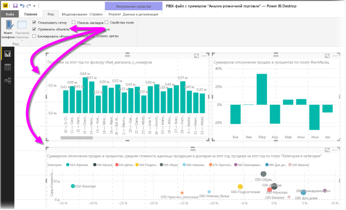
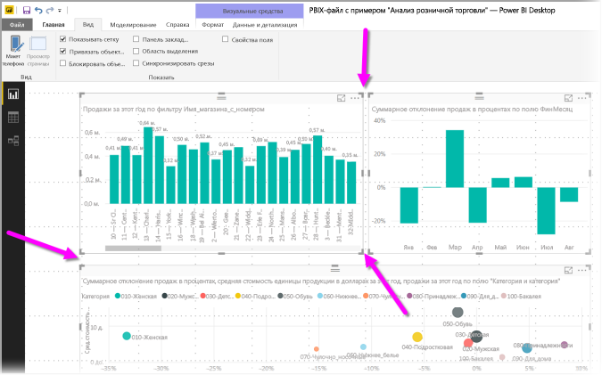
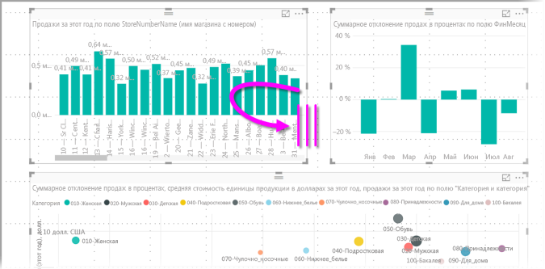
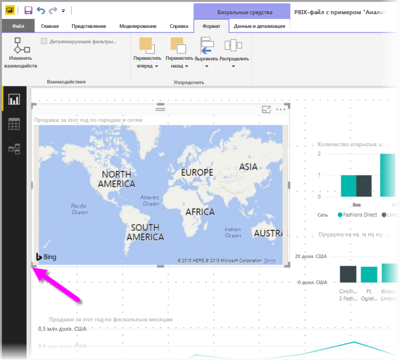

# Использование линий сетки и привязки к сетке в отчетах Power BI Desktop
На холсте отчетов **Power BI Desktop** отображаются линии сетки, которые позволяют аккуратно выравнивать визуальные элементы на странице отчета и привязывать их к сетке. Благодаря этим возможностям объекты в отчете будут выровнены и расположены с равными интервалами.

В **Power BI Desktop** можно также настроить z-порядок (переместить вперед и назад) объектов в отчете, а также выровнять или равномерно распределить выбранные визуальные элементы на холсте.

### Включение линий сетки и привязки к сетке
Чтобы включить линии сетки и привязку к сетке, выберите ленту **Представление**, а затем установите флажки **Показать линии сетки** и **Привязать объекты к сетке**. Вы можете выбрать один или оба параметра. Они работают независимо друг от друга.

> [!NOTE]
> Если параметры **Показать линии сетки** и **Привязать объекты к сетке** отключены, подключитесь к любому источнику данных, и они станут доступными.
> 
> 

### Использование линий сетки
Линии сетки — это видимые направляющие, помогающие выровнять визуальные элементы. Если вы пытаетесь определить горизонтальное или вертикальное выравнивание двух или нескольких визуальных элементов, используйте линии сетки, чтобы определить, выровнены ли их границы.

Вы можете нажать клавишу CTRL и щелкнуть мышью, чтобы выбрать сразу несколько визуальных элементов. При этом отображаются границы всех выбранных визуальных элементов, что позволяет определить, правильно ли они выровнены.

#### Использование линий сетки внутри визуальных элементов
В Power BI внутри визуальных элементов также доступны линии сетки. Они предоставляют видимые направляющие для сравнения значений и точек данных. Начиная с выпуска **Power BI Desktop** за сентябрь 2017 г. вы можете управлять линиями сетки в визуальных элементах с помощью карт **Ось Х** и **Ось Y** (при необходимости на основе типа визуального элемента). Эти элементы доступны в разделе **Формат** в области **Визуализации**. Вы можете управлять элементами линий сетки внутри визуальных элементов:

* включать и выключать линии сетки;
* изменять цвет линий сетки;
* настраивать толщину линий сетки;
* выбирать стиль линий сетки в визуальном элементе, используя сплошную, штриховую или пунктирную линию.

Изменение определенных элементов линий сетки может быть особенно полезным в отчетах, в которых для визуальных элементов используется темный цвет фона. На следующем рисунке показан раздел **Линии сетки** на карте **Ось Y**.

### Использование привязки к сетке
Если включить параметр **Привязать объекты к сетке**, все визуальные элементы, которые вы перемещаете (или размер которых вы меняете) на холсте **Power BI Desktop**, автоматически выравниваются по ближайшей оси на сетке. Благодаря этому визуальные элементы легко выравниваются по вертикали, горизонтали или размеру.

Вот и все, что нужно знать, чтобы легко и аккуратно выравнивать визуальные элементы в отчетах с помощью **линий сетки** и **привязки к сетке**.

### Использование z-порядка, выравнивания и распределения
Вы можете управлять порядком расположения визуальных элементов в отчете от начала к концу, который часто называют *z-порядком* элементов. Эта функция позволяет перекрыть визуальные элементы любым необходимым способом, а затем настроить порядок от начала к концу каждого элемента. Для задания порядка визуальных элементов можно использовать кнопки **Переместить вперед** и **Переместить назад** в разделе **Упорядочить** ленты **Формат**. Лента **Формат** отображается сразу после выбора одного или нескольких визуальных элементов на странице.

Лента **Формат** позволяет выравнивать визуальные элементы различными способами, чтобы элементы отображались на странице оптимальным образом.

Кнопка **Выровнять** позволяет выровнять выбранный визуальный элемент по краю (или центру) холста отчетов, как показано на рисунке ниже.

Если выбрано несколько визуальных элементов, они выравниваются вместе, причем для выравнивания используется их существующая выровненная граница. Например, если выбраны два визуальных элемента и нажата кнопка **Выровнять по левому краю**, выполняется выравнивание по крайней левой границе всех выбранных визуальных элементов.

Можно также равномерно распределить визуальные элементы на холсте отчета — по вертикали или по горизонтали. Для этого служит кнопка **Распределить** на ленте **Формат**.

Примените несколько параметров из инструментов для линий сетки, выравнивания и распределения, и отчеты будут выглядеть так, как вам нужно.

