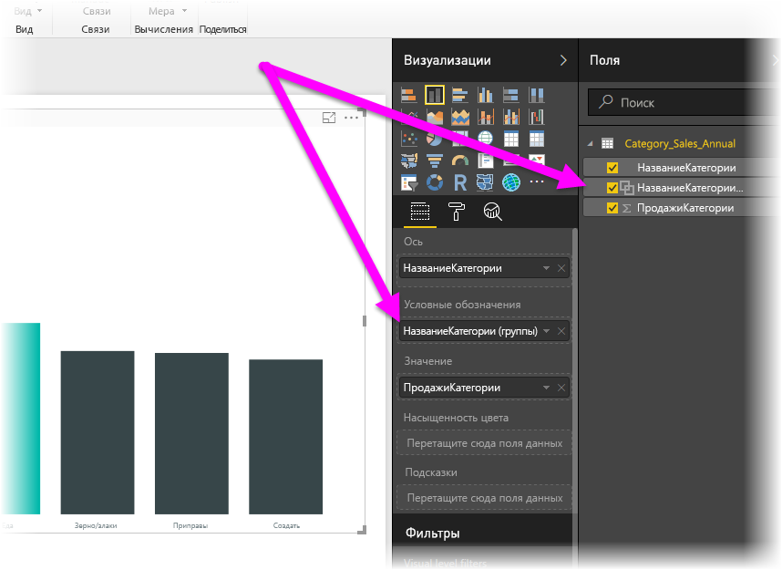
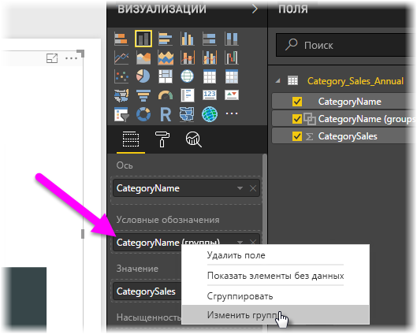
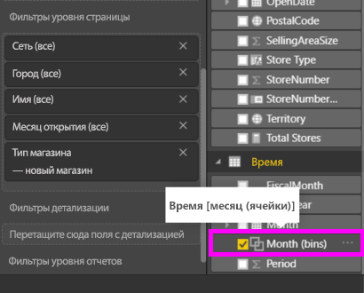

# Группирование данных и разделение их на ячейки в Power BI Desktop
При создании визуальных элементов в **Power BI Desktop** данные объединяются в блоки (или группы) на основе значений базовых данных. Часто это устраивает пользователя. Но бывают случаи, когда требуется уточнить представление этих блоков. Например, может потребоваться объединить три категории продуктов в одну более крупную категорию (одну *группу*). Или же можно отобразить показатели продаж в ячейках по 1 000 000 долларов, а не разделять их равномерно по 923 983 доллара.

Power BI Desktop позволяет **группировать** точки данных для более удобного просмотра, анализа и изучения данных и тенденций в визуальных элементах. Вы также можете определить **размер ячейки** (что также называется *разделением на ячейки*), чтобы поместить значения в группы одинакового размера для более эффективной и понятной визуализации данных.

### Группирование
Для группирования щелкните несколько объектов в визуальном элементе, удерживая клавишу CTRL. Щелкните правой кнопкой мыши один из выбранных объектов и в появившемся меню выберите пункт **Группа**.

Созданная группа будет добавлена в сегмент **Условные обозначения** этого визуального элемента, а также появится в списке **Поля**.

Элементы созданной группы можно изменять. Для этого щелкните правой кнопкой мыши поле в сегменте **Условные обозначения** или в списке **Поля** и выберите команду **Изменить группы**.

В открывшемся окне **Группы** можно создать новые группы или изменить существующие. Можно также *переименовать* любую группу, дважды щелкнув заголовок группы в поле **Группы и члены** и введя новое название.

Применение групп имеет много преимуществ. Можно добавить элементы из списка **Несгруппированные значения** в новую группу или одну из существующих. Чтобы создать группу, выберите несколько элементов (щелкайте элементы, удерживая нажатой клавишу CTRL) в поле **Несгруппированные значения**, а затем нажмите кнопку **Сгруппировать** под этим полем.

Можно добавить несгруппированное значение в существующую группу. Просто выберите его, а затем выберите существующую группу, в которую нужно добавить это значение, и нажмите кнопку **Сгруппировать**. Чтобы удалить элемент из группы, выберите его в поле **Группы и члены** и нажмите кнопку **Разгруппировать**. Кроме того, можно поместить категории без группировки в группу **Другие** или оставить их без группировки.

> [!NOTE]
> Вы можете создавать группы для любого поля в области **Поля**, не выполняя множественный выбор в существующем визуальном элементе. Для этого щелкните поле правой кнопкой мыши и выберите в меню элемент **Группа**.
> 
> 

### Разделение на ячейки
В **Power BI Desktop** можно задать размер ячейки для числовых полей и полей времени. Разделение на ячейки можно использовать для объединения отображаемых в **Power BI Desktop** данных в группы необходимого размера.

Чтобы применить определенный размер ячейки, щелкните правой кнопкой мыши нужное **поле** и выберите элемент **Создать группу**.

В окне **Группы** установите необходимое значение для параметра **Размер ячейки**.

Нажмите кнопку **ОК**. В области **Поля** появится новое поле с добавлением *(ячеек)*. Это поле можно перетащить на холст и использовать размер ячейки в визуальном элементе.

В [этом видео](https://www.youtube.com/watch?v=BRvdZSfO0DY) показано, как выполняется **разделение на ячейки**.

Вот и все, что нужно знать о **группировании** и **разделении на ячейки** для того, чтобы визуальные элементы в отчетах отображали данные необходимым образом.

