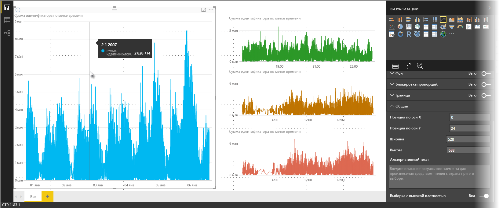
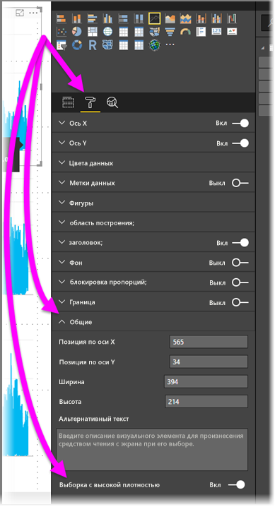

# Выборка линий с высокой плотностью в Power BI
Начиная с выпуска **Power BI Desktop** за июнь 2017 года и обновлений **службы Power BI** доступен новый алгоритм выборки, который улучшает визуальные элементы, использующие выборку данных высокой плотности. Например, можно создать график результатов продаж розничных магазинов, выписывающих более десяти тысяч товарных чеков ежегодно. Для графика таких сведений о продажах выполняется выборка (выбор информативного представления данных, чтобы показать, как изменяются продажи со временем) из данных для каждого магазина, что позволяет создать смешанный график, который представляет базовые данные. Это распространенный подход к визуализации данных с высокой плотностью. В Power BI Desktop улучшена выборка данных с высокой плотностью. Этому и посвящена статья.

> [!NOTE]
> Алгоритм **выборки с высокой плотностью**, описанный в этой статье, доступен в **Power BI Desktop** и **службе Power BI**.
> 
> 

## Как действует выборка линий с высокой плотностью
Ранее в **Power BI** детерминированным образом отбирался набор выборочных точек данных на полном диапазоне базовых данных. Например, для данных высокой плотности визуального элемента за один календарный год может отображаться 350 выборочных точек данных, которые были выбраны, чтобы в визуальном элементе был представлен полный диапазон данных (весь ряд базовых данных). Чтобы понять, как это происходит, представьте построение графика цены акций за год, для чего выбираются 365 точек данных (по одной точке данных на день).

В этом случае существует много значений цены акций за каждый день. Разумеется, имеются максимальная и минимальная цена за каждый день, но они могут возникнуть в любое время в течение дня, когда открыта фондовая биржа. При выборке линий с высокой плотностью если исходная выборка данных выполнялась в 10:30 и 12:00 каждый день, то вы получите репрезентативный моментальный снимок базовых данных (цены на 10:30 и 12:00), но он может не содержать фактическую максимальную и минимальную цену акций для этой репрезентативной точки данных (за этот день). В подобных ситуациях выборка содержит репрезентативный набор базовых данных, но он не всегда включает в себя важные точки. В приведенном примере это ежедневная максимальная и минимальная цена акций.

По определению выборка данных с высокой плотностью применяется для достаточно быстрого создания интерактивных визуализаций. Слишком большое число точек данных в визуальном элементе может затормозить его работу и помешать отображению тенденций. Способ выбора данных определяет алгоритм выборки. Он отвечает за оптимальную визуализацию. Алгоритм в Power BI Desktop усовершенствован, чтобы обеспечить наилучшее сочетание времени отклика, представления и гарантированного сохранения важных точек в каждом временном срезе.

## Как действует новый алгоритм выборки строк
Новый алгоритм выборки строк с высокой плотностью доступен для графиков и диаграмм с областями с непрерывной осью X.

Для визуального элемента с высокой плотностью **Power BI** интеллектуально разделяет данные на блоки с высокой дискретизацией, а затем выбирает важные точки для представления каждого блока. Этот процесс создания срезов данных с высокой дискретизацией специально настроен так, чтобы полученная диаграмма внешне не отличалась от диаграммы, содержащей все базовые точки данных, но была намного быстрее и интерактивнее.

### Минимальное и максимальное значения для визуальных элементов с высокой плотностью линий
Для любого визуального элемента действуют следующие ограничения.

* Визуальный элемент может *отображать* не более **3500** точек данных, вне зависимости от количества базовых точек данных или рядов. То есть, если у вас имеется 10 рядов по 350 точек данных, визуальный элемент достигнет общего предела точек данных. Если имеется один ряд, то он может содержать до 3500 точек данных, если новый алгоритм определит, что это лучшая выборка для базовых данных.
* Для любого визуального элемента можно использовать не более **60 рядов**. При наличии более 60 рядов следует разбить данные и создать несколько визуальных элементов, содержащих по 60 или менее рядов. Рекомендуется использовать **срез**, чтобы отображать только сегменты данных (только определенные ряды). Например, если вы отображаете все подкатегории в условных обозначениях, можно использовать срез, чтобы отфильтровать данные по общей категории на той же странице отчета.

Благодаря этим параметрам визуальные элементы в Power BI Desktop отображаются очень быстро, реагируют на действия пользователей и не потребляют слишком много вычислительных ресурсов компьютера, на котором отрисовывается визуальный элемент.

### Оценка репрезентативных точек данных для визуальных элементов с высокой плотностью линий
Когда число базовых точек данных превышает максимально допустимое число точек данных для визуального элемента (3500), начинается так называемый процесс *группирования*. Базовые данные разделяются на группы (*ячейки*), которые затем итеративно детализируются.

Алгоритм создает столько ячеек, сколько возможно, чтобы обеспечить наивысшую степень детализации визуального элемента. В каждой ячейке алгоритм находит минимальное и максимальное значения данных, чтобы обеспечить запись и отображение на визуальном элементе важных и характерных значений (например, выбросов). На основе результатов группирования и последующей оценки данных в Power BI определяется минимальное разрешение оси X для визуального элемента, чтобы обеспечить для него максимальную степень детализации.

Как упоминалось ранее, минимальная степень детализации для каждого ряда составляет 350 точек, а максимальная — 3500 точек.

Каждая ячейка представляется двумя точками данных, которые стали ее репрезентативными точками данных в визуальном элементе. Эти точки данных — просто максимальное и минимальное значения в ячейке. Выбирая их, процесс группирования гарантирует, что все важные максимальные значения и характерные минимальные значения будут записаны и отображены на визуальном элементе.

Если вам показалось, что для записи случайных выбросов и их отображения на визуальном элементе требуется тщательный анализ, то вы совершенно правы. И именно поэтому был разработан новый алгоритм и процесс группирования.

## Подсказки и выборка линий с высокой плотностью
Важно отметить, что процесс группирования, который позволяет записать минимальное и максимальное значения в заданной ячейке и отобразить их, может повлиять на отображение подсказок для данных при наведении указателя на точки данных. Чтобы объяснить, как и почему это происходит, давайте вернемся к нашему примеру с ценами акций.

Предположим, что вы создаете визуальный элемент на основе цены акций и сравниваете две различные акции, для которых используется **выборка с высокой плотностью**. Базовые данные для каждого ряда содержат большое количество точек данных (например, вы могли записывать цены акций за каждую секунду). Алгоритм выборки линий с высокой плотностью позволяет независимо выполнять группирование каждого ряда.

Теперь предположим, что цена первой акции повышается в 12:02, а через десять секунд снова падает. Это важная точка данных. При группировании данных этой акции максимальная цена в 12:02 станет репрезентативной точкой данных для этой ячейки.

Но цена второй акции в 12:02 не была ни максимальной, ни минимальной в ячейке, включающей в себя это время. Возможно, эти значения возникли в данной ячейке тремя минутами позже. В этом случае при наведении указателя мыши на 12:02 в созданном графике отобразится подсказка со значением для первой акции (так как ее цена повысилась в 12:02 и это значение было выбрано в качестве максимальной точки данных ячейки), на вы *не* увидите в этой подсказке значение для второй акции в 12:02. Причина этого состоит в том, что в 12:02 цена второй акции не была ни максимальной, ни минимальной для данной ячейки. Поэтому данных на 12:02 для второй акции нет, и подсказка не содержит какую-либо информацию о ней.

Это будет часто происходить с подсказками. Максимальное и минимальное значения в заданной ячейке могут не точно соответствовать точкам значений на равномерной оси x, поэтому подсказка может не отображать значение.  

## Как включить выборку линий с высокой плотностью
По умолчанию новый алгоритм **включен**. Чтобы изменить это, перейдите в область **Форматирование**, выберите карту **Общие**. Внизу вы увидите переключатель **Выборка с высокой плотностью**. Чтобы отключить алгоритм, переключите его в положение **Выключено**.

## Рекомендации и ограничения
Новый алгоритм выборки линий с высокой плотностью является важным улучшением Power BI. Но вам следует знать о некоторых особенностях работы с данными и значениями высокой плотности.

* Из-за повышенной степени детализации и процесса группирования **подсказки** могут содержать значение, только если указатель мыши наведен на репрезентативные данные. Дополнительные сведения см. в разделе *Подсказки и выборка линий с высокой плотностью* этой статьи.
* Если общий размер источника данных слишком велик, новый алгоритм устраняет ряды (элементы условных обозначений) в соответствии с ограничением размера импортируемых данных.
  
  * В этом случае новый алгоритм упорядочивает ряды условных обозначений по алфавиту и проходит вниз по списку элементов условных обозначений в алфавитном порядке, пока не будет достигнут максимальный размер импортируемых данных, и не импортируются остальные ряды.
* Если базовый набор данных содержит более 60 рядов (максимальное количество рядов, как описано выше), то новый алгоритм упорядочивает ряды по алфавиту и устраняет ряды, следующие после 60-го ряда в этом списке.
* Если данные содержат значения, не являющиеся *числовыми* или значениями *даты и времени*, то Power BI не будет использовать новый алгоритм и применит предыдущий алгоритм (без выборки с высокой плотностью).
* Параметр **Показать элементы без данных** не используется для нового алгоритма.
* Новый алгоритм не поддерживается при использовании активного подключения к модели, размещенной в SQL Server Analysis Services 2016 (или более ранней версии). Он поддерживается для моделей, размещенных в **Power BI** или Azure Analysis Services.

## Дальнейшие действия
Дополнительные сведения о выборке с высокой плотностью на точечных диаграммах см. в следующей статье.

* [Точечные диаграммы с выборкой с высокой плотностью в Power BI](desktop-high-density-scatter-charts.md)

