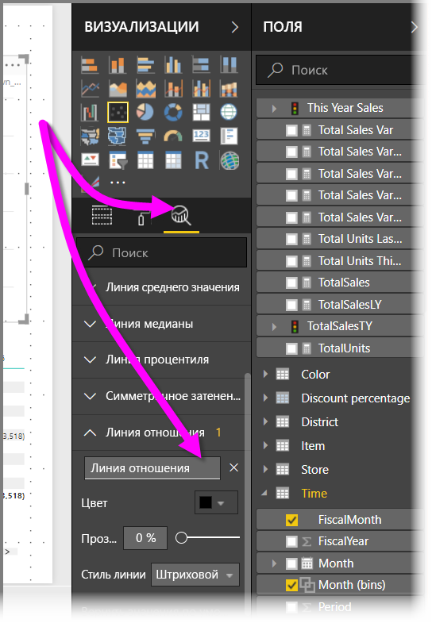
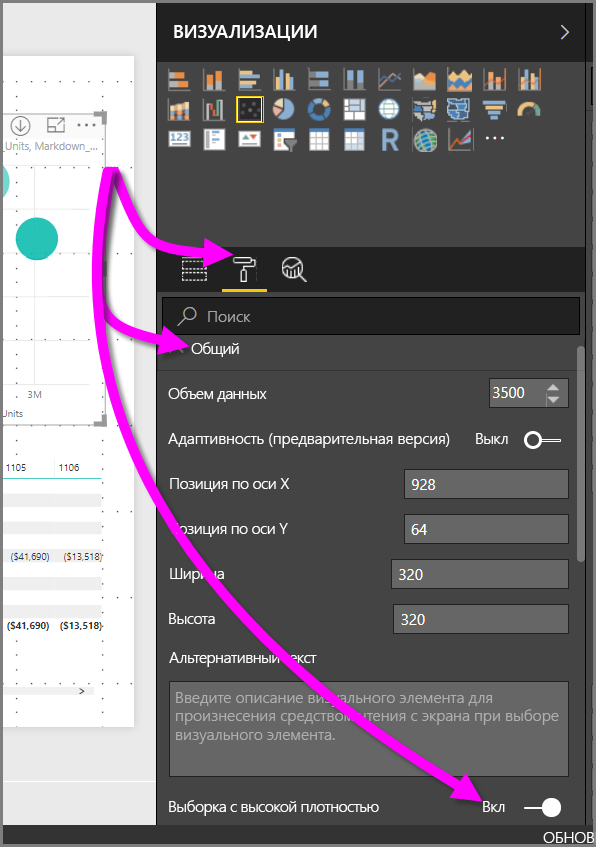

# Точечные диаграммы с выборкой с высокой плотностью в Power BI
Начиная с выпуска **Power BI Desktop** за сентябрь 2017 года и обновлений **службы Power BI** доступен новый алгоритм выборки. Он улучшает презентацию данных с высокой плотностью в точечных диаграммах.

Например, вы можете создать точечную диаграмму продаж организации, в которой каждый магазин будет иметь десятки тысяч точек данных за каждый год. Точечная диаграмма будет выбирать данные (выберите информативное представление данных, чтобы показать, тенденцию продаж со временем) из доступных данных, чтобы создать точечную диаграмму, которая представляет базовые данные. Это распространенный подход к созданию точечных диаграмм с высокой плотностью. В Power BI улучшена выборка данных с высокой плотностью. Этому и посвящена статья.

> [!NOTE]
> Алгоритм **выборки с высокой плотностью**, описанный в этой статье, доступен для точечных диаграмм и в **Power BI Desktop**, и в **службе Power BI**.
> 
> 

## Как работают точечные диаграммы с высокой плотностью
Ранее в **Power BI** для создания точечной диаграммы выбиралась коллекция точек данных в полном диапазоне базовых данных. Этот выбор основывался на определенных условиях. Например, в Power BI выбирались первая и последняя строки данных в ряде точечных диаграмм. Затем они равномерно разделялись, чтобы на точечной диаграмме поместилось всего 3500 точек данных. Например, если образец содержал 35000 строк, для отображения выбирались первая и последняя строки, а затем отображалась каждая десятая строка (35000/10 = каждая 10 строка = 3500 точек данных). Также ранее значения NULL или точки, которые не могут отображаться (например, текстовые значения) в ряде данных, не отображались, поэтому они не учитывались при создании визуального элемента. В результате такой выборки предполагаемая плотность точечной диаграммы также основывалась на репрезентативных точках данных. Поэтому подразумеваемая плотность визуального элемента была обусловлена выбранными точками, а не полной коллекцией базовых данных.

При включении **выборки с высокой плотностью** Power BI реализует алгоритм, который устраняет перекрывающиеся точки и гарантирует, что точки на визуальном элементе будут доступны при взаимодействии с ним. Этот алгоритм также гарантирует, что все точки в наборе данных представлены в визуальном элементе. Он обеспечивает контекст для значения выбранных точек, а не просто отображает репрезентативную выборку.

По определению выборка данных с высокой плотностью применяется для достаточно быстрого создания интерактивных визуализаций (слишком большое число точек данных в визуальном элементе может затормозить его работу и помешать отображению тенденций). Алгоритм выборки зависит от способа выбора данных для эффективной визуализации и отображения всех данных. Для каждого способа создается свой алгоритм. Алгоритм в Power BI был улучшен, чтобы обеспечить наилучшее сочетание времени отклика, представления и сохранения важных точек во всем наборе данных.

> [!NOTE]
> Точечные диаграммы, использующие алгоритм **выборки с высокой плотностью**, лучше всего отображаются на квадратных визуальных элементах, как и все остальные точечные диаграммы.
> 
> 

## Как действует новый алгоритм выборки точечных диаграмм
Новый алгоритм **выборки с высокой плотностью** для точечных диаграмм использует методы, которые записывают и представляют базовые данные более эффективно, устраняя перекрывающиеся точки. Алгоритм начинает выборку с небольшого радиуса для каждой точки данных (окружность визуального элемента для заданной точки на визуализации). Алгоритм увеличивает радиус всех точек данных. Если две (или более) точки данных перекрываются, одна окружность (с увеличенным радиусом) представляет эти точки перекрывающихся данных. Алгоритм постоянно увеличивает радиус точек данных, пока значение радиуса не доходит до приемлемого числа точек данных (3500), которые отображаются на точечной диаграмме.

Методы этого алгоритма гарантируют, что на итоговом визуальном элементе будут представлены выбросы. Алгоритм учитывает масштаб при определении перекрытия, чтобы экспоненциальные шкалы визуализировались с точностью до базовых визуализированных точек.

Алгоритм также сохраняет общую форму точечной диаграммы.

> [!NOTE]
> При использовании алгоритма **выборки с высокой плотностью** для точечных диаграмм основной целью является *точное распределение*, а *не* подразумеваемая плотность визуального элемента. Например, вы можете увидеть точечную диаграмму с большим числом перекрывающихся окружностей (плотность) в определенной области и подумать, что там собрано много точек данных. Так как алгоритм **выборки с высокой плотностью** может использовать один круг для представления большого числа точек данных, подразумеваемая плотность визуального элемента (или кластеризация) не будет иметь места. Чтобы больше узнать о заданной области, вы можете увеличить масштаб с помощью срезов.
> 
> 

Кроме того, точки данных, которые нельзя отобразить (например, значения NULL или текстовые значения), игнорируются. Выбираются другие значения, которые можно отобразить, чтобы поддерживать актуальную форму точечной диаграммы.

### Когда для точечных диаграмм используется стандартный алгоритм
Иногда **выборку с высокой плотностью** нельзя применить в точечной диаграмме, поэтому используется исходный алгоритм. Этот происходит при следующих обстоятельствах:

* Если щелкнуть правой кнопкой мыши панель **Сведения**, а затем в открывшемся меню выбрать команду **Показать элементы без данных**, точечная диаграмма вернется к исходному алгоритму.
  
  
* Все значения на оси **Воспроизведение** появятся на точечной диаграмме с возвратом к исходному алгоритму.
* Если на точечной диаграмме отсутствуют оси X и Y, диаграммы вернутся к исходному алгоритму.
* Если использовать параметр **Линия отношения** на панели **Аналитика**, диаграмма вернется к исходному алгоритму.
  
  

## Как включить **выборку с высокой плотностью** для точечной диаграммы
Чтобы включить **выборку с высокой плотностью**, выберите в точечную диаграмму, а затем перейдите к панели **Форматирование** и разверните карту **Общие**. В нижней части этой карты находится ползунок **Выборка высокой плотности**. Чтобы включить алгоритм, переведите его в положение **Включено**.

> [!NOTE]
> После включения ползунка Power BI будет всегда использовать алгоритм **выборки с высокой плотностью**, когда это будет возможно. Если алгоритм нельзя использовать, (например, если значение находится на оси *Воспроизведение*), ползунок остается в положении **Включено**, даже если используется стандартный алгоритм диаграммы. Если вы удалили значение с оси *Воспроизведение* (или изменились условия для включения и использование алгоритма выборки с высокой плотностью стало возможным) после включения ползунка, для диаграммы будет автоматически использоваться выборка с высокой плотностью.
> 
> [!NOTE]
> Точки данных группируются и/или выбираются по индексу. Наличие условных обозначений не влияет на алгоритм выборки. Оно влияет только на порядок отображения визуального элемента.
> 
> 

## Рекомендации и ограничения
Алгоритм выборки с высокой плотностью является важным улучшением Power BI, но вам следует знать о некоторых особенностях работы с точечными диаграммами и значениями высокой плотности.

* Алгоритм **выборки с высокой плотностью** работает только с динамическими подключениями к моделям на основе службы Power BI, импортированным моделям и DirectQuery.

## Дальнейшие действия
Дополнительные сведения о выборке с высокой плотностью на других диаграммах см. в следующей статье.

* [Выборка линий с высокой плотностью в Power BI](desktop-high-density-sampling.md)

