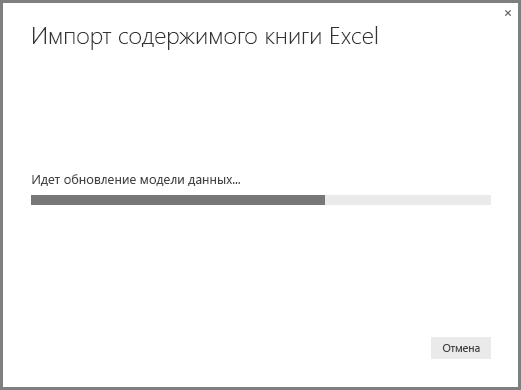

# Импорт книг Excel в Power BI Desktop
**Power BI Desktop** позволяет легко импортировать книги Excel, содержащие запросы Power Query, модели Power Pivot и листы Power View, в Power BI Desktop. Отчеты и визуализации создаются на основе книги Excel автоматически; после импорта отчеты можно улучшить и доработать с помощью Power BI Desktop, используя уже доступные возможности, а также новые функции, добавляемые в каждое ежемесячное обновление Power BI Desktop.

В будущем мы планируем обеспечить дополнительное взаимодействие между Excel и Power BI Desktop (такое как импорт-экспорт); существующая функция импорта книг в Power BI Desktop позволяет действующим пользователям Excel начать работу с Power BI Desktop.

## Импорт книги Excel
Чтобы импортировать книгу, в Power BI Desktop, последовательно выберите **Файл -\> Импорт -\> Содержимое книги Excel**.

Откроется окно, позволяющее выбрать книгу для импорта. В данный момент ограничений на размер или количество объектов в книге нет, однако чем больше книга, тем больше времени занимает ее анализ и импорт в Power BI Desktop.

> [!NOTE]
> Для загрузки и импорта файлов Excel из общих папок **OneDrive для бизнеса** или папок **групп Office 365** используйте URL-адрес соответствующего файла и вставьте его в источник данных **Интернет** в Power BI Desktop. Чтобы правильно отформатировать URL-адрес **OneDrive for Business**, необходимо выполнить несколько действий. Дополнительные сведения и точную последовательность необходимых действий см. в статье [Использование ссылок OneDrive для бизнеса в Power BI Desktop](desktop-use-onedrive-business-links.md).
> 
> 

Как только книга выбрана, Power BI Desktop приступает к ее анализу и конвертации в файл Power BI Desktop (PBIX). Эта операция выполняется однократно. Файл Power BI Desktop, созданный в результате выполнения этих шагов, не зависит от исходной книги Excel, а его изменения (а также сохранение и предоставление для общего доступа) не отражаются на оригинале.

После завершения импорта отображается страница **Сводка** с описанием конвертированных элементов, а также списком элементов, импортировать которые не удалось.

После нажатия кнопки **Закрыть**отчет загружается в Power BI Desktop. На следующем рисунке показан Power BI Desktop после импорта книги Excel: Power BI Desktop автоматически загрузил отчет на основе содержимого импортированной книги.

Обратите внимание на то, что во время импорта книги вы можете продолжать работать с отчетом — создавать визуализации, добавлять данные или создавать новые страницы отчета — используя все функции и возможности, реализованные в Power BI Desktop.

## Какие элементы книги импортируются?
Power BI Desktop может импортировать следующие элементы, или *объекты*, Excel:

| Объект в книге Excel | Конечный результат в файле Power BI Desktop |
| --- | --- |
| Запросы Power Query |Все запросы Power Query из Excel преобразуются в запросы Power BI Desktop. Если в книге Excel определены группы запросов, такие же группы создаются и в Power BI Desktop. Загружаются все запросы, для которых в Excel не установлено ограничение "Только создать подключение". Режим загрузки можно настроить в диалоговом окне **Свойства** на вкладке **Главная****редактора запросов** в Power BI Desktop. |
| Подключения к внешним данным Power Pivot |Все подключения к внешним данным Power Pivot в Power BI Desktop преобразуются в запросы. |
| Связанные таблицы или таблицы текущей книги |Если в книге Excel есть таблица, связанная с моделью данных или привязанная к запросу (с помощью команды *Из таблицы* или функции *Excel.CurrentWorkbook()* в M), доступны следующие параметры: 1. Импорт таблицы в файл Power BI Desktop. Эта таблица является однократным моментальным снимком данных, и после ее создания вы не можете изменить данные в таблице в Power BI Desktop. Для таблиц, создаваемых с помощью этого параметра, существует ограничение по размеру — не более 1 миллиона символов (включая все заголовки столбцов и ячейки). 2. Сохранение подключения к исходной книге. Вы также можете сохранить подключение к исходной книге Excel, в случае чего при каждом обновлении Power BI Desktop будет извлекать последнее содержимое этой таблицы, как для любого другого запроса, созданного на основе книги Excel в Power BI Desktop. |
| Вычисляемые столбцы, меры, ключевые показатели эффективности, категории данных и связи вычисляемых столбцов |Данные объекты модели данных преобразуются в эквивалентные объекты в Power BI Desktop. Обратите внимание, что некоторые категории данных, такие как **изображение**, недоступны в Power BI Desktop. В этих случаях сведения о категории данных для соответствующих столбцов удаляются. |
| Листы Power View |Для каждого листа Power View в Excel создается новая страница отчета. Имена и порядок таких страниц отчета соответствуют исходной книге Excel. |

## Ограничения на импорт книг Excel
При импорте книги Excel в Power BI Desktop действуют следующие ограничения:

* **Внешние подключения к табличным моделям служб Analysis Services:** в Excel 2013 можно создавать подключения к табличным моделям служб Analysis Services и формировать отчеты Power View на основе этих моделей, не импортируя данные. Сейчас этот тип подключений при импорте книг Excel в Power BI Desktop не поддерживается. Такие внешние подключения нужно создавать в Power BI Desktop заново.
* **Иерархии:** в настоящее время Power BI Desktop не поддерживает этот тип объектов модели данных. Таким образом, иерархии при импорте книги Excel в Power BI Desktop пропускаются.
* **Столбцы двоичных данных:** в настоящее время Power BI Desktop не поддерживает этот тип объектов модели данных. Столбцы двоичных данных удаляются из итоговой таблицы в Power BI Desktop.
* **Неподдерживаемые элементы Power View.** Некоторые функции Power View, такие как темы и определенные виды визуализаций (точечная диаграмма с осью воспроизведения, детализация поведений и т. д), недоступны в Power BI Desktop. При попытке импорта таких объектов в соответствующих им местах отчета Power BI Desktop появляются сообщения о *неподдерживаемых визуализациях* — их можно удалить или перенастроить.
* **Именованные диапазоны с использованием функции** ***Из таблицы*** **в Power Query или**  ***Excel.CurrentWorkbook*** **в M:** импорт данных такого именованного диапазона в Power BI Desktop сейчас не поддерживается, но будет реализован в будущем. В настоящее время именованные диапазоны загружаются в Power BI Desktop в форме подключения к внешней книге Excel.
* **Подключение PowerPivot к SSRS:** внешние подключения PowerPivot к службам SQL Server Reporting Services (SSRS) не поддерживаются, поскольку этот источник данных в Power BI Desktop пока не доступен.

