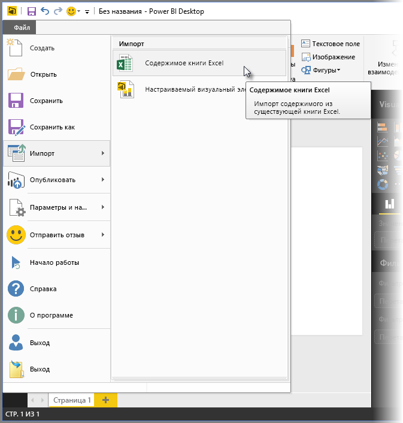
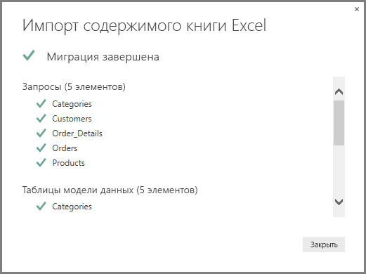

# Импорт книг Excel в Power BI Desktop
Power BI Desktop позволяет легко импортировать книги Excel, содержащие запросы Power Query, модели Power Pivot и листы Power View, в Power BI Desktop. Power BI Desktop автоматически создает отчеты и визуализации на основе книги Excel. После импорта отчеты можно улучшить и доработать с помощью Power BI Desktop, используя уже доступные возможности, а также новые функции, добавляемые в каждое ежемесячное обновление Power BI Desktop.

## Импорт книги Excel
1. Чтобы импортировать книгу Excel в Power BI Desktop, выберите пункты меню **Файл** > **Импорт** > **Power Query, Power Pivot, Power View**.

   

2. В окне **Открыть** выберите книгу Excel для импорта. 

   Хотя сейчас ограничений на размер или количество объектов в книге нет, чем больше книга, тем больше времени занимает ее анализ и импорт в Power BI Desktop.

   > [!NOTE]
   > Для загрузки и импорта файлов Excel из общих папок OneDrive для бизнеса или папок групп Office 365 используйте URL-адрес соответствующего файла и вставьте его в источник данных "Интернет" в Power BI Desktop. Чтобы правильно отформатировать URL-адрес OneDrive для бизнеса, необходимо выполнить несколько действий. Дополнительные сведения и точную последовательность необходимых действий см. в статье [Использование ссылок OneDrive для бизнеса в Power BI Desktop](desktop-use-onedrive-business-links.md).
   > 
   > 

3. В появившемся диалоговом окне импорта выберите **Запустить**.

   

   Power BI Desktop приступает к анализу книги и ее конвертации в файл Power BI Desktop (PBIX-файл). Эта операция выполняется однократно. Файл Power BI Desktop, созданный в результате выполнения этих шагов, не зависит от исходной книги Excel, а его изменение, сохранение и предоставление для общего доступа не сказываются на оригинале.

   После завершения импорта отображается страница "Сводка" с описанием конвертированных элементов, а также списком элементов, импортировать которые не удалось.

   

4. Нажмите **Закрыть**. 

   Power BI Desktop импортирует книгу Excel и загружает отчет на основе содержимого книги.

   

После импорта книги можно продолжить работу с отчетом. Можно создавать новые визуализации, добавлять данные или создавать новые страницы отчета с помощью любых функций и возможностей, реализованных в Power BI Desktop.

## Какие элементы книги импортируются?
Power BI Desktop может импортировать следующие элементы, или *объекты*, Excel:

| Объект в книге Excel | Конечный результат в файле Power BI Desktop |
| --- | --- |
| Запросы Power Query |Все запросы Power Query из Excel преобразуются в запросы Power BI Desktop. Если в книге Excel определены группы запросов, такие же группы создаются и в Power BI Desktop. Загружаются все запросы, для которых в диалоговом окне **Импорт данных** в Excel не установлено ограничение **Только создать подключение**. Режим загрузки можно настроить в диалоговом окне **Свойства** на вкладке **Главная** редактора Power Query в Power BI Desktop. |
| Подключения к внешним данным Power Pivot |Все подключения к внешним данным Power Pivot преобразуются в Power BI Desktop в запросы. |
| Связанные таблицы или таблицы текущей книги |Если в книге Excel есть таблица, связанная с моделью данных или привязанная к запросу (с помощью команды *Из таблицы* или функции *Excel.CurrentWorkbook()* в M), доступны следующие параметры. <ol><li><b>Импорт таблицы в файл Power BI Desktop</b>. Эта таблица является однократным моментальным снимком данных, и после ее создания вы не сможете изменить данные в таблице в Power BI Desktop. Для таблиц, создаваемых с помощью этого параметра, существует ограничение по размеру — не более 1 миллиона символов (включая все заголовки столбцов и ячейки).</li><li><b>Сохранение подключения к исходной книге</b>. Вы также можете сохранить подключение к исходной книге Excel, в случае чего при каждом обновлении Power BI Desktop будет извлекать последнее содержимое этой таблицы, как для любого другого запроса, созданного на основе книги Excel в Power BI Desktop.</li></ul> |
| Вычисляемые столбцы, меры, ключевые показатели эффективности, категории данных и связи вычисляемых столбцов |Эти объекты модели данных преобразуются в эквивалентные объекты в Power BI Desktop. Обратите внимание, что некоторые категории данных, такие как изображение, недоступны в Power BI Desktop. В этих случаях сведения о категории данных для соответствующих столбцов удаляются. |
| Листы Power View |Для каждого листа Power View в Excel создается новая страница отчета. Имена и порядок таких страниц отчета соответствуют исходной книге Excel. |

## Ограничения на импорт книг Excel
При импорте книги Excel в Power BI Desktop действуют следующие ограничения.

* **Внешние подключения к табличным моделям служб SQL Server Analysis Services**. В Excel 2013 можно создавать подключения к табличным моделям служб Analysis Services и формировать отчеты Power View на основе этих моделей, не импортируя данные. Сейчас этот тип подключений при импорте книг Excel в Power BI Desktop не поддерживается. Такие внешние подключения нужно создавать в Power BI Desktop заново.
* **Иерархии.** Этот тип объектов модели данных сейчас не поддерживается в Power BI Desktop. Таким образом, иерархии при импорте книги Excel в Power BI Desktop пропускаются.
* **Столбцы двоичных данных.** Этот тип столбцов модели данных сейчас не поддерживается в Power BI Desktop. Столбцы двоичных данных удаляются из итоговой таблицы в Power BI Desktop.
* **Неподдерживаемые элементы Power View.** Некоторые функции Power View, такие как темы и определенные виды визуализаций (точечная диаграмма с осью воспроизведения, функции детализации и т. д.), недоступны в Power BI Desktop. При попытке импорта таких объектов в соответствующих им местах отчета Power BI Desktop появляются сообщения о *неподдерживаемых визуализациях* — их можно удалить или перенастроить.
* **Именованные диапазоны на основе функций** ***Из таблицы*** **в Power Query или** ***Excel.CurrentWorkbook*** **в M**. Импорт данных из такого именованного диапазона сейчас не поддерживается, но будет реализован в будущем. В настоящее время именованные диапазоны загружаются в Power BI Desktop в форме подключения к внешней книге Excel.
* **Из PowerPivot в SSRS.** Внешние подключения PowerPivot к службам SQL Server Reporting Services (SSRS) не поддерживаются, так как этот источник данных в Power BI Desktop пока не доступен.

