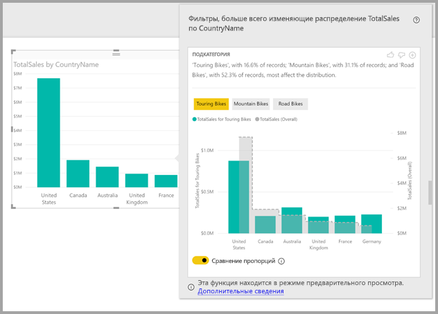

# Использование аналитических сведений в Power BI Desktop для поиска различий в распределении (предварительная версия)

Часто в визуальных элементах вы используете точки данных и не знаете, будет ли распределение одинаковым для разных категорий. С помощью **аналитических сведений** в **Power BI Desktop** это можно узнать всего за несколько щелчков.

Рассмотрим следующий визуальный элемент, который показывает *общий объем продаж* по *странам*. Как показано на диаграмме, наибольший объем продаж приходится на США — 57 % от всех продаж. В других странах это значение гораздо ниже. В таких случаях интересно узнать, будет ли это распределение одинаковым по всем категориям. Например, для всех лет, каналов продаж и категорий продуктов.  И хотя вы можете применять различные фильтры и визуально сравнить результаты, это отнимает много времени и может приводить к ошибкам. 

В **Power BI Desktop** вы можете обнаружить разницу в распределении и быстро выполнить автоматический информативный анализ своих данных. Просто щелкните правой кнопкой мыши точку данных и выберите **Анализ > Найти различия в распределении**, и вы получите ценную информацию в удобном окне.

В этом примере автоматический анализ быстро показывает, что для *туристических велосипедов* доля продаж в США и Канаде меньше, а в других странах — больше.   

> [!NOTE]
> Эта функция находится на стадии предварительной версии и подлежит изменению. Функция аналитики включена по умолчанию (не требуется устанавливать флажок предварительной версии, чтобы включить ее) начиная с версии **Power BI Desktop** за сентябрь 2017 г.
> 
> 

## Использование аналитики
Чтобы использовать функцию аналитических сведений для поиска различий в распределении на диаграмме, просто щелкните правой кнопкой мыши на любую точку данных (или на визуальный элемент в целом) и выберите **Анализ > Найти различия в распределении**.

Программа **Power BI Desktop** запустит алгоритмы машинного обучения с использованием данных, и в окне появится визуальный элемент с описанием того, какие категории (столбцы) и какие значения этих столбцов показывают наиболее значительную разницу в распределении. Аналитические сведения представлены в виде гистограммы, как показано на следующем рисунке. 

Показаны значения с применением выбранного фильтра и цветами по умолчанию. Все значения, как показано на исходном визуальном элементе, отображаются серым цветом для удобного сравнения. Можно применить до трех фильтров (в примере это *Туристические велосипеды*, *Горные велосипеды* и *Дорожные велосипеды*). Чтобы выбрать фильтр, нажмите на него (удерживайте клавишу Ctrl, чтобы выбрать несколько фильтров).

Для простых аддитивных мер, как *Общий объем продаж* в этом примере, сравнение основывается на относительных, а не абсолютных значениях. Таким образом, хотя продажи туристических велосипедов ниже, чем общие продажи для всех категорий, по умолчанию в визуальном элементе используются две оси, чтобы сравнить пропорции продаж в разных странах для туристических велосипедов и всех категорий велосипедов.  С помощью переключателя под визуальным элементом можно отобразить два значения на одной оси, чтобы вам было проще проводить сравнение с абсолютными значениями (как показано на следующем рисунке).    

Тест описания помогает понять важность значений фильтра, предоставляя количество записей, которые соответствуют заданному фильтру. В этом примере вы видите, что, хотя распределение для *туристических велосипедов* может значительно отличаться, с ними связано только 16,6 % записей.

В верхней части страницы расположены значки *Палец вверх* и *Палец вниз*. С их помощью вы можете оставить отзыв о визуальном элементе и функции. Это обеспечивает обратную связь, но пока не обучает алгоритм и не влияет на следующие результаты использования этой функции.

И, что важно, с помощью кнопки **+** в верхней части визуального элемента вы можете добавить выбранный визуальный элемент к отчету, как если бы вы создали этот элемент вручную. Затем вы сможете отформатировать или настроить иным способом добавленный визуальный элемент, как и другие визуальные элементы в отчете. Вы можете добавить выбранный визуальный элемент аналитики только при редактировании отчета в **Power BI Desktop**.

Аналитику можно использовать, когда отчет находится в режиме чтения или правки, что позволяет выполнять в нем анализ данных и создавать визуальные элементы, которые вы можете легко добавлять в отчеты.

## Сведения о возвращаемых результатах
Представьте себе, что алгоритм применяет к исходному визуальному элементу все значения столбцов в модели как фильтры, а затем находит, какие значения этих фильтров наиболее *отличаются* от оригинала.

Конечно, вас интересует, как определяется это *отличие*. Предположим, что общий объем продаж между США и Канадой распределяется следующим образом.

|Страна  |Объем продаж (млн долларов)|
|---------|----------|
|США      |15        |
|Канада   |5         |

Затем для определенной категории продукта "*Дорожные велосипеды*" распределение может выглядеть следующим образом.

|Страна  |Объем продаж (млн долларов)|
|---------|----------|
|США      |3        |
|Канада   |1         |

Хотя цифры в каждой таблице разные, относительные значения для США и Канады одинаковые (75 % и 25 % всего и для дорожных велосипедов). Поэтому они не считаются разными. Для простых аддитивные мер, как эта, алгоритм ищет различия в *относительных* значениях.  

Но если рассматривать такую меру, как рентабельность, которая рассчитывается как результат деления доходов на затраты, то общая рентабельность для США и Канады выглядит следующим образом.

|Страна  |Рентабельность (%)|
|---------|----------|
|США      |15        |
|Канада   |5         |

Затем для определенной категории продукта "*Дорожные велосипеды*" распределение может выглядеть следующим образом.

|Страна  |Рентабельность (%)|
|---------|----------|
|США      |3        |
|Канада   |1         |

С учетом особенностей таких мер это *считается* интересным отличием. Поэтому для неаддитивных мер, таких как рентабельность, алгоритм ищет различия в абсолютном значении.

Таким образом, визуальные элементы наглядно показывают обнаруженную разницу между общим распределением (как в исходном визуальном элементе) и значением с применением определенного фильтра.  

Для аддитивных мер, таких как *объем продаж* в предыдущем примере, используются гистограммы и графики, где две оси с соответствующим масштабированием позволяют легко сравнивать значения. Столбцы показывают значения с применением фильтра, а линии— общие значения (ось столбцов находится слева, а ось строк — справа, как обычно). Линии изображены *ступенчато* и пунктиром с серой заливкой. В предыдущем примере, если максимальное значение оси столбцов равно 4, а максимальное значение оси линий равно 20, вы сможете легко сравнить относительные значения США и Канады для отфильтрованных и общих значений. 

Аналогично для неаддитивных мер, таких как *Рентабельность* в предыдущем примере, используются гистограммы и диаграммы с одной осью, представляющей удобные для сравнения абсолютные значения. Здесь также линия с серой заливкой показывает общее значение. При сравнении фактических и относительных показателей степень различия двух распределений рассчитывается не простым вычислением разницы значений. Например:

* Размер совокупности также учитывается, ведь различие имеет меньшее значение со статистической точки зрения и не так интересно, если применяется к небольшой части общей совокупности. Например, распределение продаж по странам может сильно отличаться для определенного продукта, но это будет не очень интересно, если таких продуктов тысячи и на конкретный продукт приходится лишь малая доля общего объема продаж.

* Различия для категорий, где исходные значения были очень большими или очень близкими к нулю, имеют больший вес, чем другие. Например, если объем продаж в стране составляет всего 1 % от общего объема, но на определенный продукт приходится целых 6 %, это имеет большее значение в плане статистики, а потому считается более интересным, чем изменение доли страны с 50 до 55 %. 

* Для выбора наиболее важных результатов используются различные эвристические методы, например для изучения других связей между данными.
     
После изучения различных столбцов и их значений выбирается набор значений с самыми большими отличиями. Для простоты понимания затем они выводятся, сгруппированные по столбцу, и первым указывается столбец, значения в котором отличаются больше всего. Показано до трех значений каждого столбца, но их может быть меньше, если важных значений меньше трех или некоторые значения гораздо важнее других. 

Необязательно все столбцы в модели будут проверены в доступное время, так что нет гарантии, что отобразятся самые важные столбцы и значения. Тем не менее будут использоваться различные эвристические правила, чтобы первыми проверялись столбцы, где вероятнее всего существуют различия. Предположим, например, что после проверки всех столбцов выяснилось, что следующие столбцы и значения сильнее всего влияют на распределение, по степени влияния:

    Subcategory = Touring Bikes
    Channel = Direct
    Subcategory = Mountain Bikes
    Subcategory = Road Bikes
    Subcategory = Kids Bikes
    Channel = Store

Вы получите выходные данные со следующим порядком столбцов.

    Subcategory: Touring Bikes, Mountain Bikes, Road Bikes (only three listed, with the text including “...amongst others” to indicate that more than three have a significant impact) 

    Channel = Direct (only Direct listed, if it’s level of impact was much greater than Store)

## Рекомендации и ограничения
В следующем списке представлена подборка сценариев, которые сейчас не поддерживаются для **аналитики**:

* фильтры "Ведущие N";
* фильтры мер;
* нечисловые меры.
* Использование функции "Показать значение как"
* Отфильтрованные меры — это расчеты на уровне визуального элемента с применением определенного фильтра (например, *Общий объем продаж для Франции*), которые используются в некоторых визуальных элементах, созданных функцией аналитических сведений

Кроме того, сейчас для аналитики не поддерживаются следующие типы моделей и источников данных:

* DirectQuery;
* Live Connect;
* локальные службы Reporting Services.
* Внедрение

## Дальнейшие действия
Дополнительные сведения о **Power BI Desktop** и инструкции по началу работы см. в следующих статьях.

* [Что такое Power BI Desktop?](desktop-what-is-desktop.md)
* [Общие сведения о запросах в Power BI Desktop](desktop-query-overview.md)
* [Источники данных в Power BI Desktop](desktop-data-sources.md)
* [Подключение к данным в Power BI Desktop](desktop-connect-to-data.md)
* [Формирование и объединение данных в Power BI Desktop](desktop-shape-and-combine-data.md)
* [Общие задачи с запросами в Power BI Desktop](desktop-common-query-tasks.md)   

