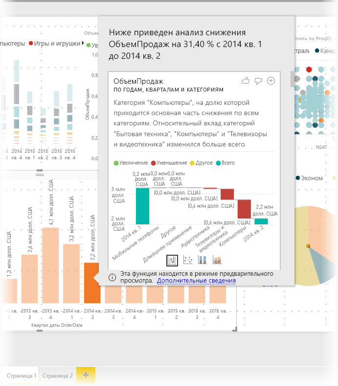
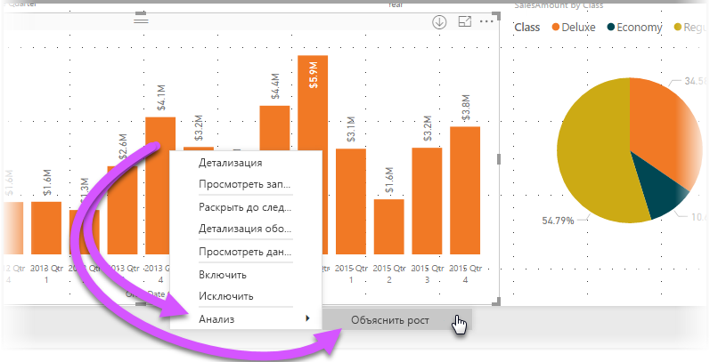
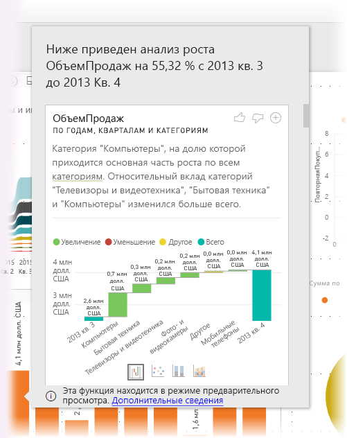
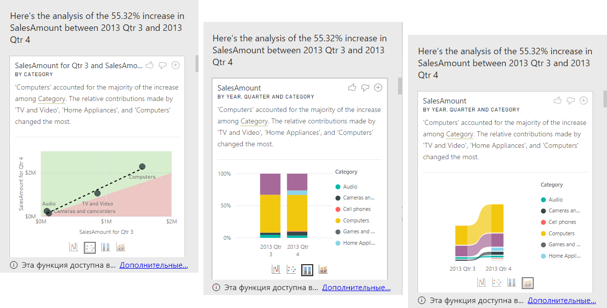

# Использование аналитики в Power BI Desktop (предварительная версия)
Вы можете запросить в **Power BI Desktop** объяснение роста или снижения показателей на диаграммах и быстро выполнить автоматический информативный анализ своих данных. Просто щелкните правой кнопкой мыши точку данных и выберите **Анализ > Объяснить снижение** (или "Объяснить рост", если предыдущая строка на диаграмме меньше), и вы получите ценную информацию в удобном окне.

Аналитика — это контекстная функция, результаты которой зависят от последней точки данных, например предыдущей строки или столбца.

> [!NOTE]
> Эта функция находится на стадии предварительной версии и подлежит изменению. Функция аналитики включена по умолчанию (не требуется устанавливать флажок предварительной версии, чтобы включить ее) начиная с версии **Power BI Desktop** за сентябрь 2017 г.
> 
> 

## Использование аналитики
Чтобы использовать аналитику, просто щелкните правой кнопкой мыши любую точку данных в визуальном элементе строки или столбца и выберите **Анализ > Объяснить рост** (или *Объяснить снижение*, так как все аналитические сведения основаны на изменениях по сравнению с предыдущей точкой данных).

Программа **Power BI Desktop** запустит алгоритмы машинного обучения с использованием данных, и в окне появится визуальный элемент с описанием того, какие категории больше всего повлияли на рост или снижение. По умолчанию аналитические сведения представлены в виде *каскадного* визуального элемента, как показано на следующем рисунке.

С помощью небольших значков в нижней части каскадного визуального элемента можно отобразить аналитические данные в виде точечной диаграммы, гистограммы с накоплением или диаграммы ленты.

В верхней части страницы расположены значки *Палец вверх* и *Палец вниз*. С их помощью вы можете оставить отзыв о визуальном элементе и функции.

И, что важно, с помощью кнопки **+** в верхней части визуального элемента вы можете добавить выбранный визуальный элемент к отчету, как если бы вы создали этот элемент вручную. Затем вы сможете отформатировать или настроить иным способом добавленный визуальный элемент, как и другие визуальные элементы в отчете. Вы можете добавить выбранный визуальный элемент аналитики только при редактировании отчета в **Power BI Desktop**.

Аналитику можно использовать, когда отчет находится в режиме чтения или правки, что позволяет выполнять в нем анализ данных и создавать визуальные элементы, которые вы можете легко добавлять в отчеты.

## Рекомендации и ограничения
Так как результаты анализа основаны на сведениях об изменениях, которые поступают из предыдущей точки данных, они не будут доступны при выборе первой точки данных в визуальном элементе. 

В следующем списке представлена подборка сценариев, которые сейчас не поддерживаются для **аналитики**:

* фильтры "Ведущие N";
* фильтры включения и исключения;
* фильтры мер;
* неаддитивные меры и статистические выражения;
* отображение значений;
* отфильтрованные меры (новая возможность для точечной диаграммы в функции аналитики);
* категориальные столбцы по оси X, только если они не определяют порядок сортировки по столбцам, которые являются скалярными (но если используется иерархия, то каждый столбец в активной иерархии должен соответствовать этому условию);
* нечисловые меры.

Кроме того, сейчас для аналитики не поддерживаются следующие типы моделей и источников данных:

* DirectQuery;
* Live Connect;
* локальные службы Reporting Services.
* Внедрение

## Дальнейшие действия
Дополнительные сведения о **Power BI Desktop** и инструкции по началу работы см. в следующих статьях.

* [Начало работы с Power BI Desktop](desktop-getting-started.md)
* [Общие сведения о запросах в Power BI Desktop](desktop-query-overview.md)
* [Источники данных в Power BI Desktop](desktop-data-sources.md)
* [Подключение к данным в Power BI Desktop](desktop-connect-to-data.md)
* [Формирование и объединение данных в Power BI Desktop](desktop-shape-and-combine-data.md)
* [Общие задачи с запросами в Power BI Desktop](desktop-common-query-tasks.md)   

