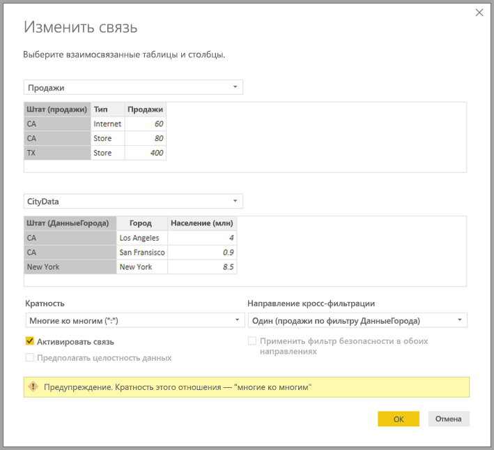

# Связи "многие ко многим" в Power BI Desktop (предварительная версия)

Функция **связей "многие ко многим"** в **Power BI Desktop** позволяет соединять таблицы с использованием кратности **многие ко многим**, а также проще и быстрее создавать модели данных, содержащие несколько источников данных. Функция **связей "многие ко многим"** является частью более широкого набора возможностей **составных моделей** в **Power BI Desktop**.

Возможность создания **связей "многие ко многим"** в **Power BI Desktop** реализована в наборе из трех связанных функций:

* **Составные модели** — позволяют включить в отчет несколько подключений к данным, в том числе подключения DirectQuery или импорт, в любой комбинации.
* **Связи "многие ко многим"** — с **составными моделями** можно устанавливать между таблицами **связи "многие ко многим"**. Эта устраняет требования уникальных значений в таблицах и необходимость в прежних обходных решениях, таких как введение новых таблиц только для установления связей. 
* **Режим хранения** — теперь можно указать, какие визуальные элементы требуют запроса к внутренним источникам данных. Визуальные элементы, которым запрос не требуется, импортируются, даже если они основаны на DirectQuery. Это позволяет повысить производительность и снизить нагрузку на серверную часть решения. Ранее даже простые визуальные элементы, например срезы, инициировали запросы к серверным источникам. 

Все три связанные функции этой коллекции для **составных моделей** описаны в отдельных статьях:

* **Составные модели** подробно описаны в статье о [составных моделях в Power BI Desktop (предварительная версия)](desktop-composite-models.md).
* **Связи "многие ко многим"** описаны в этой статье.
* **Режим хранения** описан в отдельной статье [Режим хранения в Power BI Desktop (предварительная версия)](desktop-storage-mode.md).

## Включение предварительной версии функции связей "многие ко многим"

Функция **связей "многие ко многим"** является частью набора возможностей **составных моделей**. Она доступна в режиме предварительной версии, поэтому ее необходимо включить в **Power BI Desktop**. Чтобы включить **составные модели**, последовательно выберите **Файл > Параметры и настройки > Параметры > Предварительная версия функций** и установите флажок **Составные модели**.

Чтобы включить эту функцию, нужно перезапустить **Power BI Desktop**.

## Какие задачи решают связи "многие ко многим"

До появления **связей "многие ко многим"** при определении связи между двумя таблицами в Power BI как минимум один из столбцов. участвующих в связи, должен был содержать уникальные значения. Но во многих случаях ни один из столбцов таблицы не содержал уникальные значения. 

Например, в двух таблицах может быть столбец со страной (*Country*), но значения *Country* не являются уникальными ни в одной из таблиц. Для соединения этих таблиц необходимо было использовать другие решения, например добавлять в модель дополнительные таблицы, содержащие необходимые уникальные значения. Функция **связей "многие ко многим"** представляет альтернативный способ, позволяя соединять такие таблицы непосредственно с помощью связи с кратностью **многие ко многим**.  

## Использование связей "многие ко многим"

При определении связи между двумя таблицами в Power BI необходимо определить кратность связи. Например, связь между *ProductSales* и *Product* (с использованием столбцов *ProductSales[ProductCode]* и *Product[ProductCode]*) будет определена как **многие к одному**, так как для каждого продукта предусмотрено множество продаж, а столбец в таблице *Product* *(ProductCode)* является уникальным. При определении кратности связи **многие к одному**, **один ко многим** или **один к одному** Power BI выполняет проверку, чтобы убедиться в соответствии выбранной кратности фактическим данным.

Например, рассмотрим простую модель на следующем изображении.

Представьте таблицу *Product*, содержащую всего две строки.

Также представьте таблицу *Sales*, содержащую всего четыре строки, включая *Sales* для продукта **C**, которого не существует в таблице *Product* таблицы (из-за ошибки ссылочной целостности).

Визуальный элемент, который отображал *ProductName* и *Price* (из таблицы *Product*), наряду с общим значением *Qty* (количество) для каждого продукта (из таблицы *ProductSales*), будет отображен, как показано на следующем изображении: 

Как показано на предыдущем рисунке, в визуальном элементе есть строка с пустым значением *ProductName*, связанная с продажей продукта *C*. Эта пустая строка отвечает за следующее:

* Любые строки в таблице *ProductSales*, для которых нет соответствующих строк в таблице *Product*, так как есть проблема с целостностью данных, как показано для продукта *C* в этом примере.

* Любые строки в таблице *ProductSales*, для которых столбец внешнего ключа имеет значение Null. 

По этим причинам в обоих случаях пустая строка отвечает за продажи, в которых *ProductName* и *Price* неизвестны.

Но иногда бывают случаи, когда таблицы соединены по двум столбцам, и при этом ни один из столбцов не уникален. Например, рассмотрим следующие две таблицы:

* Таблица *Sales* содержит данные о продажах по штатам (*State*), где в каждой строке указан объем продаж, соответствующий типу продаж в указанном штате (включая штаты CA, WA и TX). 

    

* Таблица *CityData* содержит данные по городам, в том числе сведения о населении и штате (включая штаты Калифорния, Вашингтон и Нью-Йорк).

    

Хотя в обеих таблицах есть столбец *State* и имеет смысл создать отчет по общим продажам (*Sales*) по штатам (*State*), наряду с общей численностью населения в каждом штате, есть и одна проблема: столбец *State* не является уникальным ни в одной из таблиц. 

## Предыдущее решение проблемы

В версиях **Power BI Desktop** до июльского (2018) выпуска нельзя было создать связь непосредственно между этими таблицами. Обычным решением этой проблемы были следующие действия:

* Создание третьей таблицы, содержащей только уникальные идентификаторы штатов (*State*). Это могла быть либо вычисляемая таблица (определенная с помощью DAX), либо таблица, определенная с помощью запроса, в свою очередь определенная в **редакторе запросов**, которая могла содержать уникальные идентификаторы из одной из таблиц или полный объединенный набор.

* Связывание двух исходных таблиц с этой новой таблицей с помощью обычных связей **многие-1*.

Такая таблица могла оставаться видимой или быть скрытой для предотвращения ее отображения в списке полей. В последнем случае связи **многие к одному** могли быть обычным образом заданы для фильтрации в обоих направлениях, чтобы можно было использовать поле *State* из любой таблицы с последующим распространением перекрестной фильтрации на другую таблицу. Такой подход демонстрируется на следующем рисунке с **представлением связей**.

Визуальный элемент с отображением поля *State* (из таблицы *CityData*) вместе с общей численностью населения (*Population*) и общим объемом продаж (*Sales*) будет выглядеть следующим образом.

Обратите внимание, что при заданном использовании штата из таблицы *CityData* в решении в этой таблице перечисляются только соответствующие штаты (*State*) (таким образом, штат Техас исключается). Кроме того, в отличие от связей **многие к одному**, хотя итоговая строка содержит весь объем продаж (*Sales*) (включая штат Техас), в подробные сведения не включается пустая строка, охватывающая такие несовпадающие строки. Аналогично, не будет пустой строки, соответствующей каким-либо продажам (*Sales*), которым соответствует значение Null поля *State*.

Если в визуальный элемент также добавлен город (*City*), то при известной численности населения для каждого *City* отображаемый объем продаж (*Sales*) для поля *City* просто повторит число *Sales* для соответствующего штата (*State*), как это обычно бывает при группировании по столбцу, не связанному с каким-либо статистическим показателем. Это показано на следующем рисунке.

Если бы новая таблица *Sales* была определена как объединение всех столбцов *States* в этом решении и была видимой в списке полей, такой же визуальный элемент с отображением поля *State* (в новой таблице) наряду с общей численностью населения (*Population*) и общим объемом продаж (*Sales*) выглядел бы следующим образом.

В этом случае в визуальный элемент были бы включены *TX* (со значением *Sales*, но без известной численности населения) и *New York* (с известным населением, но без значения *Sales*). 

Как видим, решение не оптимально и содержит много проблем. С созданием **связи "многие ко многим"** эти проблемы решаются, как описано в следующем разделе.

## Использование связей "многие ко многим" вместо описанного подхода

В версиях **Power BI Desktop**, начиная с июля 2018 г., можно напрямую связать таблицы, описанные в предыдущем разделе, без использования описанного подхода. Теперь можно задать кратность связи **многие ко многим**, указав тем самым, что ни одна из таблиц не содержит уникальные значения. При использовании таких связей по-прежнему можно указывать, какая таблица фильтрует другую таблицу, или установить двунаправленную (взаимную) фильтрацию для двух таблиц.  

> [!NOTE]
> Возможность создавать связи **"многие ко многим"** доступна в режиме предварительной версии, поэтому вы не можете публиковать модели с использованием связей **"многие ко многим"** в службе Power BI. 

В **Power BI Desktop** по умолчанию задается кратность **многие ко многим**, когда программа определяет, что ни одна из таблиц не содержит уникальные значения столбцов, участвующих в связи. В таких случаях отображается предупреждение для подтверждения того, что такая настройка связи является целевым поведением, а не непреднамеренным следствием проблемы с данными. 

Например, при создании связи непосредственно между *CityData* и *Sales*, где фильтры должны применяться от *CityData* к *Sales*, отображается следующее диалоговое окно изменения связи.

Итоговое **представление связей** будет содержать прямую связь **многие ко многим** между двумя таблицами. Вид списка **Поля** и последующее поведение при создании визуальных элементов будут аналогичны применению подхода, описанного в предыдущем разделе, где дополнительная таблица (с отличающимися значениями поля *State*) не сделана видимой. Например, как показано в предыдущем разделе, визуальный элемент с отображением полей *State* наряду с общей численностью населения и объемами продаж, будет выглядеть следующим образом.

Таким образом, основные различия между связями **многие ко многим** и более распространенными связями **многие к одному** заключается в следующем.

* Отображаемые значения не включают пустую строку, соответствующую всем несовпадающим строкам в другой таблице, равно как и строки, где используемый в связи столбец в другой таблице имеет значение Null.
* Использовать функцию *RELATED()* (так как связанными могут быть несколько строк) нельзя.
* При использовании функции *ALL()* в таблице не удаляются фильтры, примененные к другим таблицам, у которых с ней установлена связь **многие ко многим**. Например, показатель, определенный в предыдущем примере, не удалит фильтры по столбцам связанной таблицы *CityData*:

    

    В результате визуальный элемент с отображением штата (*State*), объема продаж (*Sales*) и общего объема продаж (*Sales total*) будет следующим:

    

По этой причине следует внимательно следить, чтобы расчеты с использованием функции *ALL(\<таблица>)*, например *% от общей суммы*, возвращали желаемые результаты. 

## Рекомендации и ограничения

В этом выпуске для **связей "многие ко многим"** и **составных моделей** есть несколько ограничений.

Следующие (многомерные источники) Live Connect нельзя использовать с **составными моделями**:

* SAP HANA
* SAP Business Warehouse
* Службы SQL Server Analysis Services
* Наборы данных Power BI
* Azure Analysis Services

При подключении к этим многомерным источникам с помощью DirectQuery нельзя также подключиться к другому источнику DirectQuery или сочетать их с импортированными данными.

Существующие ограничения для DirectQuery по-прежнему применяются при использовании **связей "многие ко многим"**. Многие из этих ограничений теперь относятся к таблице в зависимости от **режима хранения** этой таблицы. Например, вычисляемый столбец в импортированной таблице может ссылаться на другие таблицы, но вычисляемый столбец в таблице DirectQuery по-прежнему ограничен ссылками только на столбцы той же таблицы. Другие ограничения применяются к модели в целом, если все таблицы в пределах модели являются таблицами DirectQuery. Например, функции **Краткая аналитика** и **Вопросы и ответы** недоступны в модели, если какая-либо из таблиц в ней используется в **режиме хранения** DirectQuery. 

## Дальнейшие действия

В следующих статьях содержатся дополнительные сведения о составных моделях, а также подробно описан режим DirectQuery:

* [Составные модели в Power BI Desktop (предварительная версия)](desktop-composite-models.md)
* [Режим хранения в Power BI Desktop (предварительная версия)](desktop-storage-mode.md)

Статьи о DirectQuery:

* [Использование DirectQuery в Power BI](desktop-directquery-about.md)
* [Источники данных, поддерживаемые DirectQuery в Power BI](desktop-directquery-data-sources.md)

