# Использование визуального элемента "Матрица" в Power BI Desktop
Визуальный элемент **Матрица** позволяет создавать визуальные элементы матрицы (которые иногда также называют *таблицами*) в отчетах **Power BI Desktop** и перекрестно выделять элементы внутри матрицы с помощью других визуальных элементов. Кроме того, можно перекрестно выделять строки, столбцы и даже отдельные ячейки. Для более эффективного использования пространства макета в визуальном элементе "Матрица" поддерживается ступенчатый макет.

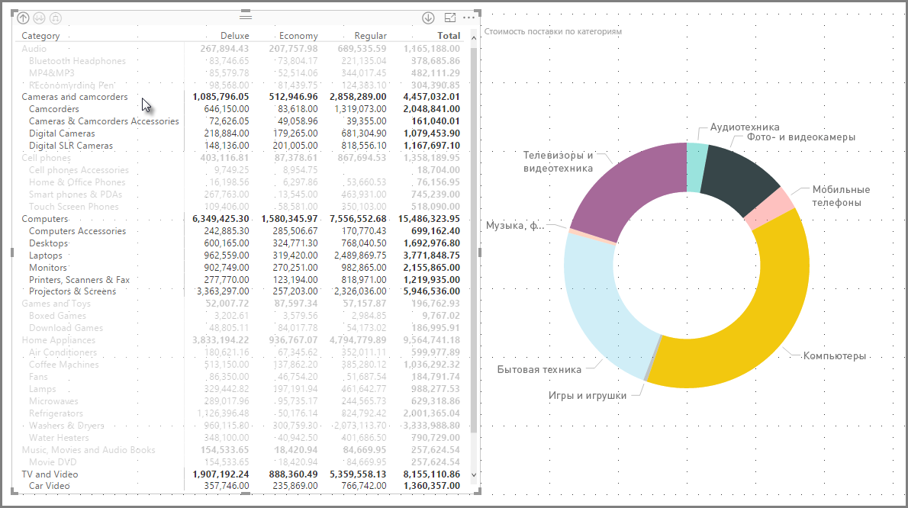

Предусмотрено множество функций для матрицы, которые мы рассмотрим в следующих разделах этой статьи.

> [!NOTE]
> Начиная с выпуска за июль 2017 г. **Power BI Desktop**, к визуальным элементам "Матрица" и "Таблица" можно применять стили (в том числе цвета) из выбранной **темы отчета**. Если вы хотите изменить цвета визуального элемента "Матрица", воспользуйтесь параметром **Тема отчета**. Дополнительные сведения о темах см. в статье [**Использование тем отчетов в Power BI Desktop (предварительная версия)**](desktop-report-themes.md).
> 
> 

## Детализация с помощью визуального элемента "Матрица"
Визуальный элемент **Матрица** позволяет использовать подробные визуализации, недоступные ранее. Вы можете выполнить детализацию с использованием строк, столбцов и даже отдельных разделов и ячеек. Рассмотрим каждый из вариантов детализации.

### Детализация по заголовкам строк
В области **Визуализации** при добавлении нескольких полей в разделе **Строки** области **Поля** вы включаете детализацию по строкам визуального элемента с матрицей. Это похоже на создание иерархии, которую затем можно детализировать (а потом обобщить), а также выполнить анализ данных на каждом уровне.

На следующем рисунке в разделе **Строки** содержатся элементы *Категория* и *Подкатегория*, формирующие группу (или иерархию) строк, которые можно детализировать.

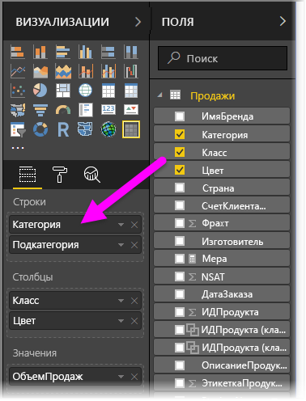

Если в разделе **Строки** для визуального элемента создана группа, в верхней левой части визуального элемента отображаются значки *детализации* и *развертывания*.

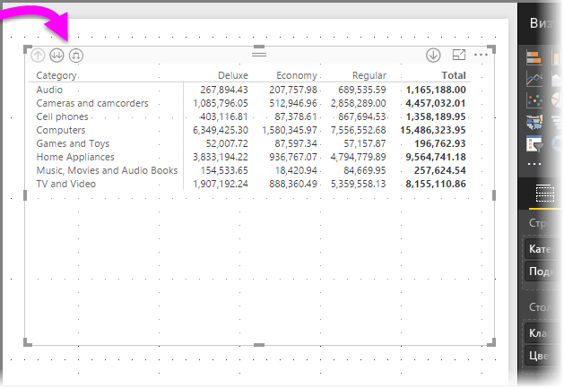

Эти кнопки действуют так же, как и подобные кнопки для детализации и развертывания в других визуальных элементах: они позволяют перемещаться по уровням элементов иерархии вниз (или вверх). В этом случае мы можем перейти от *категории* к *подкатегории*, как показано на следующем рисунке, на котором выбран значок перехода на один уровень (в виде разветвления).

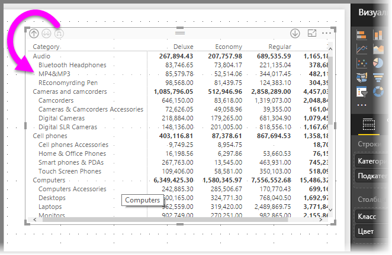

Помимо использования этих значков можно также щелкнуть любой из заголовков строк правой кнопкой мыши и выбрать пункт детализации в появившемся меню.

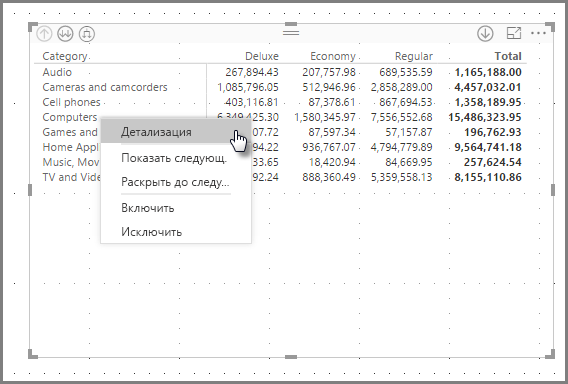

Обратите внимание, что в этом меню есть несколько параметров, используя которые вы получите разные результаты:

Если выбрать пункт **Детализация**, будет развернута матрица для *этого* уровня строки, *за исключением* других заголовков строк, кроме заголовка строки, выбранного с помощью правой кнопки мыши. На следующем рисунке мы щелкнули правой кнопкой мыши столбец *Компьютеры* и выбрали пункт **Детализация**. Обратите внимание, что другие строки верхнего уровня перестали отображаться в матрице. Это полезная функция. Она очень пригодится, когда мы перейдем к разделу о **перекрестном выделении**.

Вы можете нажать значок **Подняться**, чтобы вернуться к предыдущему представлению верхнего уровня. Если затем в контекстном меню выбрать **Показать следующий уровень**, появится список всех элементов следующего уровня (в данном случае поле *Подкатегория*) в алфавитном порядке без категоризации иерархии верхнего уровня.

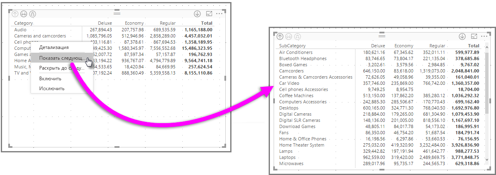

Если нажать значок **Подняться** в верхнем левом углу, чтобы в матрице отобразились все категории верхнего уровня, а затем снова щелкнуть правой кнопкой и выбрать команду **Раскрыть до следующего уровня**, мы увидим следующее:

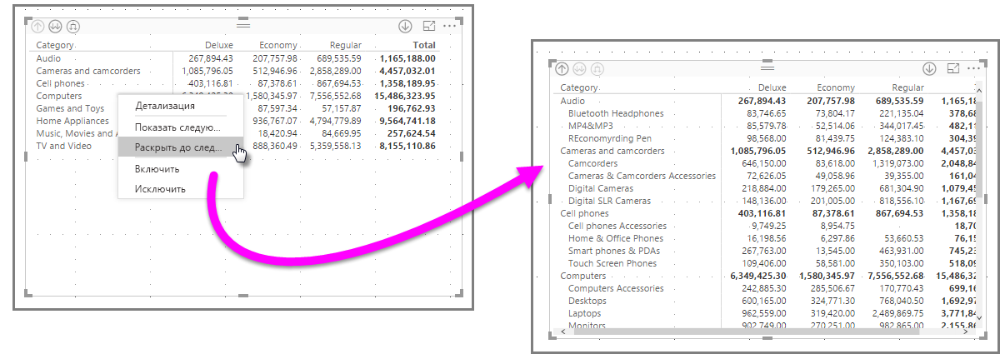

Кроме того, вы можете использовать пункты меню **Include** (Включить) и **Исключить**, чтобы удалить или добавить соответственно в матрице строку (и все подкатегории), выделенную правой кнопкой мыши.

### Детализация по заголовкам столбцов
Аналогично детализации по строкам можно также выполнять детализацию по **столбцам**. На следующем рисунке видно, что в области полей **Столбцы** есть два поля, создающие иерархию, аналогичную той, которую мы использовали для строк ранее в этой статье. В области полей **Столбцы** есть поля *Класс* и *Цвет*.

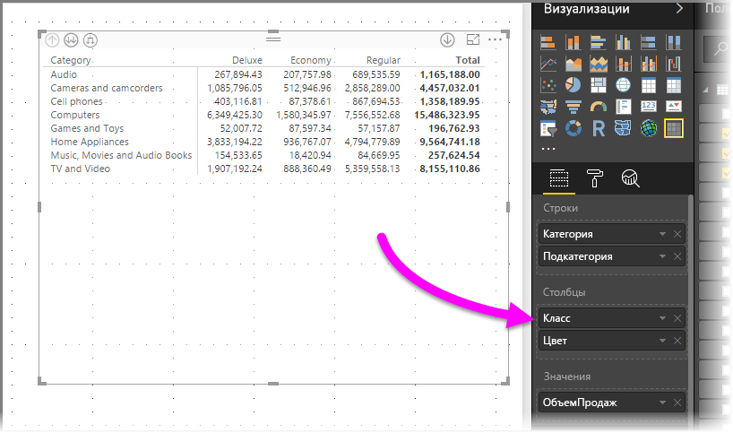

Если щелкнуть столбец правой кнопкой мыши в визуальном элементе **Матрица**, появится параметр детализации. На следующем рисунке мы щелкнули правой кнопкой мыши столбец *Люкс* и выбрали пункт **Детализация**.

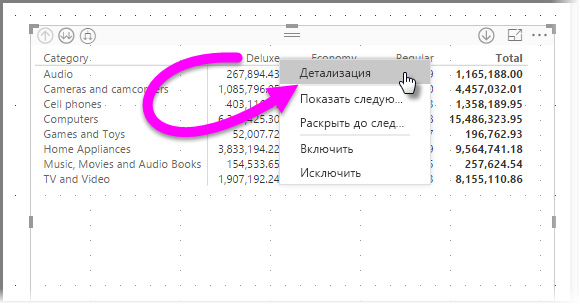

При выборе пункта **Детализация** отобразился следующий уровень в иерархии столбцов для столбца *Люкс* (в данном случае — *Цвет*).

Остальные элементы контекстного меню действуют в столбцах так же, как в строках (см. предыдущий раздел **Детализация по заголовкам строк**). Вы можете **показать следующий уровень** для столбцов, **раскрыть их до следующего уровня**, **включить** или **исключить** так же, как для строк.

> [!NOTE]
> Значки детализации и перехода на уровень выше в верхнем левом углу визуального элемента с матрицей применяются только к строкам. Чтобы выполнить детализацию по столбцам, воспользуйтесь контекстным меню.
> 
> 

## Ступенчатый макет с визуальными элементами с матрицей
Визуальный элемент **Матрица** позволяет автоматически сделать отступы для подкатегорий в иерархии под каждой родительской категорией. Вот что собой представляет **ступенчатый макет**.

В *исходной* версии визуального элемента "Матрица" подкатегории отображались в отдельном столбце, занимая больше места в визуальном элементе. На следующем рисунке показана таблица в исходном визуальном элементе **Матрица**. Обратите внимание, что подкатегории находятся в отдельном столбце.

На следующем рисунке показан визуальный элемент **Матрица** со **ступенчатым макетом**. Обратите внимание, что в категории *Компьютеры* подкатегории ("Комплектующие для компьютеров", "Настольные компьютеры", "Ноутбуки", "Мониторы" и т. д.) немного сдвинуты. Таким образом визуальный элемент стал понятнее и меньше по размеру.

Параметры **ступенчатого макета** можно легко настроить. Выберите визуальный элемент **Матрица** и в области **Визуализации** в разделе **Формат** (значок в виде валика) разверните раздел **Заголовки строк**. Здесь есть два элемента: переключатель **Ступенчатый макет** (который включает или выключает этот макет) и параметр **Макет с пошаговым отступом** (позволяет указать уровень отступа в пикселях).

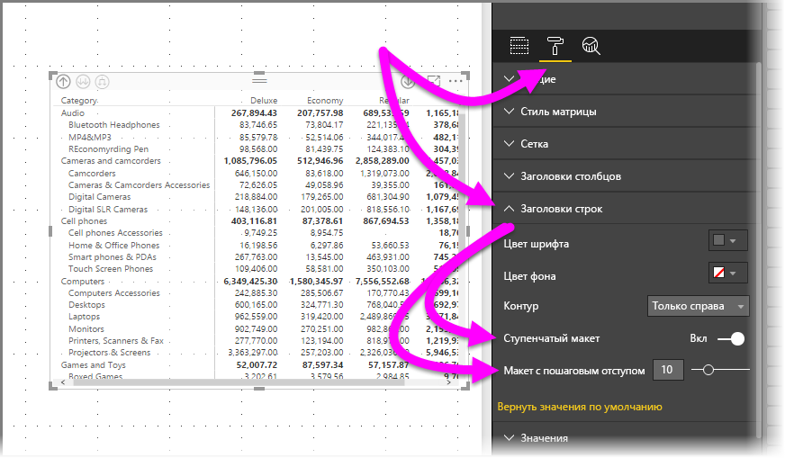

Если отключить **ступенчатый макет**, подкатегории будут отображаться в другом столбце, а не под родительской категорией.

## Промежуточные итоги с визуальными элементами матрицы
Промежуточные итоги можно включить или отключить в визуальных элементах матрицы для строк и столбцов. На следующем рисунке видно, что для строки промежуточных итогов задано значение **Включено**.

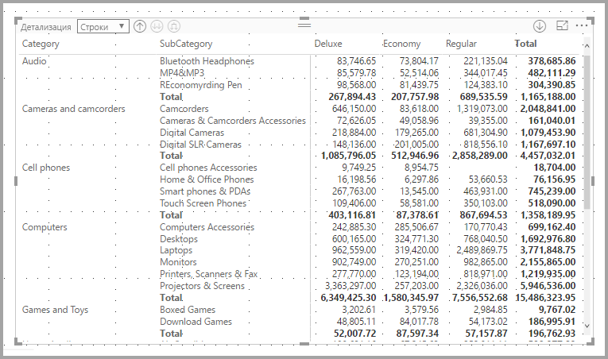

В разделе **Формат** на панели **Визуализация** разверните карту **Подытоги** и установите ползунок **Row subtotals** (Подытоги по строке) в положение **Выключено**. После этого действия подытоги больше не будут отображаться.

Для столбцов применяется тот же процесс.

## Перекрестное выделение с использованием визуальных элементов с матрицей
В визуальном элементе **Матрица** для перекрестного выделения можно выбрать все элементы в матрице. Выберите столбец в визуальном элементе **Матрица**, и он будет выделен, как и другие визуальные элементы на странице отчета. Эта возможность была доступна для других визуальных элементов, а также при выборе точки данных. Теперь она реализована и для визуального элемента **Матрица**.

Кроме того, для перекрестного выделения можно также нажать клавишу CTRL и щелкнуть мышью. Например, на следующем рисунке в визуальном элементе **Матрица** выбрана коллекция подкатегорий. Обратите внимание, что элементы, которые не были выбраны в визуальном элементе, выделены серым цветом. Также оцените, как в других визуальных элементах на странице отражаются элементы, выбранные в визуальном элементе **Матрица**.

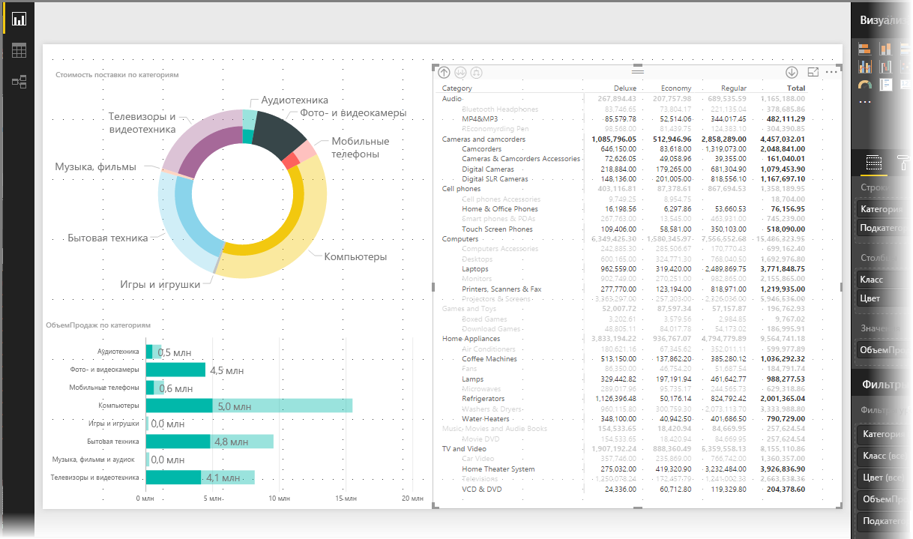

## Цвет заливки и шрифта с визуальными элементами матрицы
С помощью визуального элемента **Матрица** можно применить **условное форматирование** (цвет и заливка) фона для ячеек в матрице, а также условное форматирование текста и значений.

Чтобы применить условное форматирование, можно выполнить одно из следующих действий при выборе визуального элемента матрицы:

* На панели **Поля** щелкните "Поле" правой кнопкой мыши и выберите в меню**Условное форматирование**.
  
  
* Кроме того, на панели **Формат** разверните карту **Условное форматирование** для параметра **Background color scales** (Цветовая шкала фона) или **Font color scales** (Цветовая шкала шрифта) и установите ползунок в положение **Включено**. При включении любого из этих параметров отображается ссылка на *расширенные элементы управления*, позволяющие настроить цвета и значения для форматирования цвета.
  
  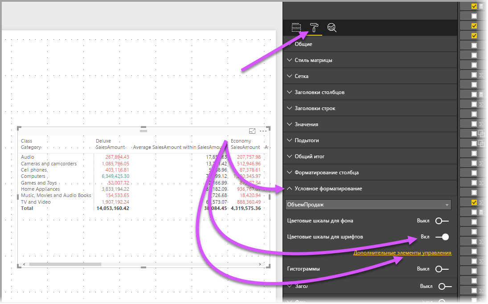

Любой из этих подходов обеспечивает такой же результат. При выборе *расширенных элементов управления* отображается следующее диалоговое окно, в котором можно внести изменения:

## Рекомендации и ограничения
С этим выпуском визуального элемента **Матрица** связан ряд ограничений и рекомендаций.

* Столбцы можно детализировать только с помощью контекстного меню. Сейчас в визуальном элементе не предусмотрена возможность детализации по группам строк или столбцов.
* Вы можете развернуть только все элементы уровня одновременно, а не по одной категории за раз.
* Если щелкнуть имя заголовка правой кнопкой мыши, может появиться элемент **Просмотреть записи**, но он не работает.
* Сейчас нет строки *Общий итог*.
* При отключении строки промежуточных итогов в ступенчатом макете ничего не происходит.
* Заголовки столбцов могут усекаться, если текст во внутренней группе короче, чем текст во внешней.
* При изменении значения отступа в ступенчатом макете не должен меняться отступ группы внешней строки.

Мы всегда рады услышать ваше мнение. Сейчас мы проводим **опрос** по визуальному элементу **Матрица**. Если у вас есть несколько минут, [пройдите его](https://www.instant.ly/s/PYXT1).

