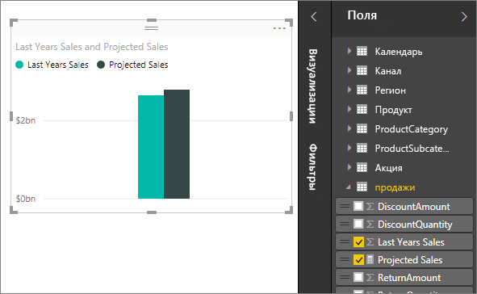

# Меры в Power BI Desktop
**Power BI Desktop** предоставляет средства быстрого анализа данных. Но иногда данные просто не содержат все необходимое для ответа на некоторые наиболее важные вопросы. Получить эти ответы можно с помощью мер.

Меры используются в некоторых наиболее распространенных способах анализа данных; например в вычислениях сумм, средних значений, минимальных и максимальных значений, количеств или в более сложных вычислениях, созданных вами самостоятельно с помощью формул DAX. Вычисленные результаты мер всегда изменяются в ответ на взаимодействие с отчетами, что обеспечивает быстрый и динамический просмотр данных. Давайте рассмотрим это более подробно.

## Основные сведения о мерах
В **Power BI Desktop** меры создаются и используются в **представлении отчетов** или **представлении данных**. Меры, которые вы создали сами, отображаются в списке полей со значком калькулятора. Вы можете давать мерам любые имена и добавлять их в новую или существующую визуализацию так же, как любое другое поле.

> [!NOTE]
> Вы также можете поэкспериментировать с **быстрыми мерами** — готовыми мерами, которые можно выбрать в диалоговых окнах. Они позволяют быстро создавать меры и знакомиться с синтаксисом DAX, так как их автоматически созданные формулы DAX доступны для просмотра. См. дополнительные сведения о [быстрых мерах](desktop-quick-measures.md).
> 
> 

## Выражения анализа данных
Меры вычисляют результат из формулы выражений. При создании собственных мер вы используете язык формул [Data Analysis Expressions](https://msdn.microsoft.com/library/gg413422.aspx) (DAX). DAX включает библиотеку из более чем 200 функций, операторов и конструкций, предоставляя огромную гибкость при создании мер, чтобы вычислять результаты практически для любого необходимого анализа данных.

Формулы DAX во многом похожи на формулы Excel. В DAX даже имеется много таких же функций, например ДАТА, СУММ и ЛЕВСИМВ. Но функции DAX предназначены для работы с реляционными данными, как те, что имеются в Power BI Desktop.

## Давайте рассмотрим пример.
Джен является менеджером по продажам в компании Contoso. Ее попросили предоставить прогноз продаж посредников на следующий финансовый год. Она решает строить свои оценки на объемах продаж за прошлый год с годовым ростом в 6 % благодаря различным рекламным акциям, запланированным на следующие шесть месяцев.

Чтобы создать отчет по оценкам, она импортирует данные о продажах за прошлый год в Power BI Desktop. Она находит поле SalesAmount в таблице Reseller Sales (Продажи посредников). Поскольку импортированные ею данные содержит только объемы продаж за прошлый год, она переименовывает поле SalesAmount в поле Last Years Sales (Продажи за последний год). Затем она перетаскивает поле Last Years Sales (Продажи за последний год) на холст отчета. Это поле отображается в визуализации диаграммы как одно значение, представляющее собой сумму всех продаж торговых представителей за прошлый год.

Она замечает, что, несмотря на то, что вычисление не было задано, оно предоставлено автоматически. Power BI Desktop создал собственную меру путем суммирования всех значений в поле Last Years Sales (Продажи за последний год).

Но Джен нужна мера для расчета прогнозов продаж на будущий год, которая будет получена путем умножения объема продаж за последний год на 1,06, чтобы учесть ожидаемое увеличение на 6 процентов. Для этого вычисления она создает свою меру. С помощью функции New Measure (Создать меру) она создает новую меру и вводит следующую формулу DAX:

    Projected Sales = SUM('Sales'[Last Years Sales])*1.06

Затем Джен перетаскивает новую меру Projected Sales (Прогноз продаж) в диаграмму.

Очень быстро и с минимальными усилиями Джен получает меру для вычисления прогнозируемых продаж. Она может дальше анализировать свой прогноз, фильтруя по конкретным посредникам или добавляя другие поля в свой отчет.

## Дополнительные сведения
Здесь представлено только краткое введение меры, но имеются дополнительные ресурсы, помогающие научиться создавать свои собственные меры. Рекомендуется прочесть [Учебник. Создание собственных мер в Power BI Desktop](desktop-tutorial-create-measures.md), где можно загрузить образец файла и получить пошаговые уроки по созданию дополнительных мер.  

Для более детального изучения DAX рекомендуется документ [Основные сведения о DAX в Power BI Desktop](desktop-quickstart-learn-dax-basics.md). В [справочнике по выражениям анализа данных](https://msdn.microsoft.com/library/gg413422.aspx) находятся подробные статьи о каждой из функций, синтаксисе, операторах и соглашениях об именовании. DAX уже несколько лет используется в Power Pivot в Excel и SQL Server Analysis Services, поэтому имеется также много других полезных и доступных ресурсов. Рекомендуется также посетить [вики-сайт Центра ресурсов DAX](http://social.technet.microsoft.com/wiki/contents/articles/1088.dax-resource-center.aspx), где влиятельные члены сообщества бизнес-аналитики делятся своими знаниями в области DAX.

