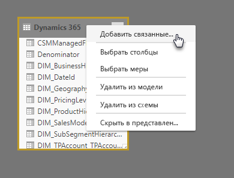
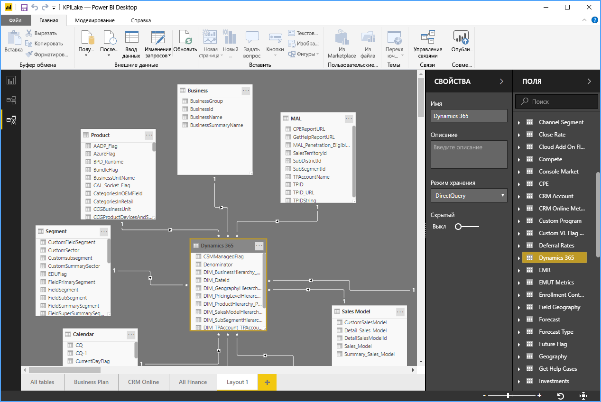

# Представление моделирования в Power BI Desktop

С помощью **представления моделирования** в **Power BI Desktop** можно просматривать и использовать сложные наборы данных, которые содержат множество таблиц.

## Использование представления моделирования

Для доступа к представлению моделирования выберите соответствующий значок на панели **Power BI Desktop** слева, как показано на следующем рисунке.

## Создание отдельных диаграмм

С помощью представления моделирования можно создавать диаграммы модели, которые содержат только определенный набор таблиц в модели. Это обеспечит более четкое представление используемых таблиц, а также упростит работу со сложными наборами данных. Чтобы создать диаграмму с набором таблиц, щелкните значок **+** рядом с вкладкой **Все таблицы** в нижней части окна Power BI Desktop.

Затем можно перетащить таблицу из списка **Поля** в область диаграммы. Щелкните правой кнопкой мыши таблицу и выберите **Добавить связанные таблицы** в появившемся меню.

При этом на диаграмме отобразятся таблицы, которые относятся к исходной таблице. На следующем рисунке показано, как связанные таблицы отображаются после выбора пункта меню **Добавить связанные таблицы**.

## Настройка общих свойств

В представлении моделирования можно выбрать сразу несколько объектов, удерживая нажатой клавишу **CTRL** и щелкая таблицы. Выбираемые таблицы отображаются выделенными в представлении моделирования. При выделении нескольких таблиц изменения, выбранные в области **Свойства**, будут применены ко всем этим таблицам.

Например, можно изменить [режим хранения](desktop-storage-mode.md) для нескольких таблиц в представлении диаграммы. Для этого удерживайте нажатой клавишу **CTRL**, выберите таблицы, а затем измените параметр режима хранения в области **Свойства**.

## Дальнейшие действия

В следующих статьях содержатся дополнительные сведения о моделях данных, а также подробно описан режим DirectQuery:

* [Агрегаты в Power BI Desktop (предварительная версия)](desktop-aggregations.md)
* [Составные модели в Power BI Desktop](desktop-composite-models.md)
* [Режим хранения в Power BI Desktop (предварительная версия)](desktop-storage-mode.md)
* [Связи "многие ко многим" в Power BI Desktop](desktop-many-to-many-relationships.md)

Статьи о DirectQuery:

* [Использование DirectQuery в Power BI](desktop-directquery-about.md)
* [Источники данных, поддерживаемые DirectQuery в Power BI](desktop-directquery-data-sources.md)
