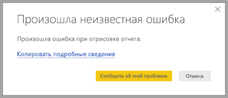

# Конфиденциальность Power BI Desktop

Корпорация Майкрософт прилагает большие усилия для защиты конфиденциальности, стараясь при этом разрабатывать продукты, которые обеспечивают высокую производительность, эффективность и удобство работы. Майкрософт собирает определенные сведения об использовании вами Power BI Desktop для диагностики проблем и совершенствования продукта. Дополнительные сведения о механизмах обеспечения конфиденциальности см. в заявлении о конфиденциальности корпорации Майкрософт. Оно распространяется на собираемые нами данные об использовании **Power BI Desktop**.
 
Сведения, полученные от пользователей **Power BI Desktop**, могут включать в себя данные об операционной системе, Power BI Desktop и версиях Internet Explorer. 
 
Если вы хотите отказаться от этого сбора данных, можете перейти в раздел **Файл > Параметры и настройки > Параметры** и снять флажок **Отправка данных об использовании** на вкладке **Данные об использовании**, как показано ниже.

## Отправка дополнительных сведений

При возникновении сбоев или других проблем вы можете отправлять отчеты об ошибках и дополнительные сведения, которые помогут нам устранить проблему в будущем выпуске. Корпорация Майкрософт также собирает сведения о состоянии файла **Power BI Desktop**, с которым вы работаете, например о языковом стандарте документа, включенных возможностях предварительной версии и режиме хранения. В эти данные могут входить снимки экрана, сообщения об ошибках и формулы из вашей модели. Кроме того, они могут включать в себя содержимое файлов, с которыми вы работали во время возникновения ошибки, поэтому вам следует проверить эти данные перед отправкой. Перед отправкой мы напомним вам, что вы можете настраивать, какие именно сведения следует направлять в Майкрософт.  
 
Если вы не хотите отправлять эти сведения, нажмите кнопку **Закрыть** при возникновении ошибки или откажитесь от отправки данных об использовании, как описано выше. 

