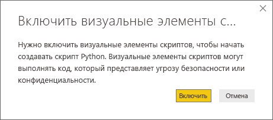
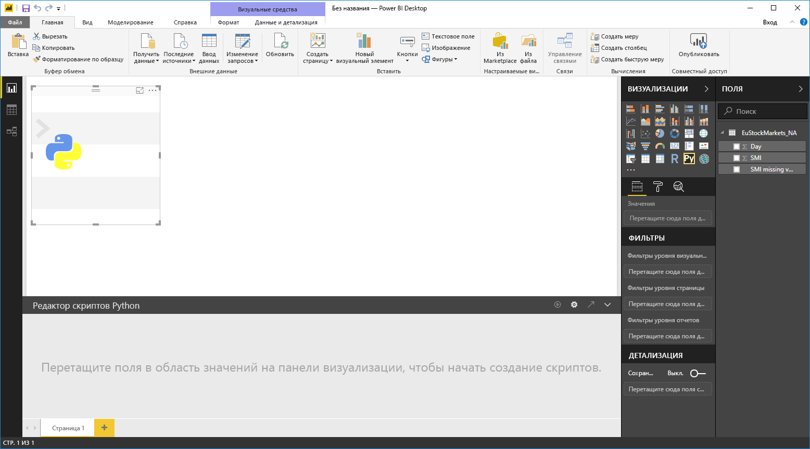

# Использование внешней среды Python IDE с Power BI
В **Power BI Desktop** можно использовать внешнюю среду Python IDE (интегрированная среда разработки) для создания и редактирования сценариев на языке Python, которые затем будут использоваться в Power BI.

## Включение внешней среды Python IDE
Можно запускать внешнюю среду Python IDE из **Power BI Desktop**, при этом с импортом, и отображение данных в Python IDE будет происходить автоматически. Вы можете изменять сценарии во внешней среде Python IDE, а затем снова добавлять их в **Power BI Desktop** для создания визуальных элементов и отчетов Power BI.

Вы можете указать, какую интегрированную среду разработки Python вы хотели бы использовать, и запускать ее автоматически в **Power BI Desktop**.

### Требования
Чтобы использовать эту функцию, необходимо установить **Python IDE** на локальном компьютере. Так как в **Power BI Desktop** не предусмотрена возможность включения, развертывания или установки подсистемы Python, вам нужно отдельно установить **Python** на локальном компьютере. Используя следующие варианты, вы можете выбрать среду Python IDE для использования.

* Можно установить привычную среду Python IDE из доступных бесплатно, таких как [страница загрузки Visual Studio Code](https://code.visualstudio.com/download/).
* **Power BI Desktop** также поддерживает **Visual Studio**.
* Можно также установить другую среду Python IDE и настроить запуск этой **Python IDE** из **Power BI Desktop** посредством одного из следующих вариантов.
  
  * Можно связать файлы **.PY** с внешней средой IDE, которая должна запускаться с помощью **Power BI Desktop**.
  * Вы можете указать файл EXE, который должно запустить приложение **Power BI Desktop**. Для этого в диалоговом окне **Options** (Параметры) в разделе **Python Script Options** (Параметры сценария Python) выберите *Other* (Другие). Чтобы открыть диалоговое окно **Options** (Параметры), последовательно выбрав элементы **File > Options and settings > Options** (Файл > Параметры и настройки > Параметры).
    
    

Если вы установили несколько сред Python IDE, вы можете указать, какую из них следует запустить. Для этого в диалоговом окне **Options** (Параметры) выберите ее в раскрывающемся списке *Detected Python IDEs* (Обнаруженные среды Python IDE).

По умолчанию приложение **Power BI Desktop** запустит **Visual Studio Code** в качестве внешней Python IDE, если она установлена на локальном компьютере. Если **Visual Studio Code** не установлена, но установлена **Visual Studio**, будет запущена последняя. Если не установлена ни одна из указанных сред Python IDE, запустится приложение, сопоставленное с файлами **.PY**.

Если нет сопоставления с файлами **.PY**, вы можете указать путь к пользовательской интегрированной среде разработки в разделе *Browse to your preferred Python IDE* (Переход к предпочтительной Python IDE) диалогового окна **Options** (Параметры). Вы также можете запустить другую среду Python IDE, щелкнув значок **Settings** (Настройки) рядом со стрелкой **Launch Python IDE** (Запуск Python IDE) в приложении **Power BI Desktop**.

## Запуск Python IDE из Power BI Desktop
Чтобы запустить Python IDE из **Power BI Desktop**, сделайте следующее.

1. Загрузите данные в **Power BI Desktop**.
2. В области **Поля** выберите поля, с которыми вы собираетесь работать. Если вы еще не включили визуальные элементы скрипта, вам будет предложено сделать это.
   
   
3. Если визуальные элементы сценария включены, вы можете выбрать визуальный элемент Python в области **Визуализации**. Будет создан пустой визуальный элемент Python, готовый для отображения результатов сценария. Также отобразится область **Редактор сценариев Python**.
   
   
4. Теперь вы можете выбрать поля, которые будут использоваться в сценарии Python. Когда вы выберете поля, **Редактор сценариев Python** автоматически создаст код сценария с учетом этого выбора. Вы можете создать (или вставить) сценарий Python непосредственно в область **Редактор Python-скриптов** либо же оставить этот элемент пустым.
   
   
   
   > [!NOTE]
   > По умолчанию для визуальных элементов Python используется тип агрегирования *не суммировать*.
   > 
   > 
5. Теперь можно запускать среду Python IDE непосредственно из **Power BI Desktop**. Нажмите кнопку **Запуск Python IDE** (справа от заголовка окна **Редактор сценариев Python**, как показано ниже).
   
   
6. Выбранная среда Python IDE будет запущена службой Power BI Desktop, как показано на следующем рисунке (здесь в качестве среды Python IDE по умолчанию используется **Visual Studio Code**).
   
   
   
   > [!NOTE]
   > **Power BI Desktop** добавляет первые три строки скрипта, обеспечивая возможность импорта данных из **Power BI Desktop** после запуска скрипта.
   > 
   > 
7. Любой сценарий, созданный в **области редактора сценариев Python** в **Power BI Desktop**, отобразится, начиная со строки 4 среды Python IDE. Теперь вы можете создавать свой сценарий Python в среде Python IDE. Когда сценарий Python будет выполнен в среде Python IDE, его нужно скопировать и вставить обратно в область **Редактор сценариев Python** в **Power BI Desktop**, *за исключением* первых трех строк сценария, автоматически созданных службой **Power BI Desktop**. Не следует копировать первые три строки сценария в **Power BI Desktop**, так как эти строки предназначены только для импорта данных в Python IDE из **Power BI Desktop**.

### Известные ограничения
При запуске среды Python IDE непосредственно из Power BI Desktop действуют следующие ограничения.

* Автоматический экспорт сценария из Python IDE в **Power BI Desktop** не поддерживается.

## Дальнейшие действия
Ознакомьтесь с дополнительными материалами по Python в Power BI.

* [Выполнение сценариев Python в Power BI Desktop](desktop-python-scripts.md)
* [Создание визуальных элементов Power BI с помощью Python](desktop-python-visuals.md)

