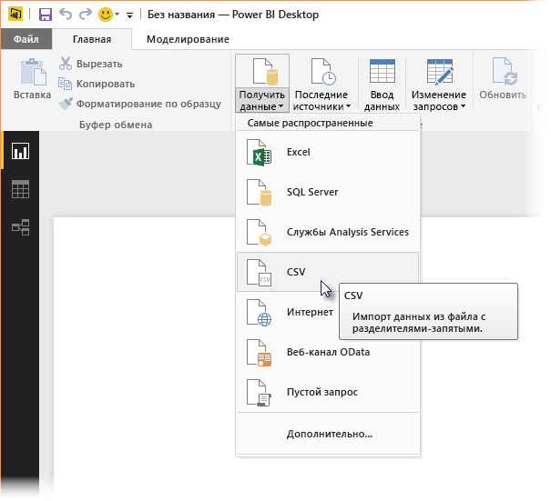
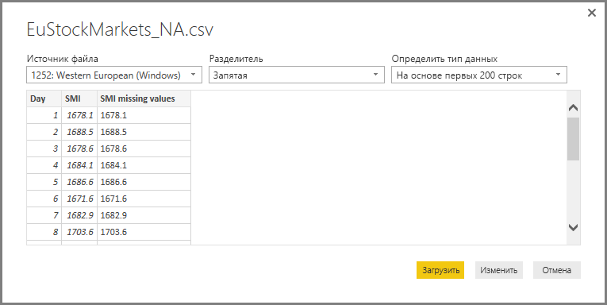
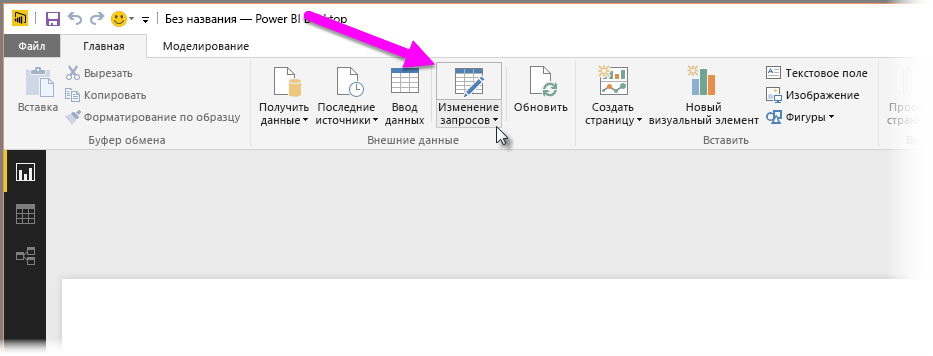

# <a name="using-python-in-query-editor"></a>Использование языка Python в редакторе запросов
В **редакторе запросов** Power BI Desktop можно использовать язык программирования **Python**, который широко применяют специалисты по статистике, аналитики и специалисты по обработке данных. Интеграция языка Python в **редактор запросов** позволяет выполнять очистку данных с помощью Python, а также формирование и анализ данных в наборах данных, в частности заполнение отсутствующих данных, прогнозирование и кластеризацию. **Python** — эффективный язык, который можно использовать в **редакторе запросов** для подготовки модели данных и создания отчетов.

## <a name="installing-python"></a>Установка Python
Чтобы использовать **Python** в **редакторе запросов** Power BI Desktop, необходимо установить **Python** на локальном компьютере. Вы можете скачать и установить **Python** бесплатно из различных расположений, включая [официальную страницу скачивания Python](https://www.python.org/) и [Anaconda](https://anaconda.org/anaconda/python/).

## <a name="using-python-in-query-editor"></a>Использование языка Python в редакторе запросов
Чтобы продемонстрировать использование **Python** в **редакторе запросов**, воспользуемся примером из набора данных фондовой биржи в CSV-файле, который вы можете [скачать здесь](http://download.microsoft.com/download/F/8/A/F8AA9DC9-8545-4AAE-9305-27AD1D01DC03/EuStockMarkets_NA.csv). Ниже перечислены шаги для этого примера.

1. Сначала загрузите данные в **Power BI Desktop**. В этом примере загрузите файл *EuStockMarkets_NA.csv* и выберите **Получить данные > CSV** на вкладке ленты **Главная** в **Power BI Desktop**.
   
   
2. Выберите файл и нажмите кнопку **Открыть**. CSV-файл отобразится в диалоговом окне **CSV-файл**.
   
   
3. После того как данные загрузятся, вы увидите их в Power BI Desktop в области **Поля**.
   
   
4. Откройте **редактор запросов**. Для этого в **Power BI Desktop** на вкладке **Главная** нажмите кнопку **Изменить запросы**.
   
   
5. На вкладке **Преобразование** нажмите кнопку **Запустить сценарий Python**. Откроется редактор **Запустить сценарий Python**, который показан на следующем шаге. Обратите внимание, что в строках 15 и 20 отсутствуют данные, как и в других строках, которых не видно на приведенном ниже рисунке. В инструкциях ниже показано, как язык Python может заполнить эти строки (и заполнит их).
   
   
6. Например, введите следующий код сценария:
   
    ```python
       import pandas as pd
       completedData = dataset.fillna(method='backfill', inplace=False)
       dataset["completedValues"] =  completedData["SMI missing values"]
   ```

   > [!NOTE]
   > Чтобы этот код сценария работал правильно, в вашей среде Python должна быть установлена библиотека *pandas*. Чтобы установить библиотеку pandas, выполните в своем экземпляре Python следующую команду: |      > pip install pandas
   > 
   > 
   
   Код в диалоговом окне **Запустить сценарий Python** будет выглядеть так:
   
   
7. После нажатия кнопки **ОК** в **редакторе запросов** отображается предупреждение о конфиденциальности данных.
   
   
8. Чтобы сценарии Python правильно работали в службе Power BI, уровень конфиденциальности всех источников данных должен иметь значение *Общедоступный*. Дополнительные сведения о параметрах конфиденциальности и результатах их использования см. в статье об [уровнях конфиденциальности](desktop-privacy-levels.md).
   
   
   
   Обратите внимание на новый столбец *completedValues* в области **Поля**. Обратите внимание на несколько отсутствующих элементов данных, например в строках 15 и 18. Следующий раздел описывает, как язык Python обрабатывает эти строки.
   

Используя только пять строк сценария Python, **редактор запросов** заполнит отсутствующие значения с помощью прогнозной модели.

## <a name="creating-visuals-from-python-script-data"></a>Создание визуальных элементов с помощью данных сценария Python
Создадим визуальный элемент, чтобы увидеть, как код сценария Python заполнил отсутствующие значения с помощью библиотеки *pandas* (см. рисунок ниже):


Когда будет создан визуальный элемент (а также другие визуальные элементы, которые требуется создать с помощью **Power BI Desktop**), вы можете сохранить файл **Power BI Desktop** в формате PBIX, а затем использовать в службе Power BI модель данных и включенные в нее сценарии Python.

> [!NOTE]
> Хотите просмотреть заполненный PBIX-файл с результатами выполнения этих действий? Вам повезло: вы можете загрузить заполненный файл **Power BI Desktop**, используемый в этих примерах, [прямо здесь](http://download.microsoft.com/download/A/B/C/ABCF5589-B88F-49D4-ADEB-4A623589FC09/Complete%20Values%20with%20Python%20in%20PQ.pbix).

После отправки PBIX-файла в службу Power BI необходимо выполнить еще несколько дополнительных действий, чтобы обновить данные (в службе) и включить обновление визуальных элементов в службе (для обновления визуальных элементов данным требуется доступ к Python). Вот эти действия:

* **Включите запланированное обновление для набора данных**. Чтобы включить запланированное обновление для книги, содержащей набор данных со сценариями Python, см. инструкции в статье [Настройка запланированного обновления](refresh-scheduled-refresh.md), которая также включает информацию о шлюзе **Personal Gateway**.
* **Установите шлюз Personal Gateway**. Установите **Personal Gateway** на компьютере, на котором сохранен файл и установлен язык Python. Службе Power BI необходимо получить доступ к этой книге и повторно преобразовать для просмотра все обновленные визуальные элементы. См. дополнительную информацию в инструкциях по [установке и настройке шлюза Personal Gateway](personal-gateway.md).

## <a name="limitations"></a>Ограничения
Существуют ограничения на запросы, включающие сценарии Python, которые созданы в **редакторе запросов**.

* Всем параметрам источника данных Python должно быть присвоено значение *Общедоступный*. Все остальные действия в запросе, созданном в **редакторе запросов**, также должны быть общедоступными. Чтобы получить параметры источника данных, в **Power BI Desktop** выберите элементы **Файл > Параметры и настройки > Параметры источника данных**.
  
  
  
  В диалоговом окне **Параметры источника данных** выберите источники данных, а затем щелкните **Изменить разрешения...** и убедитесь, что для параметра **Уровень конфиденциальности** указано значение *Общедоступный*.
  
      
* Чтобы включить запланированное обновление визуальных объектов Python или набора данных, включите **запланированное обновление** и установите шлюз **Personal Gateway** на компьютере, на котором сохранена книга и установлен экземпляр Python. Дополнительные сведения о запланированном обновлении и шлюзе Personal Gateway см. в статьях по ссылкам, приведенным в предыдущем разделе.
* Вложенные таблицы (таблицы в таблицах) на данный момент не поддерживаются. 

С помощью Python и пользовательских запросов можно выполнять разные операции. Просматривайте и формируйте свои данные, придавая им нужный вид.

