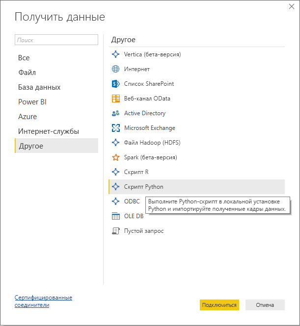
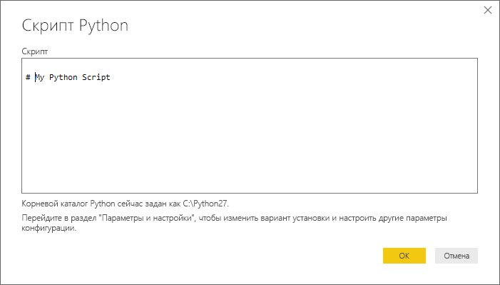
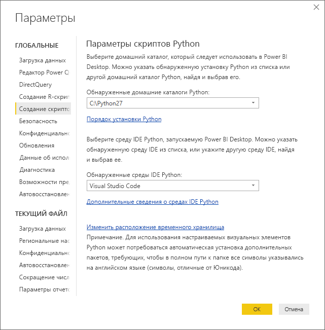

# <a name="run-python-scripts-in-power-bi-desktop"></a>Запустить сценарий Python в Power BI Desktop
Вы можете выполнять сценарий Python непосредственно в **Power BI Desktop** и импортировать полученные наборы данных в модели данных Power BI Desktop.

## <a name="install-python"></a>Установка Python
Для запуска сценариев Python в Power BI Desktop необходимо установить **Python** на локальном компьютере. Вы можете скачать и установить **Python** бесплатно из различных расположений, включая [официальную страницу скачивания Python](https://www.python.org/) и [Anaconda](https://anaconda.org/anaconda/python/). В текущем выпуске сценариев Python в Power BI Desktop в пути установки поддерживаются символы Юникода, а также пробелы (пустые символы).

### <a name="install-required-python-packages"></a>Установка необходимых пакетов Python
Для интеграции Power BI с Python требуется установить два пакета Python (Pandas и Matplotlib).  Установите эти два пакета помощью средства командной строки pip.

```
pip install pandas
pip install matplotlib
```

## <a name="run-python-scripts"></a>Запустить сценарии Python
С помощью всего нескольких действий в Power BI Desktop вы можете запустить сценарии Python и создать модель данных, из которой можно создавать отчеты и совместно использовать их в службе Power BI.

### <a name="prepare-a-python-script"></a>Подготовка сценария Python
Чтобы запустить сценарий Python в Power BI Desktop, создайте его в локальной среде разработки Python и убедитесь, что он выполняется успешно.

Чтобы запустить сценарий в Power BI Desktop, убедитесь, что этот сценарий успешно выполняется в новой и неизмененной рабочей области. Это означает, что все пакеты и зависимости должны загружаться и выполняться явным образом.

При подготовке и выполнении сценариев Python в Power BI Desktop действуют некоторые ограничения.

* Импортируются только кадры данных pandas, поэтому убедитесь, что импортируемые в Power BI данные представлены в кадре.
* Любой сценарий Python, который выполняется дольше 30 минут, завершается по истечении времени ожидания.
* Интерактивные вызовы в сценарии Python, например ожидание ввода данных пользователем, прерывают выполнение сценария.
* При настройке рабочего каталога в сценарии Python *необходимо* задать полный, а не относительный путь каталога.
* Вложенные таблицы (таблицы в таблицах) на данный момент не поддерживаются. 

### <a name="run-your-python-script-and-import-data"></a>Выполнение сценария Python и импорт данных
1. Соединитель данных сценария Python в Power BI Desktop находится в области **Получить данные**. Чтобы выполнить сценарий Python, выберите **Получить данные &gt; Подробнее**, а затем выберите **Другие &gt; сценарий Python**, как показано на следующем рисунке.
   
   
2. Если Python установлен на локальном компьютере, в качестве подсистемы Python выбирается самая новая установленная версия. Просто скопируйте сценарий в окне сценария и нажмите кнопку **ОК**.
   
   
3. Если Python не установлен, не определен или если на локальном компьютере есть несколько установок, будет отображаться предупреждение.
   
   
   
   Параметры установки Python расположены централизованно в разделе "Создание скриптов Python" в диалоговом окне "Параметры". Чтобы указать параметры установки Python, выберите **Файл > Параметры и настройки**, а затем **Параметры > Создание сценариев Python**. Если доступно несколько установок Python, появится раскрывающееся меню для выбора используемой установки. Можно также выбрать **Другое** и предоставить путь настройки.
   
   
4. Нажмите кнопку **ОК**, чтобы выполнить сценарий Python. Если сценарий выполняется успешно, можно выбрать полученные кадры данных для добавления в модель Power BI.

### <a name="refresh"></a>Обновить
Вы можете обновить сценарий Python в Power BI Desktop. При обновлении сценария Python Power BI Desktop запускает его повторно в среде Power BI Desktop.

## <a name="next-steps"></a>Дальнейшие действия
Ознакомьтесь с дополнительными материалами по Python в Power BI.

* [Создание визуальных элементов Python в приложении Power BI Desktop](desktop-python-visuals.md)
* [Использование внешней среды Python IDE с Power BI](desktop-python-ide.md)
