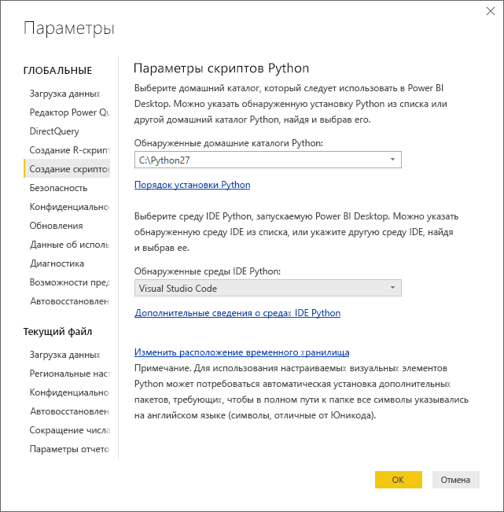
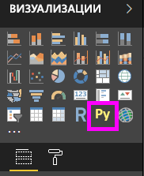
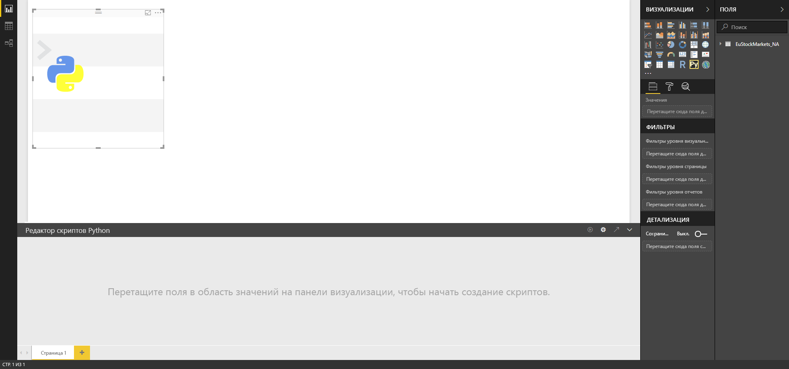
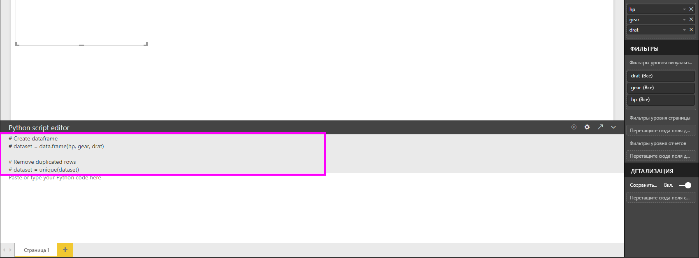
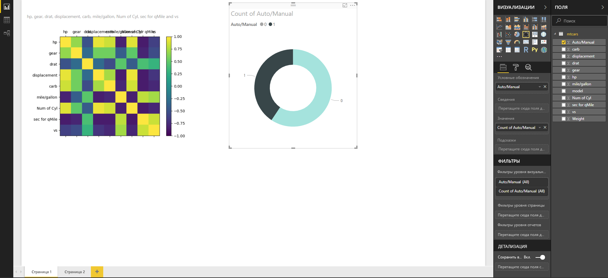
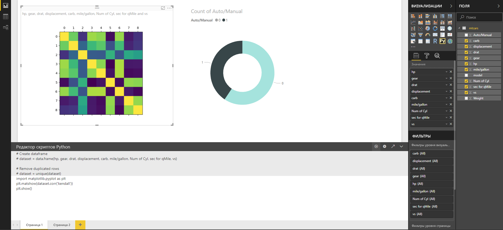

# Создание визуальных элементов Power BI с помощью Python
В приложении **Power BI Desktop** для визуализации данных можно использовать **Python**.

## Установка Python
**Python** не входит в приложение **Power BI Desktop**, а также не развертывается и не устанавливается вместе с ним. Для выполнения в приложении **Power BI Desktop** скриптов Python необходимо отдельно установить на локальном компьютере компонент **Python**. Вы можете скачать и установить **Python** бесплатно из различных расположений, включая [официальную страницу скачивания Python](https://www.python.org/) и [Anaconda](https://anaconda.org/anaconda/python/). В текущем выпуске сценариев Python в Power BI Desktop в пути установки поддерживаются символы Юникода, а также пробелы (пустые символы).

## Включение визуальных элементов Python
Чтобы включить визуальные элементы Python, выберите **Файл > Параметры и настройки > Параметры**, а затем на странице **Параметры** убедитесь, что в разделе **Создание скриптов Python** окна **Параметры** указаны сведения об установленной у вас локально версии Python, как показано на рисунке ниже. На рисунке ниже в текстовом поле явно указан путь к установленной версии Python: **C:\Python27**. Путь должен соответствовать расположению каталога с локальной установленной версией Python, которая будет использоваться службой **Power BI Desktop**.
   
   

После указания установленной версии Python все готово к созданию визуальных элементов Python.

## Создание визуальных элементов Python в приложении Power BI Desktop
1. Чтобы добавить визуальный элемент Python, выберите значок **Python Visual** (Визуальный элемент Python) в области **Визуализация**, как показано на следующем рисунке.
   
   

   При добавлении в отчет визуального элемента Python в **Power BI Desktop** выполняются такие действия:
   
   - На холсте отчета появляется изображение заполнителя для визуального элемента Python.
   
   - В нижней части центральной области открывается **редактор скриптов Python**.
   
   

2. Теперь в раздел **Значения** в области **Поля** необходимо добавить поля, которые будут использоваться в скрипте Python, как и для любого другого визуального элемента **Power BI Desktop**. 
    
    В скриптах Python можно использовать только поля, которые добавлены в список **Поля**. При работе в **редакторе скриптов Python Power BI Desktop** вы можете добавлять в область **Поля** новые поля и удалять ненужные. **Power BI Desktop** автоматически определяет, какие поля были добавлены или удалены.
   
   > [!NOTE]
   > По умолчанию для визуальных элементов Python используется тип агрегирования *не суммировать*.
   > 
   > 
   
3. Теперь выбранные данные можно использовать для создания визуализации. 

    При выборе полей **редактор скриптов Python** создает для них связующий код скрипта в серой области вверху области редактора. При выборе и удалении полей соответствующим образом автоматически создается и удаляется связующий код в редакторе скриптов Python.
   
   В примере, показанном на изображении ниже, выбраны три поля: hp, gear и drat. В результате редактор скриптов Python создал следующий код привязки:
   
   * Был создан кадр данных под названием **набор данных** .
     * Кадр данных состоит из различных полей, выбранных пользователем.
   * По умолчанию используется тип агрегирования *Не суммировать*.
   * Аналогично визуальным элементам таблиц, поля сгруппированы, а одинаковые строки отображаются только один раз.
   
   
   
   > [!TIP]
   > В определенных случаях автоматическая группировка не нужна либо нужно, чтобы отображались все строки, в том числе одинаковые. В такой ситуации в набор данных можно добавить индексное поле, в результате чего все строки будут считаться уникальными и не будут объединяться в группы.
   > 
   > 
   
   Созданный кадр данных называется **dataset**, и к выбранным столбцам можно обращаться по соответствующим именам. Например, чтобы обратиться к полю gear в редакторе скриптов Python, введите в скрипт Python *dataset["gear"]*.

4. После автоматического создания кадра данных с выбранными полями можно написать сценарий Python, который строит визуализацию на устройстве Python по умолчанию. Составив скрипт, выберите **Выполнить** в строке заголовка **редактора скриптов Python** (кнопка **Выполнить** находится в правой части этой строки).
   
    В режиме **выполнения** **Power BI Desktop** определяет структуру и наносит ее на холст. Так как эта процедура выполняется в локальной среде Python, необходимо установить все необходимые пакеты.
   
   **Power BI Desktop** выполняет повторное нанесение структуры визуального элемента каждый раз, когда:
   
   * вы нажимаете кнопку **Выполнить** в строке заголовка **Редактор скриптов Python**;
   * происходит изменение данных (в результате обновления, применения фильтра или выделения).

    На изображении ниже показан пример кода, выполняющего построение корреляционной диаграммы: на визуализации представлены связи между атрибутами различных типов автомобилей.

    

5. Чтобы увеличить область визуализации, **редактор скриптов Python** можно свернуть. И, как и при работе с другими визуальными элементами в **Power BI Desktop**, в корреляционной структуре можно выполнять перекрестную фильтрацию, например, выбрать только спортивные автомобили в визуальном элементе "Кольцо" (на изображении выше — круглый элемент справа).

    

6. В скрипт Python также можно внести изменения для настройки визуального элемента, в том числе путем добавления параметров Python в команду построения.

    В исходном виде команда построения диаграммы выглядит так:

    plt.matshow(dataset.corr('pearson'))

    После нескольких изменений скрипта Python команда принимает следующий вид:

    plt.matshow(dataset.corr('kendall'))

    Таким образом, визуальный элемент Python создается с помощью тау-коэффициента корреляции Кендалла, как показано на следующем рисунке.

    

    Если при выполнении скрипта Python возникает ошибка, то визуальный элемент Python не создастся, а на холсте появится сообщение об ошибке. Чтобы **просмотреть подробные сведения** об этой ошибке визуального элемента Python, выберите соответствующую команду в сообщении на холсте.

    

    > **Безопасность скриптов Python**. Визуальные элементы Python создаются на основе скриптов Python, которые могут содержать код, не обеспечивающий достаточный уровень безопасности или конфиденциальности. При первой попытке просмотра визуальных элементов Python или взаимодействии с ними пользователь видит предупреждение системы безопасности. Включайте визуальные элементы Python, только если доверяете автору и источнику либо после проверки и ознакомления со сценариями Python.
    > 
    > 

## Известные ограничения
У визуальных элементов Python в **Power BI Desktop** есть несколько ограничений.

* Ограничения на размер данных: для нанесения на холст визуальный элемент Python может использовать до 150 000 строк. Если выбрано больше строк, используются только первые 150 000 из них; при этом на изображении появляется соответствующее сообщение.
* Ограничение на время вычисления: если время вычисления для визуального элемента Python превышает пять минут, истекает время ожидания выполнения и возникает ошибка.
* Связи: как и при работе с другими визуальными элементами Power BI Desktop, при выборе полей данных из разных таблиц, между которыми не определены связи, возникает ошибка.
* Визуальные элементы Python обновляются при обновлении данных, применении фильтрации и выделения. Однако само изображение не является интерактивным и не может служить источником для перекрестной фильтрации.
* Визуальные элементы Python реагируют на выделение других визуальных элементов, однако выполнять перекрестную фильтрацию, выбирая объекты на визуальном элементе Python, нельзя.
* На холсте правильно отображаются только визуализации, построение которых выполняется на устройстве отображения Python по умолчанию. Не рекомендуется указывать явным образом другое устройство отображения Python.

## Дальнейшие действия
Ознакомьтесь с дополнительными материалами по Python в Power BI.

* [Выполнение сценариев Python в Power BI Desktop](desktop-python-scripts.md)
* [Использование внешней среды Python IDE с Power BI](desktop-python-ide.md)

