# Общие сведения о запросах в Power BI Desktop
С помощью **Power BI Desktop** вы можете подключаться к миру данных, создавать привлекательные и фундаментальные отчеты и совместно использовать свою работу с другими пользователями, которые затем могут использовать ее для расширения своих возможностей по бизнес-аналитике.

Power BI Desktop имеет три представления:

* Представление **отчетов** — здесь можно использовать запросы для создания впечатляющих визуализаций, их упорядочивания и добавления на них нескольких страниц, которые можно использовать совместно с другими пользователями.
* Представление **данных** — здесь можно просматривать данные отчета в формате модели данных, добавлять меры, создавать новые столбцы и управлять связями.
* Представление **связей** — здесь можно получить графическое представление связей, установленных в вашей модели данных, а также при необходимости изменять их или управлять ими.

Доступ к этим представлениям осуществляется путем выбора одного из трех значков, расположенных вдоль левой стороны Power BI Desktop. На следующем рисунке выбрано представление отчетов, на что указывает желтая полоска рядом со значком.  

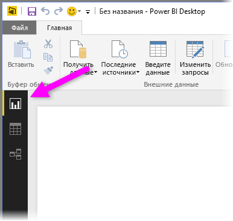

Power BI Desktop также имеет **редактор запросов**, где можно подключиться к одному или нескольким источникам данных, преобразовывать данные в соответствии с потребностями, а также загружать модель в Power BI Desktop.

Этот документ содержит общие сведения о работе с данными в **редакторе запросов**. В конце документа вы найдете ссылки на дополнительные сведения и рекомендации по поддерживаемым типам данных, подключению к данным, формированию данных, созданию связей и началу работы.

Но сначала давайте ознакомимся с **редактором запросов**.

## Редактор запросов
Чтобы открыть **редактор запросов**, в Power BI Desktop на вкладке **Главная** нажмите кнопку **Изменить запросы**.  

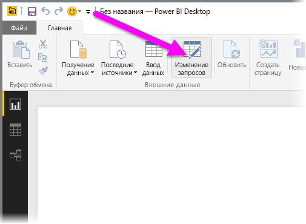

Без подключения к данным в **редакторе запросов** отображается пустая область.  

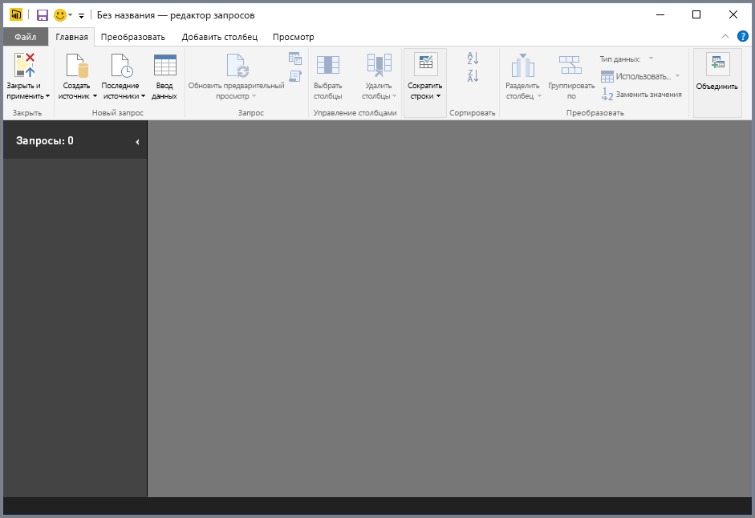

После загрузки запроса представление **редактора запросов** становится гораздо более интересным. Если мы подключимся к указанному ниже веб-источнику данных, **редактор запросов** загрузит сведения о данных и мы сможем начинать их формировать.

[*http://www.bankrate.com/finance/retirement/best-places-retire-how-state-ranks.aspx*](http://www.bankrate.com/finance/retirement/best-places-retire-how-state-ranks.aspx)

Вот так выглядит **редактор запросов** после подключения к данным:

1. На ленте многие кнопки теперь можно использовать для взаимодействия с данными в запросе.
2. В левой области перечислены запросы, которые можно выбирать, просматривать и формировать.
3. В центральной области отображаются данные из выбранного запроса, и их можно формировать.
4. Появляется окно **параметров запроса**, в котором перечислены свойства запроса и примененные действия.  
   
   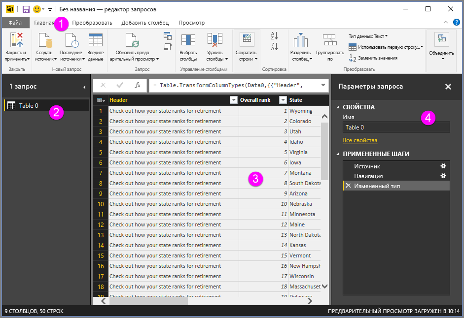

Мы рассмотрим каждую из этих четырех областей — ленту, область запросов, представление данных и область параметров запроса — в следующих разделах.

## Лента запроса
Лента в **редакторе запросов** состоит из четырех вкладок: **Главная**, **Преобразовать**, **Добавить столбец** и **Вид**.

На вкладке **Главная** содержатся общие задачи запроса, включая первый шаг в любом запросе — **получение данных**. На следующем рисунке показана вкладка **Главная** ленты.  

Чтобы подключиться к данным и начать процесс построения запросов, нажмите кнопку **Получить данные** . Появится меню с наиболее распространенными источниками данных.  

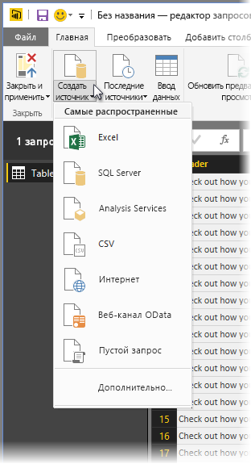

Дополнительные сведения о доступных источниках данных см. в разделе **Источники данных**. Сведения о подключении к данным, включая примеры и инструкции, см. в разделе **Подключение к данным**.

На вкладке **Преобразовать** предоставляется доступ к распространенным задачам преобразования данных, таким как добавление или удаление столбцов, изменение типов данных, разбиение столбцов и другие задачи управления данными. На следующем рисунке показана вкладка **Преобразовать** ленты.  

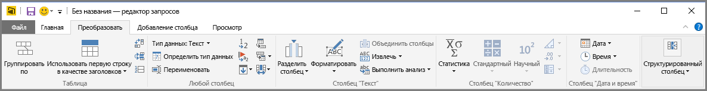

Дополнительные сведения о преобразовании данных, включая примеры, см. в разделе **Объединение и формирование данных**.

На вкладке **Добавить столбец** предоставляются дополнительные задачи, связанные с добавлением столбца, форматированием данных столбца и добавлением настраиваемых столбцов. На следующем рисунке показана вкладка **Добавить столбец** ленты.  

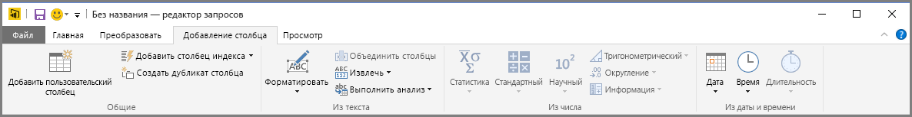

Вкладка **Вид** на ленте используется для переключения между разными областями или окнами. Она также используется для отображения расширенного редактора. На следующем рисунке показана вкладка **Вид** ленты.  

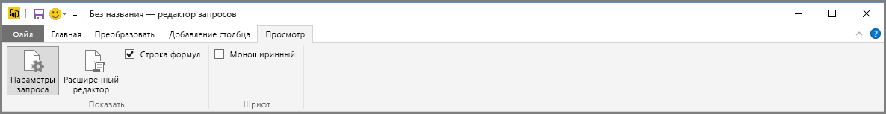

Полезно знать, что многие задачи, доступные на ленте, также доступны по щелчку правой кнопкой мыши столбца или других данных в центральной области.

## Левая область
В левой области отображается число активных запросов, а также имя запроса. При выборе запроса в левой области его данные отображаются в центральной области, где их можно формировать и преобразовывать в соответствии со своими потребностями. На следующем рисунке показана левая область с несколькими запросами.  

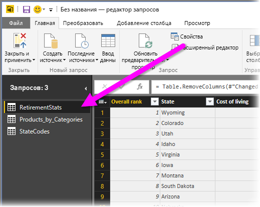

## Центральная область (область данных)
В центральной области, или области данных, отображаются данные из выбранного запроса. Здесь выполняется большая часть работы с представлением запросов.

На следующем рисунке показано установленное ранее подключение к интернет-данным, столбец **Overall score** (Общий рейтинг) выбран, и выполняется щелчок его заголовка правой кнопкой мыши, чтобы отобразить доступные пункты меню. Обратите внимание, что многие из этих пунктов контекстного меню совпадают с кнопками на вкладках ленты.  

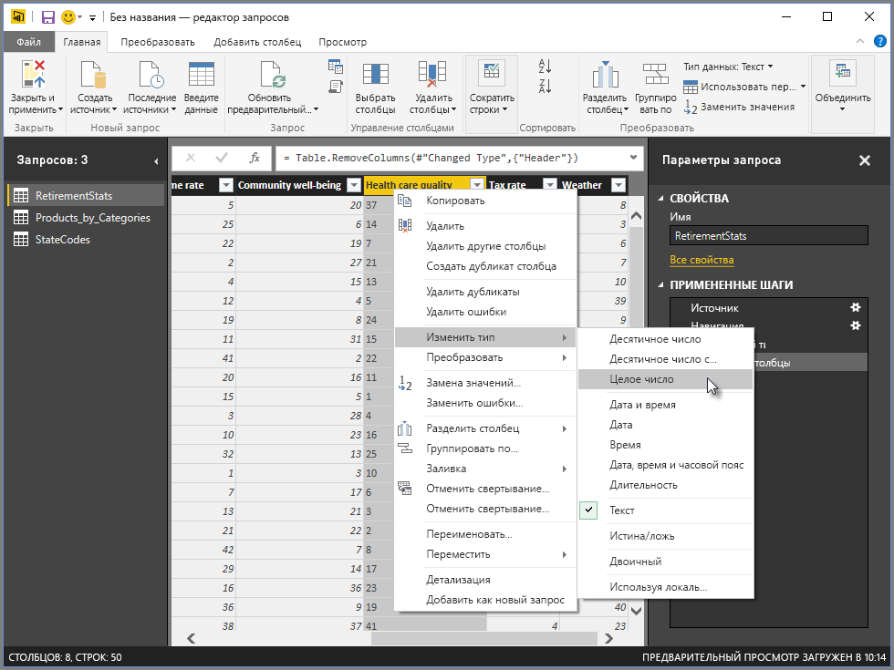

При выборе пункта контекстного меню (или нажатии кнопки на ленте) запрос применяет это действие к данным и сохраняет его как часть самого запроса. Действия записываются в области **Параметры запроса** в последовательном порядке, как описано в следующем разделе.  

## Область параметров запроса
В области **Параметры запроса** отображаются все действия, связанные с запросом. Например, на следующем рисунке в разделе **Примененные действия** области **Параметры запроса** отражен тот факт, что мы только что изменили тип столбца **Overall score** (Общий рейтинг).

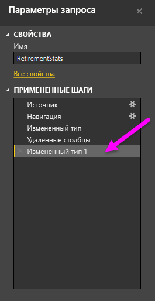

По мере применения к запросу дополнительных действий по формированию они регистрируются в разделе **Примененные действия** .

Важно знать, что базовый источник данных *не* изменяется; редактор запросов настраивает и формирует представление его данных, и все взаимодействие с базовыми данными происходит на основе сформированного и измененного редактором запросов представления этих данных.

В области **Параметры запроса** можно переименовывать действия, удалять действия или упорядочивать их по своему усмотрению. Для этого щелкните правой кнопкой мыши действие в разделе **Примененные действия** и в появившемся меню выберите соответствующую команду. Все действия запроса выполняются в порядке их отображения в области **Примененные действия**.

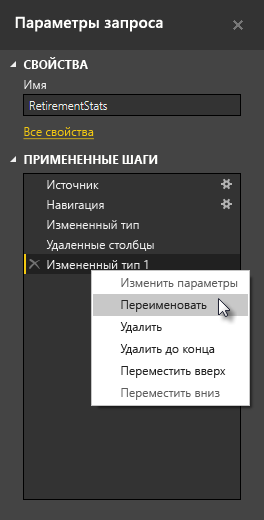

## Расширенный редактор
Если вы хотите просмотреть код, который создает запрос в каждом действии, или нужно создать собственный формирующий код, можно использовать **расширенный редактор**. Чтобы запустить расширенный редактор, выберите на ленте вкладку **Вид** , а затем нажмите **Расширенный редактор**. Появится окно с существующим кодом запроса.  
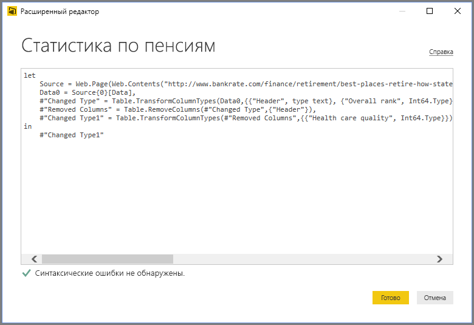

Можно непосредственно редактировать код в окне **Расширенный редактор** . Чтобы закрыть окно, нажмите кнопку **Готово** или **Отмена** .  

## Сохранение работы
Когда запрос готов, можно использовать редактор запросов для применения изменений к модели данных в Power BI Desktop, после чего закрыть редактор запросов. Для этого выберите пункт **Закрыть и применить** в меню **Файл** редактора запросов.  
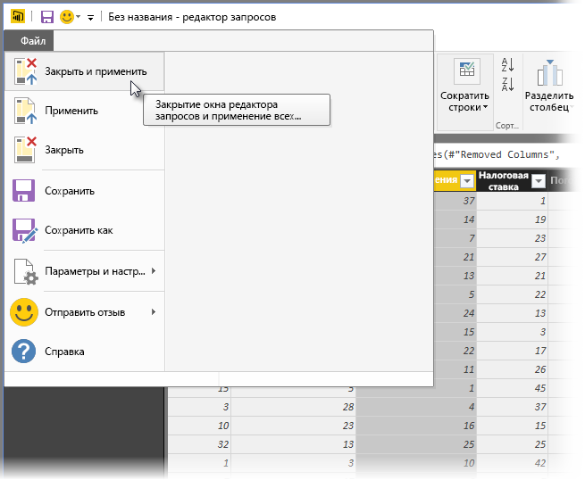

По мере хода выполнения Power BI Desktop выводит диалоговое окно для отображения состояния.  

После создания запроса или для сохранения результатов работы Power BI Desktop может сохранить вашу работу в виде PBIX-файла.

Чтобы сохранить результаты работы, выберите **Файл \> Сохранить** (или **Файл \> Сохранить как**), как показано на следующем рисунке.  
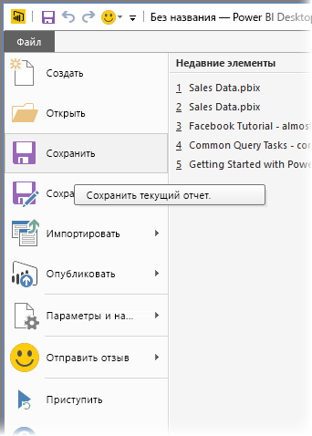

## Дальнейшие действия
Power BI Desktop предоставляет широкие возможности. Дополнительные сведения об этих возможностях см. в следующих ресурсах.

* [Начало работы с Power BI Desktop](desktop-getting-started.md)
* [Источники данных в Power BI Desktop](desktop-data-sources.md)
* [Подключение к данным в Power BI Desktop](desktop-connect-to-data.md)
* [Формирование и объединение данных в Power BI Desktop](desktop-shape-and-combine-data.md)
* [Общие задачи с запросами в Power BI Desktop](desktop-common-query-tasks.md)   

