# Использование быстрых мер для простого выполнения стандартных и мощных вычислений
Чтобы оперативно и без труда выполнять стандартные и мощные вычисления, используйте **быстрые меры**. Средство **Быстрые меры** запускает набор команд DAX в фоновом режиме (вам не нужно писать DAX-код — все выполняется автоматически) на основе данных, которые вы вводите в диалоговое окно, а затем представляет результаты для использования в отчете. Самое главное, вы можете просмотреть, как быстрые меры выполняют DAX-команды, а также ознакомиться с библиотекой DAX или расширить свои знания о ней.

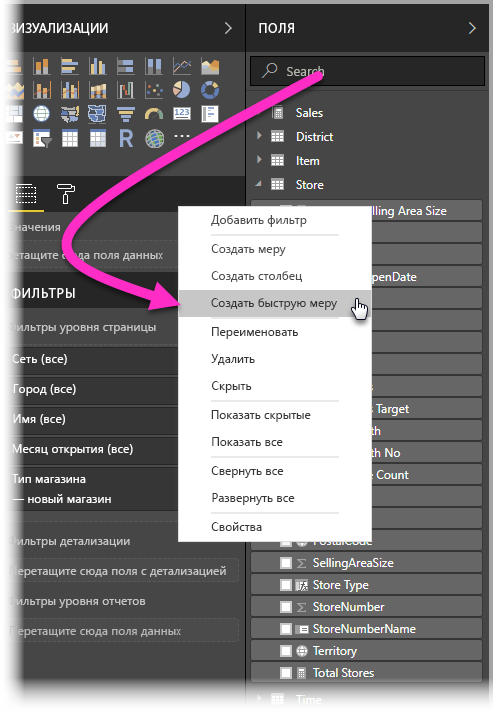

Чтобы создать **быстрые меры**, щелкните правой кнопкой мыши меню **Поля** и выберите пункт **Быстрые меры** в открывшемся меню. Щелкните правой кнопкой мыши любое значение в области **Значения** существующего визуального элемента (например, поле *Значения* в визуальном элементе *Линейчатая диаграмма*). Существует много доступных категорий вычислений и способов изменять каждое вычисление в соответствии с вашими потребностями.

### Быстрые меры предоставляются в общедоступной версии

Начиная с выпуска **Power BI Desktop** за февраль 2018 г. быстрые меры предоставляются в общедоступной версии (не в предварительной). Если вы используете предыдущий выпуск **Power BI Desktop**, можно ознакомиться с функцией **Быстрые меры** начиная с выпуска **Power BI Desktop** за **апрель 2017 г.** Для этого последовательно выберите **Файл > Параметры и настройки > Параметры > Предварительная версия функций** и установите флажок рядом с элементом **Быстрые меры**.

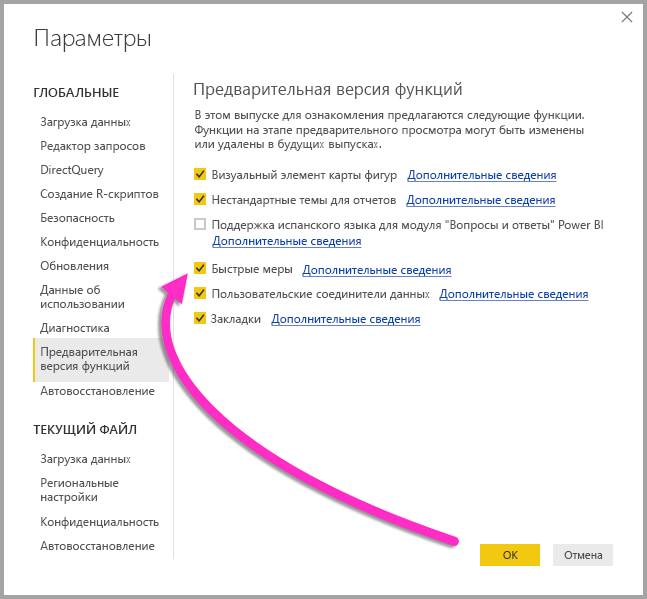

После этого изменения приложение **Power BI Desktop** необходимо перезапустить.

## Использование быстрых мер
Чтобы создать **быстрые меры**, щелкните правой кнопкой мыши любое поле в меню **Поля** в **Power BI Desktop** и выберите пункт **Быстрые меры** в открывшемся меню.

При использовании динамических подключений служб SQL Server Analysis Services (SSAS) доступны некоторые **быстрые меры**. В **Power BI Desktop** отображается только коллекция **быстрых мер**, которую поддерживает версия подключенной службы SSAS. Таким образом, если вы подключились к источнику динамических данных SSAS, и не видите в списке определенных **быстрых мер**, это означает, что версия подключенной службы SSAS не поддерживает меру DAX, с помощью которой реализуется эта **быстрая мера**.

Когда вы выберете соответствующий пункт в контекстном меню, откроется диалоговое окно **Быстрые меры**, где можно выбрать вычисления и поля, для которых нужно выполнить вычисление.

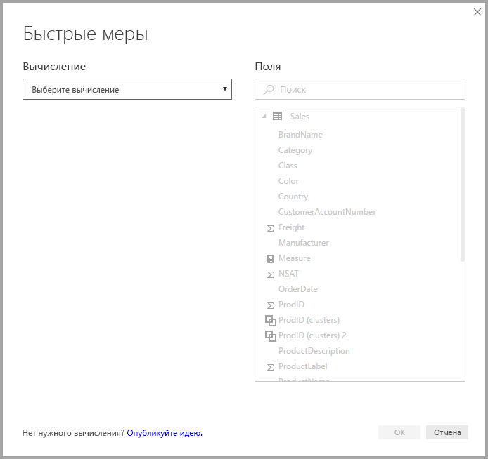

При выборе вычислений в раскрывающемся меню вы увидите длинный список доступных **быстрых мер**.

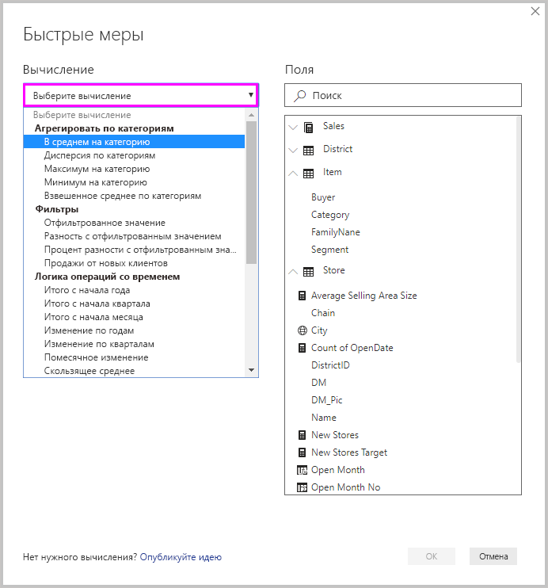

В быстрых мерах доступно пять разных групп типов вычислений, каждая из которых содержит коллекцию вычислений. Ниже перечислены эти группы и вычисления.

* **Агрегировать по категориям:**
  * В среднем на категорию
  * Дисперсия по категориям
  * Максимум на категорию
  * Минимум на категорию
  * Средневзвешенное значение по категориям
* **Фильтры:**
  * отфильтрованное значение;
  * Разность с отфильтрованным значением
  * процент разности с отфильтрованным значением;
  * продажи из новых категорий.
* **Логика операций со временем**
  * Итого с начала года
  * Итого с начала квартала
  * Итого с начала месяца
  * изменение по годам;
  * поквартальное изменение;
  * Помесячное изменение
  * Скользящее среднее
* **Итоги**
  * Итоговая сумма
  * Итоги для категории (с фильтрами)
  * Итоги для категории (без фильтров)
* **Математические операции**
  * Добавление
  * Вычитание
  * Умножение
  * Деление
  * Разница в процентах
  * коэффициент корреляции.
* **Текстовые**
  * Оценка
  * Объединенный список значений

В будущем к этим вычислениям добавятся новые. Мы хотели бы узнать, какие новые **быстрые меры** вам нужны, и узнать ваше мнение о **быстрых мерах** (в том числе о формулах DAX). Подробнее об этом в конце этой статьи.

## Пример быстрых мер
Рассмотрим пример этих **быстрых мер** в действии.

Следующий визуальный элемент **Матрица** отображает таблицу с продажами электроники. Это основная таблица, содержащая итог по каждой категории.

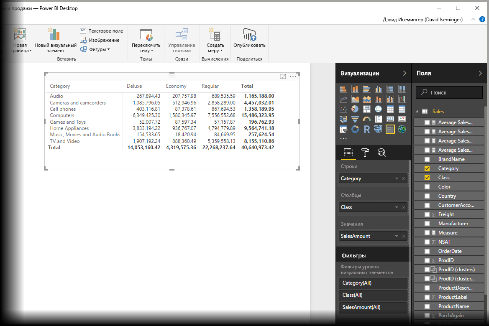

Если щелкнуть правой кнопкой мыши поле **Значения** и выбрать пункт **Быстрые меры**, можно выбрать вариант *В среднем на категорию* в качестве *вычисления*, а затем выбрать *сумму SalesAmount* как *базовое значение*, указать значение *SalesAmount*, перетаскивая это поле из списка *Поля* в области права в раздел *Категория* слева.

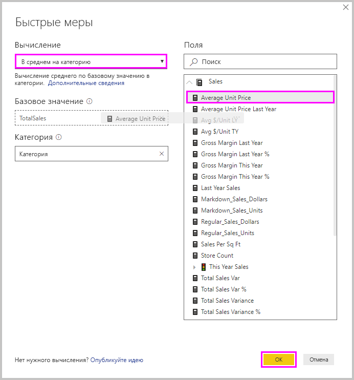

Если нажать кнопку **ОК**, мы увидим интересные результаты, которые описаны ниже.

1. Визуальный элемент **Матрицы** теперь содержит новый столбец, показывающий наши вычисления (в нашем примере — *среднее значение SalesAmount в SalesAmount*).
2. Создана новая **мера**, которая теперь доступна в меню **Поля**. Она выделена желтым прямоугольником. Эта мера доступна в любом визуальном элементе в отчете, а не только в элементе, для которого он был создан.
3. Формула DAX, которая создана для **быстрой меры**, отображается в строке формул.

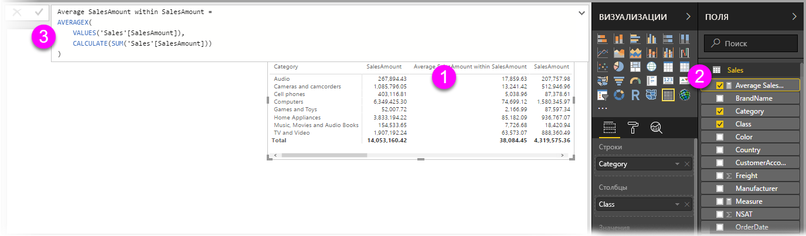

Прежде всего обратите внимание, что **быстрая мера** применена к визуальному элементу. Доступны новый столбец и связанное значение, которые основаны на созданной **быстрой мере**.

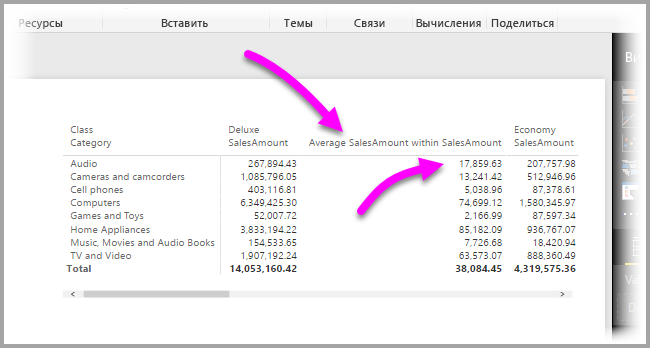

Во-вторых, **быстрая мера** отображается в меню **Поля** модели данных и может использоваться как любое другое поле в модели для любого визуального элемента. Визуальный элемент **линейчатой диаграммы**, показанный на следующем рисунке, создан с помощью нового поля, которое создано с помощью **быстрой меры**.

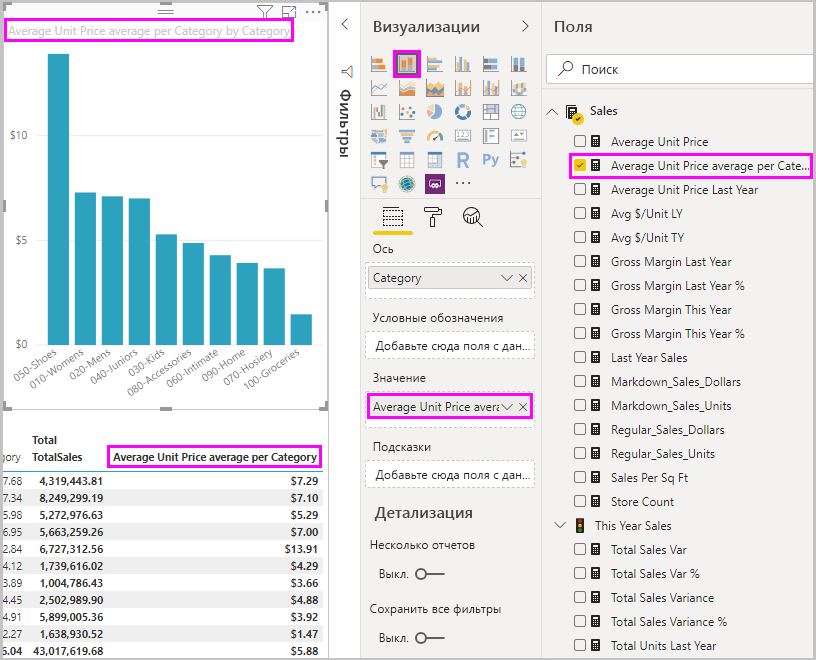

Перейдем к следующему разделу, чтобы обсудить третий элемент — формулы DAX.

## Сведения о формулах DAX, используемыми быстрыми мерами
Другое значительное преимущество функции **быстрых мер** заключается в том, что она непосредственно отображает формулу DAX, которая создана для реализации меры. На следующем рисунке видно, что мы выбрали меру, созданную функцией **Быстрая мера** (она находится в меню **Поля**, поэтому мы просто выбрали ее). После этого появляется **строка формул**, где отображается формула DAX, которую приложение Power BI создало для реализации меры.

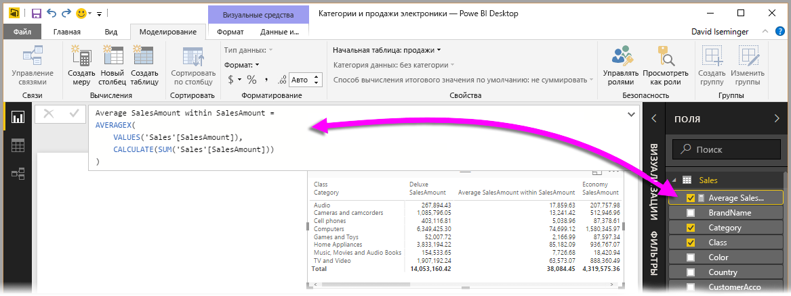

Это очень хорошо, так как мы можем видеть формулу меры. Но что еще более важно, вы можете использовать **быстрые меры**, чтобы увидеть, как должны создаваться базовые формулы DAX.

Предположим, вам необходимо выполнить вычисление по годам, но вы не уверены, как структурировать формулу DAX. Или вы вообще не знаете, с чего начать. Для начала вы можете создать **быструю меру** с помощью вычисления **Погодовое изменение** и наблюдать, что происходит. Создав **быструю меру**, вы увидите, как она отображается в вашем визуальном элементе, и как работает формула DAX. Затем вы можете внести изменения непосредственно в формулу DAX или создать другую меру в соответствии со своими потребностями.

Это как умный учитель, который немедленно отвечает на все ваши вопросы. Вы всегда можете удалить эти меры из модели, если они вам не нравятся. Просто щелкните правой кнопкой мыши меру и выберите команду **Удалить**.

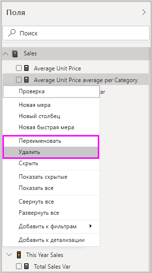

Создав идеальную меру, вы можете переименовать ее по своему усмотрению, используя то же контекстное меню.

## Рекомендации и ограничения
Обратите внимание на ряд ограничений и рекомендаций.

* Функция **Быстрые меры** доступна, только если вы можете редактировать модель, что невозможно, если вы работаете с некоторыми динамическими подключениями (табличные динамические подключения SSAS поддерживаются, как объяснялось ранее).
* Мера, которая добавляется в меню **Поля**, может использоваться с любым визуальным элементом в отчете.
* Вы всегда можете просмотреть формулу DAX, связанную с **быстрой мерой**. Для этого выберите меру в меню **Поля**, а затем найдите формулу в **строке формул**.
* В режиме DirectQuery нельзя создавать быстрые меры для логики операций со временем. Функции DAX, используемые в этих быстрых мерах, влияют на производительность при преобразовании в инструкции T-SQL, отправляемые в источник данных.

> [!WARNING]
> Сейчас быстрые меры *только* создают инструкции DAX с запятыми в качестве разделителей аргументов. Если версию **Power BI Desktop** локализовано на язык, где в качестве десятичных разделителей используются запятые, быстрые меры будут работать неправильно.
> 
> 

### Логика операций со временем и быстрые меры
Начиная с обновления **Power BI Desktop** за октябрь 2017 г. вы можете использовать настраиваемые таблицы дат с **быстрыми мерами** временной аналитики. При использовании внешней табличной модели убедитесь в том, что при создании модели первичный столбец дат в этой таблице помечен как таблица дат, как описано в [этой статье](https://docs.microsoft.com/sql/analysis-services/tabular-models/specify-mark-as-date-table-for-use-with-time-intelligence-ssas-tabular). Если вы импортируете собственную таблицу дат, пометьте ее соответствующим образом, как описано в [этой статье](https://docs.microsoft.com/power-bi/desktop-date-tables).

### Дополнительные сведения и примеры
Мы ожидаем появления примеров и рекомендаций для каждого вычисления с помощью **быстрых мер**, поэтому рекомендуем вскоре проверить обновления в этой статье.

У вас есть идеи, которые не реализованы для функции **Быстрая мера**? Отлично! Перейдите [на эту страницу](https://go.microsoft.com/fwlink/?linkid=842906) и отправьте свои идеи (и формулы DAX) по поводу функции **Быстрая мера**, которые вы бы хотели увидеть реализованными в **Power BI Desktop**. Мы рассмотрим возможность добавления их в список **быстрых мер** в будущем выпуске.

