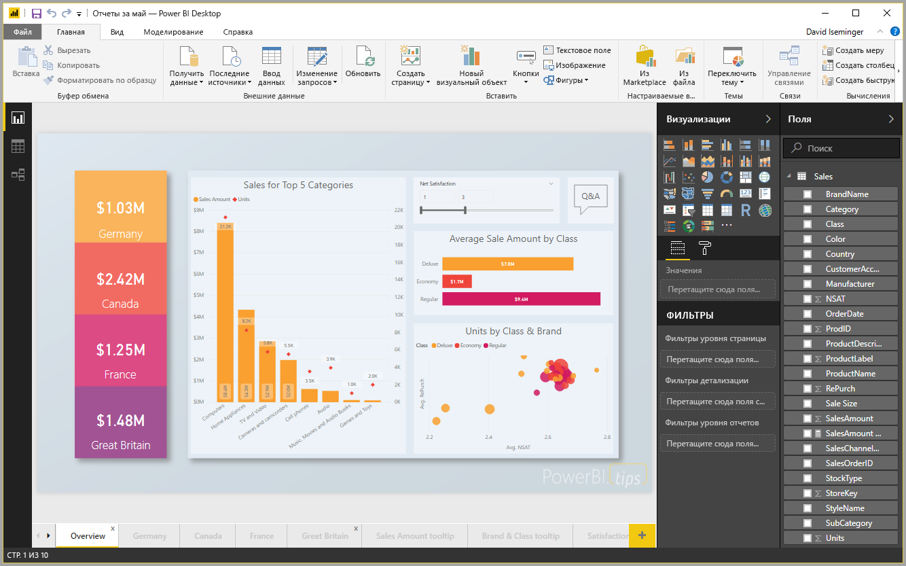

# Краткое руководство. Подключение к данным в Power BI Desktop

В этом кратком руководстве описано, как подключиться к данным с помощью **Power BI Desktop**, что является первым шагом в создании моделей данных и отчетов.

Если вы не зарегистрированы в Power BI, перед началом работы [пройдите бесплатную регистрацию](https://app.powerbi.com/signupredirect?pbi_source=web).

## Предварительные требования

Чтобы выполнить описанные в этой статье действия, вам понадобится следующее:
* Скачать и установить **Power BI Desktop** — бесплатное приложение, которое выполняется на локальном компьютере. Вы можете [скачать **Power BI Desktop**](https://powerbi.microsoft.com/desktop) напрямую или в [ **магазине Microsoft Store**](http://aka.ms/pbidesktopstore).
* [Скачайте этот пример книги Excel](http://go.microsoft.com/fwlink/?LinkID=521962) и сохраните его в папку с именем *C:\PBID-qs*, которую нужно создать дополнительно. Для всех последующих этапов краткого руководства предполагается, что вы поместили эту книгу Excel в указанное расположение.

## Запуск Power BI Desktop

После установки **Power BI Desktop** запустите это приложение, чтобы оно выполнялось на локальном компьютере. На экране вы увидите пустой холст, на котором можно создавать визуальные элементы и отчеты на основе данных, к которым вы подключитесь. 

## Подключение к данным

**Power BI Desktop** позволяет подключаться к данным разных типов. Например, вы можете подключиться к базовым источникам данных, например файлу Microsoft Excel, или Интернет-службам с данными любых типов, например Salesforce, Microsoft Dynamics, хранилищу больших двоичных объектов и многим другим. 

Для подключения к данным на ленте **Главная** выберите **Получить данные**.

Появится окно **Получить данные**, где можно выбрать любой из множества разных источников данных, поддерживаемых в **Power BI Desktop**. В этом кратком руководстве мы используем книгу Excel, которую вы скачали по инструкциям из раздела *Предварительные требования* в начале этой статьи. 

Так как это файл Excel, нужно выбрать вариант **Excel** в окне **Получение данных**, а затем нажать кнопку **Подключиться**.

Вам будет предложено указать расположение файла Excel, к которому мы хотим подключиться. Выберите скачанный ранее файл с именем *Financial Sample*, а затем нажмите кнопку **Открыть**.

**Power BI Desktop** загрузит книгу и считает ее содержимое, а затем отобразит доступные в файле данные в окне **Навигатор**, где вы можете выбрать нужные данные для загрузки в Power BI Desktop. Чтобы выбрать таблицы для импорта, отметьте их флажками. В нашем примере выбраны обе доступные таблицы.

Выбрав все нужные данные, щелкните **Загрузить** для импорта данных в Power BI Desktop.

## Просмотр данных в области "Поля"

Когда загрузка таблиц завершится, панель **Поля** отобразит полученные данные. Вы можете развернуть здесь любую таблицу, выбрав треугольник рядом с ее именем. На следующем рисунке показана развернутая таблица *finanсials* и все поля в ней. 

Вот и все! Вы подключились к данным в **Power BI Desktop**, загрузили эти данные, и теперь вы можете видеть все доступные поля в этих таблицах.

## Дальнейшие действия
**Power BI Desktop** позволяет выполнять много разных операций с подключенными данными, например создавать визуальные элементы и отчеты. См. дополнительные сведения:

* [Руководство по началу работы с Power BI Desktop](desktop-getting-started.md).

