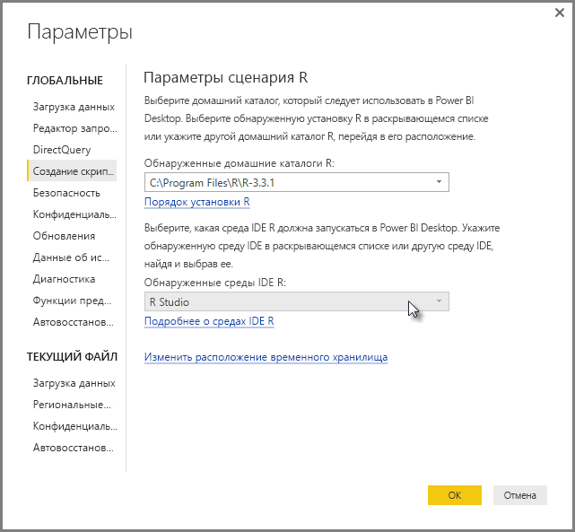

# Использование внешней среды R IDE с Power BI
В **Power BI Desktop** можно использовать внешнюю среду R IDE (интегрированная среда разработки) для создания и редактирования R-скриптов, которые затем будут использоваться в Power BI.

## Включение внешней среды R IDE
Ранее для создания и выполнения R-скриптов вам нужно было использовать редактор R-скриптов в **Power BI Desktop**. Сейчас вы можете запускать внешнюю среду R IDE из **Power BI Desktop** с автоматическим импортом и отображением данных в R IDE. Вы можете изменять скрипты во внешней среде R IDE, а затем снова добавлять их в **Power BI Desktop** для создания визуальных элементов и отчетов Power BI.

Начиная с версии **Power BI Desktop**, выпущенной в сентябре 2016 года, (версия 2.39.4526.362) можно указать, какую среду R IDE вы хотите использовать, и запустить ее автоматически из **Power BI Desktop**.

### Требования
Чтобы использовать эту функцию, необходимо установить **R IDE** на локальном компьютере. Так как в **Power BI Desktop** не предусмотрена возможность включения, развертывания или установки модуля R, вам нужно отдельно установить **R** на локальном компьютере. Используя следующие варианты, вы можете выбрать среду R IDE для использования.

* Вы можете установить свою любимую среду R IDE из доступных бесплатно, таких как [Revolution Open](https://mran.revolutionanalytics.com/download/) и [CRAN Repository](https://cran.r-project.org/bin/windows/base/).
* **Power BI Desktop** также поддерживает [R Studio](https://www.rstudio.com/) и **Visual Studio 2015** со средствами редактирования [*R для Visual Studio*](https://beta.visualstudio.com/vs/rtvs/).
* Вы можете запустить другую среду R IDE, чтобы с помощью следующих действий запустить эту **R IDE**, используя **Power BI Desktop**.
  
  * Вы можете связать файлы **.R** с внешней средой IDE, которая будет запущена с помощью **Power BI Desktop**.
  * Вы можете указать исполняемый файл, который должно запустить приложение **Power BI Desktop**. Для этого в диалоговом окне **Options** (Параметры) в разделе **R Script Options** (Параметры R-скрипта) выберите *Other* (Другие). Чтобы открыть диалоговое окно **Options** (Параметры), последовательно выбрав элементы **File > Options and settings > Options** (Файл > Параметры и настройки > Параметры).
    
    

Если вы установили нескольких сред R IDE, вы можете указать, какую из них следует запустить. Для этого выберите ее в раскрывающемся списке *Detected R IDEs* (Обнаруженные среды R IDE) в диалоговом окне **Options** (Параметры).

По умолчанию приложение **Power BI Desktop** запустит **R Studio** в качестве внешней R IDE, если она установлена на локальном компьютере. Если среда **R Studio** не установлена, но установлена **Visual Studio 2015** со **средствами R для Visual Studio**, будет запущена эта среда. Если не установлена ни одна из сред R IDE, запустится приложение, ассоциированное с файлами **.R**.

Если нет сопоставления с файлом **.R**, вы можете указать путь к пользовательской интегрированной среде разработки в разделе *Browse to your preferred R IDE* (Переход к предпочтительной R IDE) диалогового окна **Options** (Параметры). Вы также можете запустить другую среду R IDE, щелкнув значок **Settings** (Настройки) рядом со стрелкой **Launch R IDE** (Запуск R IDE) в приложении **Power BI Desktop**.

## Запуск R IDE из Power BI Desktop
Чтобы запустить R IDE из **Power BI Desktop**, сделайте следующее:

1. Загрузите данные в **Power BI Desktop**.
2. В области **Поля** выберите поля, с которыми вы собираетесь работать. Если вы еще не включили визуальные элементы скрипта, вам будет предложено сделать это.
   
   
3. Если визуальные элементы скрипта включены, вы можете выбрать визуальный элемент R в области **Визуализации**. Будет создан пустой визуальный элемент R, готовый для отображения результатов скрипта. Также отобразится область **Редактор R-скриптов**.
   
   
4. Теперь вы можете выбрать поля, которые будут использоваться в R-скрипте. Когда вы выберете поля, **Редактор R-скриптов** автоматически создаст код скрипта с учетом этого выбора. Вы можете создать (или вставить) сценарий R непосредственно в область **Редактор R-скриптов** либо же оставить этот элемент пустым.
   
   
   
   > [!NOTE]
   > По умолчанию для визуальных элементов R используется тип агрегирования *Не подводить итоги*.
   > 
   > 
5. Теперь можно запускать среду R IDE непосредственно из **Power BI Desktop**. Нажмите кнопку **запуска R-IDE** (справа от заголовка **Редактор R-скриптов**, как показано ниже).
   
   
6. Выбранная среда R IDE будет запущена службой Power BI Desktop, как показано на следующем рисунке (здесь в качестве среды R IDE по умолчанию используется **RStudio**).
   
   
   
   > [!NOTE]
   > **Power BI Desktop** добавляет первые три строки скрипта, обеспечивая возможность импорта данных из **Power BI Desktop** после запуска скрипта.
   > 
   > 
7. Любой скрипт, созданный в **области редактора R-скриптов** в **Power BI Desktop** отобразится, начиная со строки 4 среды R IDE. Теперь вы можете создавать свой сценарий R в среде R IDE. Когда R-скрипт будет выполнен в среде R IDE, его нужно скопировать и вставить обратно в область **Редактор R-скриптов** в **Power BI Desktop**, *за исключением* первых трех строк скрипта, автоматически созданных службой **Power BI Desktop**. Не следует копировать первые три строки скрипта в **Power BI Desktop**, так как эти строки предназначены только для импорта данных в R IDE из **Power BI Desktop**.

### Известные ограничения
При запуске среды R IDE непосредственно из Power BI Desktop действуют следующие ограничения.

* Автоматический экспорт скрипта из R IDE в **Power BI Desktop** не поддерживается.
* Редактор **R Client** (RGui.exe) не поддерживается, так как сам редактор не поддерживает открытие файлов.

## Дальнейшие действия
Ознакомьтесь с дополнительными материалами по R в Power BI.

* [Выполнение сценариев R в Power BI Desktop](desktop-r-scripts.md)
* [Создание визуальных элементов Power BI с помощью R](desktop-r-visuals.md)

