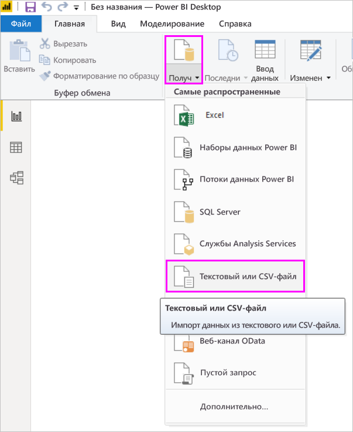
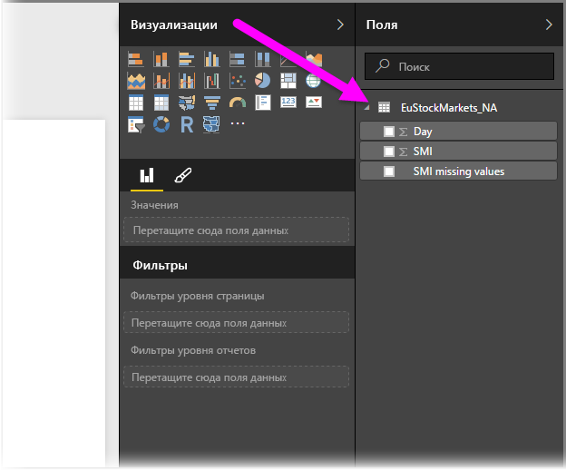
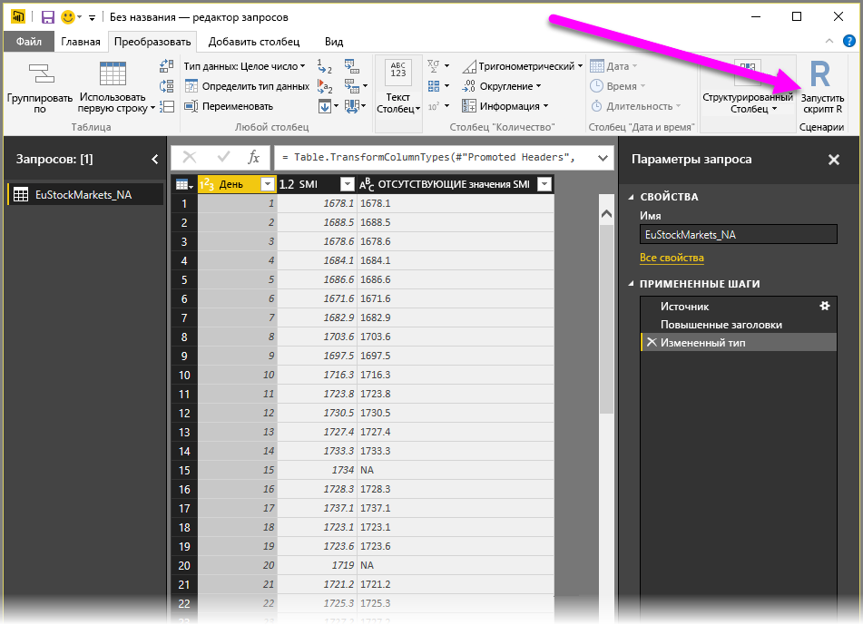
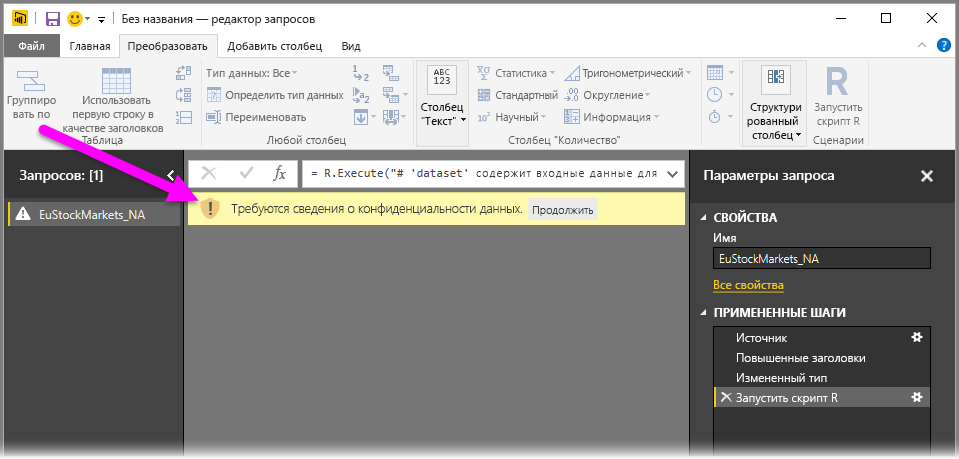
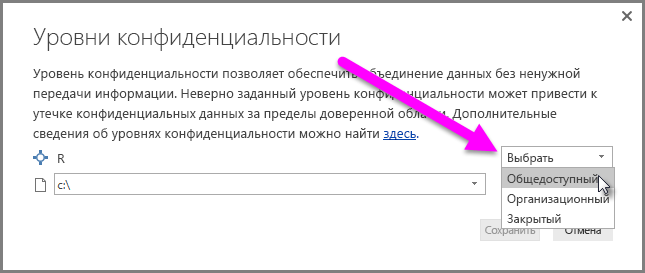
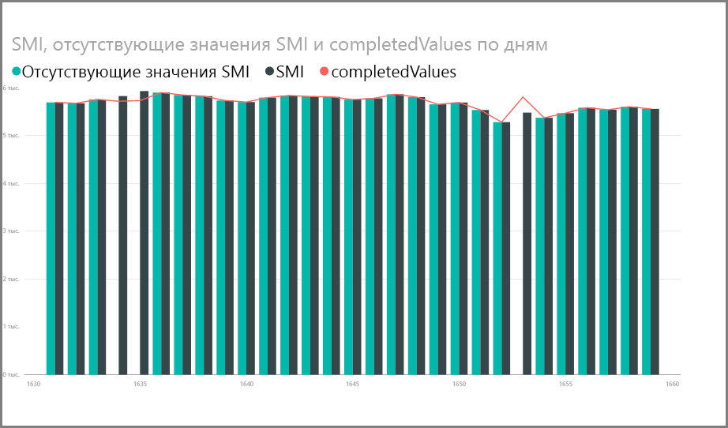
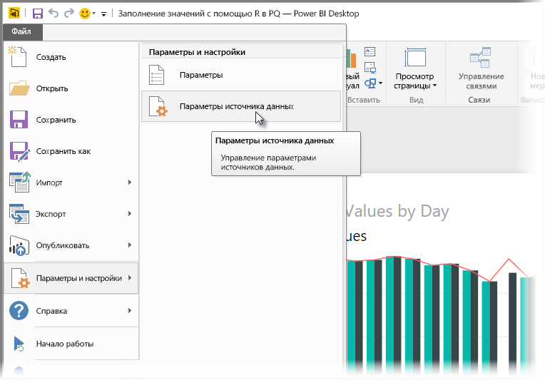
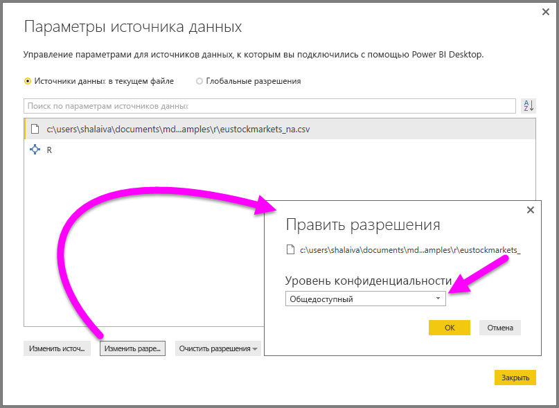

# <a name="use-r-in-power-query-editor"></a>Использование языка R в редакторе Power Query

[Язык R](https://mran.microsoft.com/documents/what-is-r) — это многофункциональный язык программирования, который широко применяют специалисты по статистике, аналитики и специалисты по обработке данных. Его можно использовать в редакторе Power Query в Power BI Desktop для выполнения следующих задач.

* Подготовка моделей данных.

* Создание отчетов.

* Очистка данных, расширенное формирование данных и аналитика набора данных, включая завершение отсутствующих данных, прогнозирование, кластеризацию и многое другое.  

## <a name="install-r"></a>Установка скрипта R

Вы можете бесплатно скачать R на странице скачивания [Revolution R Open](https://mran.revolutionanalytics.com/download/) и в [репозитории CRAN](https://cran.r-project.org/bin/windows/base/).

## <a name="install-mice"></a>Установка mice

В качестве необходимого компонента необходимо установить библиотеку [mice](https://www.rdocumentation.org/packages/mice/versions/3.5.0/topics/mice) в среде R. Без нее этот код примера сценария работает неправильно. Пакет mice реализует метод для обработки отсутствующих данных.

Чтобы установить библиотеку mice, выполните следующие действия.

1. Запустите программу R.exe (например, C:\Program Files\Microsoft\R Open\R-3.5.3\bin\R.exe).  

2. Выполните команду установки из командной строки R:

   ``` 
   install.packages('mice') 
   ```

## <a name="use-r-in-power-query-editor"></a>Использование языка R в редакторе Power Query

Чтобы продемонстрировать использование R в редакторе Power Query, мы воспользуемся примером набора данных фондовой биржи из CSV-файла и выполним следующие действия.

1. [Скачайте файл EuStockMarkets_NA.csv](https://download.microsoft.com/download/F/8/A/F8AA9DC9-8545-4AAE-9305-27AD1D01DC03/EuStockMarkets_NA.csv). Запомните, куда вы его сохраняете.

1. Загрузите данные из файла в Power BI Desktop. На вкладке **Главная** выберите пункт **Получить данные** > **Текстовый или CSV-файл**.

   

1. Выберите файл EuStockMarkets_NA.csv, а затем выберите команду **Открыть**. CSV-данные отображаются в диалоговом окне **Текстовый или CSV-файл**.

   

1. Выберите **Загрузить**, чтобы загрузить данные из файла. После того как Power BI загрузит данные, в области **Поля** появится новая таблица.

   

1. Чтобы открыть редактор Power Query, на вкладке **Главная** ленты выберите **Изменить запросы**.

   

1. На вкладке **Преобразование** ленты нажмите кнопку **Запустить скрипт R**. Откроется редактор **Запуск сценария R**. В строках 15 и 20 отсутствуют данные, как и в других строках, которых не видно на изображении. В инструкциях ниже показано, как язык R заполняет эти строки.

   

1. В этом примере введите следующий код скрипта в поле **Скрипт** окна **Запуск сценария R**. Замените *&lt;Your File Path&gt;* (Ваш путь к файлу) на путь к файлу EuStockMarkets_NA.csv в локальной файловой системе, например C:/Users/John Doe/Documents/Microsoft/EuStockMarkets_NA.csv.

    ```r
       dataset <- read.csv(file="<Your File Path>/EuStockMarkets_NA.csv", header=TRUE, sep=",")
       library(mice)
       tempData <- mice(dataset,m=1,maxit=50,meth='pmm',seed=100)
       completedData <- complete(tempData,1)
       output <- dataset
       output$completedValues <- completedData$"SMI missing values"
    ```

    > [!NOTE]
    > Может потребоваться перезаписать переменную с именем *output*, чтобы правильно создать набор данных с примененными фильтрами.

7. Выберите **ОК**. В редакторе Power Query появится предупреждение о конфиденциальности данных.

   
8. В сообщении с предупреждением выберите **Продолжить**. В появившемся диалоговом окне **Уровни конфиденциальности** установите для всех источников данных значение **Общедоступные**, чтобы скрипты R правильно работали в службе Power BI. 

   

   Дополнительные сведения о параметрах конфиденциальности и результатах их использования см. в статье об [уровнях конфиденциальности Power BI Desktop](desktop-privacy-levels.md).

 9. Нажмите кнопку **Создать**, чтобы выполнить скрипт. 

   Обратите внимание на новый столбец **completedValues** в области **Поля**. В столбце отсутствует несколько элементов данных, например в строках 15 и 18. Следующий раздел описывает, как язык R обрабатывает эти строки.

   Используя только пять строк скрипта R, редактор Power Query заполнит отсутствующие значения с помощью прогнозной модели.

## <a name="create-visuals-from-r-script-data"></a>Создание визуальных элементов с использованием данных сценария R

Теперь можно создать визуальный элемент, чтобы увидеть, как код сценария R с библиотекой mice дополняет отсутствующие значения.



Можно сохранить все готовые визуальные элементы в одном PBIX-файле Power BI Desktop и использовать модель данных и ее сценарии R в службе Power BI.

> [!NOTE]
> Вы можете [скачать PBIX-файл](https://download.microsoft.com/download/F/8/A/F8AA9DC9-8545-4AAE-9305-27AD1D01DC03/Complete%20Values%20with%20R%20in%20PQ.pbix), где все эти действия уже выполнены.

После отправки PBIX-файла в службу Power BI нужно выполнить дополнительные действия для включения обновления данных службы и обновленных визуальных элементов.  

* **Включить запланированное обновление для набора данных**. Сведения о включении запланированного обновления книги, содержащей набор данных, с помощью скриптов R см. в разделе [Настройка запланированного обновления](refresh-scheduled-refresh.md). В этой статье также содержатся сведения о персональных шлюзах.

* **Установить персональный шлюз**. Установите персональный шлюз на компьютере, где находятся файл и R. Служба Power BI обращается к этой книге и повторно отрисовывает все обновленные визуальные элементы. Дополнительные сведения см. в разделе [Использование персональных шлюзов в Power BI](service-gateway-personal-mode.md).

## <a name="limitations"></a>Ограничения

Существуют ограничения на запросы, включающие сценарии R, которые созданы в редакторе Power Query.

* Все параметры источника данных R должны быть **общедоступными**. Все остальные действия в запросе редактора Power Query также должны быть общедоступными. 

   Чтобы открыть параметры источника данных, в Power BI Desktop выберите пункты меню **Файл** > **Параметры и настройки** > **Параметры источника данных**.

   

   В диалоговом окне **Параметры источника данных** выберите источники данных, а затем щелкните **Изменить разрешения**. Задайте для параметра **Уровень конфиденциальности** значение **Общедоступный**.

     
  
* Чтобы запланировать обновление визуальных объектов или набора данных R, включите запланированное обновление и установите персональный шлюз на компьютере с книгой и R. 

С помощью R и настраиваемых запросов можно выполнять самые разнообразные действия. Просматривайте и упорядочивайте данные так, как они должны отображаться.

## <a name="next-steps"></a>Следующие шаги

* [Введение в R](https://mran.microsoft.com/documents/what-is-r) 

* [Выполнение скриптов R в Power BI Desktop](desktop-r-scripts.md) 

* [Использование внешней среды R IDE с Power BI](desktop-r-ide.md) 

* [Создание визуальных элементов с помощью пакетов R в службе Power BI](service-r-packages-support.md)
