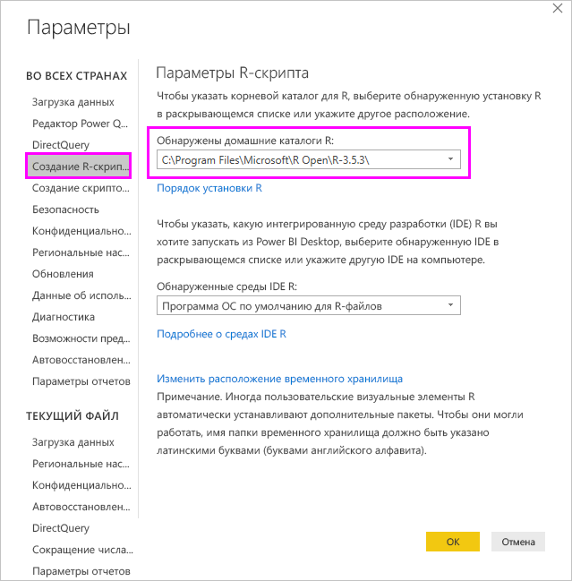
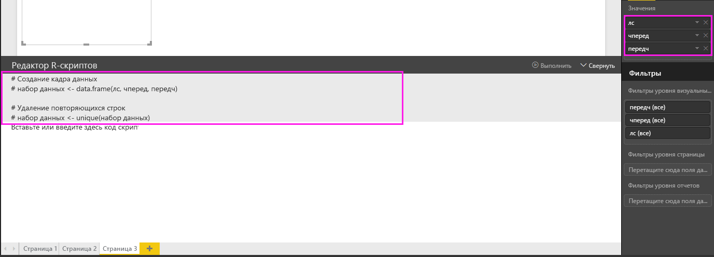

# Создание визуальных элементов Power BI с помощью R
В приложении **Power BI Desktop** для наглядного представления данных можно использовать **R**.

## Установка скрипта R
Модуль **R** не входит в состав приложения **Power BI Desktop**, не развертывается и не устанавливается вместе с ним. Для выполнения R-скриптов в приложении **Power BI Desktop** необходимо отдельно установить компоненты **R** на локальном компьютере. Вы можете скачать и установить **R** бесплатно из различных расположений, включая [страницу скачивания Revolution Open](https://mran.revolutionanalytics.com/download/) и [репозиторий CRAN](https://cran.r-project.org/bin/windows/base/). В текущем выпуске R-скриптов в **Power BI Desktop** в пути установки поддерживаются символы Юникода, а также пробелы (пустые символы).

## Включение визуальных элементов R
Чтобы включить визуальные элементы R, выберите **Файл > Параметры и настройки > Параметры**, а затем на странице **Параметры** убедитесь, что в разделе **Создание R-скриптов** окна **Параметры** указаны сведения об установленной у вас локально версии R, как показано на рисунке ниже. На рисунке ниже в текстовом поле явно указан путь к установленной версии R: **C:\Program Files\R\R-3.2.0** . Путь должен соответствовать расположению каталога с локальной установленной версией R, которая будет использоваться службой **Power BI Desktop**.
   
   

После указания установленной версии R все готово к созданию визуальных элементов R.

## Создание визуальных элементов R в приложении Power BI Desktop
1. Выберите значок **R Visual** (Визуальный элемент R) в области **Визуализация**, как показано на следующем рисунке, чтобы добавить визуальный элемент R.
   
   

   При добавлении в отчет визуального элемента R в **Power BI Desktop** выполняются перечисленные ниже действия:
   
   - На холсте отчета появляется изображение заполнителя для визуального элемента R.
   
   - В нижней части центральной области открывается **редактор R-скриптов**.
   
   

2. Теперь в раздел **Значения** в области **Поля** необходимо добавить поля, которые будут использоваться в R-скрипте, как и для любого другого визуального элемента **Power BI Desktop**. 
    
    Только поля, добавленные в список **Поля**, можно использовать в скриптах R. При работе в **редакторе R-скриптов Power BI Desktop** вы можете добавлять в область **Поля** новые поля и удалять ненужные. **Power BI Desktop** автоматически определяет, какие поля были добавлены или удалены.
   
   > [!NOTE]
   > По умолчанию для визуальных элементов R используется тип агрегирования *Не подводить итоги*.
   > 
   > 
   
3. Теперь выбранные данные можно использовать для создания визуализации. 

    При выборе полей **редактор R-скриптов** создает для них связующий код скрипта в серой области вверху области редактора. При выборе и удалении полей соответствующим образом автоматически создается и удаляется связующий код в редакторе R-скриптов.
   
   В примере, показанном на изображении ниже, выбраны три поля: hp, gear и drat. В результате редактор создал следующий связующий код:
   
   * Был создан кадр данных под названием **набор данных** .
     * Кадр данных состоит из различных полей, выбранных пользователем.
   * По умолчанию используется тип агрегирования *Не суммировать*.
   * Аналогично визуальным элементам таблиц, поля сгруппированы, а одинаковые строки отображаются только один раз.
   
   
   
   > [!TIP]
   > В определенных случаях автоматическая группировка не нужна либо нужно, чтобы отображались все строки, в том числе одинаковые. В такой ситуации в набор данных можно добавить индексное поле, в результате чего все строки будут считаться уникальными и не будут объединяться в группы.
   > 
   > 
   
   Созданный кадр данных называется **dataset**, и к выбранным столбцам можно обращаться по соответствующим именам. Например, чтобы обратиться к полю gear в редакторе R-скриптов, введите *dataset$gear*. Имена полей, содержащие пробелы или специальные символы, следует заключать в одинарные кавычки.

4. После автоматического создания кадра данных с выбранными полями можно написать сценарий R, который строит визуализацию на устройстве R по умолчанию. Составив скрипт, выберите **Выполнить** в строке заголовка **редактора R-скриптов** (кнопка**Выполнить** находится в правой части этой строки).
   
    В режиме **выполнения** **Power BI Desktop** определяет структуру и наносит ее на холст. Так как эта процедура выполняется в локальной среде R, необходимо установить все необходимые пакеты.
   
   **Power BI Desktop** выполняет повторное нанесение структуры визуального элемента каждый раз, когда:
   
   * вы нажимаете кнопку **Выполнить** в строке заголовка **Редактор R-скриптов**;
   * происходит изменение данных (в результате обновления, применения фильтра или выделения).

     На изображении ниже показан пример кода, выполняющего построение корреляционной диаграммы: на визуализации представлены связи между атрибутами различных типов автомобилей.

     

5. Чтобы увеличить область визуализации, можно свернуть **редактор R-скриптов**. И, как и при работе с другими визуальными элементами в **Power BI Desktop**, в корреляционной структуре можно выполнять перекрестную фильтрацию, например, выбрать только спортивные автомобили в визуальном элементе "Кольцо" (на изображении выше — круглый элемент справа).

    

6. В R-скрипт также можно внести изменения для настройки визуального элемента, в том числе путем добавления параметров R в команду построения диаграммы.

    В исходном виде команда построения диаграммы выглядит так:

    corrplot(M, method = "color",  tl.cex=0.6, tl.srt = 45, tl.col = "black")

    После несколько изменений R-скрипта команда принимает следующий вид:

    corrplot(M, method = "circle", tl.cex=0.6, tl.srt = 45, tl.col = "black", type= "upper", order="hclust")

    В результате визуальные элементы R на диаграмме выглядят как круги, при этом учитывается только верхняя половина значений, а порядок элементов в матрице изменен таким образом, чтобы сгруппировать связанные атрибуты, как показано на изображении ниже.

    

    Если при выполнении R-скрипта возникает ошибка, визуальный элемент R не наносится на диаграмму, а на холсте появляется сообщение об ошибке. Чтобы **просмотреть подробные сведения** об этой ошибке, выберите соответствующую команду в сообщении на холсте.

    

    > **Безопасность R-скриптов**. Визуальные элементы R создаются на основе скриптов R, которые могут содержать код, не обеспечивающий достаточный уровень безопасности или конфиденциальности. При первой попытке просмотра визуальных элементов R или взаимодействия с ними пользователь видит предупреждение системы безопасности. Включайте визуальные элементы R, только если доверяете автору и источнику либо после проверки и ознакомления со сценариями R.
    > 
    > 

## Известные ограничения
У визуальных элементов R в **Power BI Desktop** имеется несколько ограничений.

* Ограничения на размер данных: для нанесения на холст визуальный элемент R может использовать до 150 000 строк. Если выбрано больше строк, используются только первые 150 000 из них; при этом на изображении появляется соответствующее сообщение.
* Ограничение на время вычисления: если время вычисления для визуального элемента R превышает пять минут, истекает время ожидания выполнения и возникает ошибка.
* Связи: как и при работе с другими визуальными элементами Power BI Desktop, при выборе полей данных из разных таблиц, между которыми не определены связи, возникает ошибка.
* Визуальные элементы R обновляются при обновлении данных, применении фильтрации и выделения. Однако само изображение не является интерактивным и не может служить источником для перекрестной фильтрации.
* Визуальные элементы R реагируют на выделение других визуальных элементов, однако выполнять перекрестную фильтрацию, выбирая объекты на визуальном элементе R, нельзя.
* На холсте правильно отображаются только визуализации, построение которых выполняется на устройстве отображения R по умолчанию. Не рекомендуется указывать явным образом другое устройство отображения R.
* В этом выпуске установленные экземпляры RRO не распознаются автоматически 32-разрядной версией Power BI Desktop, поэтому необходимо вручную указать путь к каталогу установки R в разделе **Параметры и настройки > Параметры > Создание R-скриптов**.

## Дальнейшие действия
Ознакомьтесь с дополнительными материалами по R в Power BI.

* [Выполнение сценариев R в Power BI Desktop](desktop-r-scripts.md)
* [Использование внешней среды R IDE с Power BI](desktop-r-ide.md)

