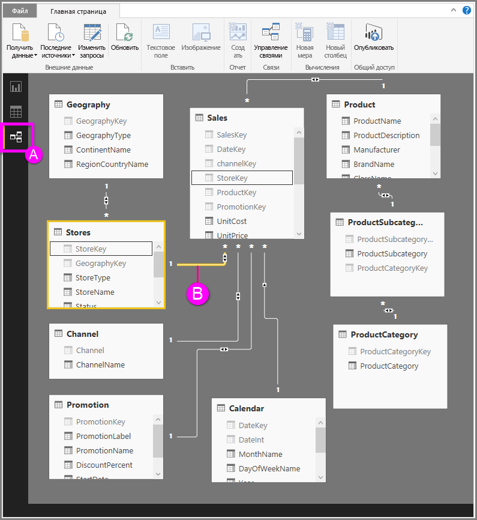

# Представление связей в Power BI Desktop
**Представление связей** показывает все таблицы, столбцы и связи в модели. Это может быть особенно удобно, если модель содержит сложные связи между большим количеством таблиц.

Давайте взглянем подробнее.

**A.**  Значок представления связей — щелкните для отображения своей модели в представлении связей.

**B.** Связь — можно навести на связь курсор для отображения используемых столбцов. Дважды щелкните связь, чтобы открыть ее в диалоговом окне **Изменение связи**. 

На приведенном выше рисунке видно, что таблица *Stores* имеет столбец *StoreKey*, связанный с таблицей *Sales*, которая также имеет столбец *StoreKey*. Мы видим, что это связь *многие к одному* (\*:1), а значок в середине линии показывает, что направление перекрестной фильтрации задано в *обе* стороны. Стрелка на значке показывает направление потока контекста фильтра.

Дополнительные сведения о связях см. в разделе [Создание связей и управление ими в Power BI Desktop](desktop-create-and-manage-relationships.md).

