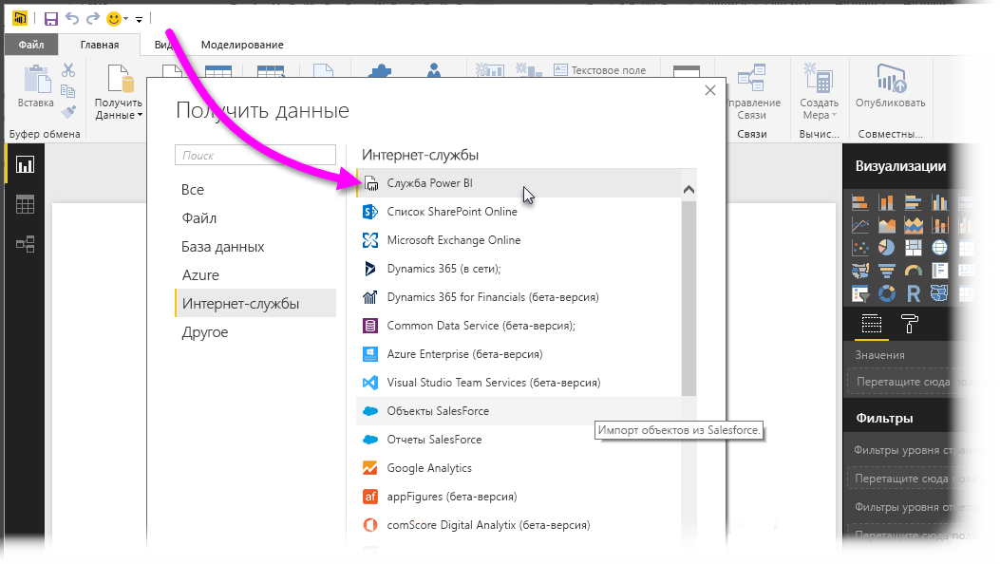
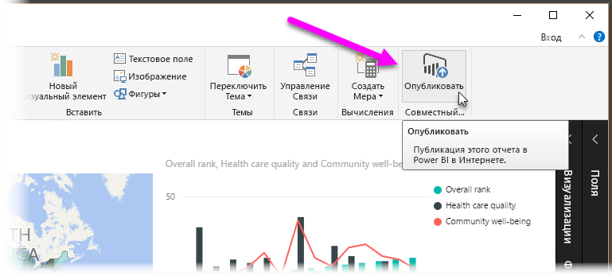
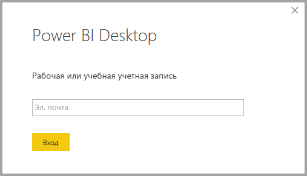
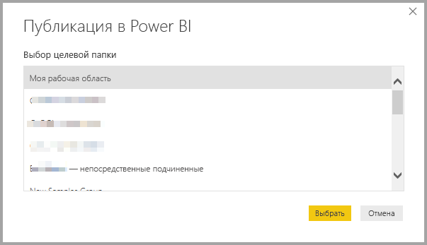
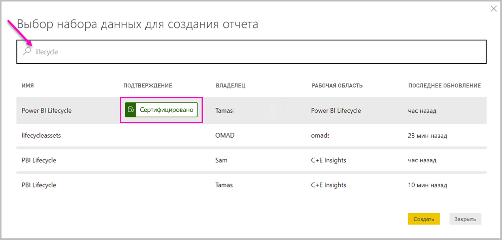
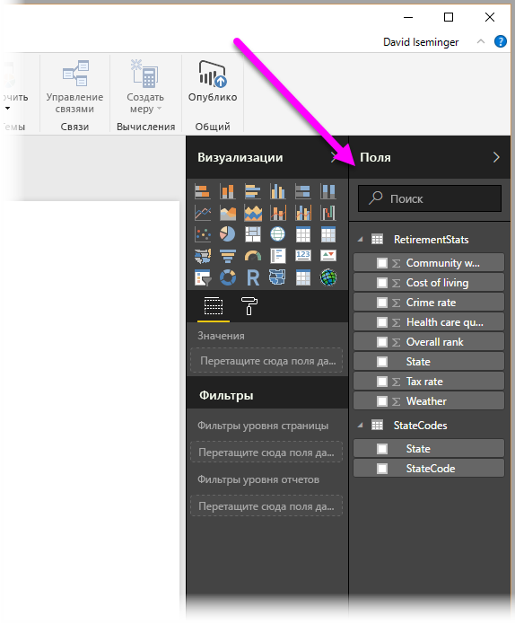

# Подключение к наборам данных в службе Power BI из приложения Power BI Desktop

Вы можете устанавливать динамическое подключение к общему набору данных в *службе Power BI* и создавать различные отчеты из одного набора данных. Вы можете создать идеальную модель данных в Power BI Desktop и опубликовать ее в службе Power BI. После этого вы и другие пользователи сможете создать несколько разных отчетов в отдельных *PBIX*-файлах на основе общей модели и сохранить их в разных рабочих областях. Это называется *динамическим подключением в службе Power BI*.

Эта функция предоставляет множество преимуществ, включая возможности, которые мы обсудим в этой статье. Мы рекомендуем ознакомиться с [рекомендациями и ограничениями](#limitations-and-considerations) этой функции.

## Использование динамического подключения в службе Power BI для управления жизненным циклом отчета

Одной из проблем, связанных с популярностью Power BI, является широкое распространение отчетов, панелей мониторинга и их основных моделей данных. Каждый может легко создавать качественные отчеты в Power BI Desktop, а затем [публиковать их](desktop-upload-desktop-files.md) в службе Power BI и создавать отличные панели мониторинга на основе этих наборов данных. Так как многие пользователи делают это, часто используя один и тот же (или сходный) набор данных, очень трудно определить связь между отчетом и набором данных, а также то, насколько этот набор данных актуален. Динамическое подключение в службе Power BI решает эту проблему и упрощает согласованное создание, предоставление общего доступа и распространение отчетов, основанных на общих наборах данных.

### Создание набора данных, который могут использовать все, и предоставление общего доступа к нему

Предположим, Анна (бизнес-аналитик) работает в вашей команде. Анна умеет создавать отличные модели данных, часто называемые наборами данных. Анна может создать набор данных и отчет, а затем предоставить доступ к нему в службе Power BI.

Всем нравятся ее отчет и набор данных. И тут появляется проблема. Все ее коллеги пытаются создать *собственную версию* этого набора данных, чтобы предоставить затем команде доступ к собственным отчетам. Внезапно в рабочей области команды в службе Power BI появляется множество отчетов, созданных на основе разных наборов данных. Какой отчет был создан последним? Использовался ли один и тот же набор данных или это были сходные наборы данных? Чем отличаются эти отчеты? Благодаря функции динамического подключения в службе Power BI все выглядит иначе. В следующем разделе мы рассмотрим, как другие пользователи могут использовать не только опубликованный Анной набор данных для своих собственных отчетов в своих рабочих областях, но и одни и те же цельные проверенные и опубликованные наборы данных для создания уникальных отчетов.

### Подключение к набору данных службы Power BI с помощью динамического подключения

Анна создает отчет и набор данных, на котором он основан. Затем Анна публикует его в службу Power BI. Теперь отчет отображается в рабочей области команды в службе Power BI. Анна сохраняет его в *новом интерфейсе рабочей области*. Она может задать *разрешение на сборку*, чтобы все пользователи в ее рабочей области и вне ее могли просматривать и использовать этот отчет.

Дополнительные сведения о новом интерфейсе рабочих областей см. в статье [Рабочие области](service-new-workspaces.md).

Другие участники в рабочей области Анны и вне ее теперь смогут установить динамическое подключение к общей модели данных Анны, используя функцию динамического подключения в службе Power BI. Они могут создавать собственные уникальные отчеты на основе *исходного набора данных* в *их собственных рабочих областях*.

На следующем рисунке можно увидеть, как Анна создает один отчет Power BI Desktop и публикует его (вместе с моделью данных) в службе Power BI. Другие пользователи могут подключаться к ее модели данных с помощью динамического подключения в службе Power BI, чтобы создавать собственные уникальные отчеты в своих рабочих областях на основе ее набора данных.

> [!NOTE]
> При сохранении набора данных в [классической общей рабочей области](service-create-workspaces.md) только ее участники могут создавать отчеты на базе вашего набора данных. Чтобы установить динамическое подключение в службе Power BI, в рабочей области, участником которой вы являетесь, должен быть предоставлен общий доступ к набору данных, к которому вы подключаетесь.
> 
> 

## Пошаговое руководство по использованию динамического подключения в службе Power BI

Теперь, когда мы знаем, насколько полезно динамическое подключение к службе Power BI, и как его можно использовать для управления жизненным циклом отчета, рассмотрим пошаговое руководство, которое поможет нам извлечь прекрасный отчет Анны (и набор данных) в общий набор данных, который смогут использовать ее коллеги в Power BI.

### Публикация отчета Power BI и набора данных

Первым шагом в управлении жизненным циклом отчета с помощью динамического подключения в службе Power BI будет получение отчета (и набора данных), который хотят использовать коллеги. Поэтому Анна сначала должна *опубликовать* свой отчет из Power BI Desktop. Выберите **Опубликовать** на ленте **Главная** в Power BI Desktop.

Если она не вошла в свою учетную запись службы Power BI, то служба Power BI предложит ей сделать это.

После этого она может выбрать целевую рабочую область, в которой будут опубликованы отчет и набор данных. Помните, если она сохраняет его в новом интерфейсе рабочих областей, любой пользователь с разрешением "Сборка" может получить доступ к этому набору данных. Разрешение "Сборка" задается в службе Power BI после публикации. Если она сохраняет его в классической рабочей области, только участники с доступом к рабочей области, в которой публикуется отчет, имеют доступ к его набору данных благодаря динамическому подключению к службе Power BI.

Начинается процесс публикации, и в Power BI Desktop отображается ход выполнения.

После завершения приложение Power BI Desktop сообщает об успешном выполнении и отображает несколько ссылок, по которым вы можете получить отчет в службе Power BI и ссылку на подробности отчета.

Теперь, когда ваш отчет с его набором данных находится в службе Power BI, вы также можете *повысить его уровень*. Это означает, что вы подтверждаете его качество и надежность. Вы даже можете запросить, чтобы он был *сертифицирован* центром в вашем клиенте Power BI. При наличии любого из таких подтверждений набор данных всегда будет отображаться в начале списка, когда люди ищут наборы данных. Дополнительные сведения см. в статье [Повышение уровня набора данных (предварительная версия)](service-datasets-promote.md).

Последним шагом является установка разрешения "Сборка" для набора данных, на котором основан отчет. Разрешение "Сборка" определяет, кто может видеть и использовать набор данных. Вы можете задать его в самой рабочей области либо при предоставлении приложения для общего доступа из рабочей области. Дополнительные сведения см. в статье [Разрешение на сборку для общих наборов данных (предварительная версия)](service-datasets-build-permissions.md).

Теперь рассмотрим, как другие участники команды с доступом к рабочей области, в которой опубликованы отчет и набор данных, могут подключаться к набору данных и создавать собственные отчеты.

### Установление динамического подключения в службе Power BI к опубликованному набору данных

Чтобы установить подключение к опубликованному отчету и создать собственный отчет на основе опубликованного набора данных, выберите **Получить данные** на ленте **Главная** в Power BI Desktop, выберите **Power Platform** в левой области, а затем — **Наборы данных Power BI**.

Если вы не вошли в систему, Power BI предложит сделать это. После входа Power BI отобразит рабочие области, участником которых вы являетесь. Вы можете выбрать рабочую область, содержащую набор данных, к которому необходимо установить динамическое подключение службы Power BI.

Наборы данных в списке представляют собой все общие наборы данных, для которых у вас задано разрешение "Сборка", в любой рабочей области. Вы можете найти конкретный набор данных и просмотреть его имя, владельца, рабочую область, где он находится, а также время его последнего обновления. В начале списка также отображается **ОДОБРЕНИЕ** для наборов данных, для которых была выполнена сертификация или повышение уровня.

Выбирая команду **Создать**, вы устанавливаете динамическое подключение к выбранному набору данных. Power BI Desktop загружает поля и их значения, которые отображаются в Power BI Desktop в режиме реального времени.

Теперь вы и другие пользователи можете создавать и совместно использовать пользовательские отчеты из одного набора данных. Очень удобно, когда один знающий человек создает набор данных правильного формата. Многие коллеги могут использовать этот общий набор данных для создания собственных отчетов.

## Рекомендации и ограничения

При использовании динамического подключения в службе Power BI применяется ряд ограничений и рекомендаций.

* Подключаться к опубликованному набору данных с помощью динамического подключения в службе Power BI могут только пользователи, имеющие разрешение "Сборка" для этого набора.
* Пользователи бесплатной версии видят только наборы данных из раздела **Моя рабочая область** и из рабочих областей Premium.
* Так как это динамическое подключение, навигация слева и моделирование отключены. В каждом отчете можно подключаться только к одному набору данных. Такое поведение аналогично поведению при подключении к *SQL Server Analysis Services*.
* Так как это динамическое подключение, применяются безопасность на уровне строк (RLS) и другое подобное поведение при подключении, как и при подключении к SQL Server Analysis Services.
* Если владелец изменяет исходный PBIX-файл, общий набор данных и отчет, к которым предоставлен доступ в *службе Power BI*, перезаписываются. Отчеты, основанные на этом наборе данных, не перезаписываются, но любые изменения в наборе данных отражаются в отчете.
* Участники рабочей области не могут заменить исходный общий отчет. При попытке сделать это появится предупреждение, предлагающее переименовать и опубликовать файл.
* При удалении общего набора данных в службе Power BI основанные на нем отчеты больше не будут работать правильно или отображать свои визуальные элементы.
* Чтобы получить содержимое пакетов, необходимо сначала создать копию пакета содержимого перед его использованием в качестве основы для совместного использования отчета PBIX и набора данных в *службы Power BI*.
* После копирования пакетов содержимого в разделе *Моя организация* нельзя заменить отчет, созданный в службе, или отчет, созданный в процессе копирования содержимого пакета с применением динамического подключения. При попытке сделать это появится предупреждение, предлагающее переименовать и опубликовать файл. В этом случае можно заменить только отчеты, опубликованные с применением динамического подключения.
* После удаления общего набора данных в службе Power BI получить доступ к нему из Power BI Desktop будет невозможно.
* Отчеты с общим набором данных в службе Power BI не поддерживают автоматические развертывания с помощью REST API для Power BI.
