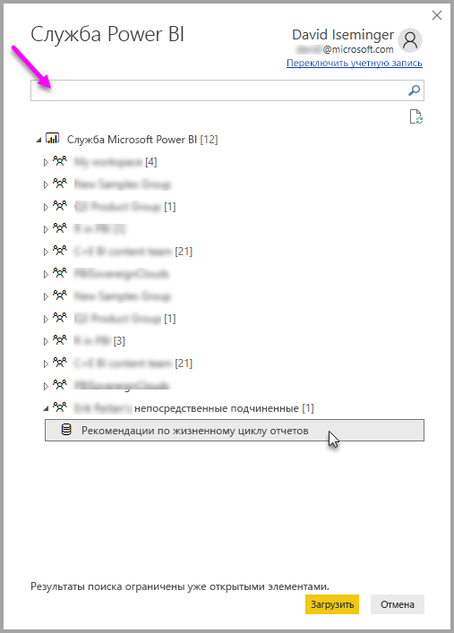

# Подключение к наборам данных в службе Power BI из приложения Power BI Desktop
Вы можете устанавливать динамическое подключение к общему набору данных в службе Power BI и создавать различные отчеты из одного набора данных. Это означает, что вы можете создать идеальную модель данных в Power BI Desktop и опубликовать ее в службе Power BI. После этого вы и другие пользователи сможете создавать несколько разных отчетов (в отдельных PBIX-файлах) на основе одной и той же общей модели. Это называется **динамическим подключением в службе Power BI**.

Эта функция предоставляет множество преимуществ, включая возможности, которые мы обсудим в этой статье. Для этой функции существуют также некоторые рекомендации и ограничения. Обязательно ознакомьтесь с ними в конце этой статьи.

## Использование динамического подключения в службе Power BI для управления жизненным циклом отчета
Одной из проблем, связанных с популярностью Power BI, является широкое распространение отчетов, панелей мониторинга и их основных моделей данных. Вот почему это происходит: каждый может легко создавать качественные отчеты в **Power BI Desktop**, затем предоставлять доступ к ним ([публиковать их](desktop-upload-desktop-files.md)) в **службе Power BI** и создавать отличные панели мониторинга на основе этих наборов данных. Так как многие пользователи делают это, часто используя один и тот же (или сходный) набор данных, очень трудно определить связь между отчетом и набором данных, а также то, насколько этот набор данных актуален. **Динамическое подключение в службе Power BI** решает эту проблему и упрощает согласованное создание, предоставление общего доступа и распространение отчетов, основанных на общих наборах данных.

### Создание набора данных, который могут использовать все, и предоставление общего доступа к нему
Предположим, Анна (бизнес-аналитик) работает в вашей команде. Она умеет создавать отличные модели данных (часто называемые наборами данных). Используя свой опыт, Анна может создать набор данных и отчет, а затем предоставить доступ к нем в **службе Power BI**.

Всем нравятся ее отчет и набор данных. И тут появляется проблема: все ее коллеги пытаются создать *собственную версию* этого набора данных, чтобы предоставить затем команде доступ к собственным отчетам. Внезапно в рабочей области команды в **службе Power BI** появляется множество отчетов, созданных на основе разных наборов данных. Какой отчет был создан последним? Использовался ли один и тот же набор данных или это были сходные наборы данных? Чем отличаются эти отчеты? Благодаря функции **динамического подключения в службе Power BI** все выглядит иначе. В следующем разделе мы рассмотрим, как другие пользователи могут использовать не только опубликованный Анной набор данных для своих собственных отчетов, но и одни и те же цельные проверенные и опубликованные наборы данных для создания уникальных отчетов.

### Подключение к набору данных службы Power BI с помощью динамического подключения
Когда Анна создаст отчет (и создает набор данных, на котором он основан) и опубликует его в **службе Power BI**, он отобразится в рабочей области ее команды в службе Power BI. Теперь все пользователи ее рабочей области смогут просматривать и использовать этот отчет.

Другие участники этой рабочей области теперь смогут установить динамическое подключение к общей модели данных Анны, используя функцию **динамического подключения в службе Power BI**, и создавать собственные уникальные отчеты на основе *ее исходного набора данных*.

На следующем рисунке можно увидеть, как Анна создает один отчет **Power BI Desktop** и публикует его (вместе с моделью данных) в **службе Power BI**. Другие пользователи в ее рабочей области могут подключаться к ее модели данных с помощью **динамического подключения в службе Power BI**, чтобы создавать собственные уникальные отчеты на основе ее набора данных.

> [!NOTE]
> К набору данных можно предоставить общий доступ только в одной рабочей области. Чтобы установить динамическое подключение в службе Power BI, в рабочей области, участником которой вы являетесь, должен быть предоставлен общий доступ к набору данных, к которому вы подключаетесь.
> 
> 

## Пошаговое руководство по использованию динамического подключения в службе Power BI
Теперь когда мы знаем, насколько полезно **динамическое подключение к службе Power BI**, и как его можно использовать для управления жизненным циклом отчета, рассмотрим пошаговое руководство, которое поможет нам извлечь прекрасный отчет Анны (и набор данных) в общий набор данных, который смогут использовать коллеги в ее рабочей области в Power BI.

### Публикация отчета Power BI и набора данных
Первым шагом в управлении жизненным циклом отчета с помощью **динамического подключения в службе Power BI** будет получение отчета (и набора данных), который хотят использовать коллеги. Поэтому Анна сначала должна **опубликовать** свой отчет из **Power BI Desktop**. Для этого она должна выбрать команду **Опубликовать** на вкладке ленты **Главная** в Power BI Desktop.

Если она не вошла в свою учетную запись службы Power BI, ей будет предложено сделать это.

После этого она может выбрать целевую рабочую область, в которой будут опубликованы отчет и набор данных. Помните: только участники с доступом к рабочей области, в которой публикуется отчет, имеют доступ к его набору данных благодаря **динамическому подключению к службе Power BI**.

Начинается процесс публикации, и в **Power BI Desktop** отображается ход выполнения.

После завершения приложение **Power BI Desktop** сообщает об успешном выполнении и отображает несколько ссылок, по которым вы можете получить отчет в **службе Power BI** и ссылку на **подробности** отчета.

Теперь рассмотрим, как другие участники команды с доступом к рабочей области, в которой опубликованы отчет и набор данных, могут подключаться к набору данных и создавать собственные отчеты.

### Установление динамического подключения в службе Power BI к опубликованному набору данных
Чтобы установить подключение к опубликованному отчету и создать собственный отчет на основе опубликованного набора данных, выберите **Получить данные** на ленте **Главная** в **Power BI Desktop** и выберите **службу Power BI**. Можно также выбрать меню **Получить данные > Онлайн-службы > Служба Power BI**.

Если вы не вошли в Power BI, вам будет предложено это сделать. После входа в систему вы увидите окно с рабочими областями, участником которых вы являетесь. Вы можете выбрать рабочую область, содержащую набор данных, с которой вы хотите установить **динамическое подключение в службе Power BI**.

Цифры в скобках рядом с рабочей областью показывают число доступных общих наборов в этой области. Если выбрать треугольник слева, рабочая область развернется и вы сможете выбрать общий набор данных.

Обратите внимание на несколько элементов в предыдущем окне динамического подключения в **службе Power BI**.

* Вы можете искать общий набор данных, но результаты поиска ограничиваются развернутыми элементами и не будут включать рабочие области, которые вы не развернули.
* Вы можете развернуть несколько рабочих областей, чтобы расширить область поиска.

Если вы выбрали **Загрузка** в окне, это означает, что вы установили динамическое подключение к выбранному набору данных. Это также означает, что вы видите в режиме реального времени данные (поля и их значения), которые загружаются в **Power BI Desktop**.

Теперь вы и другие пользователи можете создавать и совместно использовать пользовательские отчеты из одного набора данных. Очень удобно, когда один знающий человек создает набор данных правильного формата (например, Анна) и разрешает коллегам использовать этот общий набор данных для создания собственных отчетов.

> [!NOTE]
> При создании отчетов на основе набора данных с применением динамического подключения к **службе Power BI** их можно опубликовать только в той же рабочей области службы Power BI, которая содержит используемый набор данных.
> 
> 

## Рекомендации и ограничения
При использовании **динамического подключения в службе Power BI** применяется ряд ограничений и рекомендаций.

* Участники с доступом только для чтения в рабочей области не могут подключаться к наборам данных из **Power BI Desktop**.
* Подключаться к опубликованному набору данных с помощью **динамического подключения в службе Power BI** могут только пользователи-участники одной и той же рабочей области **службы Power BI**. Пользователи могут (и зачастую это так и есть) принадлежать к нескольким рабочим областям.
* Так как это динамическое подключение, навигация слева и моделирование отключены, как и при подключении к **SQL Server Analysis Services**.
* Так как это динамическое подключение, применяются RLS (безопасность на уровне строки и роли), OneDrive для бизнеса (и другое подобное поведение при подключении), как и при подключении к **SQL Server Analysis Services**.
* При выборе набора данных для подключения к **службе Power BI** поле поиска применяется только к рабочим областям, которые могут быть расширены.
* Если владелец изменяет исходный PBIX-файл, общий набор данных и отчет, к которым предоставлен доступ в **службе Power BI**, перезаписываются.
* Участники рабочей области не могут заменить исходный общий отчет. При попытке сделать это появится предупреждение, предлагающее переименовать и опубликовать файл.
* При удалении общего набора данных в **службе Power BI** приложение **Power BI Desktop** (PBIX-файлы) не будет работать правильно или отображать визуальные элементы файлов.
* Чтобы получить содержимое пакетов, необходимо сначала создать копию пакета содержимого перед его использованием в качестве основы для совместного использования отчета PBIX и набора данных в **службы Power BI**.
* После копирования пакетов содержимого в разделе *Моя организация* нельзя заменить отчет, созданный в службе, или отчет, созданный в процессе копирования содержимого пакета с применением динамического подключения. При попытке сделать это появится предупреждение, предлагающее переименовать и опубликовать файл. В этом случае можно заменить только отчеты, опубликованные с применением динамического подключения.
* При создании отчета на основе набора данных с применением динамического подключения к **службе Power BI** этот отчет можно опубликовать только в той же рабочей области службы Power BI, которая содержит используемый набор данных.
* После удаления общего набора данных в **службе Power BI** получить доступ к этому набору данных из **Power BI Desktop** будет невозможно.

