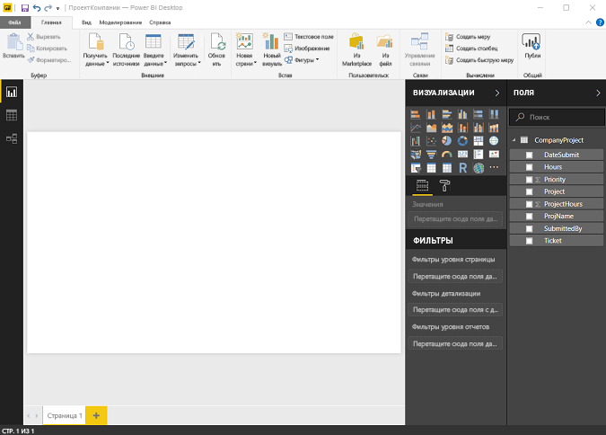
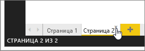

# Представление отчетов в Power BI Desktop
Если вы работали с Power BI, вы знаете, как просто можно создавать отчеты, предоставляющие динамические сведения о ваших данных. В Power BI Desktop также реализованы дополнительные возможности. С помощью Power BI Desktop можно создавать сложные запросы, объединять данные из нескольких источников, создавать связи между таблицами и многое другое.

Power BI Desktop содержит **представление отчетов**, где можно создать любое количество страниц отчета с визуализациями. Представление отчетов во многом похоже на режим редактирования отчета в службе Power BI. Вы можете перемещать визуализации, копировать, вставлять, объединять элементы и т. д.

Разница состоит в том, что при использовании Power BI Desktop вы можете работать с запросами и моделями данных, чтобы извлекать самые полезные сведения для отчетов. Затем вы можете сохранить файл Power BI Desktop где угодно — как на локальном диске, так и в облаке.

## Давайте посмотрим!
При первой загрузке данных в Power BI Desktop вы увидите **представление отчетов** с пустым холстом.

Можно переключаться между **представлениями отчетов**, **данных** и **связей**, щелкая значки в левой панели навигации:

После добавления данных можно добавить поля в новую визуализацию на холсте.

Чтобы изменить тип визуализации, выберите новый тип в группе **Визуализация** на ленте или щелкните визуализацию правой кнопкой мыши и выберите тип в списке **Изменить тип визуализации** .

> [!TIP]
> Поэкспериментируйте с различными типами визуализаций. Визуализация должна четко представлять информации о данных.
> 
> 

В начале отчет содержит по крайней мере одну пустую страницу. Страницы отображаются в области навигатора слева от холста. Вы можете добавить различные виды визуализаций на страницу, но главное не переборщить. Слишком много визуализаций на странице усложнят работу с ней и затруднят поиск нужной информации. Вы можете добавить новые страницы в отчет, просто нажав кнопку **Новая страница** на ленте.

Чтобы удалить страницу, нажмите кнопку **X** на вкладке этой страницы в нижней части представления отчета.

> [!NOTE]
> Отчеты и визуализации не могут быть закреплены на панели мониторинга из Power BI Desktop. Для этого вам необходимо [выполнить публикацию из Power BI Desktop](desktop-upload-desktop-files.md) на сайте Power BI.
> 
> 

