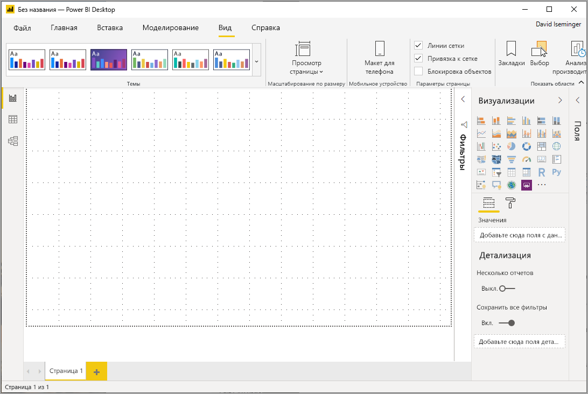
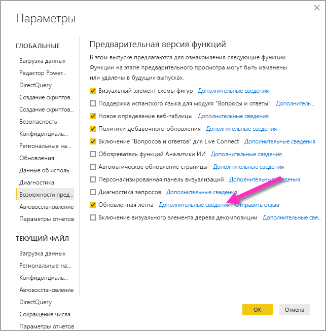
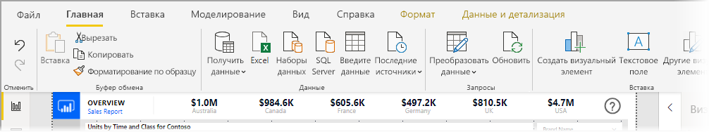
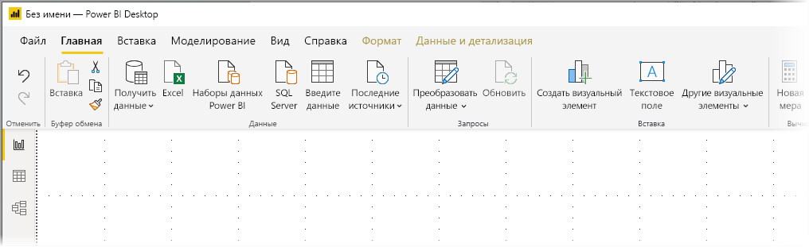

# Использование обновленной ленты в Power BI Desktop (предварительная версия)

Начиная с обновления в ноябре 2019 года, Power BI Desktop пересматривает свою ленту, чтобы лучше согласовать ее внешний вид и возможности с другими продуктами Microsoft, такими как Microsoft Office.

Обновленная лента находится в предварительной версии, поэтому мы можем получить обратную связь от пользователей и клиентов и убедиться в том, что интерфейс исключительный. Нам нужно несколько месяцев предварительной версии, обратной связи и улучшений перед выпуском общедоступной обновленной ленты Power BI Desktop. 

## Включение обновленной ленты

Обновленная лента в Power BI — это предварительная версия функции, которую нужно включить. Выберите пункты **Файл > Параметры и настройки > Параметры**, а затем в столбце слева выберите **Предварительная версия функций**. В правой панели отображается **Обновленная лента**. Установите флажок рядом с **Обновленная лента**, чтобы включить функцию предварительной версии. Чтобы изменения предварительной версии функции вступили в силу, необходимо перезапустить Power BI Desktop.

## Функции новой ленты

Преимущества обновления ленты призваны сделать работу с Power BI Desktop, а также с другими продуктами Майкрософт легкой и знакомой. 

Эти преимущества можно сгруппировать в следующие категории:

* **Усовершенствованный вид, удобство работы и организации** — значки и функции на обновленной ленте Power BI Desktop согласовываются с видом, оформлением и организацией элементов ленты приложений Office.

    

* **Галерея с интуитивно понятными темами** — коллекция тем, которая находится в ленте **Вид**, имеет привычный вид коллекции тем PowerPoint. Таким образом, изображения на ленте показывают, как будет выглядеть тема после изменения, например, цветовые комбинации и шрифты, если она будет применена к отчету. 

    

* **Динамическое содержимое ленты основывается на представлении** — на существующей ленте для Power BI Desktop иконки или команды, которые не были доступны, были просто затемнены, создавая не совсем хорошее впечатление. В обновленной ленте значки отображаются и упорядочиваются динамически, чтобы вы всегда знали, какие опции доступны в контексте.

* **Однолинейная лента при свертывании экономит место** — еще одним преимуществом обновленной ленты является возможность разбивать саму ленту на одну линию, динамически отображая элементы ленты в зависимости от вашего контекста. 

    

Помимо видимых изменений, обновленная лента также позволяет вносить будущие обновления в Power BI Desktop и его ленту, например:

* Создание более гибких и интуитивно понятных элементов управления на ленте, например коллекции визуальных элементов
* Добавление *черной* и *темно-серой* тем Office в Power BI Desktop
* Улучшение специальных возможностей

## Дальнейшие действия
В Power BI Desktop можно подключаться к данным самых разных видов. Дополнительные сведения об источниках данных см. в перечисленных ниже статьях.

* [Что такое Power BI Desktop?](desktop-what-is-desktop.md)
* [Источники данных в Power BI Desktop](desktop-data-sources.md)
* [Формирование и объединение данных в Power BI Desktop](desktop-shape-and-combine-data.md)
* [Подключение к данным Excel в Power BI Desktop](desktop-connect-excel.md)   
* [Ввод данных непосредственно в Power BI Desktop](desktop-enter-data-directly-into-desktop.md)   

