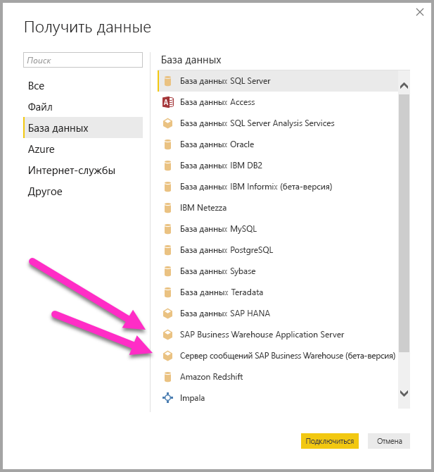
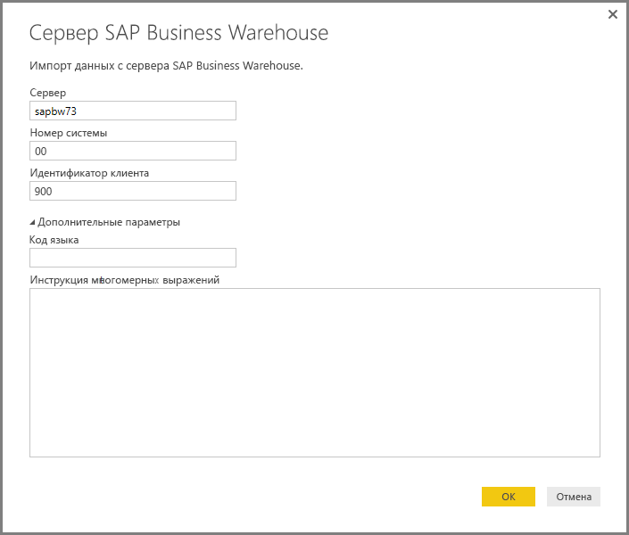
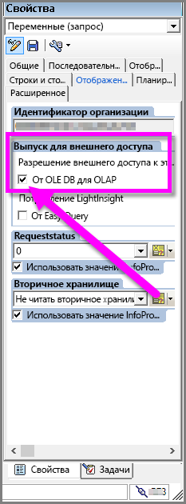

# Использование соединителя SAP BW в Power BI Desktop
С помощью Power BI Desktop вы можете получить доступ к данным **SAP Business Warehouse (BW)**.

Сведения о том, какие преимущества могут получить клиенты SAP, подключив Power BI к своим системам SAP Business Warehouse (BW), см. в [этом документе](https://aka.ms/powerbiandsapbw). Сведения об использовании DirectQuery с SAP BW см. в статье [DirectQuery и SAP Business Warehouse (BW)](desktop-directquery-sap-bw.md).

Начиная с выпуска **Power BI Desktop** за июнь 2018 года вы можете использовать соединитель SAP BW, в котором реализованы значительные улучшения в плане производительности и возможностей. Эта обновленная версия SAP BW была разработана корпорацией Майкрософт и называется **реализация 2.0**. Вы можете выбрать **соединитель SAP BW** версии 1 (v1) или **реализацию 2.0 соединителя SAP**. В следующих разделах по очереди описывается установка каждой версии. При подключении к SAP BW из Power BI Desktop можно выбрать один из соединителей.

Мы рекомендуем по возможности использовать **реализацию 2.0 соединителя SAP**.

## Установка соединителя SAP BW версии 1
Мы рекомендуем по возможности использовать реализацию 2.0 соединителя SAP (см. инструкции в следующем разделе). В этом разделе описывается установка **соединителя SAP BW** версии 1, который можно установить, выполнив указанные ниже действия.

1. Установите библиотеку **SAP NetWeaver** на локальном компьютере. Библиотеку **SAP NetWeaver** можно получить у администратора SAP или непосредственно в [Центре скачивания программного обеспечения SAP](https://support.sap.com/swdc). В связи с частым изменением структуры **Центра скачивания программного обеспечения SAP** более конкретные рекомендации по навигации по этому сайту недоступны. Кроме того, библиотека **SAP NetWeaver** обычно входит в пакет установки клиентских средств SAP Client Tools.
   
   Чтобы получить ссылку на скачивание последней версии, введите в строку поиска запрос *SAP Note #1025361* (мы не гарантируем, что это точно поможет ее найти). Убедитесь, что архитектура библиотеки **SAP NetWeaver** (32-или 64-разрядная) соответствует архитектуре установленной у вас версии **Power BI Desktop**, а затем установите все файлы из **пакета SDK для RFC SAP NetWeaver** согласно примечаниям SAP.
2. В диалоговом окне **Получение данных** в категории **База данных** будет указан **Сервер приложений SAP Business Warehouse Application Server** и **Сервер сообщений SAP Business Warehouse**.
   
   

## Установка реализации 2.0 соединителя SAP

Для **реализации 2.0** соединителя SAP требуется SAP .NET Connector 3.0. [SAP .NET Connector 3.0 можно скачать](https://support.sap.com/en/product/connectors/msnet.html) с веб-сайта SAP по следующей ссылке:

* [SAP .NET Connector 3.0](https://support.sap.com/en/product/connectors/msnet.html)

Для скачивания требуются действительные учетные данные S-пользователя. Клиентам рекомендуется обратиться в свой отдел SAP Basis за получением SAP .NET Connector 3.0. 

Соединитель имеет 32- и 64-разрядную версии. Пользователю *необходимо* выбрать версию, которая соответствует его установке Power BI Desktop. На момент написания этого материала на веб-сайте указаны две версии (для платформы .NET 4.0):

* Соединитель SAP для Microsoft .NET 3.0.20.0 для 32-разрядных (x86) версий Windows в виде ZIP-файла (6,896 КБ), 16 января 2018 г.
* Соединитель SAP для Microsoft .NET 3.0.20.0 для 64-разрядных (x64) версий Windows в виде ZIP-файла (7,180 КБ), 16 января 2018 г.

При установке в окне **Дополнительные этапы установки** необходимо выбрать параметр *Установить сборки в глобальном кэше сборок*, как показано на рисунке ниже.

> [!NOTE]
> Первая версия реализации SAP BW требовала библиотек DLL Netweaver. Если вы используете реализацию 2.0 соединителя SAP и не используете первую версию, библиотеки DLL Netweaver не нужны.

## Возможности соединителя SAP BW версии 1
**Соединитель с SAP BW** версии 1 в Power BI Desktop позволяет импортировать данные из кубов **сервера SAP Business Warehouse** или использовать DirectQuery. 

Дополнительные сведения о **соединителе SAP BW** и его использовании с DirectQuery см. в статье [DirectQuery и SAP Business Warehouse (BW)](desktop-directquery-sap-bw.md).

Чтобы установить подключение, нужно указать *сервер*, *номер системы* и *идентификатор клиента*.

Также можно указать два **дополнительных параметра**: код языка и пользовательскую инструкцию многомерных выражений для выполнения с использованием указанного сервера.

Если указана инструкция многомерных выражений, появится окно **Навигатор**, в котором отображается список кубов, доступных на сервере, с возможностью детализации и выбора элементов из доступных кубов, включая измерения и меры. Power BI предоставляет запросы и кубы, предоставляемые [OLAP BAPI интерфейса открытого анализа BW](https://help.sap.com/saphelp_nw70/helpdata/en/d9/ed8c3c59021315e10000000a114084/content.htm).

После выбора одного или нескольких элементов на сервере создается выходная таблица для предварительного просмотра, которая определяется выбранными элементами.

В окне **Навигатор** также представлено несколько **параметров отображения**, которые позволяют делать следующее.

* **Параметры отображения *Только выбранные элементы* и *Все элементы* (представление по умолчанию):** эти параметры полезны для проверки окончательного набора выбранных элементов. В качестве альтернативы для просмотра можно выбрать *имена столбцов* в области *предварительного просмотра*.
* **Включить предварительный просмотр данных (по умолчанию):** вы можете включить или отключить предварительный просмотр данных в этом диалоговом окне. Отключение предварительного просмотра данных уменьшает количество вызовов к серверу, так как он больше не запрашивает данные для предварительного просмотра.
* **Технические имена:** SAP BW поддерживает наличие *технических имен* у объектов в кубе. Использование технических имен позволяет владельцу куба отображать *понятные* имена объектов куба, а не *физические имена* этих объектов в кубе.

После выбора всех необходимых объектов в окне **Навигатор** можно решить, что делать дальше, нажав одну из следующих кнопок в нижней части окна **Навигатор**.

* Если нажать кнопку **Загрузить**, активируется загрузка всего набора строк для выходной таблицы в модель данных Power BI Desktop, затем осуществляется переход к представлению **Отчет**, где можно начать визуализацию данных. Также вы можете внести дополнительные изменения с помощью представления **Данные** или **Связи**.
* Если нажать кнопку **Изменить**, отобразится **редактор запросов**, в котором можно выполнить дополнительное преобразование данных и фильтрацию, прежде чем весь набор строк будет передан в модель данных Power BI Desktop.

Помните, что кроме импорта данных из кубов **SAP BW**, вы также можете импортировать в Power BI Desktop данные из широкого диапазона других источников данных, а затем объединить их в один отчет. Это делает возможными самые разнообразные сценарии составления отчетов и аналитики на основе данных **SAP BW**.

## Использование реализации 2.0 соединителя с SAP BW

Для использования реализации 2.0 соединителя с SAP BW необходимо создать подключение. Чтобы создать подключение, выполните указанные ниже действия.

1. В окне **Получение данных** выберите **Сервер приложений SAP Business Warehouse Application Server** или **Сервер сообщений SAP Business Warehouse**.

2. Появится диалоговое окно создания подключения, в котором можно выбрать реализацию. При выборе **реализации 2.0** становятся доступны параметры режима выполнения, размера пакета и включения структур характеристик, как показано на рисунке ниже.

    

3. Нажмите кнопку **ОК**. Дальнейшие действия в окне **Навигатор** аналогичны описанным в предыдущем разделе для соединителя SAP BW версии 1. 

### Новые параметры для реализации 2.0 

Реализация 2.0 поддерживает следующие параметры:

1. **ExecutionMode** — определяет интерфейс многомерных выражений, используемый для выполнения запросов на сервере. Возможны следующие варианты:

        a. SapBusinessWarehouseExecutionMode.BasXml
        b. SapBusinessWarehouseExecutionMode.BasXmlGzip
        c. SapBusinessWarehouseExecutionMode.DataStream

    Значение по умолчанию для этого параметра — SapBusinessWarehouseExecutionMode.BasXmlGzip.

    Значение *SapBusinessWarehouseExecutionMode.BasXmlGzip* может повысить производительность, если при обработке больших наборов данных возникают длительные задержки.

2. **BatchSize** — задает максимальное число строк, возвращаемое при выполнении инструкции многомерного выражения. При извлечении большого набора данных небольшое число строк будет означать больше обращений к серверу. Увеличение числа строк может повысить производительность, но привести к проблемам с памятью на сервере SAP BW. Значение по умолчанию — 50 000 строк.

3. **EnableStructures** — логическое значение, указывающее, распознаются ли структуры характеристик. По умолчанию этот параметр имеет значение False. Влияет на список объектов, доступных для выбора. Не поддерживается в режиме собственного запроса.

Параметр **ScaleMeasures** в этой реализации является нерекомендуемым. В ней принимается значение *ScaleMeasures = false*, то есть всегда отображаются немасштабированные значения.

### Дополнительные улучшения в реализации 2.0 

В приведенном ниже маркированном списке описываются некоторые дополнительные улучшения, появившиеся в новой реализации.

* Повышение производительности
* Возможность извлечения нескольких миллионов строк данных и точной настройки с помощью параметра размера пакета.
* Возможность переключения режимов выполнения.
* Поддержка режима сжатия. Он особенно полезен в случае с длительными задержками или большими наборами данных.
* Улучшено обнаружение переменных типа Date.
* (Экспериментальная возможность) Предоставление измерений дат (тип ABAP DATS) и времени (тип ABAP TIMS) в виде значений даты и времени соответственно, а не текстовых значений.
* Улучшенная обработка исключений. Ошибки, происходящие в вызовах BAPI, теперь отображаются.
* Свертывание столбцов в режимах BasXml и BasXmlGzip. Например, если созданный запрос многомерного выражения извлекает 40 столбцов, но в соответствии с текущим выбором требуется только 10, запрос будет передан на сервер для извлечения меньшего набора данных.

### Изменение существующих отчетов для использования реализации 2.0 

Изменение существующих отчетов для использования **реализации 2.0** возможно только в режиме импорта и требует выполнения указанных ниже действий вручную.

1. Откройте существующий отчет, на ленте выберите команду **Изменить запросы**, а затем запрос SAP Business Warehouse, который нужно изменить.

2. Щелкните запрос правой кнопкой мыши и выберите пункт **Расширенный редактор**.

3. В окне **Расширенный редактор** измените вызов SapBusinessWarehouse.Cubes следующим образом: 

    а. Определите, содержит ли уже запрос запись параметра, например, как в следующем примере:

    

    б. Если да, добавьте параметр из реализации 2.0 и удалите параметр ScaleMeasures, если он имеется, как показано ниже.

    

    в. Если запрос еще не содержит запись параметров, просто добавьте ее. Например, если запрос имеет следующий вид:

    

    г. Измените его на:

    

4. Мы приложили все усилия, чтобы сделать реализацию 2.0 соединителя SAP BW совместимой с соединителем SAP BW версии 1. Однако могут быть некоторые различия из-за использования разных режимов выполнения многомерных выражений SAP BW. Чтобы устранить несоответствия, попробуйте сменить режим выполнения.

## Устранение неполадок
В этом разделе приведены случаи устранения неполадок при работе с соединителем **SAP BW**.

1. Числовые данные из **SAP BW** возвращают точки в качестве десятичных разделителей вместо запятых. Например, 1,000,000 возвращается как 1.000.000.
   
   **SAP BW** возвращает десятичные данные с *,* (запятая) или *.* (точка) в качестве десятичного разделителя. Чтобы указать, какие **SAP BW** следует использовать для десятичного разделителя, драйвер, используемый **Power BI Desktop**, вызывает *BAPI_USER_GET_DETAIL*. Этот вызов возвращает структуру, называемую **DEFAULTS**, которая содержит поле с именем *DCPFM*, в котором хранится *нотация десятичного формата*. Он принимает одно из следующих трех значений:
   
       ‘ ‘ (space) = Decimal point is comma: N.NNN,NN
       'X' = Decimal point is period: N,NNN.NN
       'Y' = Decimal point is N NNN NNN,NN
   
   Клиенты, сообщавшие об этой проблеме, обнаружили, что вызов *BAPI_USER_GET_DETAIL* завершается сбоем для определенного пользователя (пользователь, для которого отображаются неверные данные) и сообщением об ошибке следующего вида:
   
       You are not authorized to display users in group TI:
           <item>
               <TYPE>E</TYPE>
               <ID>01</ID>
               <NUMBER>512</NUMBER>
               <MESSAGE>You are not authorized to display users in group TI</MESSAGE>
               <LOG_NO/>
               <LOG_MSG_NO>000000</LOG_MSG_NO>
               <MESSAGE_V1>TI</MESSAGE_V1>
               <MESSAGE_V2/>
               <MESSAGE_V3/>
               <MESSAGE_V4/>
               <PARAMETER/>
               <ROW>0</ROW>
               <FIELD>BNAME</FIELD>
               <SYSTEM>CLNTPW1400</SYSTEM>
           </item>
   
   Чтобы исправить эту ошибку, пользователи должны запросить у своего администратора SAP предоставить пользователю SAP BW, который используется в Power BI, право на выполнение *BAPI_USER_GET_DETAIL*. Стоит также убедиться, что пользователь задал необходимое значение *DCPFM*, описанное выше в этом решении для устранения неполадок.
2. **Возможность использования запросов SAP BEx**
   
   В Power BI Desktop можно выполнять запросы **BEx**, включив определенное свойство, как показано на следующем изображении:
   
   

## Дальнейшие действия
Дополнительные сведения о SAP и DirectQuery см. в следующих статьях:

* [DirectQuery и SAP HANA](desktop-directquery-sap-hana.md)
* [Использование DirectQuery и SAP Business Warehouse (BW)](desktop-directquery-sap-bw.md)
* [Power BI и DirectQuery](desktop-directquery-about.md)
* [Источники данных, поддерживаемые DirectQuery](desktop-directquery-data-sources.md)
* [Технический документ о Power BI и SAP BW](https://aka.ms/powerbiandsapbw)
