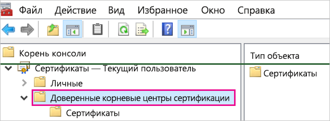
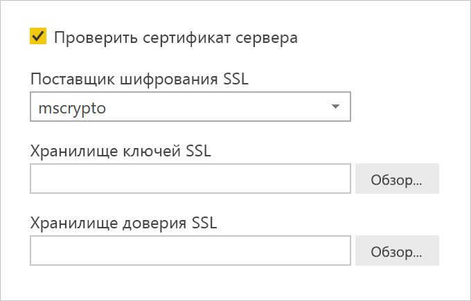

# <a name="enable-encryption-for-sap-hana"></a>Включение шифрования для SAP HANA

Мы рекомендуем шифровать подключения к серверу SAP HANA из Power BI Desktop и службы Power BI. Для включения шифрования HANA можно использовать как библиотеку OpenSSL, так и собственную библиотеку CommonCryptoLib компании SAP (прежнее название — sapcrypto). SAP рекомендует использовать CommonCryptoLib, но базовые функции шифрования доступны при использовании любой библиотеки.

Эта статья содержит общие сведения о включении шифрования с помощью OpenSSL и ссылки на некоторые разделы документации SAP. Мы периодически обновляем материалы и ссылки, но для получения исчерпывающих инструкций и полноценной поддержки всегда используйте официальную документацию SAP. Если вы хотите настроить шифрование с помощью CommonCryptoLib вместо OpenSSL, см. статью [о настройке TLS/SSL в SAP HANA 2.0](https://blogs.sap.com/2018/11/13/how-to-configure-tlsssl-in-sap-hana-2.0/). Инструкции по миграции с OpenSSL на CommonCryptoLib см. в [заметке SAP 2093286](https://launchpad.support.sap.com/#/notes/2093286) (необходимы права пользователя s-user).

> [!NOTE]
> Действия по настройке шифрования, описанные в этой статье, пересекаются с действиями по настройке единого входа SAML. Независимо от того, выбрали ли вы OpenSSL или CommonCryptoLib в качестве поставщика функций шифрования сервера HANA, убедитесь, что выбранный вариант согласуется с конфигурациями шифрования и SAML.

Включение шифрования для SAP HANA с помощью OpenSSL состоит из четырех этапов. Далее мы рассмотрим их подробнее.  Дополнительные сведения см. в статье о [защите обмена данными между SAP HANA Studio и SAP HANA Server по протоколу SSL](https://blogs.sap.com/2015/09/28/securing-the-communication-between-sap-hana-studio-and-sap-hana-server-through-ssl/).

## <a name="use-openssl"></a>Использование OpenSSL

Убедитесь, что сервер HANA настроен для использования OpenSSL в качестве поставщика услуг шифрования. Замените отсутствующие сведения о пути ниже на идентификатор сервера (sid) своего сервера HANA.


## <a name="create-a-certificate-signing-request"></a>Создание запроса на подписывание сертификата

Создайте запрос на подписывание сертификата X509 для сервера HANA.

1. С помощью SSH подключитесь к компьютеру Linux, на котором выполняется сервер HANA, с правами \<sid\>adm.

1. Перейдите в корневой каталог _/__usr/sap/\<sid\>/home_.

1. Создайте скрытый каталог с именем _.__ssl_, если он еще не существует.

1. Выполните следующую команду:

    ```
    openssl req -newkey rsa:2048 -days 365 -sha256 -keyout Server\_Key.pem -out Server\_Req.pem -nodes
    ```

Эта команда создает запрос на подписывание сертификата и закрытый ключ. После подписывания сертификат действителен в течение года (см. параметр -days). При появлении запроса на ввод общего имени (CN) введите полное доменное имя (FQDN) компьютера, на котором установлен сервер HANA.

## <a name="get-the-certificate-signed"></a>Получение подписанного сертификата

Получите сертификат, подписанный центром сертификации (ЦС), являющимся доверенным для клиентов, которые будут использоваться для подключения к серверу HANA.

1. Если у вашей организации уже есть доверенный ЦС (представленный CA\_Cert.pem и CA\_Key.pem в следующем примере), подпишите запрос на сертификат, выполнив следующую команду:

    ```
    openssl x509 -req -days 365 -in Server\_Req.pem -sha256 -extfile /etc/ssl/openssl.cnf -extensions usr\_cert -CA CA\_Cert.pem -CAkey CA\_Key.pem -CAcreateserial -out Server\_Cert.pem
    ```

    Если у вас пока нет подходящего ЦС, вы можете самостоятельно создать корневой ЦС, выполнив действия из статьи о [защите обмена данными между SAP HANA Studio и SAP HANA Server по протоколу SSL](https://blogs.sap.com/2015/09/28/securing-the-communication-between-sap-hana-studio-and-sap-hana-server-through-ssl/).

1. Создайте цепочку сертификатов сервера HANA, объединив сертификат сервера, ключ и сертификат ЦС (имя key.pem соответствует соглашению для SAP HANA):

    ```
    cat Server\_Cert.pem Server\_Key.pem CA\_Cert.pem \> key.pem
    ```

1. Создайте копию CA\_Cert.pem с именем trust.pem (имя trust.pem соответствует соглашению для SAP HANA):

    ```
    cp CA\_Cert.pem trust.pem
    ```

1. Перезапустите сервер HANA.

1. Проверьте наличие отношения доверия между клиентом и ЦС, использованным для подписи сертификата сервера SAP HANA.

    Клиент должен доверять ЦС, использованному для подписи сертификата X509 сервера HANA, прежде чем можно будет установить зашифрованное подключение к серверу HANA с компьютера клиента.

    Существует несколько способов для обеспечения такого отношения доверия с помощью консоли управления (MMC) или командной строки. Сертификат X509 (trust.pem) центра сертификации можно импортировать в папку **Доверенные корневые центры сертификации** для пользователя, который будет устанавливать соединение, или в ту же папку на самом клиентском компьютере, если это необходимо.

    

    Прежде чем импортировать сертификат в папку "Доверенные корневые центры сертификации", нужно преобразовать trust.pem в CRT-файл, например, выполнив следующую команду OpenSSL:

    ```
    openssl x509 -outform der -in your-cert.pem -out your-cert.crt
    ```
    
    Сведения об использовании OpenSSL для преобразования см. в [документации по OpenSSL](https://www.openssl.org/docs/manmaster/man1/x509.html).

## <a name="test-the-connection"></a>Проверка подключения

Проверьте подключение в Power BI Desktop или службе Power BI.

1. Прежде чем пытаться установить подключение к серверу SAP HANA, убедитесь, что в Power BI Desktop или на странице **Управление шлюзами** службы Power BI включен параметр **Проверять сертификат сервера**. Для параметра **Поставщик шифрования SSL** выберите mscrypto, если вы использовали шаги настройки OpenSSL, и commoncrypto, если вы настроили эту библиотеку в качестве поставщика услуг шифрования. Оставьте поля "Хранилище ключей SSL" и "Хранилище доверия SSL" пустыми.

    - Power BI Desktop

        

    - службе Power BI

        

1. Убедитесь, что вы можете установить зашифрованное соединение с сервером с включенным параметром **Проверить сертификат сервера**, загрузив данные в Power BI Desktop или обновив опубликованный отчет в службе Power BI.
