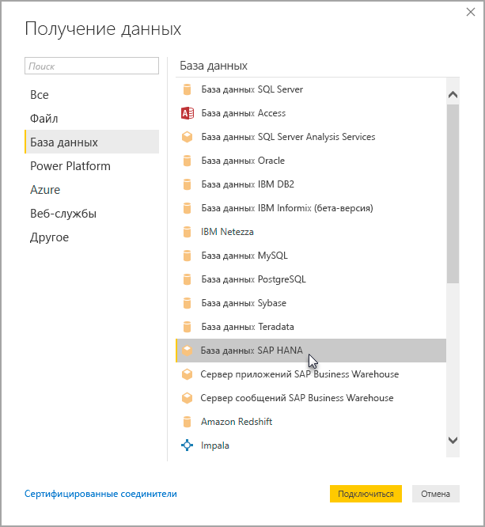

# Использование SAP HANA в Power BI Desktop
Теперь с помощью Power BI Desktop вы можете получить доступ к базе данных **SAP HANA** . Для использования **SAP HANA**на локальном клиентском компьютере нужно установить драйвер ODBC SAP HANA, чтобы подключение к данным **SAP HANA** в Power BI Desktop работало правильно. Драйвер ODBC SAP HANA можно скачать в [Центре скачивания программного обеспечения SAP](https://support.sap.com/swdc). В нем следует найти клиент SAP HANA CLIENT для компьютеров Windows. В связи с частым изменением структуры **Центра скачивания программного обеспечения SAP** более конкретные рекомендации по навигации по этому сайту недоступны.

Для подключения к базе данных **SAP HANA** последовательно выберите пункты **Получить данные > База данных > База данных SAP HANA**, как показано на следующем рисунке:

При подключении к базе данных SAP HANA укажите имя сервера и порт в формате *сервер:порт*. На рисунке ниже показан пример, в котором используется имя сервера *ServerXYZ* и порт *30015*.

В этом выпуске **SAP HANA** в режиме [DirectQuery](desktop-directquery-sap-hana.md) поддерживается в Power BI Desktop и службе Power BI, и вы можете публиковать и отправлять отчеты, использующие **SAP HANA** в режиме DirectQuery, в службу Power BI. Когда **SAP HANA** не используется в режиме DirectQuery, вы также можете публиковать и отправлять отчеты в службу Power BI.

## Поддерживаемые компоненты SAP HANA
Этот выпуск содержит множество возможностей для работы с **SAP HANA**, перечисленных в списке ниже.

* Для удобства пользователей соединитель Power BI для **SAP HANA** использует драйвер SAP ODBC.
* **SAP HANA** поддерживает DirectQuery и функцию импорта
* Power BI поддерживает информационные модели HANA (например, представления аналитики и вычислений) и отличается оптимизированной навигацией
* **SAP HANA** позволяет использовать функцию прямого SQL для подключения к строкам и столбцам таблиц.
* Включает оптимизированную навигацию для моделей HANA
* Power BI поддерживает переменные и входные параметры **SAP HANA**
* Представления вычислений на основе HDI-контейнера
  * Поддержка представлений вычислений на основе HDI-контейнера доступна в общедоступной предварительной версии в выпуске Power BI Desktop за август 2019 года. Чтобы получить доступ к представлениям вычислений на основе HDI-контейнера в Power BI, убедитесь, что пользователи базы данных HANA, используемые с Power BI, имеют разрешение на доступ к контейнеру среды выполнения HDI, где хранятся представления, к которым требуется получить доступ. Чтобы предоставить такой доступ, необходимо создать роль, которая разрешает доступ к контейнеру HDI, и назначить роль пользователю базы данных HANA, который будет использоваться с Power BI (этот пользователь также должен иметь разрешение на чтение из системных таблиц в \_SYS\_BI в обычном режиме). Подробные инструкции по созданию и назначению ролей базы данных см. в официальной документации SAP. Начните с [этой записи блога о SAP](https://nam06.safelinks.protection.outlook.com/?url=https%3A%2F%2Fblogs.sap.com%2F2018%2F01%2F24%2Fthe-easy-way-to-make-your-hdi-container-accessible-to-a-classic-database-user%2F&data=02%7C01%7Cv-adbold%40microsoft.com%7Cf7e0a405fe334598ba0608d7096ef5b4%7C72f988bf86f141af91ab2d7cd011db47%7C1%7C0%7C636988244476739316&sdata=PuRu61GPRYp34mLuGbQk6gdbRikdgbxfqo8q1RBQtm0%3D&reserved=0).
  * Обратите внимание, что в настоящее время существуют некоторые ограничения для переменных HANA, присоединенных к представлениям вычислений на основе HDI. Эти ограничения обусловлены ошибками на стороне HANA и будут устранены в будущих выпусках SAP HANA. Во-первых, невозможно применить переменную HANA к общему столбцу в представлении вычисления на основе HDI-контейнера. Это ограничение можно исправить путем обновления до HANA 2 версии 37.02 и более поздних версий или HANA 2 версии 42 и выше. Во-вторых, значения по умолчанию для переменных и параметров в настоящее время не отображаются в пользовательском интерфейсе Power BI. Это также вызвано ошибкой в SAP HANA. SAP еще не объявила об исправлении.

## Ограничения SAP HANA
Использование **SAP HANA**связано с рядом описанных ниже ограничений.

* Строки NVARCHAR усекаются максимум до 4000 символов Юникод
* SMALLDECIMAL не поддерживается
* VARBINARY не поддерживается
* Допустимый диапазон дат — с 30.12.1899 до 31.12.9999.

## Дальнейшие действия
Дополнительные сведения о SAP HANA и DirectQuery см. в следующих статьях:

* [DirectQuery и SAP HANA](desktop-directquery-sap-hana.md)
* [Power BI и DirectQuery](desktop-directquery-about.md)
* [Источники данных, поддерживаемые DirectQuery](desktop-directquery-data-sources.md)
* [Включение шифрования для SAP HANA](desktop-sap-hana-encryption.md)

