# Использование просмотра данных и записей в Power BI Desktop
В **Power BI Desktop** можно детализировать данные любого визуального элемента и отобразить текстовое представление данных или отдельных записей данных выбранного визуального элемента. Иногда эти возможности называют *переходами*, *детализацией* или *детализацией данных*.

Функция **Просмотреть данные** позволяет просматривать текстовую версию значений, используемых выбранной визуализацией. Чтобы отобразить все данные одной выбранной записи, можно воспользоваться функцией **Просмотреть записи**. 

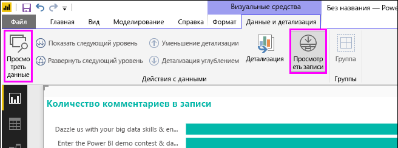

>[!IMPORTANT]
>Функции **Просмотреть данные** и **Просмотреть записи** поддерживают только следующие типы визуализаций:
>  - Линейчатая диаграмма
>  - Гистограмма
>  - Кольцевой график
>  - Картограмма
>  - Воронкообразная диаграмма
>  - Карта
>  - круговая диаграмма;
>  - Диаграмма-дерево

## Использование функции "Просмотреть данные" в Power BI Desktop

Функция **Просмотреть данные** отображает данные, лежащие в основе визуализации. Кнопка **Просмотреть данные** находится на вкладке **Данные и детализация** в разделе **Визуальные средства** ленты, если выбрана детализация.

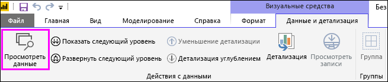

Вы также можете просмотреть данные, щелкнув правой кнопкой мыши визуализацию, а затем выбрав **Показать данные** в появившемся меню, или выбрав **дополнительные параметры**  (...) в верхнем правом углу визуализации, а затем выбрав **Показать данные**.

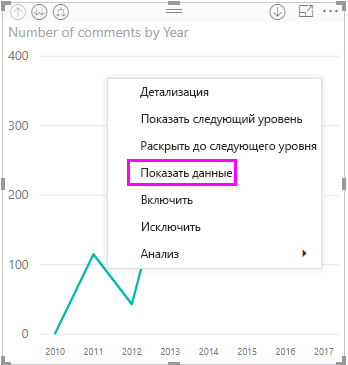&nbsp;&nbsp;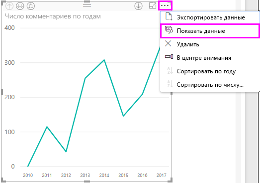

> [!NOTE]
> Чтобы получить доступ к контекстному меню, необходимо навести указатель мыши на точку данных в визуальном элементе.

Когда вы выбираете **Просмотреть данные** или **Показать данные**, холст Power BI Desktop отображает как визуальное, так и текстовое представление данных. В *горизонтальном представлении* визуальный элемент отображается в верхней половине холста, а данные — в нижней половине. 

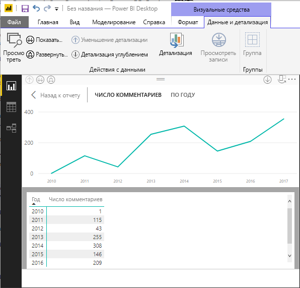

Для перехода в *вертикальное представление* (или возврата в горизонтальное представление) щелкните значок в правом верхнем углу холста.

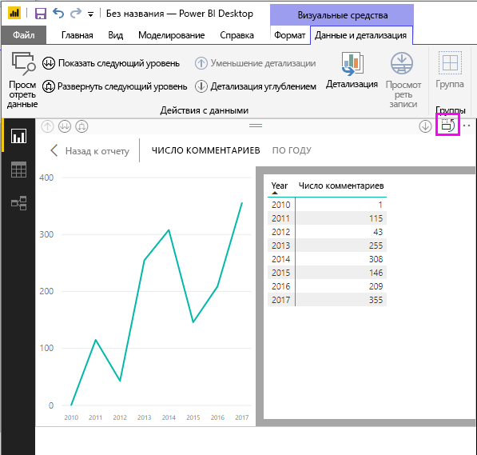

Чтобы вернуться к отчету, нажмите кнопку **< Назад к отчету** в левом верхнем углу холста.

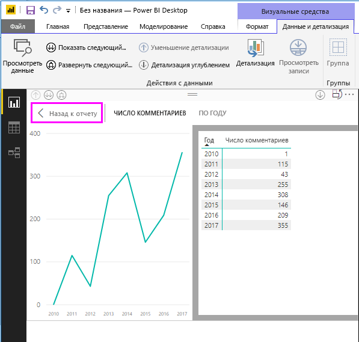

## Использование просмотра записей в Power BI Desktop

Вы можете сконцентрироваться на одной записи данных в визуализации и подробно рассмотреть его данные. Чтобы **просмотреть записи**, выберите визуализацию, затем нажмите кнопку **Просмотреть записи** на вкладке **Данные и детализация** в разделе **Визуальные средства** ленты, а затем выберите точку или строку данных в визуализации. 

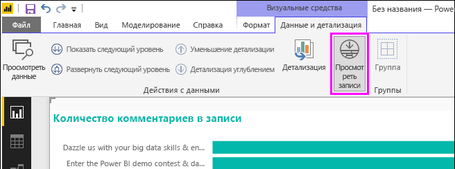

> [!NOTE]
> Если кнопка **Просмотреть записи** на ленте отключена и выделена серым цветом, это означает, что выбранная визуализация не поддерживает **просмотр записей**.

Вы также можете щелкнуть правой кнопкой мыши элемент данных и нажать кнопку **Просмотреть записи** в появившемся меню.

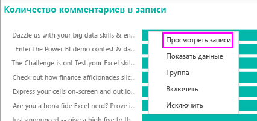

Когда вы выбираете **Просмотреть записи** для элемента данных, холст Power BI Desktop отображает все данные, связанные с выбранным элементом. 

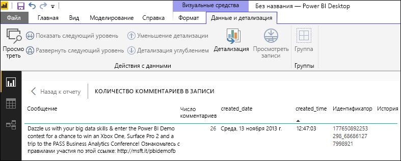

Чтобы вернуться к отчету, нажмите кнопку **< Назад к отчету** в левом верхнем углу холста.

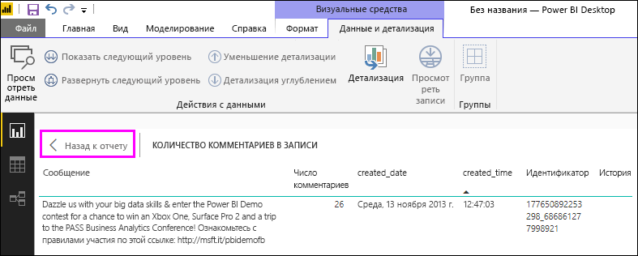

> [!NOTE]
>**Просмотр записей** имеет следующие ограничения:
> - Вы не можете изменить данные в представлении **просмотра записей** и сохранить их обратно в отчете.
> - Функцию **Просмотреть записи** нельзя использовать, если для визуального элемента применяется вычисляемая мера.
> - Функцию **Просмотреть записи** нельзя использовать при подключении к динамической многомерной модели.

## Дальнейшие действия
В **Power BI Desktop** представлены все виды возможностей для форматирования отчетов и управления данными. Примеры см. в указанных ниже статьях.

* [Группирование данных и разделение их на ячейки в Power BI Desktop](desktop-grouping-and-binning.md)
* [Использование линий сетки, привязки к сетке, z-порядка, выравнивания и распределения в отчетах Power BI Desktop](desktop-gridlines-snap-to-grid.md)

