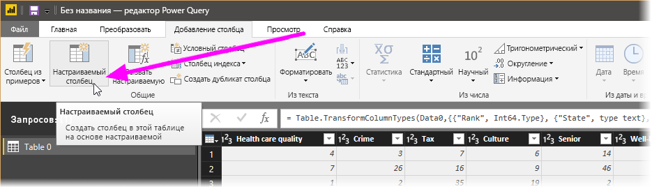
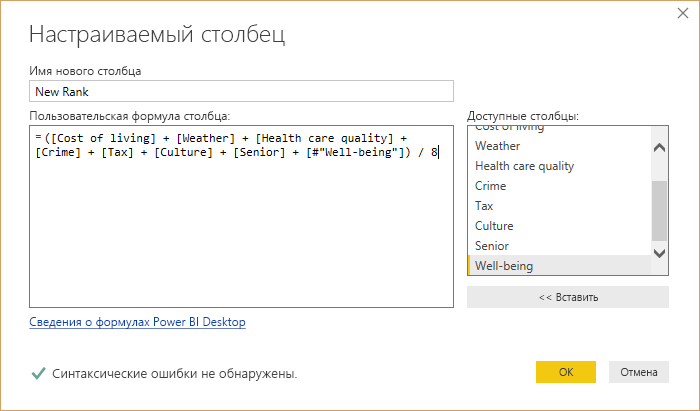
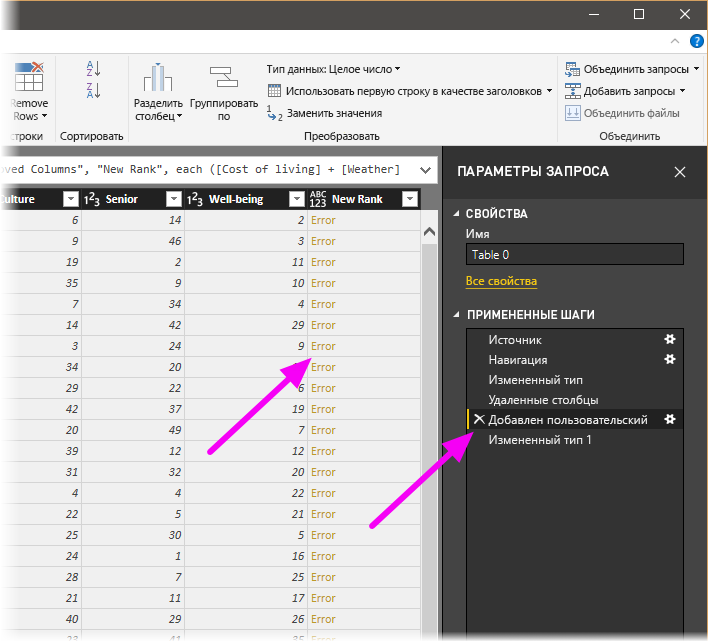
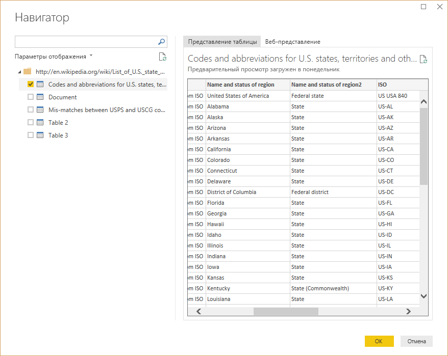
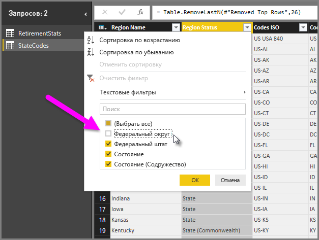
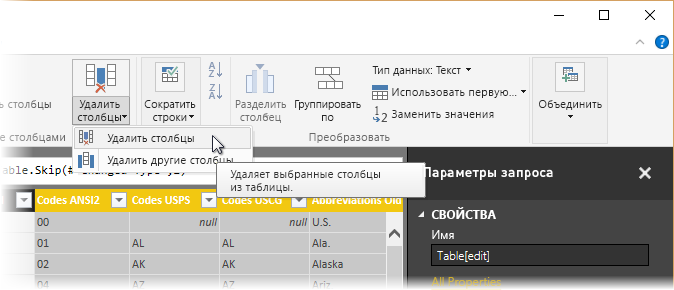

# Руководство. Формирование и объединение данных в Power BI Desktop

С помощью **Power BI Desktop** можно подключаться к разным типам источников данных, а затем формировать данные в соответствии с потребностями, создавая визуальные отчеты, которые можно использовать с другими пользователями. *Формирование* данных означает преобразование данных, например переименование столбцов или таблиц, замену текста числами, удаление строк, установку первой строки в качестве заголовков и т. д. *Объединение* данных означает подключение к нескольким источникам данных, формирование их данных в соответствии с потребностями и их последующее объединение в один удобный запрос.

Из этого руководства вы узнаете, как выполнять следующие задачи:

* Формирование данных в **редакторе запросов**
* Подключение к источникам данных
* Подключение к другим источникам данных
* Объединение этих источников данных и создание модели данных для использования в отчетах

В этом документе описано, как сформировать запрос с помощью Power BI Desktop, и показаны распространенные задачи. Используемый здесь запрос и процесс его создания с нуля подробно описываются в разделе [Начало работы с Power BI Desktop](desktop-getting-started.md).

Полезно знать, что в **редакторе запросов** в Power BI Desktop можно в полной мере использовать контекстные меню в дополнение к задачам, доступным на ленте. Почти все действия, которые можно выбрать на ленте **Преобразование** , также доступны, если щелкнуть правой кнопкой мыши элемент (например, столбец) и выбрать соответствующий пункт в появившемся меню.

## Формирование данных
При формировании данных в редакторе запросов вы создаете пошаговые инструкции (которые автоматически выполняются в этом редакторе запросов) для настройки данных по мере их загрузки и отображения в редакторе. Это не влияет на исходный источник данных; корректируется или *формируется* только это конкретное представление данных.

Указываемые действия (переименование таблицы, преобразование типа данных или удаление столбцов) записываются редактором запросов, и каждый раз, когда этот запрос подключается к источнику данных, эти действия выполняются, чтобы данные всегда были сформированы указанным образом. Это происходит всякий раз, когда вы используете функцию редактора запросов Power BI Desktop или когда кто-либо другой использует ваш предоставленный в общий доступ запрос, например в службе **Power BI** . Эти действия последовательно записываются в области **Параметры запроса** в разделе **Примененные действия**.

На следующем рисунке показана область **Параметры запроса** для сформированного запроса — мы разберем каждое из этих действий ниже.

Сформируем данные об увольнениях из раздела [Начало работы с Power BI Desktop](desktop-getting-started.md), которые мы нашли, подключившись к источнику данных в Интернете, нужным нам образом.

Для начала добавим настраиваемый столбец для вычисления ранга на основе всех данных с одинаковыми факторами, а затем сравним этот ранг с существующим столбцом _Rank_.  На снимке экрана ниже показана лента **Добавление столбца** с наведенной стрелкой на кнопку **Пользовательский столбец**. С ее помощью можно добавить настраиваемый столбец.

В диалоговом окне **Пользовательский столбец** в поле **Имя нового столбца** введите _New Rank_, а в поле **Формула пользовательского столбца** введите эту формулу:

    ([Cost of living] + [Weather] + [Health care quality] + [Crime] + [Tax] + [Culture] + [Senior] + [#"Well-being"]) / 8

Убедитесь, что сообщение о состоянии содержит такой текст: _No syntax errors have been detected_ (Синтаксические ошибки не обнаружены) и нажмите кнопку **ОК**.

Чтобы данные столбца были согласованными, преобразуйте значения нового столбца в целые числа. Для этого щелкните правой кнопкой мыши заголовок столбца и выберите **Изменить тип \> Целое число**. 

Чтобы выбрать несколько столбцов, сначала выделите столбец, нажмите и удерживайте клавишу **SHIFT**, одновременно выделите смежные столбцы, а затем щелкните правой кнопкой мыши заголовок столбца, чтобы изменить все выделенные столбцы. Можно также использовать клавишу **CTRL** , чтобы выбрать несмежные столбцы.

Вы также можете *преобразовать* типы данных столбцов на ленте **Преобразование**. На следующем рисунке показана лента **Преобразование** ; стрелка на рисунке указывает на кнопку **Тип данных** , которая позволяет преобразовать текущий тип данных в другой.

Обратите внимание, что в области **Параметры запроса**в разделе **Примененные действия** отражаются все примененные действия по формированию данных. Если требуется удалить какой-либо шаг из процесса формирования, можно просто щелкнуть значок **X** слева от него. На следующем рисунке в разделе **Примененные действия** отражаются предпринятые до этого момента действия: подключение к веб-сайту (**Источник**); выбор таблицы (**Навигация**); автоматическое изменение редактором запросов при загрузке таблицы типа текстовых столбцов, содержащих числа, с *текстового* на *целочисленный* (**Изменен тип**). Последние два этапа показывают предыдущие действия: **Добавлен пользовательский объект** и **Измененный тип1**. 

Прежде чем можно будет работать с этим запросом, необходимо внести некоторые изменения, чтобы получить его данные, где нам это нужно.

* *Настроить рейтинги, удалив столбцы* — мы решили, что столбец **Cost of living** не влияет на наши результаты. После удаления этого столбца возникает проблема: данные остаются без изменений. Но это легко исправить с помощью Power BI Desktop, что демонстрирует замечательную функцию **Примененные шаги** надстройки Query.
* *Устранить несколько ошибок* — так как мы удалили столбец, необходимо изменить вычисления в столбце **New Rank**. Для этого нужно изменить формулу.
* *Сортировать данные* — на основе столбцов **New Rank** и **Rank**. 
* *Заменить данные* — мы покажем, как заменить конкретное значение и объясним необходимость вставки **примененного действия**.
* *Изменить имя таблицы* — имя **Table 0** не содержит полезных сведений, но его легко изменить.

Чтобы удалить столбец **Cost of living**, выберите этот столбец, перейдите на вкладку **Главная** на ленте, а затем выберите **Удалить столбцы**, как показано на следующем рисунке.

Обратите внимание, что значения столбца _New Rank_ не изменились благодаря порядку выполнения шагов. Поскольку редактор запросов записывает действия последовательно, но независимо друг от друга, можно перемещать каждое **Примененное действие** вверх или вниз в последовательности. Просто щелкните правой кнопкой какое-либо действие, и редактор запросов предоставит меню, которое позволяет сделать следующее: **Переименовать**, **Удалить**, **Удалить** **до конца** (удалить все действия, начиная с текущего), **Переместить вверх** или **Переместить вниз**. Переходите к последнему шагу _Удаленные столбцы_, который предшествует шагу _Добавлен пользовательский объект_.

Выберите шаг _Добавлен пользовательский объект_. Обратите внимание, что данные отображают _ошибку_, которую нужно устранить. 

Существует несколько способов получить дополнительные сведения о каждой ошибке. Можно выбрать ячейку, не щелкая слово **Ошибка**, или щелкнуть непосредственно слово **Ошибка** . Если выбрать ячейку, *не* щелкая непосредственно слово **Ошибка**, то редактор запросов отобразит сведения об ошибке в нижней части окна.

Если щелкнуть непосредственно слово *Ошибка* , запрос создает **Примененный шаг** в области **Параметры запроса** и отображает сведения об ошибке. Это не нужно делать, поэтому выберите **Отменить**.

Чтобы исправить ошибки, выберите столбец _New Rank_, затем отобразите формулу данных столбца: откройте ленту **Представление** и установите флажок **Строка формул**. 

Теперь можно удалить параметр_Cost of living_ и уменьшить делитель, изменив формулу: 

    Table.AddColumn(#"Removed Columns", "New Rank", each ([Weather] + [Health care quality] + [Crime] + [Tax] + [Culture] + [Senior] + [#"Well-being"]) / 7)

Выберите зеленый флажок слева от поля формулы и нажмите клавишу **ВВОД**. Данные заменятся исправленными значениями, и теперь шаг **Добавлен пользовательский объект** должен выполниться *без ошибок* .

> [!NOTE]
> Вы также можете использовать команду **Удалить ошибки** на ленте или в контекстном меню, которая удаляет все строки, содержащие ошибки. В этом случае из данных будут удалены все строки. Но это нежелательный результат: все данные должны остаться в таблице.

Теперь необходимо отсортировать данные на основе столбца **New Rank**. Сначала выберите последний примененный шаг **Измененный тип1** для получения последних данных. После этого выберите раскрывающийся список рядом с заголовком столбца **New Rank** и выберите **Сортировать по возрастанию**.

Обратите внимание: данные теперь отсортированы по столбцу **New Rank**.  Но если взглянуть на столбец **Rank**, вы заметите, что данные не сортируются правильно, если есть привязка к значению столбца **New Rank**. Чтобы устранить эту проблему, выберите столбец **New Rank** и измените формулу в **строке формул** на следующую:

    = Table.Sort(#"Changed Type1",{{"New Rank", Order.Ascending},{"Rank", Order.Ascending}})

Выберите зеленый флажок слева от поля с формулой или нажмите клавишу **ВВОД**. Теперь строки отсортированы в соответствии с обоими столбцами _New Rank_ и _Rank_.

Кроме того, можно выбрать любое **Примененное действие** в списке и продолжить формирование данных с этой точки. Редактор запросов будет автоматически вставлять новое действие непосредственно после выбранного в данный момент **примененного действия**. Давайте попробуем.

Сначала выберите **примененный шаг**, предшествующее добавлению настраиваемого столбца. Это шаг _Удаленные столбцы_. Здесь замените значение ранжирования значения _Weather_ в Аризоне. Щелкните правой кнопкой мыши соответствующую ячейку, содержащую ранжирование _Weather_ и выберите в появившемся меню команду *Заменить значения*. Обратите внимание, какой **примененный шаг** выбран (шаг, предшествующий шагу _Добавлен пользовательский объект_).

Поскольку мы вставляем действие, редактор запросов предупреждает об опасности этого — последующие действия могут привести к прерыванию запроса. Нам нужно действовать аккуратно и осторожно! Поскольку это учебник и мы рассматриваем действительно выдающуюся функцию редактора запросов, чтобы продемонстрировать, как можно создавать, удалять, вставлять действия и изменять их порядок шагов, давайте продолжим и нажмем кнопку **Вставить**.

Измените значение на _51_ и данные для Аризоны заменятся. При создании нового примененного действия редактор запросов присваивает ему новое имя с учетом действия — в данном случае **Заменено значение**. Если в запросе появляется еще одно действие с тем же именем, редактор запросов добавляет к нему последовательный номер, чтобы различать **Примененные действия** .

Теперь выберите последний **примененный шаг** — _Отсортированные строки_). Вы увидите, что данные изменились в соответствии с новым ранжированием Аризоны.  Это связано с тем, что шаг _Замененное значение_ вставлен в правильное место, то есть до шага _Добавлен пользовательский объект_.

Это был небольшой, но хороший пример того, насколько мощным и гибким может быть редактор запросов.

Наконец, мы хотим изменить имя этой таблицы на что-нибудь более осмысленное. Когда мы приступим к созданию отчетов, будет особенно удобно иметь описательные имена таблиц, особенно в том случае, если мы подключаемся к нескольким источникам данных и все они перечисляются в области **Поля** представления **Отчет** .

Изменить имя таблицы легко: в области **Параметры запроса** в разделе **Свойства**введите новое имя таблицы, как показано на следующем рисунке, и нажмите клавишу **Ввод**. Давайте назовем эту таблицу *RetirementStats*.

Итак мы сформировали данные в нужной степени. Теперь давайте подключимся к другому источнику данных и объединим данные.

## Объединение данных
Эти данные о различных штатах представляют интерес и будут использоваться для создания дополнительных аналитических исследований и запросов. Однако есть одна проблема: в большей части данных здесь используется не полное название штата, а его двухбуквенный код. Нам нужно каким-либо способом связать названия штатов с их кодами.

Нам повезло: имеется другой общедоступный источник данных, который делает именно это, но требуется его изрядное формирование, прежде чем можно будет подключить его к нашей таблице. Вот этот веб-ресурс для кодов штатов:

<http://en.wikipedia.org/wiki/List_of_U.S._state_abbreviations>

На ленте **Главная** в редакторе запросов выберите **Создать источник \> Интернет**, введите адрес, нажмите кнопку **Подключиться**. В навигаторе отобразятся данные, найденные на этой веб-странице.

 

Установите флажок **Коды и аббревиатуры**, так как эта таблица содержит нужные данные, но их нужно очистить от лишнего.

> [!TIP]
> Можно ли выполнить описанные ниже действия легче или быстрее? Да, можно создать *связь* между двумя таблицами и сформировать данные на ее основе. С помощью описанных ниже действий вы все равно сможете познакомиться с таблицами: просто помните о том, что связи позволяют ускорить работу с данными из нескольких таблиц.
> 
> 

Чтобы придать данным нужную форму, выполним перечисленные ниже действия.

* Удалите первую строку — она появилась в результате создания таблицы на веб-странице, но она не нужна. На ленте **Главная** выберите **Сократить строки \> Удалить строки \> Удалить верхние строки**.

Откроется окно **Удалить верхние строки** , в котором можно указать, сколько строк требуется удалить.

>[!NOTE]
>Если служба Power BI случайно импортирует заголовки таблицы в виде строки в таблицу данных, выберите **Использовать первую строку в качестве заголовков** на вкладке **Главная** или на вкладке **Преобразование** ленты, чтобы исправить таблицу.

* Удалим последние 26 строк — это все территории, которые нам не нужно включать. На ленте **Главная** выберите **Сократить строки \> Удалить строки \> Удалить нижние строки**.

* Поскольку таблица RetirementStats не содержит сведения для Washington DC (Вашингтон, округ Колумбия), нам необходимо отфильтровать их из нашего списка. Выберите стрелку раскрывающегося списка рядом со столбцом Region Status (Состояние региона), а затем снимите флажок рядом с элементом **Federal district**(Федеральный округ).

* Удалим несколько ненужных столбцов — нам требуется только сопоставление штата с его официальным двухбуквенным кодом, поэтому можно удалить следующие столбцы: **Column1**, **Column3**, **Column4**, а затем с **Column6** по **Column11**. Сначала выберите **Column1**, затем нажмите и удерживайте клавишу **CTRL** и выберите остальные столбцы для удаления (с помощью этой клавиши можно выбирать несколько несмежных столбцов). На вкладке "Главная" на ленте выберите **Удалить столбцы \> Удалить столбцы**.

>[!NOTE]
>Это подходящий момент, чтобы показать, как важна *последовательность* примененных шагов в редакторе запросов, так как она может влиять на способ формирования данных. Также важно рассмотреть, как один шаг может повлиять на последующий шаг; если удалить шаг из примененных действий, то последующие шаги могут работать не так, как предполагалось, из-за влияния последовательности шагов запроса.

>[!NOTE]
>При изменении размера (сужении) окна редактора запросов некоторые элементы ленты уплотняются, что обеспечивает оптимальное использование видимого пространства. При увеличении ширины окна редактора запросов элементы ленты расширяются, чтобы оптимально использовать увеличенную площадь ленты.

* Переименуйте столбцы и саму таблицу. Как обычно, существует несколько способов переименования столбца: сначала выберите столбец, а затем выберите команду **Переименовать** на вкладке **Преобразование** ленты или щелкните правой кнопкой мыши и выберите команду **Переименовать...** в появившемся меню. На следующем рисунке оба варианта показаны стрелками; просто выберите один из них.

Давайте переименуем их в *Имя штата* и *Код штата*. Чтобы переименовать таблицу, просто введите имя в поле **Имя** в области **Параметры запроса** . Давайте назовем эту таблицу *StateCodes*.

Теперь, когда таблица StateCodes сформирована нужным образом, давайте объединим эти две таблицы (или два запроса) в одну; поскольку таблицы, которые у нас получились, представляют собой результат применения запросов к данным, они часто называются *запросами*.

Существует два основных способа объединения запросов: *слияние* и *дополнение*.

Если имеется один или несколько столбцов, которые требуется добавить в другой запрос, нужно выполнить **слияние** запросов. При наличии дополнительных строк данных, которые нужно добавить в существующий запрос, выполняется **дополнение** запроса.

В данном случае нужно объединить запросы. Для начала в левой области редактора запросов мы выберем запрос, *с которым* хотим объединить другой запрос, которым в данном случае является *RetirementStats*. Затем на вкладке **Главная** на ленте выберите **Объединить \> Объединить запросы**.

Вам может быть предложено задать уровни конфиденциальности, чтобы убедиться, что данные объединяются без включения или переноса данных, которые переносить не нужно.

Появится окно **Слияние** , предлагающее выбрать таблицу для слияния с выбранной и соответствующие столбцы для слияния. Выберите столбец "Штат" из таблицы (запроса) *RetirementStats* , затем выберите запрос *StateCodes* (в данном случае это просто, так как существует только один другой запрос, а при подключении к нескольким источникам данных приходится выбирать из нескольких запросов). Выбрав нужные сопоставляемые столбцы ( **Штат** из таблицы *RetirementStats* и **Название штата** из таблицы *StateCodes* , мы увидим окно **Слияние** , которое выглядит следующим образом, и активную кнопку **ОК** .

В конце запроса создается столбец **NewColumn** , содержащий данные из таблицы (запроса), которая была объединена с существующим запросом. Все столбцы из объединенного запроса включены в столбец **NewColumn**, но можно **Развернуть** таблицу и включить нужные столбцы.

Чтобы развернуть слитую таблицу и выбрать столбцы для включения, щелкните значок развертывания (). Появится окно **Развернуть** .

В данном случае нам нужен только столбец **Код штата** , поэтому мы выберем только этот столбец, а затем нажмем кнопку **ОК**. Мы снимаем флажок "Использовать имя исходного столбца как префикс", поскольку нам это не нужно; если оставить этот флажок, то объединенный столбец будет называться **NewColumn.State Code** (имя исходного столбца **NewColumn**, затем точка, а затем имя столбца, отображаемого в запросе).

>[!NOTE]
>Хотите опробовать разные способы выведения таблицы **NewColumn** на экран? Вы можете немного поэкспериментировать, и если вас не устроит результат, просто удалите этот шаг из списка **примененных действий** в области **параметров запроса** ; ваш запрос вернется в состояние до применения шага **Развернуть** . Это как бесплатная попытка, которую вы можете повторять сколько угодно, пока процесс развертывания не будет происходить так, как нужно.

Теперь у нас есть один запрос (таблица), объединяющий два источника данных, каждый из которых сформирован так, как нам нужно. Этот запрос может служить основой для большого количества дополнительных подключений к представляющим интерес данным, таким как стоимость содержания, демографические данные или вакансии в любом штате.

Чтобы применить изменения и закрыть редактор запросов, выберите **Закрыть и применить** на вкладке **Главная** ленты. Преобразованный набор данных отображается в Power BI Desktop, готовый к использованию для создания отчетов.

## Дальнейшие действия
Power BI Desktop предоставляет широкие возможности. Дополнительные сведения об этих возможностях см. в следующих ресурсах.

* [Что такое Power BI Desktop?](desktop-what-is-desktop.md)
* [Общие сведения о запросах в Power BI Desktop](desktop-query-overview.md)
* [Источники данных в Power BI Desktop](desktop-data-sources.md)
* [Подключение к данным в Power BI Desktop](desktop-connect-to-data.md)
* [Общие задачи с запросами в Power BI Desktop](desktop-common-query-tasks.md)   

