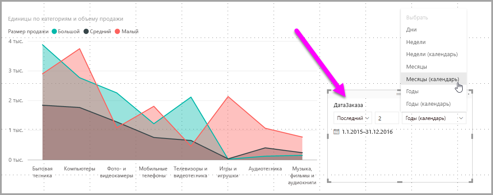
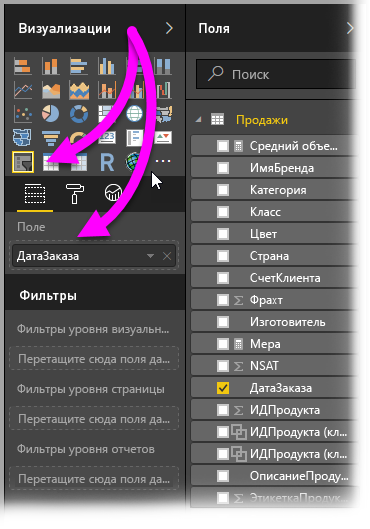
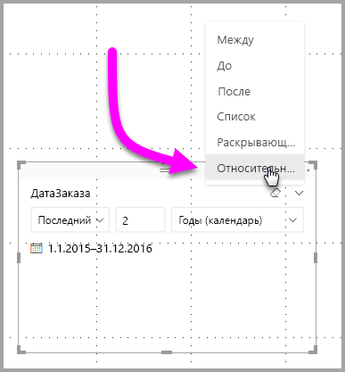
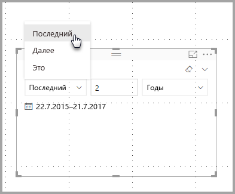
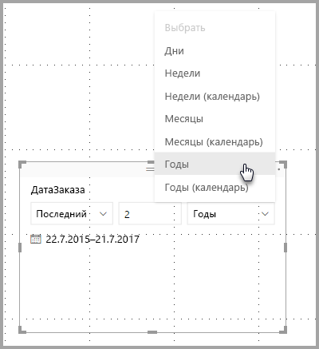
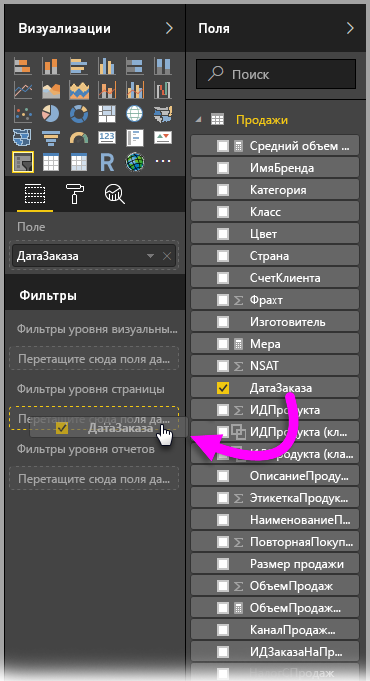
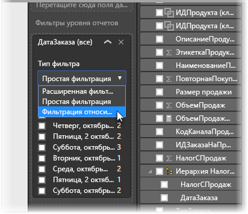
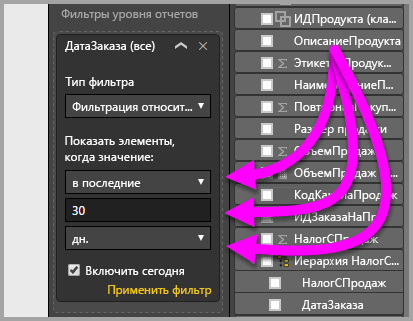

# Использование среза и фильтра относительных дат в Power BI Desktop
**Срез относительных дат** или **фильтр относительных дат** позволяют применять фильтры с учетом времени для любого столбца даты в модели данных. Например, вы можете использовать **срез относительных дат**, чтобы отобразились только данные по продажам за последние 30 дней (или месяц, календарный месяц и т. д). А когда вы обновляете данные, период относительного времени автоматически применяет ограничение относительной даты.

## Использование среза для диапазона относительных дат
Вы можете использовать срез диапазона относительных дат так же, как и любой другой срез. Просто создайте визуальный элемент **Срез** для отчета, а затем выберите значение даты для параметра **Поле**. На следующем изображении выбрано поле *OrderDate*.

В правом верхнем углу области **среза относительных дат** нажмите угловую скобку. Отобразится меню.

Для среза относительных дат выберите *Относительное значение*.

Затем можно выбрать параметры. Для первого раскрывающегося списка в *срезе относительных дат* можно выбрать один из следующих вариантов:

* Последний
* Далее
* Это

Эти параметры показаны на изображении ниже.

Следующий параметр (средний) в *срезе относительных дат* позволяет ввести число, определяющее диапазон относительных дат.

Третий параметр позволяет выбрать меру даты. Можно выбрать следующие значения:

* Дни
* Weeks (Недели);
* Weeks (Calendar) (Календарные недели);
* Months (Месяцы);
* Months (Calendar) (Календарные месяцы);
* Years (Годы);
* Years (Calendar) (Календарные годы).

Эти параметры показаны на изображении ниже.

Если вы выберете *Месяц* в этом списке и введете "2" в средний параметр, произойдет следующее. Если сегодня — 20 июля, в ограниченных срезом визуальных элементах отобразятся данные за два предыдущих месяца: с 20 мая по 20 июля (текущая дата).

Для сравнения, если вы выбрали *Months (Calendar)* (Календарные месяцы), в ограниченных визуальных элементах отобразятся данные с 1 мая по 30 июня (за два последних полных календарных месяца).

## Использование фильтра для диапазона относительных дат
Кроме того, вы можете создать фильтр диапазона относительных дат для всего отчета или его отдельной страницы. Для этого просто перетащите поле даты в области **Page level filters** (Фильтры на уровне страницы) или **Report level filters** (Фильтры на уровне отчета) на панели **Поле**, как показано на следующем рисунке.

После этого вы можете изменить диапазон относительных дат аналогично настройке **среза относительных дат**. В раскрывающемся списке **Тип фильтра** выберите **Фильтрация относительных дат**.

После выбора **фильтрации относительных дат** отобразятся три раздела, которые можно изменить, включая цифровое поле посередине, как и для среза.

Вот и все сведения об использовании этих ограничений относительных дат в отчетах.

## Рекомендации и ограничения
В настоящее время к **срезу** и фильтру диапазона относительных дат применяются описанные ниже ограничения и рекомендации.

* Модели данных в **Power BI** не включают сведения о часовом поясе. В моделях можно сохранить данные времени, но без определения часового пояса, к которому они принадлежат.
* Срезы и фильтры всегда создаются на основе времени в формате UTC. Поэтому если вы настроите фильтр в отчете и отправите его коллеге в другом часовом поясе, и для вас, и для коллеги отобразятся одинаковые данные. Но в часовом поясе, отличном от UTC, могут отображаться данные для другого сдвига по времени.
* Можно преобразовать данные, зафиксированные в местном часовом поясе, в формат UTC с помощью **редактора запросов**.

