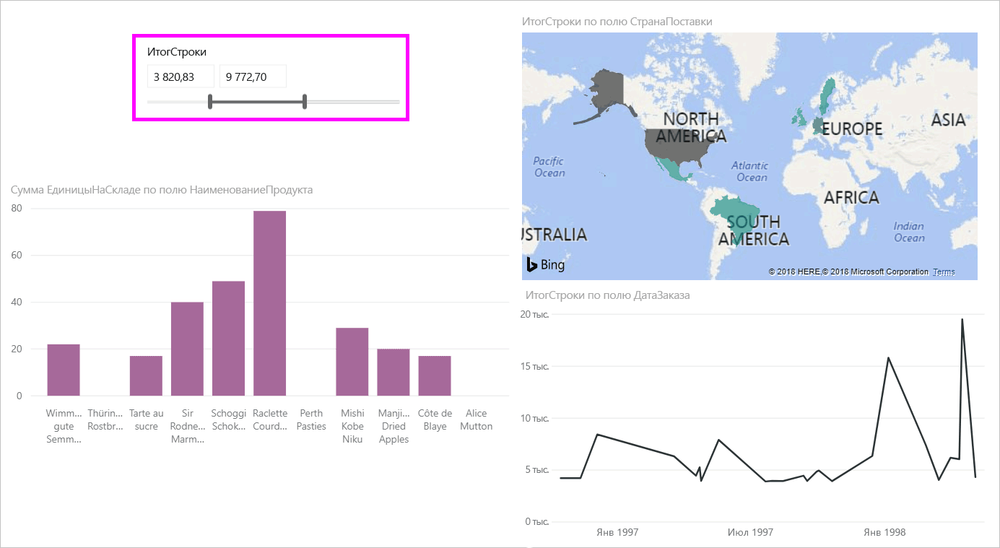
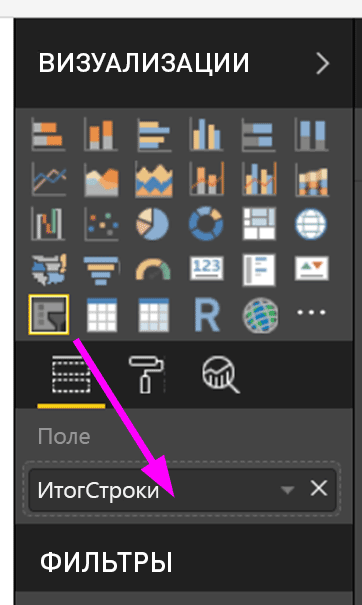
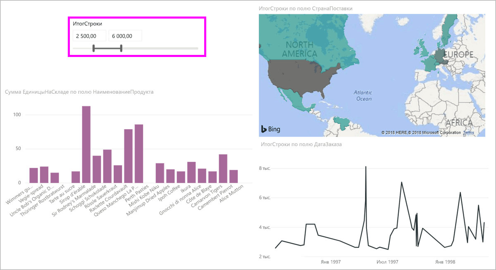
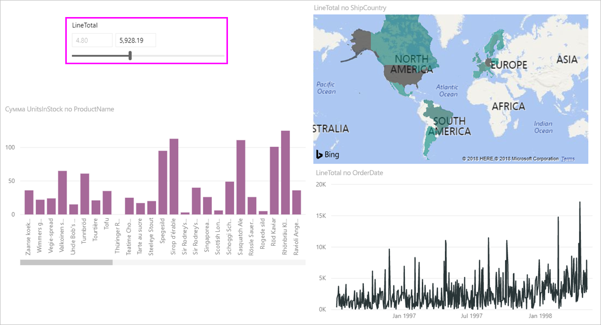
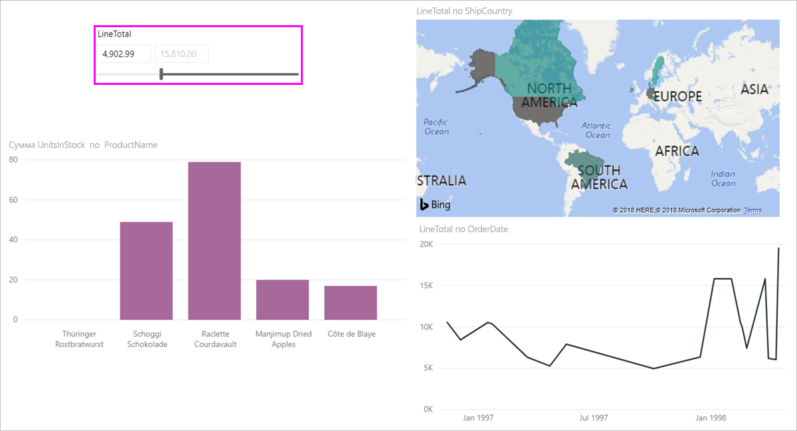

# Использование среза числового диапазона в Power BI Desktop
С помощью **среза числового диапазона** можно применять все виды фильтров к любому числовому столбцу в модели данных. Вы можете выбрать фильтрацию **по диапазону** чисел, а также по значению **не больше** или **не меньше** числа. Хотя эта функция может показаться простой, это очень эффективный способ для фильтрации данных.

## Использование среза числового диапазона
Вы можете использовать срез числового диапазона так же, как и любой другой срез. Просто создайте визуальный элемент **Срез** для отчета, а затем выберите числовое значение для значения **Поле**. На следующем изображении выбрано поле *LineTotal*.

В правом верхнем углу **среза числового диапазона** выберите ссылку со стрелкой вниз, чтобы отобразить меню.

Для числового диапазона можно выбрать один из следующих трех вариантов:

* "Между";
* Меньше или равно
* Больше или равно

При выборе в меню пункта **Между** отображается ползунок, используя который можно отфильтровать числовые значения, которые находятся в диапазоне чисел. Помимо использования самого ползунка можно щелкнуть любое поле и ввести значения. Это удобно, если нужно выполнить срез конкретных чисел, однако из-за степени детализации при перемещении среза достаточно сложно выбрать точное числовое значение.

На следующем рисунке фильтруется страница отчета для значений *LineTotal* в диапазоне от 2500,00 до 6000,00.

При выборе варианта **Меньше или равно** исчезает левый маркер ползунка (меньшее значение). При этом можно настроить только верхнюю границу ползунка. На следующем рисунке мы устанавливаем ползунок на числовое значение 5928,19.

Наконец, при выборе варианта **Больше или равно** исчезает правый маркер ползунка (максимальное значение). При этом можно настроить меньшее значение, как показано на следующем рисунке. Теперь в визуальных элементах на странице отчета отображаются только элементы, значение которых для *LineTotal* больше или равно 4902,99.

## Привязка к целым числам для среза числового диапазона

Срез числового диапазона будет обрезан до целых чисел, если базовое поле имеет тип данных **Целое число**. Это обеспечит точное выравнивание среза по целым числам. В полях с типом **Десятичное число** можно вводить или выбирать дробные числа. Форматирование, применяемое в текстовом поле, соответствует параметру форматирования поля, даже если вы можете вводить или выбирать более точные числа.

## Отображение форматирования с использованием среза диапазона дат

При использовании среза для отображения или задания диапазона дат всегда применяется формат **краткой даты** в соответствии с языковым стандартом браузера или операционной системы пользователя. Этот формат отображения не зависит от типов данных, заданных для базовых данных или модели. 

Например, для базовых данных может быть настроен формат полной даты *дддд, д ММММ гггг*, и в результате в других визуальных элементах дата будет отображаться так: *Среда, 14 марта 2001 г*. Однако в срезе диапазона дат она будет отображаться в следующей форме: *14.03.2001*.

Благодаря использованию формата **краткой даты** в срезе длина строки всегда достаточно мала и одинакова. 

## Рекомендации и ограничения
Сейчас к **срезу числового диапазона** применяются следующие рекомендации и ограничения:

* Сейчас **срез числового диапазона** позволяет фильтровать каждую базовую строку данных и не позволяет отфильтровать агрегированные значения. Например, если используется поле *Sales Amount* (Сумма продаж), каждая транзакция, основанная на значениях *этого поля*, будет отфильтрована. Они фильтруются для каждой точки данных визуального элемента, а не по сумме значений поля *Sales Amount* (Сумма продаж).
* Сейчас это не работает с мерами.
* Вы можете вводить любые числа в текстовые поля числового среза, даже если они выходят за пределы диапазона значений базового столбца. Это позволяет настраивать фильтры, если известно, что в будущем данные могут измениться.
