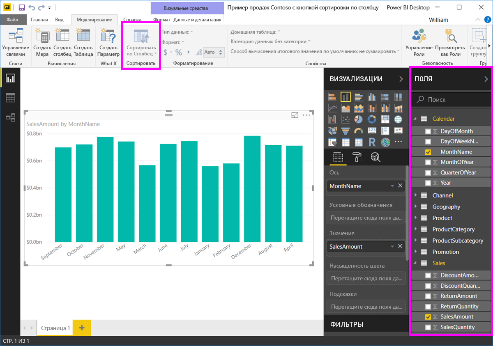

# Сортировка по столбцу в Power BI Desktop
В Power BI Desktop и службе Power BI можно изменять вид визуального элемента, выполнив сортировку по разным полям данных. Изменив порядок сортировки визуального элемента, вы можете выделить информацию, которую необходимо передать, и убедиться в том, что визуальный элемент отражает тенденцию (или акцент).

Независимо от того, используете ли вы числовые (например, объемы продаж) или текстовые данные (например, названия штатов), визуализации можно сортировать. Power BI предоставляет гибкие возможности сортировки и меню быстрого доступа. На любом визуальном элементе для сортировки выберите меню **Дополнительные параметры** (...), команду **Сортировать по**, а затем выберите поле, по которому нужно выполнить сортировку.

## Пример сортировки
Давайте рассмотрим более подробный пример и узнаем, как это работает в Power BI Desktop.

На представленной ниже визуализации показаны затраты, количества и суммы по названию производителя. Визуализация приведена в том виде, как она выглядит до начала какой-либо сортировки.

Сейчас визуальный элемент сортируется по столбцу **SalesQuantity**. Можно определить столбец сортировки, сопоставляя цвет растущих столбцов с условными обозначениями, но есть и более удобный способ: меню **Дополнительные параметры**, доступ к которому можно получить, нажав кнопку с многоточием (...).

Ниже приведены параметры сортировки.

* Текущим полем сортировки является **SalesQuantity**. На это указывает то, что пункт **SalesQuantity** выделен полужирным шрифтом и отмечен желтой полоской. 

* Текущее направление сортировки — по возрастанию, как показано в поле **Сортировка по возрастанию** полужирным шрифтом, за которым следует желтая полоска.

В следующих двух разделах мы рассмотрим поле и направление сортировки.

## Выбор столбца для сортировки
Вы обратили внимание на желтую полоску рядом с пунктом **SalesQuantity** в меню **Дополнительные параметры**. Она указывает на то, что визуальный элемент сортируется по столбцу **SalesQuantity**. Сортировка по другим столбцам проста: нажмите кнопку с многоточием (...), чтобы отобразить меню **Дополнительные параметры**, выберите команду **Сортировать по**, а затем выберите другой столбец.

На представленном ниже рисунке мы выбрали для сортировки столбец **DiscountAmount**. Этот столбец оказался одним из горизонтальных, а не вертикальных элементов визуального элемента. 

Обратите внимание на то, как изменилась диаграмма. Теперь элементы располагаются в порядке от максимального значения **DiscountAmount** (здесь это Fabrikam Inc.) до минимального (Northwind Traders). 

Но что делать, если требуется сортировка по возрастанию, а не по убыванию? В следующем разделе показано, насколько просто выполнить такую сортировку.

## Выбор порядка сортировки
Когда мы подробнее рассмотрим меню **Дополнительные параметры** с предыдущего изображения, мы видим, что **Сортировка по убыванию** выделена полужирным шрифтом и за ней находится желтая полоска.

Когда выбран значок **Сортировка по убыванию**, визуальный элемент сортируется по выбранному столбцу в порядке от максимального значения к минимальному. Хотите это изменить? Проблема не возникает: просто выберите пункт **Сортировка по возрастанию**, и порядок сортировки выбранного столбца изменится на обратный.

Вот тот же визуальный элемент после изменения порядка сортировки по **DiscountAmount**. Обратите внимание на то, что Northwind Traders теперь первый производитель в списке, а Fabrikam Inc. — последний, то есть все стало наоборот.

Можно выполнить сортировку по любому столбцу визуального элемента: выберем **SalesQuantity** в качестве столбца, по которому нужно отсортировать диаграмму, чтобы производители с наибольшим объемом продаж отображались первыми. Другие столбцы по-прежнему будут отображаться на диаграмме, но будут относиться к соответствующему производителю. Вот как выглядит диаграмма с этими настройками.

## Сортировка с помощью кнопки "Сортировка по столбцу"
Вы также можете сортировать данные с помощью кнопки **Сортировка по столбцу** на ленте **Моделирование**.

Чтобы сортировать данные таким способом, вам нужно выбрать столбец в области **Поля**, а затем выбрать **Моделирование** > **Сортировка по столбцу**, чтобы указать столбец для сортировки визуального элемента. Если не выбрать столбец, то кнопка **Сортировать по столбцу** будет неактивна.

Рассмотрим типичный пример. У вас есть данные за каждый месяц года, и вы хотите отсортировать их в хронологическом порядке. Ниже показано, как это сделать.

1. Обратите внимание: если выбрать визуальный элемент, но не выбрать столбец в области **Поля**, кнопка **Сортировка по столбцу** будет неактивна (отображается серым).
   
   

2. Когда вы выбираете в области **Поля** столбец, по которому нужно отсортировать данные, кнопка **Сортировка по столбцу** становится активной.
   
   
3. Выбрав визуальный элемент, выберите **МесяцГода** вместо значения по умолчанию (**НазваниеМесяца**). Визуальный элемент будет отсортирован в нужном порядке — по месяцу года.
   
   

<!---
This functionality is no longer active. Jan 2020

## Getting back to default column for sorting
You can sort by any column you'd like, but there may be times when you want the visual to return to its default sorting column. No problem. For a visual that has a sort column selected, open the **More options** menu and select that column again, and the visualization returns to its default sort column.

For example, here's our previous chart:

When we go back to the menu and select **SalesQuantity** again, the visual defaults to being ordered alphabetically by **Manufacturer**, as shown in the following image.

With so many options for sorting your visuals, creating just the chart or image you want is easy.
--->

## Дальнейшие действия

Рекомендуем также ознакомиться со следующими материалами:

* [Использование детализации между отчетами в Power BI Desktop](desktop-cross-report-drill-through.md)
* [Срезы в Power BI](visuals/power-bi-visualization-slicers.md)

