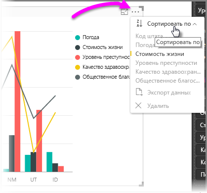
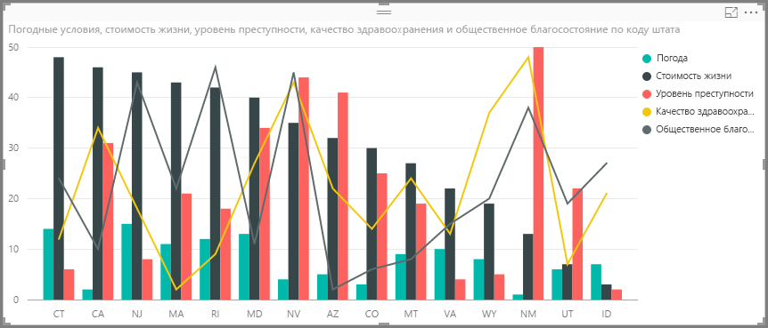
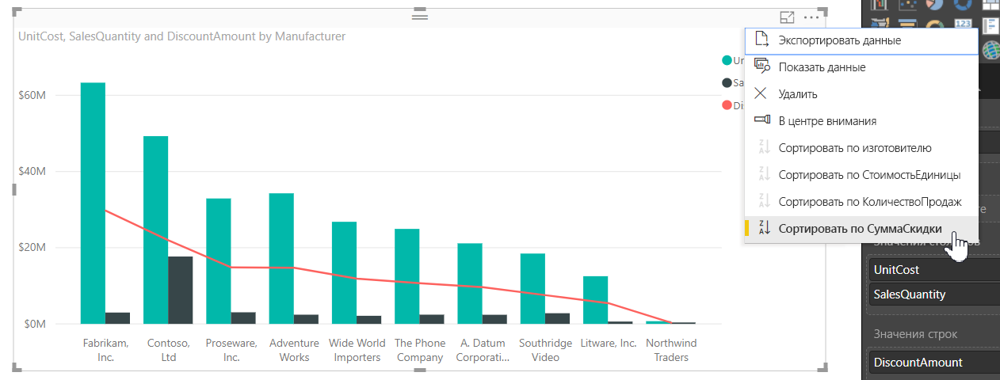
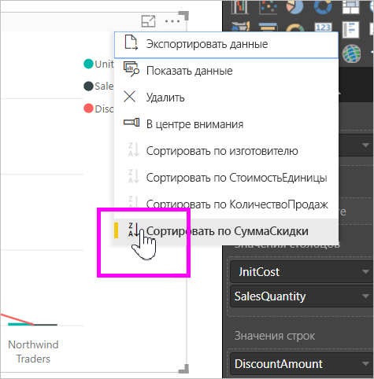
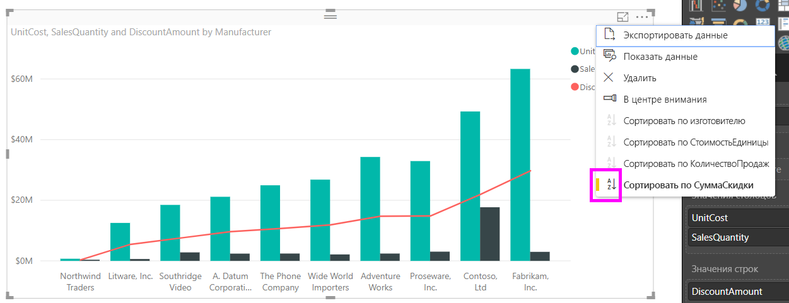
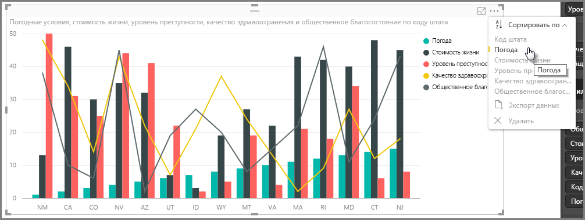
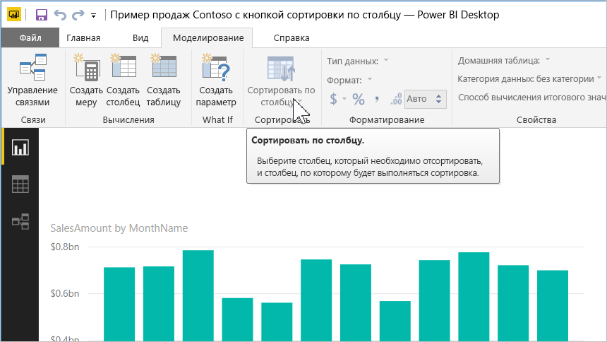
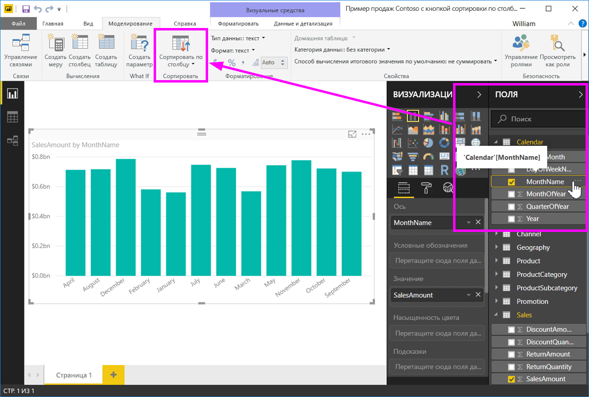
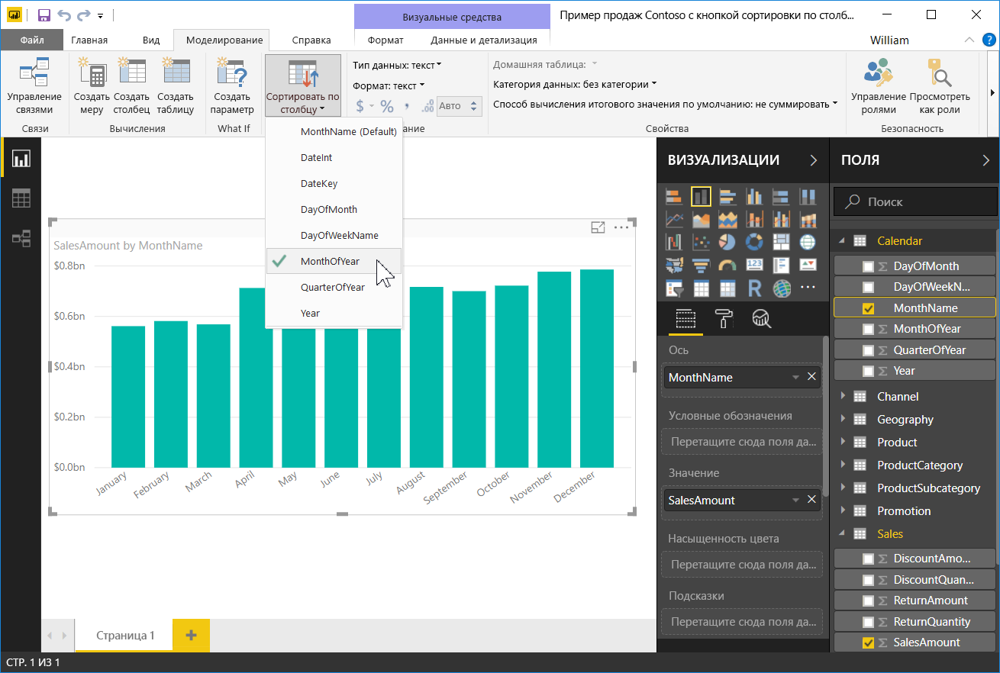
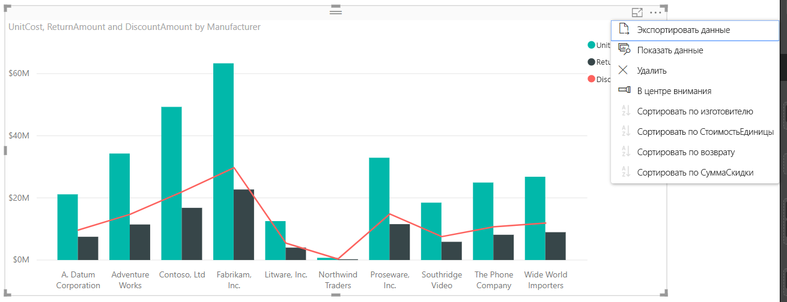

# Сортировка по столбцу в Power BI Desktop
В **Power BI Desktop** и **службе Power BI** можно изменять вид визуального элемента, выполнив сортировку по разным полям данных. Изменив порядок сортировки визуального элемента, вы можете выделить информацию, которую необходимо передать, и убедиться, что визуальный элемент отражает сведения о тенденции или об акценте, на которые нужно обратить внимание.

Независимо от того, используете ли вы числовые (например, объемы продаж) или текстовые данные (например, названия штатов), визуализации можно сортировать в любом удобном вам порядке.  **Power BI** предоставляет гибкие возможности сортировки и меню быстрого доступа. В любом визуальном элементе щелкните меню с многоточием (...), а затем **Sort By** (Сортировка) и выберите поле, по которому необходимо выполнить сортировку, как показано на рисунке ниже.

## Более подробный пример
Давайте рассмотрим более подробный пример и узнаем, как это работает в **Power BI Desktop**.

В следующей визуализации выводится список основных 15 штатов с точки зрения погоды (максимум солнечных дней, порядок от 1 до 50, номер 1 соответствует самому большому числу солнечных дней). Ниже приведена визуализация в том виде, как она выглядит до начала какой-либо сортировки.

Сейчас визуальный элемент отсортирован по **прожиточному минимуму**. Это становится понятно при сопоставлении цветов строк по убыванию с условными обозначениями. Но есть более эффективный способ определить текущую сортировку столбцов: диалоговое окно **Сортировать по**, доступное из меню "многоточия" (...) в правом верхнем углу визуального элемента. Щелкнув многоточие, мы увидим следующее:

Следует обратить внимание на несколько пунктов меню, которое отображается при выборе многоточия:

* желтая черточка рядом с пунктом **Cost of living** (Прожиточный минимум) и тот факт, что **Cost of living** выделен жирным шрифтом;
* маленький значок рядом со словами **Сортировать по** с буквами **Z/A** (Z над A) и стрелкой "вниз".

Мы рассмотрим каждый из этих элементов в следующих двух разделах.

## Выбор столбца для сортировки
Вы заметили желтую черточку рядом с **прожиточному** в **сортировать по** меню, которая указывает, что используется **стоимости жизни** столбца для сортировки визуального элемента. Выполнить сортировку по другому столбцу несложно: просто щелкните многоточие, чтобы вывести на экран меню **Сортировать по**, а затем выберите другой столбец. Очень просто.

На следующем рисунке мы выбрали столбец **Community well-being** (Благосостояние населения) в качестве основания для сортировки. Этот столбец оказался одним из горизонтальных, а не вертикальных элементов диаграммы. Вот так будет выглядеть визуальный элемент после выбора **благосостояния населения**.

Обратите внимание на то, как изменилась диаграмма. Значения теперь упорядочены от самого высокого значения благосостояния населения (в нашем примере это значение для RI — Род-Айленда) для штатов, включенных в эту диаграмму, до наименьшего значения (AZ — Аризона). Помните, что общая диаграмма по-прежнему включает только 15 штатов с максимальным числом солнечных дней, — мы просто упорядочили их, основываясь на другом столбце, включенном в визуальный элемент.

Но что делать, если требуется сортировка по возрастанию, а не по убыванию? В следующем разделе показано, насколько просто выполнить такую сортировку.

## Выбор порядка сортировки: по возрастанию или по убыванию
Приглядевшись к меню **Сортировать по** на предыдущем рисунке, мы увидим, что на значке рядом с **Сортировать по** указаны буквы **Z/A** (Z над A). Посмотрите:

Когда отображается значок **Z/A**, визуальный элемент сортируется по выбранному столбцу в порядке от максимального значения к минимальному. Хотите это изменить? Никаких проблем: просто щелкните значок **Z/A**, порядок сортировки изменится на **A/Z**, и визуальный элемент будет отсортирован от минимального к максимальному значению (на основе выбранного столбца).

Ниже вы видите тот же визуальный элемент, но после щелчка значка **Z/A** в меню **Сортировать по** порядок в нем изменился. Обратите внимание, что AZ (Аризона) теперь является первым штатом в списке, а RI (Род-Айленд) — последним.

Можно выполнить сортировку по любому столбцу визуального элемента: выберем Weather (Погода) в качестве столбца, по которому нужно отсортировать диаграмму, и порядок **Z/A** в меню **Сортировать по**, чтобы штаты с самой солнечной погодой отображались первыми (максимальное значение погоды соответствует числу солнечных дней в этой модели данных): другие столбцы по-прежнему будут отображаться на диаграмме, однако они будут применяться к этому штату. Вот как выглядит диаграмма с этими настройками.

## Сортировка с помощью кнопки "Сортировка по столбцу"
Вы также можете сортировать данные с помощью кнопки **Сортировка по столбцу** на ленте **Моделирование**.

Чтобы сортировать данные таким способом, вам нужно выбрать столбец в области **Поля**, а затем нажать кнопку **Сортировка по столбцу**, чтобы указать столбец для сортировки визуального элемента. Выберите в области **Поля** столбец (поле), который нужно сортировать, чтобы включить кнопку **Сортировка по столбцу**, иначе кнопка будет неактивна.

Рассмотрим типичный пример. У вас есть данные за каждый день недели и вы хотите отсортировать их в хронологическом порядке. Ниже показано, как это сделать.

1. Обратите внимание. Если выбрать визуальный элемент, но не выбрать столбец в области **Поля**, кнопка **Сортировка по столбцу** будет неактивна (отображается серым).
   
   
2. Когда вы выбираете в области **Поля** столбец, по которому нужно отсортировать данные, кнопка **Сортировка по столбцу** становится активной.
   
   
3. Выбрав визуальный элемент, выберите *День недели* вместо значения по умолчанию (*Название дня*). Визуальный элемент теперь будет отсортирован в нужном порядке — по дню недели.
   
   

Вот и все! Не забудьте выбрать столбец в области **Поля**, чтобы активировать кнопку **Сортировка по столбцу**.

## Возврат к столбцу для сортировки по умолчанию
Сортировку можно выполнять по любому столбцу, но бывают случаи, когда требуется вернуть визуальный элемент к столбцу для сортировки по умолчанию. Это не проблема. Для визуального элемента, для которого был выбран столбец сортировки (помните, что рядом с выбранным столбцом сортировки отображается желтая черточка в меню **Сортировать по**), откройте меню **Сортировать по** и снова выберите нужный столбец: визуализация возвращается к столбцу сортировки по умолчанию.

Например, вот наша диаграмма:

Если вернуться в меню и снова выбрать столбец **Погода**, визуальный элемент вернется к стандартной сортировке по алфавиту по **коду штата**, как показано на следующем рисунке.

Создание нужных диаграмм и изображений очень сильно упрощается благодаря такому широкому набору возможностей сортировки.

