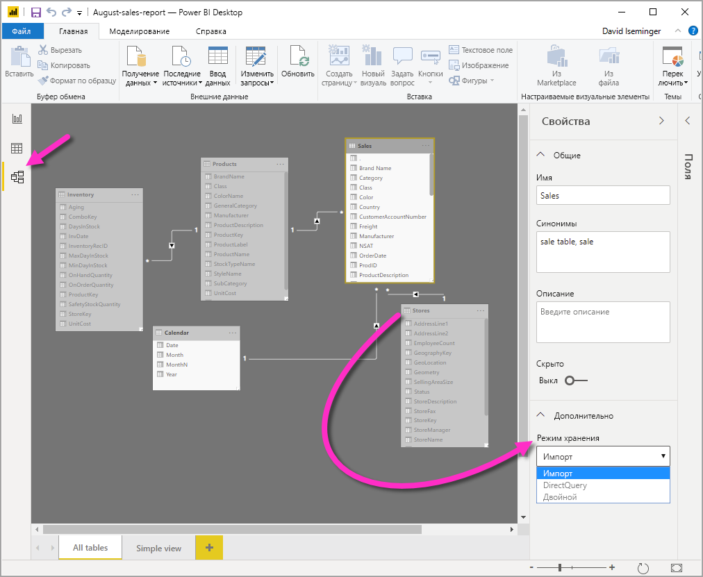

# Управление режимом хранения в Power BI Desktop

В Microsoft Power BI Desktop вы можете указать режим хранения таблицы. Использование режима хранения позволяет выбрать, будет ли Power BI Desktop кэшировать в памяти данные таблиц для отчетов. 

Использование режима хранения обеспечивает много преимуществ. Режим хранения можно задать отдельно для каждой таблицы в модели. Это действие позволяет использовать один набор данных и получить следующие преимущества.

* **Производительность запросов**. При взаимодействии пользователей с визуальными элементами в отчетах Power BI отправляются запросы DAX к набору данных. Кэширование данных в памяти с правильным выбором режима хранения помогает значительно повысить производительность и улучшить интерактивность отчетов.

* **Большие наборы данных**. Таблицы, которые не кэшируются, не потребляют память для кэширования. Можно включить интерактивный анализ для больших наборов данных, которые слишком велики или дороги для полного кэширования в память. Также вы можете выбрать, какие таблицы следует кэшировать, а какие нет.

* **Оптимизация обновления данных**. Таблицы, которые не кэшируются, не нужно обновлять. Вы можете сократить время обновления, кэшируя только необходимые данные с учетом соглашений об уровне обслуживания и бизнес-требований.

* **Требование использования практически в реальном времени**. Таблицы с требованием использования практически в реальном времени могут выиграть от отсутствия кэширования, так как это уменьшает задержку при передаче данных.

* **Обратная запись**. Обратная запись позволяет бизнес-пользователям исследовать сценарии гипотез, изменяя значения ячеек. Пользовательские приложения могут применять изменения к источнику данных. В таблицах, которые не кэшируются, изменения могут отражаться немедленно, что позволяет тут же анализировать влияние изменений.

Функция режима хранения в Power BI Desktop является одной из трех связанных функций:

* **Составные модели.** Они позволяют включить в отчет несколько подключений к данным в любом сочетании, в том числе подключения DirectQuery или импорт. Дополнительные сведения см. в статье [Использование составных моделей в Power BI Desktop](desktop-composite-models.md).

* **Связи "многие ко многим"** . В составных моделях вы можете установить между таблицами связи *многие ко многим*. Связи "многие ко многим" избавляют от необходимости поддерживать уникальные значения в таблицах. Также они позволяют обойтись без предыдущих обходных путей, например создания новых таблиц исключительно для образования связей. Дополнительные сведения см. в статье [О связях "многие ко многим" в Power BI Desktop](desktop-many-to-many-relationships.md).

* **Режим хранения.** Режим хранения позволяет указать, в каких визуальных элементах будут использоваться запросы к источникам данных серверной части. Визуальные элементы, которым не нужны такие запросы, всегда импортируются, даже если они основаны на DirectQuery. Эта функция помогает повысить производительность и снизить нагрузку на серверную часть. Ранее даже простые визуальные элементы, например срезы, инициировали запросы к серверным источникам. 

## Использование свойства режима хранения

**Режим хранения** — это свойство, которое можно задать для каждой таблицы в модели. Оно управляет тем, как Power BI кэширует табличные данные.

Чтобы задать **режим хранения** или просмотреть его текущее значение, выполните следующие действия. 

1. В представлении **Модель** выберите таблицу, свойства которой необходимо просмотреть или задать. 
2. В области **Свойства** разверните раздел **Дополнительно** и разверните раскрывающийся список **Режим хранения**.

   

Задайте для свойства **Режим хранения** одно из следующих трех значений.

* **Импорт**. Импортированные таблицы с этим значением кэшируются. Запросы к набору данных Power BI, которые возвращают данные из таблиц импорта, могут быть выполнены только из кэшированных данных.

* **DirectQuery**. Таблицы с этим значением не кэшируются. Запросы, отправленные к набору данных Power BI &mdash;(например, запросы DAX)&mdash;, которые возвращают данные из таблиц DirectQuery, могут быть выполнены только с помощью запросов по требованию к источнику данных. В запросах, отправленных к источнику данных, используется язык запросов для соответствующего источника (например, SQL).

* **Двойной**. Таблицы с этим значением могут функционировать как кэшированные или некэшированные в зависимости от контекста запроса, отправленного к набору данных Power BI. В некоторых случаях запросы будут выполняться из кэшированных данных. В других случаях для обработки запроса потребуется запрос к источнику данных.

Указание для **режима хранения** таблицы значения **Импорт** — *необратимая* операция. После этого вы не сможете вернуть для нее значение **DirectQuery** или **Двойной**.

> [!NOTE]
> В Power BI Desktop и службе Power BI можно использовать **двойной** режим хранения.

## Ограничения для таблиц DirectQuery и двойных таблиц

К двойным таблицам применяются те же функциональные ограничения, что и к таблицам DirectQuery. К ним относятся ограниченный набор М-преобразований и ограниченные функции DAX в вычисляемых столбцах. Дополнительные сведения см. в разделе [Ограничения использования DirectQuery](desktop-directquery-about.md#implications-of-using-directquery).

## Распространение двойного режима хранения
Возьмем следующую простую модель, где все таблицы поступают из единого источника, поддерживающего режим импорта и DirectQuery.

Для начала предположим, что все таблицы в этой модели являются таблицами **DirectQuery**. Если мы затем изменим **режим хранения** для таблицы **SurveyResponse** на **Импорт**, отобразится следующее предупреждение:

Таблицам измерений (**Customer**, **Geography** и **Date**) можно задать **двойной** режим, чтобы сократить количество слабых связей в наборе данных и повысить производительность. Слабые связи обычно включают по меньшей мере одну таблицу DirectQuery, где логика соединения не поддерживается исходными системами. Поскольку таблицы с двойным режимом могут действовать как DirectQuery или таблицы с импортом, такая ситуация исключается.

Логика распространения помогает управлять моделями, которые содержат большое количество таблиц. Предположим, у вас есть модель с 50 таблицами и только некоторые таблицы фактов (транзакционные таблицы) нужно кэшировать. Логика в Power BI Desktop определяет минимальный набор таблиц измерения, для которых нужно задать **двойной** режим, поэтому вам не нужно об этом беспокоиться.

Логика распространения обрабатывает только одну сторону в рамках связей "один ко многим".

## Пример использования режима хранения
Давайте продолжим работу с примером из предыдущего раздела и представим, что мы применяем следующие настройки для режима хранения:

| Таблица                   | Режим хранения         |
| ----------------------- |----------------------| 
| Продажи                 | DirectQuery          | 
| SurveyResponse        | Импорт               | 
| Дата                  | Двойной                 | 
| Клиент              | Двойной                 | 
| Географический регион             | Двойной                 | 

Применение этих параметров режима хранения приводит к следующим результатам при условии, что в таблице **Sales** содержится значительный объем данных.
* Power BI Desktop кэширует таблицы измерения (**Date**, **Customer** и **Geography**), поэтому время загрузки начальных отчетов должно быть небольшим при получении значений срезов для отображения.
* Power BI Desktop не кэширует таблицу **Sales**. Не используя кэширование для таблицы, Power BI Desktop обеспечивает следующие результаты.
    * Время обновления данных и потребление памяти сокращаются.
    * Запросы, основанные на таблице **Sales**, выполняются в режиме **DirectQuery**. Выполнение таких запросов может быть более длительным, но их результаты будут ближе к режиму реального времени, так как отсутствует задержка кэширования.

* Запросы отчетов на основе таблицы **SurveyResponse** возвращаются из кэша в памяти и поэтому выполняются относительно быстро.

## Запросы, попадающие или не попадающие в кэш

Подключив SQL Profiler к порту диагностики Power BI Desktop, можно увидеть, какие запросы попадают или не попадают в кэш в памяти, выполняя трассировку на основе следующих событий.

* Queries Events\Query Begin
* Query Processing\Vertipaq SE Query Begin
* Query Processing\DirectQuery Begin

Для каждого события *Query Begin* проверьте другие события с таким же идентификатором *ActivityID*. Например, если событие *DirectQuery Begin* отсутствует, но есть событие *Vertipaq SE Query Begin*, ответ на запрос поступает из кэша.

Запросы, которые обращаются к таблицам в двойном режиме, по возможности возвращают данные из кэша; в противном случае используется режим DirectQuery.

Продолжая предыдущий пример, следующий запрос обращается только к столбцу из таблицы **Date** в **двойном** режиме. Таким образом, он должен выбрать данные из кэша.

Следующий запрос обращается только к столбцу из таблицы **Sales** в режиме **DirectQuery**. Таким образом, он *не* должен выбирать данные из кэша.

Следующий запрос примечателен тем, что в нем сочетаются оба столбца. Этот запрос не попадет в кэш. Возможно, сначала вы ожидали получить значения **CalendarYear** из кэша и значения **SalesAmount** из источника с последующим объединением результатов, но это будет менее эффективно, чем отправка операции SUM/GROUP BY в систему источника. Если операция будет принудительно отправлена в источник, количество возвращенных строк будет гораздо меньше. 

> [!NOTE]
> Это поведение отличается от [связей "многие ко многим"](desktop-many-to-many-relationships.md) в Power BI Desktop при объединении кэшированных и некэшированных таблиц.

## Кэши должны поддерживаться в синхронизированном состоянии

Представленные в предыдущем разделе запросы показывают, что таблицы в двойном режиме иногда попадают в кэш, а иногда не попадают. Это означает, что при устаревшем кэше могут возвращаться разные значения. При выполнении запроса не будет произведена попытка скрыть проблемы с данными, например, фильтрацией результатов DirectQuery для соответствия кэшированным значениям. Предполагается, что вы знаете характеристики своих потоков данных, чтобы в соответствии с этим вести разработку. При необходимости можно воспользоваться установленными методами обработки таких ситуаций на стороне источника.

**Двойной** режим хранения — это способ оптимизировать производительность. Его следует использовать только так, чтобы это не помешало выполнению бизнес-требований. Для реализации альтернативного поведения попробуйте применить приемы, описанные в статье [Связи "многие ко многим" в Power BI Desktop](desktop-many-to-many-relationships.md).

## Представление данных
Если хотя бы для одной таблицы в наборе данных установлен режим хранения **Импорт** или **Двойной**, отображается вкладка представления **Данные**.

При выборе в представлении **Данные** таблиц в двойном режиме или режиме импорта отображаются кэшированные данные. Для таблиц DirectQuery данные не отображаются. Вместо этого отображается сообщение о том, что таблицы DirectQuery не могут быть показаны.

## Рекомендации и ограничения

В этом выпуске есть несколько ограничений для режима хранения и его связи с составными моделями.

Следующие многомерные источники с интерактивным подключением невозможно использовать с составными моделями:

* SAP HANA
* SAP Business Warehouse
* Службы SQL Server Analysis Services
* Наборы данных Power BI
* Azure Analysis Services

При подключении к этим многомерным источникам в режиме DirectQuery невозможно одновременно подключиться к другому источнику DirectQuery или сочетать его с импортированными данными.

Существующие ограничения для использования DirectQuery по-прежнему действуют при применении составных моделей. Многие из этих ограничений теперь относятся к отдельным таблицам в зависимости от режима хранения для каждой таблицы. Например, вычисляемый столбец в импортированной таблице может ссылаться на другие таблицы, но вычисляемый столбец в таблице DirectQuery по-прежнему ограничен ссылками только на столбцы той же таблицы. Другие ограничения применяются к модели в целом, если все таблицы в пределах модели являются таблицами DirectQuery. Например, функции "Краткая аналитика" и "Вопросы и ответы" недоступны в модели, если какая-либо из таблиц в ней используется в режиме хранения DirectQuery. 

## Дальнейшие действия

Дополнительные сведения о составных моделях и DirectQuery см. в следующих статьях:
* [Составные модели в Power BI Desktop](desktop-composite-models.md)
* [Связи "многие ко многим" в Power BI Desktop](desktop-many-to-many-relationships.md)
* [Использование Power BI в DirectQuery](desktop-directquery-about.md)
* [Источники данных, поддерживаемые DirectQuery в Power BI](desktop-directquery-data-sources.md)
