# Учебник. Создание вычисляемых столбцов в Power BI Desktop

Иногда в данных, которые вы анализируете, отсутствует определенное поле, необходимое для получения нужных результатов. Тогда появляются *вычисляемые столбцы*. Вычисляемые столбцы определяют значения с помощью формул выражения анализа данных (DAX). Это может быть совместное размещение текстовых значений из нескольких разных столбцов в любом месте модели или вычисление числового значения из других значений. Например, предположим, что в данных имеются поля **Город** и **Штат**, но требуется одно поле **Расположение**, в котором содержатся оба значения, например "Майами, Флорида". Это именно то, для чего предназначены вычисляемые столбцы.

Вычисляемые столбцы похожи на [меры](desktop-tutorial-create-measures.md) в том, что они строятся на формуле DAX, но их использование отличается. Меры часто используются в области **Значения** визуализации для вычисления результатов на основе других полей. Вычисляемые столбцы используются в качестве новых **полей** в строках либо в области оси, условных обозначений или группы визуализаций.

Это руководство поможет понять вычисляемые столбцы, создать несколько собственных и использовать их в визуализациях отчетов в Power BI Desktop. 

### Предварительные требования
- Это руководство предназначено для пользователей Power BI, которые знают, как использовать Power BI Desktop для создания более сложных моделей. Вы должны уметь импортировать данные с помощью функции **Получить данные** и **редактора Power Query**, работать с несколькими связанными таблицами и добавлять поля на холст отчета. Если вы еще не знакомы с Power BI Desktop, прочтите статью [Начало работы с Power BI Desktop](desktop-getting-started.md).
  
- В этом руководстве используется файл [Продажи Contoso для Power BI Desktop](http://download.microsoft.com/download/4/6/A/46AB5E74-50F6-4761-8EDB-5AE077FD603C/Contoso%20Sales%20Sample%20for%20Power%20BI%20Desktop.zip). Этот же пример используется в руководстве по [созданию собственных мер в Power BI Desktop](desktop-tutorial-create-measures.md). Эти данные по продаже товаров вымышленной компании Contoso, Inc. были импортированы из базы данных, поэтому вы не сможете подключаться к источнику данных или просматривать его в редакторе Power Query. Загрузите, а затем извлеките файл на своем компьютере и откройте его в Power BI Desktop.

## Создание вычисляемого столбца со значениями из связанных таблиц

Предположим, что в отчете о продажах необходимо отобразить категории и подкатегории продуктов одним значением, например "Сотовые телефоны — принадлежности", "Сотовые телефоны — смартфоны и КПК" и т. д. В списке **Поля** нет поля, которое содержит необходимые данные, но есть поля **ProductCategory** и **ProductSubcategory** (каждое в своей таблице). Вы можете создать вычисляемый столбец, который объединяет значения из этих двух столбцов. Формулы DAX могут использовать все возможности существующей модели, в том числе уже имеющиеся связи между различными таблицами. 

 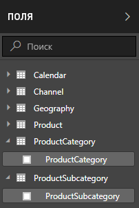

1.  Выберите **Дополнительные параметры** (...) или щелкните правой кнопкой мыши таблицу **ProductSubcategory** в списке "Поля", а затем выберите **Создать столбец**. Это создаст столбец в таблице ProductSubcategory.
    
    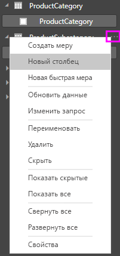
    
    В верхней части холста отчета появится строка формул, в которой можно присвоить столбцу имя и ввести формулу DAX.
    
    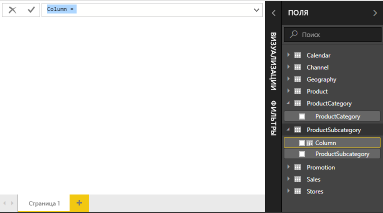
    
2.  По умолчанию новый вычисляемый столбец получает имя Column. Если его не переименовать, следующие созданные столбцы получат имя Column 2, Column 3 и т. д. Чтобы проще идентифицировать столбец, переименуйте его. Так как имя **Column** уже выделено в строке формул, введите **ProductFullCategory**, а затем — знак равенства (**=**).
    
3.  Предположим, необходимо, чтобы значения в новом столбце начинались с имени ProductCategory. Так как этот столбец находится в другой, но связанной таблице, чтобы получить его, можно использовать функцию [RELATED](https://msdn.microsoft.com/library/ee634202.aspx).
    
    После знака равенства введите **R**. Появится раскрывающийся список предложений со всеми функциями DAX, начинающимися с буквы R. При выборе каждой функции отображается ее описание. По мере ввода список предложений становится короче. Выберите функцию **RELATED**, а затем нажмите клавишу **ВВОД**.
    
    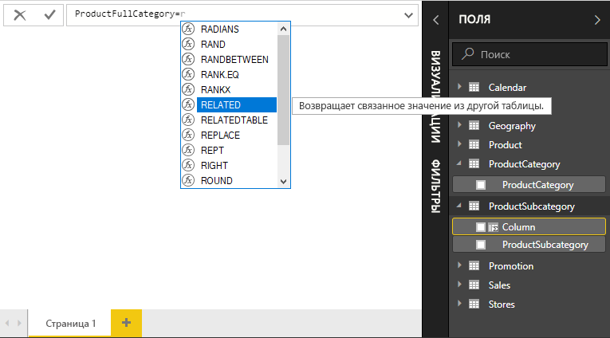
    
    Появится открывающая скобка, а также список предложений всех доступных столбцов, которые можно передать в функцию RELATED, с описаниями и сведениями об ожидаемых параметрах. 
    
    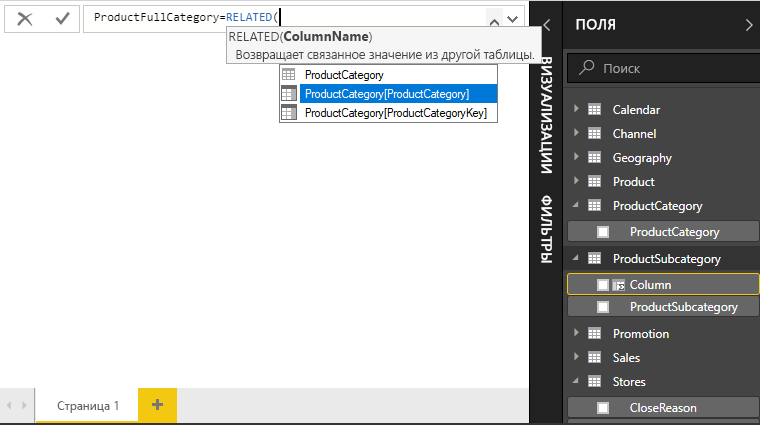
    
4.  Предположим, нужен столбец **ProductCategory** из таблицы **ProductCategory**. Выберите **ProductCategory[ProductCategory]**, нажмите клавишу **ВВОД**, а затем введите закрывающую скобку.
    
    > [!TIP]
    > Синтаксические ошибки чаще всего вызваны отсутствующей или неправильно расположенной закрывающей скобкой. Иногда Power BI Desktop добавляет скобки автоматически.
    
4. Необходимо добавить тире и пробелы, чтобы разделять значения ProductCategories и ProductSubcategories, поэтому после закрывающей круглой скобки первого выражения введите пробел, амперсанд (**&**), кавычку (**"**), пробел, тире (**-**), еще один пробел, еще одну кавычку и еще один амперсанд. Теперь ваша формула должна выглядеть следующим образом:
    
    `ProductFullCategory = RELATED(ProductCategory[ProductCategory]) & " - " &`
    
    > [!TIP]
    > Если требуется больше места, щелкните шеврон внизу справа от строки формулы, чтобы развернуть редактор формул. В редакторе нажмите клавиши **Alt + ВВОД**, чтобы переместиться на строку вниз, или **клавишу табуляции**, чтобы пролистывать.
    
5.  Введите открывающую скобку (**[**), а затем выберите столбец **[ProductSubcategory]**, чтобы завершить формулу. 
    
    
    
    Чтобы вызвать таблицу ProductSubcategory, во втором выражении не нужно использовать другую функцию RELATED, так как вы создаете вычисляемый столбец в этой таблице. Вы можете ввести имя столбца [ProductCategory] как с именем таблицы (полное имя), так и без него (неполное имя).
    
6.  Завершите ввод формулы, нажав клавишу **ВВОД** или выбрав флажок в строке формулы. Формула проверяется, а столбец **ProductFullCategory** отображается в таблице **ProductSubcategory** в списке "Поля". 
    
    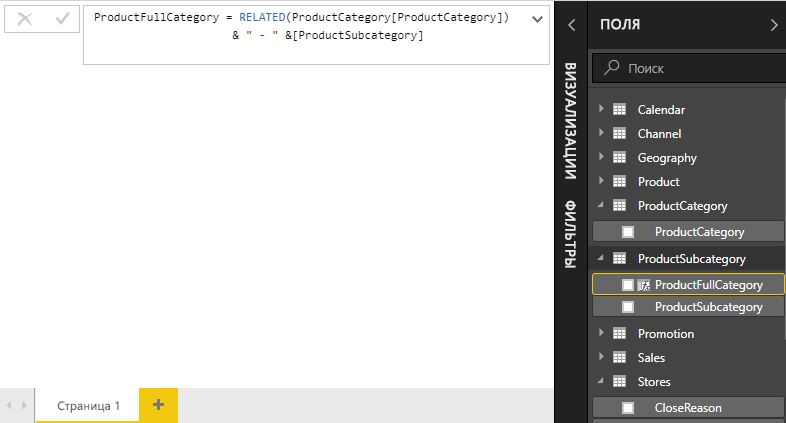
    
    >[!NOTE]
    >В Power BI Desktop вычисляемые столбцы в списке "Поля" имеют специальный значок. Это показывает, что они содержат формулу. В службе Power BI (сайт Power BI) изменить формулу нельзя, поэтому вычисляемые столбцы значком не помечаются.
    
## Использование нового столбца в отчете

Теперь вы можете использовать новый столбец ProductFullCategory, чтобы посмотреть на объемы продаж (SalesAmount) по полным категориям продуктов (ProductFullCategory).

1. Выберите или перетащите столбец **ProductFullCategory** из таблицы **ProductSubcategory** на холст отчета, чтобы создать таблицу с именами ProductFullCategory.
   
   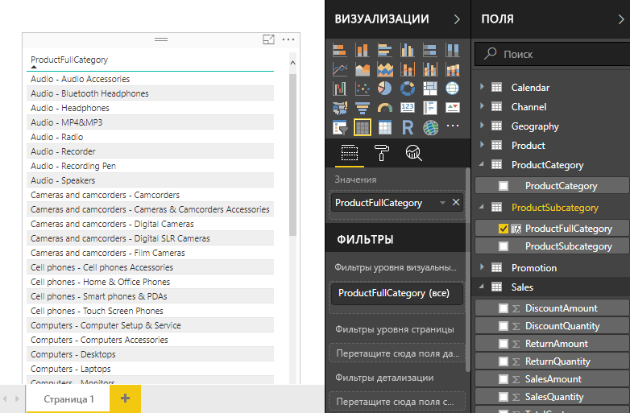
    
2. Выберите или перетащите поле **SalesAmount** из таблицы **Sales** в таблицу, чтобы отобразить объемы продаж (SalesAmount) по полным категориям продуктов (ProductFullCategory).
   
   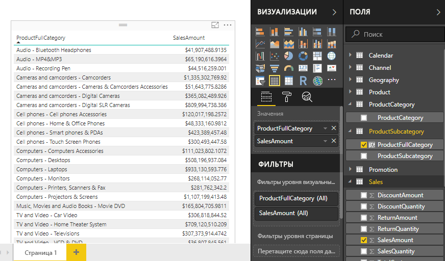
    
## Создание вычисляемых столбцов, использующих функцию IF

Модель "Продажи Contoso" содержит данные о продажах с действующих и недействующих складов. Необходимо отделить в отчете продажи с действующих от продаж с недействующих складов. Фактически нужно создать поле с именем Active StoreName. В новом вычисляемом столбце Active StoreName каждый активный склад будет отображаться вместе с полным именем, а в качестве имени недействующего склада будет отображаться значение "Недействующий". 

К счастью, в таблице Stores есть столбец с именем **Status**, в котором для действующих складов содержится значение On, а для недействующих — Off, с помощью которых можно создать значения для нового столбца Active StoreName. Формула DAX с помощью логической функции [IF](https://msdn.microsoft.com/library/ee634824.aspx) будет проверять состояние каждого склада и возвращать конкретное значение в зависимости от результата. Если состояние склада имеет значение On, формула вернет его имя. Если это значение Off, формула вернет значение "Недействующий". 

1.  Создайте вычисляемый столбец в таблице **Stores** с именем **Active StoreName** в строке формул.
    
2.  После знака **=** начните вводить **IF**. В списке предложений отобразятся варианты, которые можно добавить. Выберите **ЕСЛИ**.
    
    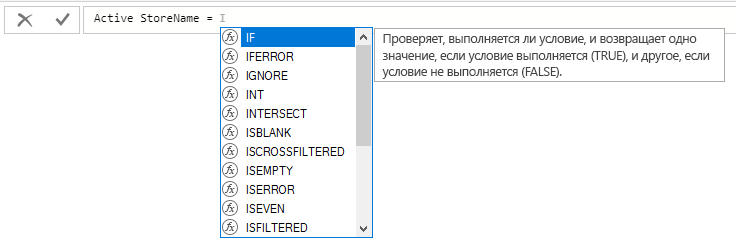
    
3.  Первый аргумент для функции IF является логическим тестом. Необходимо проверить, имеет ли склад состояние On. Введите открывающую квадратную скобку **[**, которая позволяет выбрать столбцы из таблицы Stores, и выберите **[Status]**.
    
    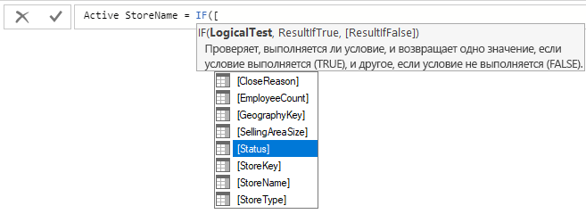
    
4.  Сразу после **[Status]** введите **="On"**, а затем поставьте запятую (**,**), чтобы завершить аргумент. Подсказка указывает, что необходимо добавить значение для результата true.
    
    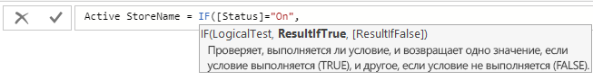
    
5.  Если склад имеет состояние On, нужно показать его название. Введите открывающую квадратную скобку (**[**) и выберите столбец **[StoreName]**, а затем введите еще одну запятую. Теперь подсказка указывает, что необходимо добавить значение для результата false. 
    
    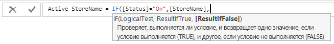
    
6.  Если требуется, чтобы значение было *Недействующий*, введите **Недействующий**, а затем завершите формулу, нажав клавишу **ВВОД** или выбрав флажок в строке формул. Формула проверяется и добавляется в список "Поля" в таблице **Stores**.
    
    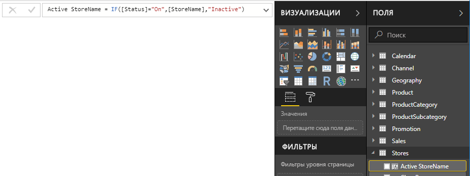
    
8.  Подобно любому другому полю мы используем наш новый столбец Active StoreName в визуализации. Чтобы отобразить объемы продаж по имени действующих складов, выберите поле **Active StoreName** или перетащите его на холст, а затем выберите поле **SalesAmount** или перетащите его в таблицу. В этой таблице действующие склады отображаются отдельно по имени, а недействующие группируются в конце со значением *Недействующие*. 
    
    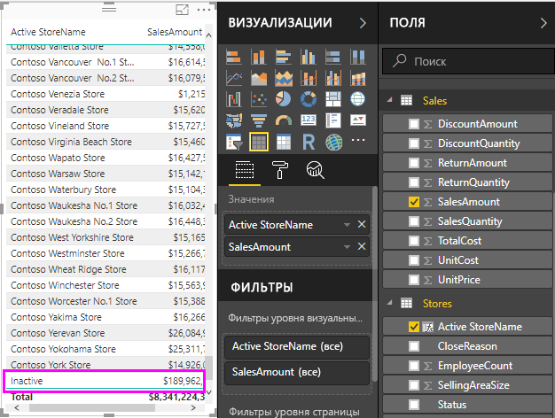
    
## Что вы узнали
Вычисляемые столбцы могут обогатить ваши данные и предоставить простые аналитические данные. Вы научились создавать вычисляемые столбцы в списке полей и на панели формул, использовать списки предложений и всплывающие подсказки для помощи в построении формул, вызывать такие функции DAX, как RELATED и IF, с соответствующими аргументами и использовать вычисляемые столбцы при визуализации отчетов.

## Дальнейшие действия
Если вы хотите более подробно изучить формулы DAX и создавать вычисляемые столбцы с помощью более сложных формул, см. статью [Основные сведения о DAX в Power BI Desktop](desktop-quickstart-learn-dax-basics.md). В этой статье описываются основные понятия языка DAX, такие как синтаксис, функции, и дается более глубокое объяснение контекста.

Рекомендуется добавить в избранное [справочник по языку выражений анализа данных (DAX)](https://msdn.microsoft.com/library/gg413422.aspx). В нем можно найти подробные сведения о синтаксисе DAX, операторах и более чем о 200 функциях DAX.

