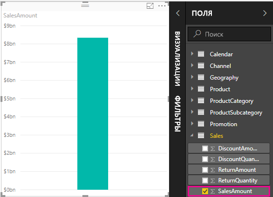
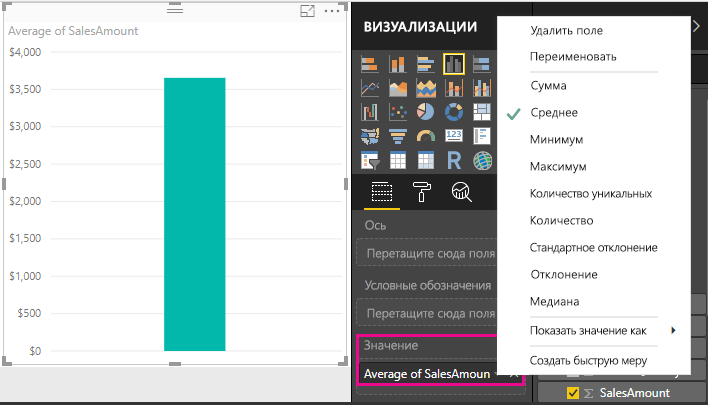
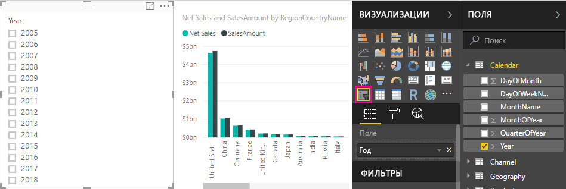
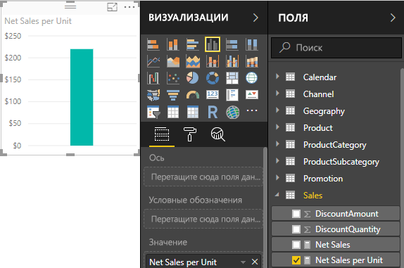
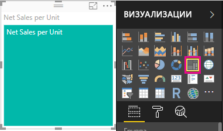
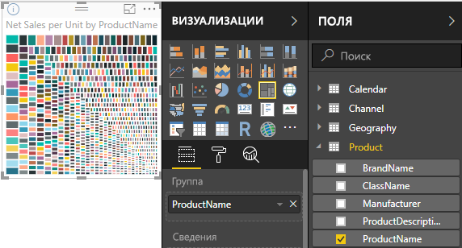

# Учебник. Создание собственных мер в Power BI Desktop
Некоторые наиболее мощные решения для анализа данных в Power BI Desktop можно создать с помощью мер. Меры полезны тем, что выполняют вычисления с нашими данными, получаемыми по мере взаимодействия с отчетами. Этот учебник поможет вам понять меры и создать несколько собственных базовых мер в Power BI Desktop.

Эта статья предназначена для пользователей Power BI, уже знакомых с использованием Power BI Desktop для создания более сложных моделей. Вы должны уметь использовать запрос для импорта данных, работать с несколькими связанными таблицами и добавлять поля на холст отчета. Если вы еще не знакомы с Power BI Desktop, прочтите статью [Начало работы с Power BI Desktop](desktop-getting-started.md).

Для выполнения действий из этого учебника вам нужно скачать файл [Contoso Sales for Power BI Desktop](http://download.microsoft.com/download/4/6/A/46AB5E74-50F6-4761-8EDB-5AE077FD603C/Contoso%20Sales%20Sample%20for%20Power%20BI%20Desktop.zip). Он уже содержит данные по продаже товаров через Интернет вымышленной компании Contoso, Inc. Так как данные в этом файле были импортированы из базы данных, вы не сможете подключаться к источнику данных или просматривать его в редакторе запросов. Загрузив этот файл на компьютер, откройте его в Power BI Desktop.

## В чем суть мер?
Чаще всего меры создаются автоматически, например когда мы устанавливаем флажок рядом с полем **SalesAmount** из таблицы **Sales** (Продажи) в списке полей или когда перетаскиваем поле **SalesAmount** на холст отчета.

Появляется новая визуализация диаграммы, подобная показанной на рисунке.

Мы получаем гистограмму, показывающую общую сумму значений продаж из поля SalesAmount.  Поле SalesAmount — это просто столбец с именем SalesAmount в таблице Sales (Продажи), которую мы уже импортировали.

Столбец SalesAmount содержит более двух миллионов строк значений продаж. Возможно, вас удивляет, что вы не видите таблицу со строками всех этих значений. Просто Power BI Desktop знает, что все значения в SalesAmount имеют числовой тип данных, и вы, скорее всего, захотите выполнить какие-либо статистические вычисления: сложение, вычисление среднего значения, подсчет и т. д.

Если поле в списке полей отображается со значком "сигма" , значит это числовое поле и с его значениями можно выполнять статистические вычисления. В этом случае, когда мы выбираем SalesAmount, Power BI Desktop создает собственную меру, и сумма всех продаж вычисляется и отображается в нашей диаграмме.

Сумма — это статистическая обработка по умолчанию, когда выбирается поле с числовым типом данных, но мы можем довольно легко изменить его на другой тип статистической обработки.

Если в области **Значение** (Value) щелкнуть стрелку вниз рядом с полем **SalesAmount**, можно выбрать **СРЗНАЧ**.

Тогда наша визуализация изменится и будет отображать среднее значение продаж в поле SalesAmount.

Мы можем изменять тип статистической обработки в зависимости от требуемого результата, но не все типы статистической обработки применяются к любому числовому типу данных. Например для поля SalesAmount имеет смысл вычисление суммы и среднего значения. Также может применяться вычисление максимального и минимального значения. Однако Count (подсчет количества) не будет иметь смысла для поля SalesAmount, так как хотя его значения и числовые, они представляют денежные значения.

Понимание статистических вычислений — это основа для понимания мер, поскольку каждая мера будет выполнять какой-либо тип статистической обработки. Мы рассмотрим дополнительные примеры использования статистического вычисления СУММ немного позже, при создании некоторых собственных мер.

Значения, вычисленные из мер, всегда изменяются в ответ на наше взаимодействие с отчетом. Например, если мы перетаскиваем поле **RegionCountryName** из таблицы **Geography** (География) в нашу диаграмму, то для каждой страны вычисляется и отображается среднее значение объема продаж.

Когда из-за взаимодействия с отчетом изменяется результат меры, мы влияем на *контекст*нашей меры. Фактически каждый раз при взаимодействии с отчетом вы изменяете контекст, в котором мера вычисляет и отображает результаты.

В большинстве случаев Power BI делает свое дело и вычисляет и возвращает значения в зависимости от полей, которые мы добавили, и типов статистической обработки, которые мы выбираем. Однако в других случаях может потребоваться создать собственные меры для выполнения более сложных, уникальных вычислений.

С помощью конструктора Power BI Desktop вы создаете собственные меры на языке формул DAX. Формулы DAX очень похожи на формулы Excel. Фактически в DAX используются многие функции, операторы и синтаксис, такие же как в формулах Excel. Однако функции DAX предназначены для работы с реляционными данными и выполнения более динамических вычислений по мере нашего взаимодействия с отчетами.

Существует более 200 функций DAX, которые делают все, от простых вычислений, таких как сумма и среднее, до более сложных статистических функций и функций фильтрации. Здесь мы не будем слишком подробно углубляться в язык DAX, но существует множество ресурсов, из которых вы сможете узнать больше. После завершения этого учебника рекомендуется ознакомиться со статьей [Основные сведения о DAX в Power BI Desktop](desktop-quickstart-learn-dax-basics.md).

При создании собственных мер они добавляются в список полей для нужной таблицы. Такая мера называется *моделью*, и она останется в нашей таблице как поле. Одно из значительных преимуществ мер модели заключается в том, что мы можем назвать их как захотим, упрощая их идентификацию. Кроме того, их можно использовать в качестве аргумента в других выражениях DAX, а также можно создавать меры, которые очень быстро выполняют сложные вычисления.

## Давайте создадим собственную меру
Предположим, мы хотим проанализировать чистую выручку от продаж. Если мы взглянем на таблицу Sales (Продажи) в списке полей, то увидим, что нет поля с именем NetSales. Но у нас есть все, чтобы создать собственную меру для вычисления чистой выручки от продаж.

Нам нужна мера для вычитания скидок и возвратов из суммы продаж. Поскольку мы хотим, чтобы наша мера вычисляла результат для любого контекста в визуализации, в сущности нам нужно вычесть сумму DiscountAmount и ReturnAmount из суммы SalesAmount. В данный момент это может показаться немного сложным, но не беспокойтесь, вскоре все станет более понятно.

### Чистая выручка от продаж
1.  Щелкните правой кнопкой мыши или нажмите стрелку вниз в таблице **Sales** (Продажи) в списке полей, а затем щелкните **Создать меру**. Это обеспечит сохранение нашей новой меры в таблице продаж, где ее будет проще найти.
    
    
    
    > [!TIP]
    > Вы также можете создать новую меру, нажав кнопку New Measure (Создать меру) на вкладке "Главная" ленты в Power BI Desktop.
    > 
    > 
    > 
    > При создании меры с помощью ленты эта мера может быть создана в любой таблице. Хотя мера не должна принадлежать определенной таблице, ее будет проще найти, если она создана в наиболее логичной для вас таблице. Чтобы создать меру в определенной таблице, сначала щелкните эту таблицу, чтобы сделать ее активной. Затем нажмите «New Measure» (Создать меру). В нашем случае мы создадим первую меру в таблице Sales (Продажи).
    > 
    > 
    
    Строка формулы появляется в верхней части холста отчета. Здесь мы можем переименовать меру и ввести формулу DAX.
    
    
    
    Дайте имя новой мере. По умолчанию новая мера получает имя «Measure». Если ее не переименовать, следующая созданная мера получит имя «Measure 2», «Measure 3» и т. д. Мы хотим, чтобы нашу меру было проще идентифицировать, поэтому дадим ей имя Net Sales (Чистая выручка от продаж).
    
2. Выделите **Measure** в строке формулы, а затем введите **Net Sales**.
    
    Теперь мы можем начать вводить нашу формулу.
    
3.  После знака равенства введите **S**. Появится раскрывающийся список предложений со всеми функциями DAX, начинающимися с буквы C. Чем больше букв мы введем, тем короче будет список предложений. Прокрутив список предложений вниз, выберите функцию **SUM** и нажмите клавишу ВВОД.
    
    
    
    После нажатия клавиши ВВОД появляется открывающая скобка вместе со списком предложений всех доступных столбцов, которые можно передать в функцию СУММ.
    
    
    
    Выражение всегда появляется между открывающей и закрывающей скобкой. В данном случае наше выражение будет содержать единственный аргумент, передаваемый в функцию СУММ — столбец для суммирования. Можно сузить список столбцов, введя первые буквы имени нужного столбца. В данном случае нам нужен столбец SalesAmount, поэтому когда мы начинаем вводить salesam, наш список уменьшается, и отображаются два элемента, которые можно выбрать. Фактически это один и тот же столбец. В одном элементе просто показывается имя [SalesAmount], поскольку мы создаем меру в той же таблице, в которой находится столбец SalesAmount. В другом элементе мы видим имя таблицы перед именем столбца.
    
    
    
    В целом рекомендуется вводить полное имя столбца. Это сделает формулы более удобными для чтения.
    
4. Выберите **Sales[SalesAmount]**, а затем введите закрывающую скобку.
    
    > [!TIP]
    > Синтаксические ошибки чаще всего бывают вызваны отсутствующей или неправильно расположенной закрывающей скобкой.
    > 
    > 
    
    Теперь мы хотим вычесть другие два столбца.
    
5.  После закрывающей скобки для первого выражения введите пробел, затем оператор "минус" (**-**) и еще один пробел. Введите другую функцию СУММ со столбцом **Sales[DiscountAmount]** в качестве аргумента.
    
    
    
    Нам начинает не хватать места для формулы. Это не проблема.
    
6.  Щелкните шеврон вниз справа от строки формулы.
    
    
    
    Теперь у нас есть больше места. Можно вводить новые части нашей формулы в новой строке, нажав сочетание клавиш ALT + ВВОД. Также можно перемещаться по строке с помощью клавиши TAB.
    
    
    
    Теперь можно добавить заключительную часть нашей формулы.
    
7.  Добавьте еще один оператор "минус", а затем еще одну функцию SUM со столбцом **Sales[ReturnAmount]** в качестве аргумента.
    
    
    
    Теперь наша формула выглядит готовой.

8.  Нажмите клавишу ВВОД или нажмите кнопку с галочкой в строке формул для завершения. Формула проверяется и добавляется в список полей в таблице продаж.

### Давайте добавим нашу новую меру в отчет
Теперь можно добавить нашу меру Net Sales (Чистая выручка от продаж) на холст отчета, и чистая выручка от продаж будет вычисляться независимо от других полей, добавляемых в отчет. Давайте посмотрим чистую выручку от продаж по странам.

1.  Перетащите меру **Net Sales** (Чистая выручка от продаж) из таблицы **Sales** (Продажи) на холст отчета.
    
2. Теперь перетащите поле **RegionCountryName** из таблицы **Geography** в диаграмму.
    
    
    
    Давайте добавим дополнительные данные.
    
3.  Перетащите поле **SalesAmount** в диаграмму, чтобы увидеть разницу между чистой выручкой от продаж и суммой продаж.
    
    Теперь в нашей диаграмме имеются две меры: SalesAmount, которая суммировалась автоматически, и созданная мера Net Sales (Чистая выручка от продаж). В каждом случае результаты вычисляются в контексте другого поля, которое имеется в диаграмме, — стран в поле RegionCountryName.
    
    
    
    Добавим срез, чтобы можно было дополнительно разбить суммы чистой выручки от продаж и суммы продаж по календарным годам.
    
4.  Щелкните пустое место рядом с диаграммой, затем щелкните в поле **Визуализации** и выберите визуализацию таблицы.
    
    
    
    При этом на холсте отчета создается пустое представление таблицы.
    
    
    
5.  Перетащите поле **Year** из таблицы **Calendar** в новую пустую таблицу.
    
    
    
    Так как Year (Год) — это числовое поле, Power BI Desktop просуммировал его значения и предоставил диаграмму. Но это не дает нам ничего особенного, в отличие от среза.
    
6. В области **Значения** щелкните стрелку вниз рядом с полем **Year**, а затем выберите **Не суммировать**.
    
    
    
    Теперь мы можем изменить поле года в представлении таблицы на срез.

    7.  В поле **Визуализации** щелкните визуализацию **Срез**.

    
    
    Теперь у нас есть год в виде среза. Можно выбрать любой год или группу лет, и все визуализации нашего отчета будут обрезаны соответствующим образом.
    
8. Щелкните **2013**. Вы увидите изменение диаграммы. Меры Net Sales и SalesAmount вычисляются заново и показывают результаты только для 2013 года. Здесь мы снова изменили контекст, в котором вычисляются наши меры, и получили результат.
    
    

## Давайте создадим другую меру
Теперь, когда вы знаете, как создавать собственные меры, давайте создадим другую меру.

### Чистая выручка от продаж на единицу
Что делать, если нужно узнать, какие продукты имели самую высокую выручку от продаж на единицу?

Можно создать другую меру. В этом случае нам необходимо разделить чистую выручку от продаж на количество проданных единиц. Фактически нужно разделить результат меры "Net Sales" (Чистая выручка от продаж) на сумму Sales[SalesQuantity].

1.  Создайте новую меру с именем **Net Sales per Unit** (Чистая выручка от продаж на единицу) в таблице Sales (Продажи) или Products (Продукты).
    
    В этой мере мы будем использовать созданную ранее меру Net Sales (Чистая выручка от продаж). В DAX мы можем ссылаться в формуле на другие меры.
    
2.  Начните вводить **Net Sales**. Список предложений покажет, что можно добавить. Выберите **[Net Sales]**.
    
    
    
    Можно также сослаться на другую меру, введя только открывающую квадратную скобку (**[**). В списке предложений будут показаны только меры, которые можно добавить в нашу формулу.
    
    
    
3.  Сразу после **[Net Sales]** введите пробел, оператор деления (**/**), функцию СУММ, а затем введите **Quantity**. Список предложений покажет все столбцы с «Quantity» в имени. Выберите **Sales[SalesQuantity]**. Теперь формула должна выглядеть следующим образом:
    
    > **Net Sales per Unit = [Net Sales] / SUM(Sales[SalesQuantity])**
    > 
    > 
    
    Неплохо, правда? Ввод формул DAX действительно весьма прост, если мы используем функциональность поиска и предложений в редакторе DAX. Теперь давайте посмотрим, что мы получили с нашей новой мерой "Net Sales per Unit (Чистая выручка от продаж на единицу).
    
4. Перетащите меру **Net Sales per Unit** (Чистая выручка от продаж на единицу) в пустую область на холсте отчета.
    
    
    
    Не очень интересно? Не беспокойтесь.
    
5.  Измените тип визуализации диаграммы на **Tree Map** (Плоское дерево).
    
    
    
6. Теперь перетащите поле **ProductCategory** из таблицы **Products** (Продукты) вниз в область **Группа**.
    
    
    
    Это уже интересные сведения, но что если мы хотим просмотреть чистую выручку от продаж по продуктам?
    
7. Удалите поле **ProductCategory**, а затем перетащите поле **ProductName** из таблицы **Products** (Продукты) вниз в область **Группа**. 
    
    
    
    Мы просто играем, но нужно признать, что это просто здорово! Конечно, это древовидное представление можно отфильтровать разными способами, однако они не рассматриваются в этом учебнике.

## Что вы узнали
Меры увеличивают возможности получения аналитических материалов из наших данных. Вы узнали, как создавать меры с помощью строки формул. Можно давать мерам имена, которые имеют больше смысла, а списки предложений облегчают поиск и выбор правильного элемента для добавления в формулы. Вы также познакомились с понятием контекста, в котором результат вычислений в мерах изменяется в соответствии с другими полями или другими выражениями в формуле меры.

## Дальнейшие действия
Если вы хотите более подробно изучить формулы DAX и создавать более сложные меры, см. статью [Основные сведения о DAX в Power BI Desktop](desktop-quickstart-learn-dax-basics.md). В этой статье описываются основные понятия языка DAX, такие как синтаксис, функции, и дается более глубокое объяснение контекста.

Рекомендуется добавить в избранное [справочник по языку выражений анализа данных (DAX)](https://msdn.microsoft.com/library/gg413422.aspx). В нем можно найти подробные сведения о синтаксисе DAX, операторах и более чем о 200 функциях DAX.

