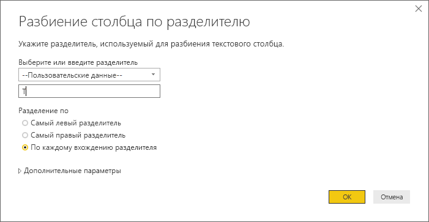
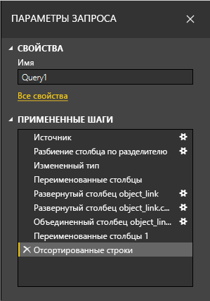
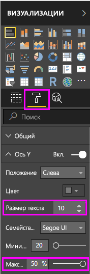
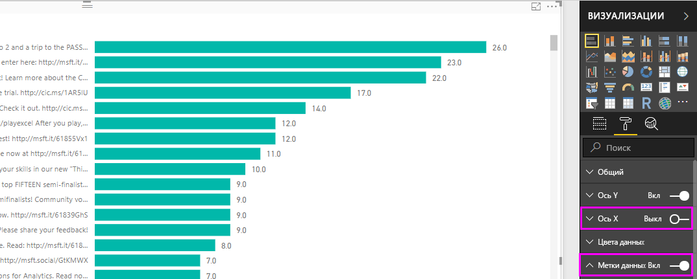
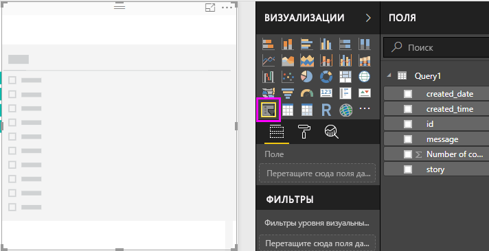
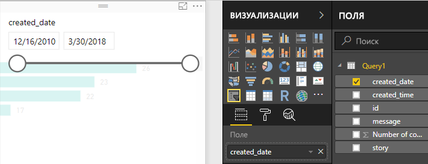

# Руководство. Анализ данных Facebook с помощью Power BI Desktop

Из этого руководства вы узнаете, как импортировать данные из Facebook и использовать их в Power BI Desktop. Вы подключитесь к странице Power BI в Facebook, импортируете данные, примените к ним преобразования, а затем используете данные в визуализациях отчета.

> [!WARNING]
> Из-за ограничений на разрешения для приложений Facebook возможности соединителя, описанные в этой статье, в настоящее время не работают должным образом. Мы работаем с Facebook, чтобы вернуть эту функцию как можно скорее.

## Подключение к странице Facebook

В этом руководстве используются данные со [страницы Microsoft Power BI в Facebook](https://www.facebook.com/microsoftbi). Чтобы подключиться к этой странице и импортировать данные, вам не нужны никакие учетные данные, кроме вашей личной учетной записи Facebook.

1. Откройте приложение Power BI Desktop и выберите **Получить данные** в диалоговом окне **Начало работы**. Или на вкладке ленты **Главная** последовательно выберите **Получить данные** и **Дополнительно**.
   
2. В диалоговом окне **Получение данных** выберите **Facebook** из группы **Веб-службы** и нажмите кнопку **Подключиться**.
   
   
   
   Откроется диалоговое окно с предупреждением о рисках, связанных с использованием службы сторонних производителей.
   
   
   
3. Нажмите кнопку **Продолжить**. 
   
4. В диалоговом окне **Facebook** введите или вставьте имя страницы **microsoftbi** в поле **Имя пользователя** и выберите **Записи** из раскрывающегося списка **Подключение**. Затем нажмите кнопку **ОК**.
   
   
   
5. При появлении запроса на учетные данные войдите в свою учетную запись Facebook и разрешите Power BI доступ с помощью этой учетной записи.
   
   

   После подключения к странице Power BI в Facebook вы сможете просмотреть данные страницы "Записи". 
   
   
   
## Обработка и преобразование импортируемых данных

Предположим, вам нужно отобразить записи с наибольшим количеством комментариев. Но в области предварительного просмотра записей вы видите, что данные в столбце **created_time** трудно прочесть и понять, а сведения в комментариях почти отсутствуют. Чтобы извлечь из данных полезную информацию, необходимо обработать и очистить их. Прежде чем импортировать данные в Power BI Desktop, можно отредактировать их с помощью редактора Power Query в приложении Power BI Desktop. Это можно сделать и после импорта данных. 

### Разбиение столбца даты и времени

Сначала разделите значения даты и времени в столбце **created_time**, чтобы их было удобнее читать. 

1. В области предварительного просмотра данных Facebook нажмите кнопку **Изменить**. 
   
   
   
   В новом окне откроется редактор Power Query приложения Power BI Desktop. Отобразится область предварительного просмотра данных со страницы Power BI в Facebook. 
   
   
   
2. Выберите столбец **created_time**. Обратите внимание, что это **текстовый** тип данных, на что указывает значок **ABC** в заголовке столбца. Щелкните правой кнопкой мыши заголовок и выберите команды **Разделить столбец** > **По разделителю** в раскрывающемся списке. Или выберите пункты **Разделить столбец** > **По разделителю** в группе **Преобразование** на вкладке ленты **Главная**.  
   
   
   
3. В диалоговом окне **Разделение столбца по разделителю** из раскрывающегося списка выберите **Настраиваемый**. В поле ввода введите букву **T** (символ, с которого начинается запись времени в значениях **created_time**) и нажмите кнопку **ОК**. 
   
   
   
   Столбец разделится на два столбца, которые содержат строки до и после разделителя *T*. Имена новых столбцов — **created_time.1** и **created_time.2** соответственно. Типы данных были обнаружены и изменены в службе Power BI автоматически. Теперь тип данных первого столбца — **Дата**, а тип данных второго столбца — **Время**. Кроме того, отформатированы значения даты и времени, чтобы их было удобнее читать.
   
4. Переименуйте оба столбца. Выберите столбец **created_time.1**, затем выберите команду **Переименовать** в группе **Любой столбец** на вкладке **Преобразование ленты**. Или дважды щелкните заголовок столбца и введите новое имя столбца, **created_date**. Повторите эти действия для столбца **created_time 2** и переименуйте его в **created_time**.
   
   
   
### Развертывание вложенного столбца

Теперь, когда данные даты и времени отображаются правильно, вам нужно отобразить данные комментариев. Для этого потребуется развернуть вложенный столбец. 

1. Выберите значок  вверху столбца **object_link**, чтобы открыть диалоговое окно **Развертывание и агрегирование**. Выберите столбец **connections** и нажмите кнопку **ОК**. 
   
   
   
   Заголовок столбца изменится на **object_link.connections**.
2. Выберите значок  в верхней части столбца **object_link.connections**, выберите **comments** и нажмите кнопку **ОК**. Заголовок столбца изменится на **object_link.connections.comments**.
   
3. Выберите значок  в верхней части столбца **object_link.connections.comments**. В этот раз выберите в диалоговом окне команду **Агрегировать** вместо **Развернуть**. Выберите **# Count of id** и нажмите кнопку**ОК**. 
   
   
   
   Теперь в столбце отображается количество комментариев для каждого сообщения. 
   
4. Переименуйте столбец **Count of object_link.connections.comments.id** на **Number of comments**.
   
5. Щелкните стрелку вниз рядом с заголовком столбца **Number of comments** (Число столбцов) и выберите команду **Сортировать по убыванию**, чтобы просмотреть записи, отсортированные по убыванию количества комментариев. 
   
   
   
### Просмотр шагов запроса

После того как вы обработали и преобразовали данные в **редакторе Power Query**, каждый шаг был записан в область **Примененные шаги** на панели **Параметры запроса** в правой части окна редактора Power Query. Вы можете вернуться к разделу **Примененные шаги**, чтобы просмотреть внесенные вами правки и при необходимости изменить, удалить или переупорядочить их. Соблюдайте осторожность при внесении изменений, так как изменение предыдущих шагов может привести к невозможности выполнения последующих. 

После применения преобразования данных область **Примененные шаги** должна выглядеть так.
   
   
   
   >[!TIP]
   >В основе **примененных шагов** — формулы, написанные на [языке формул Power Query M](https://docs.microsoft.com/powerquery-m/quick-tour-of-the-power-query-m-formula-language). Чтобы просмотреть и изменить формулы, выберите **Расширенный редактор** в группе **Запрос** на вкладке **Главная** на ленте. 

### Импорт преобразованных данных

Если формат данных вас устраивает, последовательно выберите команды **Закрыть и применить** > **Закрыть и применить** на вкладке **Главная** на ленте, чтобы импортировать данные в Power BI Desktop. 
   
   
   
   Откроется диалоговое окно со сведениями о ходе выполнения для загрузки данных в модель данных Power BI Desktop. 
   
   
   
   После того как данные загрузятся, они отобразятся в представлении **Отчет** в виде нового запроса в области **Поля**.
   
   
   
## Использование данных в визуализациях отчета 

После импорта данных со страницы Facebook вы можете быстро и легко проанализировать их, используя визуализации. Создать визуализацию несложно. Просто выберите поле или перетащите его из области **Поля** на холст отчета.

### Создание линейчатой диаграммы

1. В представлении **Отчет** Power BI Desktop выберите столбец **message** из области **Поля** или перетащите его на холст отчета. На полотне отобразится таблица со всеми сообщениями записи. 
   
   
   
2. Выбрав эту таблицу, выберите столбец **Number of comments** (Число столбцов) из области **Поля** или перетащите его в таблицу. 
   
3. Выберите значок **Линейчатая диаграмма с накоплением** в области **Визуализации**. Таблица станет линейчатой диаграммой, в которой отображается количество комментариев в каждой записи. 
   
   
   
4. Выберите **Дополнительные параметры** (…) рядом с визуализацией, а затем команду **Сортировать по** > **числу комментариев**, чтобы сортировать таблицу по убыванию числа комментариев. 

   Обратите внимание, что большинство комментариев относятся к **пустым** сообщениям. Эти записи могут содержать истории, ссылки, видео или другое нетекстовое содержимое. 
   
5. Чтобы отфильтровать пустые строки, выберите **message (all)** (Сообщение [все]) в области **Фильтры**, команду **Выбрать все** и снимите выбор с пункта **Пустые**. 

   Запись в области **Фильтры** изменится на **сообщение не является пустым**. После этого строка **Пустые** исчезнет из визуализации диаграммы.
   
   
   
### Форматирование диаграммы

Визуализация становится более интересной, но на диаграмме отображается лишь небольшая часть текста записи. Чтобы отобразить больший объем текста записи, выполните следующие действия:

1. Используя маркеры на визуализации диаграммы, измените размер диаграммы, максимально увеличив ее. 
   
2. Выберите диаграмму, выберите **значок формата** (значок с изображением валика) в области **Визуализации**.
   
3. Щелкните стрелку вниз рядом с **осью Y**, перетащите ползунок **Максимальный размер** в крайнюю правую позицию (**50 %**). 
4. Также уменьшите **Размер текста** до значения **10 пунктов**, чтобы уместить больше текста.
   
   
   
   Теперь на диаграмме отображается больше содержимого записи. 
   
   
   
Ось X (количество комментариев) диаграммы не содержит точных значений, и внизу диаграммы часть значений теряется. Вместо этого можно использовать метки данных. 

1. Выберите значок **Формат** и поместите ползунок рядом с **осью X** в положение **Откл**. 
   
2. Переведите ползунок **Метки данных** в положение **Вкл**. 

   Теперь на диаграмме отображается точное количество комментариев для каждой записи.
   
   
   
### Изменение типа данных

Визуализация улучшилась, но все метки данных содержат десятичный разряд **.0**, который отвлекает и вводит в заблуждение, так как **количество записей** должно быть целым числом. Чтобы исправить это, необходимо изменить тип данных столбца **Количество записей** на **целочисленный**.

1. Щелкните правой кнопкой мыши поле **query1** в области **Поля** или наведите на него указатель мыши и выберите **Дополнительные параметры** (...). 

2. В контекстном меню выберите **Изменить запрос**. Либо выберите **Изменить запросы** > **Изменить запросы** в группе **Внешние данные** на вкладке ленты **Главная**. 
   
3. В окне **Редактор Power Query** выберите столбец **Number of comments** (Число столбцов) и измените тип данных. Это можно сделать разными способами: 
   - Выберите значок **1.2** рядом с заголовком столбца **Number of comments** (Число столбцов), затем в раскрывающемся списке выберите **Целое число**.
   - Щелкните правой кнопкой мыши заголовок столбца и выберите **Изменить тип** > **Целое число**.
   - Выберите **Тип данных: десятичное число** в группе **Преобразование** на вкладке **Главная** либо в группе **Любой столбец** на вкладке **Преобразование** и выберите **Целое число**.
   
   Значок в заголовке столбца изменится на **123**, что обозначает тип данных **Целое число**.
   
   
   
3. Чтобы применить изменения, выберите пункты меню **Файл** > **Закрыть и применить** или **Файл** > **Применить**, чтобы оставить открытым окно **Редактор Power Query**. 

   После того как загрузятся изменения, метки данных на диаграмме станут целыми числами.
   
   
   
### Создание среза дат

Допустим, вам нужно визуализировать количество комментариев к записям по времени. Вы можете создать визуализацию среза, чтобы фильтровать данные диаграммы по различным временным отрезкам. 

1. Выберите пустую область холста и выберите значок **Срез** в области **Визуализации**. 

   Отобразится пустая визуализация среза.
   
   
   
2. Выберите поле **created_date** в области **Поля** или перетащите его в новый срез. 

   Срез станет ползунком диапазона дат, основанным на типе данных **Дата**.
   
   
   
3. Перемещайте маркеры ползунка, чтобы выбрать другие диапазоны дат, и обратите внимание, как фильтруются данные диаграммы по мере его перемещения. Также можно выбрать в срезе поля дат и ввести конкретные даты или выбрать их из всплывающего окна календаря.
    
   
   
### Форматирование визуализаций

Сделайте заголовок диаграммы более описательным и привлекательным. 

1. Выбрав диаграмму, выберите значок **Формат** в области **Визуализации**, а затем щелкните стрелку раскрывающегося списка рядом с полем **Заголовок**, чтобы развернуть его.

2. Измените **заголовок текста** на **Комментарии к одной записи**. 

3. Щелкните стрелку раскрывающегося списка рядом с полем **Цвет шрифта** и выберите зеленый цвет, который соответствует зеленым полосам визуализации.

4. Увеличьте **Размер текста** до значения **10 пунктов** и измените **Семейство шрифтов** на **Segoe (Bold)**.

5. Поэкспериментируйте с другими вариантами форматирования, чтобы изменить внешний вид визуализации. 

   

## Создание других визуализаций

Как видите, вы можете легко настроить визуализации в отчете для любого представления данных. Например, с помощью импортированных данных Facebook можно создать этот график, на котором отображается количество комментариев со временем.

Power BI Desktop предоставляет удобные возможности для получения данных из разнообразных источников и их обработки для анализа и визуализации в интерактивном режиме. Готовый отчет можно [отправить в Power BI](desktop-upload-desktop-files.md), создать на его основе панели мониторинга и предоставить к ним общий доступ другим пользователям Power BI.

## Дальнейшие действия
* [Прочитайте другие руководства по Power BI Desktop.](https://go.microsoft.com/fwlink/?LinkID=521937)
* [Посмотрите видеоматериалы по Power BI Desktop.](https://go.microsoft.com/fwlink/?LinkID=519322)
* [Посетите форум Power BI.](https://go.microsoft.com/fwlink/?LinkID=519326)
* [Прочитайте блог, посвященный Power BI.](https://go.microsoft.com/fwlink/?LinkID=519327)

