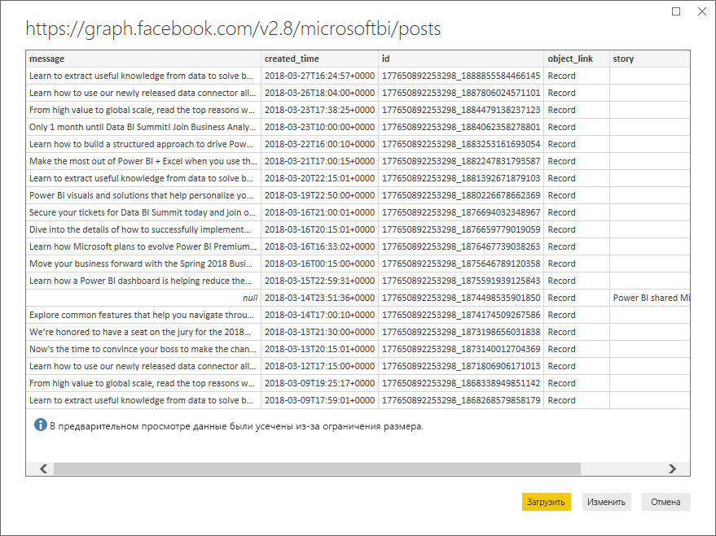
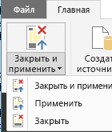
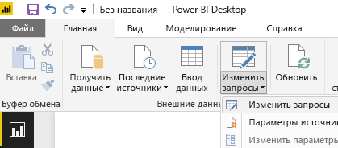

# Учебник. Анализ Facebook с помощью Power BI Desktop
В этом учебнике вы узнаете, как импортировать и визуализировать данные из **Facebook**. Вы также узнаете, как подключаться к определенной странице Facebook (странице Power BI), преобразовывать данные и создавать визуализации.

Далее показано, что именно вы сделаете.

* **Задача 1.** Подключение к странице Facebook
* **Задача 2.**Создание визуализаций с помощью представления отчета
  
  * **Шаг 1.**Создание визуализации диаграммы дерева
* **Задача 3.**Обработка данных в представлении запросов
  
  * **Шаг 1.**Разбиение столбца даты и времени на две части
  * **Шаг 2.**Добавление агрегированного значения из связанной таблицы
* **Задача 4.**Создание дополнительных визуализаций с помощью представления отчета
  
  * **Шаг 1.**Загрузка запроса в отчет
  * **Шаг 2.**Создание графика и линейчатой диаграммы

## **Задача 1. Подключение к странице Facebook**
В этой задаче выполняется импорт данных с сайта [Microsoft Power BI Facebook](https://www.facebook.com/microsoftbi) (URL-адрес: *https://www.facebook.com/microsoftbi ).*

Любой пользователь может подключиться к этой странице и выполнить следующие действия — специальные учетные данные (кроме собственной учетной записи Facebook, используемом на этом шаге) не требуются.

1. В диалоговом окне **Приступая к работе** или на вкладке **Главная**на ленте выберите **Получить данные.**
2. Откроется диалоговое окно **Получение данных** , где можно выбрать любой источник данных. Выберите **Facebook** в группе **Другое** .
   
   
   
   При выборе **Подключить**откроется диалоговое окно с предупреждением о рисках, связанных с использованием службы сторонних производителей.
   
   
3. После нажатия кнопки "Продолжить" откроется диалоговое окно **Facebook**. В нем вставьте имя страницы (**microsoftbi**) в поле **Имя пользователя**. Выберите **Публикации** в раскрывающемся списке **Подключения**.
   
   
4. Нажмите кнопку **ОК**.
5. При появлении запроса учетных данных войдите с использованием учетной записи Facebook и разрешите Power BI доступ с помощью этой учетной записи.
   
   

После подключения к странице вы увидите данные, загружаемые в модель. 

Здесь **редактор запросов** отображает данные. **Редактор запросов** входит в состав Power BI Desktop, но загружается в отдельном окне и является местом, где выполняются все преобразования подключений к данным.

Теперь, когда данные имеют требуемый вид, их можно загрузить в Power BI Desktop. Выберите **Загрузить и закрыть** на вкладке ленты **Главная**.

Откроется диалоговое окно с отображением хода выполнения загрузки данных в модель данных Power BI Desktop.

После загрузки вы будете перенаправлены в представление **отчета** , где столбцы из таблицы перечислены в **списке полей** справа.

## **Задача 2. Создание визуализаций с помощью представления отчета**
После получения данных со страницы вы можете быстро и легко проанализировать их, используя визуализации.

**Шаг 1.** Создание визуализации диаграммы дерева

Создать визуализацию несложно — просто перетащите поле из **списка полей** и поместите его на **холсте отчета.**

Перетащите поле **Тип** и поместите его на холсте **отчета** . Power BI Desktop создаст новую визуализацию на **холсте отчета**. Затем перетащите поле **Тип** из **списка полей** (то же поле, которое было размещено на холсте **отчета** ) в область **Значение** для создания визуализации **Диаграмма** .

Можно легко изменить тип визуализации, щелкнув другой значок в области **Визуализация** . Изменим тип на **Диаграмма дерева** , выбрав его значок в области **Визуализации**, как показано на следующем рисунке.

Теперь добавим условные обозначения, а затем изменим цвет точки данных. Выберите значок **Формат** в области **Визуализации**. Значок **Формат** имеет вид кисти.

При щелчке стрелки вниз рядом с разделом **Условные обозначения**раздел раскрывается, отображая способ настройки условных обозначений для выбранной визуализации. В этом случае были выполнены следующие действия:

* ползунок **Условные обозначения** перемещен в положение **Вкл.** , чтобы отображались условные обозначения;
* выбрано значение **Справа** из раскрывающегося списка **Расположение условных обозначений** ;
* ползунок **Название** перемещен в положение **Вкл.** , чтобы отображались названия условных обозначений;
* введено **тип** для названия условных обозначений.

На следующем рисунке эти действия уже выполнены и отражаются в визуализации.

Теперь изменим цвет одной из точек данных. Точка данных ссылки должна быть синей — так она будет ближе к общему цвету гиперссылок.

Щелкните стрелку рядом с разделом **Цвета данных** , чтобы раскрыть его. Точки данных отображаются со стрелками выбора около каждого цвета, поэтому для каждой точки данных можно выбрать другой цвет.

Если щелкнуть стрелку вниз у поля выбора цвета рядом с любой точкой данных, откроется диалоговое окно выбора цвета, в котором можно выбрать цвет. В этом случае мы выберем голубой цвет.

Так лучше. На следующем рисунке можно увидеть применение цвета к точке данных в визуализации и автоматическое обновление условных обозначений согласно выбору цвета в разделе **Цвета данных** .

## **Задача 3. Данные фигуры в таблице**
Импортировав выбранную таблицу и приступив к созданию визуализации, вы можете заметить, что вам необходимо выполнить различные операции по обработке и очистке данных, чтобы использовать их максимально эффективно.

**Шаг 1.** Разбиение столбца даты и времени на две части

На этом шаге вы разделите столбец **created\_time**, чтобы получить значения даты и времени. Каждый раз, когда вы находитесь в Power BI Desktop и хотите изменить существующий запрос, необходимо запустить **редактор запросов**. Для этого выберите **Изменить запросы** на вкладке **Главная** .

1. В таблице **Редактор запросов** прокрутите вправо и найдите столбец **created\_time**.
2. Щелкните правой кнопкой мыши заголовок столбца в таблице **Просмотр запроса** и выберите команду **Разделить столбец \> По разделителю**, чтобы разделить столбцы. Выберите **Настраиваемый** из раскрывающегося списка разделителей и введите **"T"**. Обратите внимание, что эта операция также доступна на вкладке ленты **Главная** в группе **Управление столбцами**.
   
   
   
   
3. Переименуйте созданные столбцы в **created\_date** и **created\_time** соответственно.
4. Выберите новый столбец **created\_time** и на ленте **Представление запроса** перейдите на вкладку **Добавить столбец** и выберите **Время \> Час** в группе **Начальная дата и время**. При этом будет добавлен новый столбец, содержащий только компонент часа.
   
   
5. Измените тип нового столбца **Час** на **Целое число**. Для этого перейдите на вкладку **Главная** и выберите раскрывающийся список **Тип данных** или щелкните правой кнопкой мыши столбец и выберите команду **Преобразовать \> Целое число**.
   
   

**Шаг 2.** Добавление агрегированного значения из связанной таблицы

На этом шаге вы добавите число общих папок из вложенного значения, которое можно использовать в визуализациях.

1. Прокручивайте экран вправо, пока не увидите столбец **Общие ресурсы** . Вложенное значение указывает, что нам нужно выполнить еще одно преобразование, чтобы получить фактические значения.
2. В верхнем правом углу заголовка столбца выберите значок , чтобы открыть построитель **развертывания или агрегирования**. Выберите **Количество** и нажмите кнопку **ОК**. При этом будет добавлено число общих ресурсов для каждой строки в таблице.
   
   
   
   После загрузки данных переименуйте столбец в **Общие ресурсы**. Для этого дважды щелкните имя столбца, щелкните столбец правой кнопкой мыши или в **представлении запроса** на ленте, выберите **Переименовать** на вкладке **Преобразование** в группе **Любой столбец**.
3. Наконец, измените тип нового столбца **Общие ресурсы** на **Целое число**. Выбрав столбец, измените его тип, щелкнув его правой кнопкой мыши и выбрав команду **Преобразовать \> Целое число**. Также можно перейти на вкладку **Главная** и выбрать раскрывающийся список **Тип данных**.

### Созданные действия запроса
При выполнении преобразований в представлении запроса действия запроса создаются и отображаются в области **Параметры запроса** в списке **ПРИМЕНЕННЫЕ ДЕЙСТВИЯ** . У каждого действия запроса есть соответствующая формула запроса, также известная как язык "M".

| Задача | Действие запроса | Формула |
| --- | --- | --- |
| Подключение к странице Facebook |Источник |Facebook.Graph (&quot;https://graph.facebook.com/microsoftbi/posts&quot;) |
| **Разбиение столбцов** для получения необходимых значений |Разбиение столбца по разделителю |Table.SplitColumn (Source,&quot;created_time&quot;,Splitter.SplitTextByDelimiter(&quot;T&quot;),{&quot;created_time.1&quot;, &quot;created_time.2&quot;}) |
| **Изменение типа** новых столбцов (автоматическое действие) |Измененный тип |Table.TransformColumnTypes (#&quot;Разбиение столбца по разделителю&quot;,{{&quot;created_time.1&quot;, type date}, {&quot;created_time.2&quot;, type time}}) |
| **Переименование **столбца**** |Переименованные столбцы |Table.RenameColumns (#&quot;Измененный тип&quot;,{{&quot;created_time.1&quot;, &quot;created_date&quot;}, {&quot;created_time.2&quot;, &quot;created_time&quot;}}) |
| **Вставка **столбца**** |Вставленный час |Table.AddColumn (#&quot;Переименованные столбцы&quot;, &quot;Час&quot;, each Time.Hour([created_time]), type number) |
| **Изменение типа ** |Измененный тип 1 |Table.TransformColumnTypes (#&quot;Вставленный час&quot;,{{&quot;Час&quot;, type text}}) |
| **Развертывание **значений во вложенной таблице**** |Развернутые общие папки |Table.ExpandRecordColumn (#&quot;Измененный тип 1&quot;, &quot;shares&quot;, {&quot;count&quot;}, {&quot;shares.count&quot;}) |
| **Переименование **столбца**** |Переименованные столбцы 1 |Table.RenameColumns (#&quot; Развернуть общие папки&quot;,{{&quot;shares.count&quot;, &quot;shares&quot;}}) |
| **Изменение типа** |Измененный тип 2 |Table.TransformColumnTypes (#&quot;Переименованные столбцы 1&quot;,{{&quot;shares&quot;, Int64.Type}}) |

## **Задача 4. Создание дополнительных визуализаций с помощью представления отчета**
После преобразования данных в форму, необходимую для остальной части анализа, мы можем загрузить полученную таблицу в отчет и создать дополнительные визуализации.

**Шаг 1.** Загрузка запроса в отчет

Чтобы загрузить результаты запроса в отчет, необходимо выбрать **Загрузить и закрыть** в **редакторе запросов**. Изменения будут загружены в Power BI Desktop, после чего **редактор запросов**закроется.

В Power BI Desktop нужно убедиться, что мы находимся в представлении **отчетов** . Выберите верхний значок в левой панели в Power BI Desktop.

**Шаг 2.** Создание графика и линейчатой диаграммы

Чтобы создать визуализацию, можно перетащить поля из **списка полей** и разместить их на **холсте отчета**.

1. Перетащите поле **Общие ресурсы** на холст **отчета** , в результате чего будет создана линейчатая диаграмма. Перетащите created\_date на диаграмму, и Power BI Desktop изменит визуализацию на **График**.
   
   
2. Затем перетащите поле **Общие ресурсы** на **холст отчета**. Теперь перетащите поле **Час** в раздел **Ось** в **списке полей**.
   
   
3. Можно легко изменить тип визуализации, щелкнув другой значок в области **Визуализация** . Стрелка на рисунке ниже указывает на значок **линейчатой диаграммы** .
   
   
4. Измените тип визуализации на **График**.
5. Создается **линейчатая диаграмма** , но ось нам не нужна — нам требуется сортировка в обратном направлении (от большего к меньшему). Щелкните стрелку вниз рядом с разделом **Ось Y** , чтобы раскрыть его. Нам нужно изменить тип оси с **Непрерывный** на **Категориальный**, чтобы получить нужный порядок сортировки (на рисунке ниже показана ось до выбора; просмотрите следующее изображение с нужным видом).

Так лучше. Теперь на этой странице есть три визуализации, размер которых можно изменить, чтобы заполнить страницу отчета.

Как видно, вы можете очень легко настроить визуализации в отчете для представления данных нужным образом. Power BI Desktop предоставляет удобные возможности для получения данных из разнообразных источников и их обработки для анализа и визуализации интерактивными способами. Готовый отчет можно [отправить в Power BI](desktop-upload-desktop-files.md) и создать на его основе панели мониторинга, к которым можно предоставить общий доступ для других пользователей Power BI.

Результат этого учебника можно скачать [здесь](http://download.microsoft.com/download/1/4/E/14EDED28-6C58-4055-A65C-23B4DA81C4DE/FacebookAnalytics.pbix).

### Где еще можно получить дополнительные сведения?
* [Прочитайте другие руководства по Power BI Desktop.](http://go.microsoft.com/fwlink/?LinkID=521937)
* [Посмотрите видеоматериалы по Power BI Desktop.](http://go.microsoft.com/fwlink/?LinkID=519322)
* [Посетите форум Power BI.](http://go.microsoft.com/fwlink/?LinkID=519326)
* [Прочитайте блог, посвященный Power BI.](http://go.microsoft.com/fwlink/?LinkID=519327)

